# Anatomy Odyssey

**A guided journey through the human body, from whole body to molecule.**

Anatomy Odyssey is an open-source web app for exploring the human body across scales. You start at a whole-body 3D model, then take a *guided dive*: a short, authored descent through the tiers that matter for one part of you, ending at the smallest building block that well-understood biology supports on that path. A depth gauge shows how big the view is at every moment, so size relationships stay honest across about nine orders of magnitude.


> Teaching model, not medical advice. Every scene is labeled for what it is: a generalized teaching model, drawn to scale except where a card says otherwise.

## Six dives and four modules

| Dive | Path | Ends at (shared) | Interactive control |
|---|---|---|---|
| **Skeletal** | body → skeleton → femur → bone tissue → osteocyte → nucleus | DNA | — |
| **Circulatory** | body → heart → blood → red blood cell | hemoglobin → heme | Oxygen pressure slider (Hill curve) |
| **Muscular** | body → biceps → fascicle → muscle fiber → sarcomere | actin and myosin | Sarcomere length; cross-bridge cycle |
| **Immune** | body → lymph node → follicle → plasma cell | antibody | — |
| **Nervous** | body → brain → neuron → synapse | glutamate | Axon diameter (conduction speed); release stages |
| **Respiratory** | body → lungs → alveoli → air–blood barrier → hemoglobin | O₂ and CO₂ | Breathing; capillary transit time |
| **Inflammatory response** (module) | a splinter wound, from the first alarm to healing | — | Five-stage animation |
| **From gene to protein** (module) | the start of the β-globin gene → mRNA → ribosome → protein | RNA → amino acids | Transcribe, export, translate, fold |
| **Chemistry of life** (module) | your body as cubes sorted by element → carbonic anhydrase → the blood buffer | bicarbonate, carbonic acid, hydronium | Count by mass or atoms; how far the enzyme lowers the barrier; blood CO₂ (Henderson–Hasselbalch pH) |
| **Immune response and memory** (module) | immune cells side by side at true size → a first and a second infection | — | Pick a cell; day 0–140 of an illustrative response model |

Side trips branch off the main path into shared scenes: from a muscle fiber, a plasma cell or a neuron into the shared **nucleus → DNA**; from a red blood cell or a synapse into the **lipid bilayer → phospholipid**; from the nucleus into a **nucleosome**; from DNA into its **nucleotides**; from myosin into **ATP**; from an antibody into its **amino acids**.

Every shared building block is built, and each one's card links **up** to what it is part of and **down** to what it is made of, so you can keep zooming from wherever you are.

New in 0.5.0: the Chemistry of life and Immune response and memory modules.

<table>
<tr>
<td>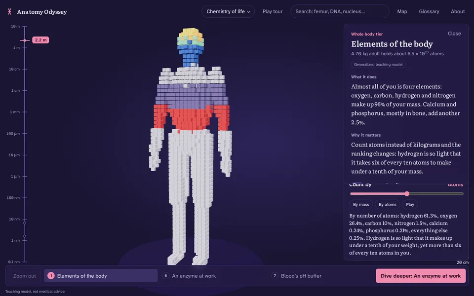</td>
<td></td>
<td>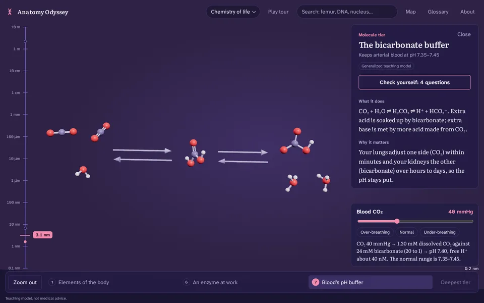</td>
</tr>
<tr>
<td></td>
<td>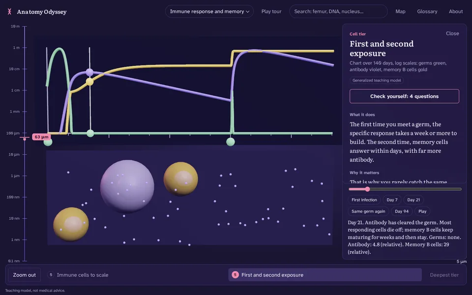</td>
</tr>
</table>

<table>
<tr>
<td></td>
<td></td>
<td>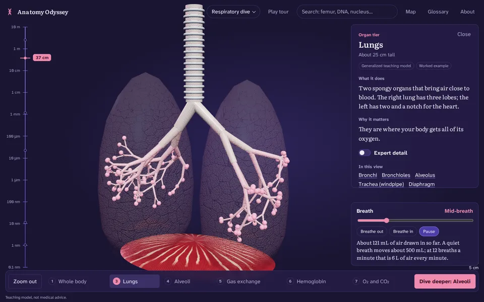</td>
</tr>
<tr>
<td>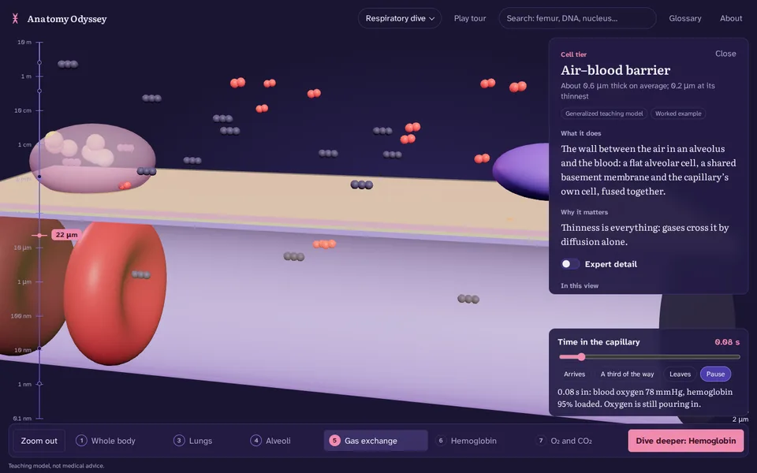</td>
<td>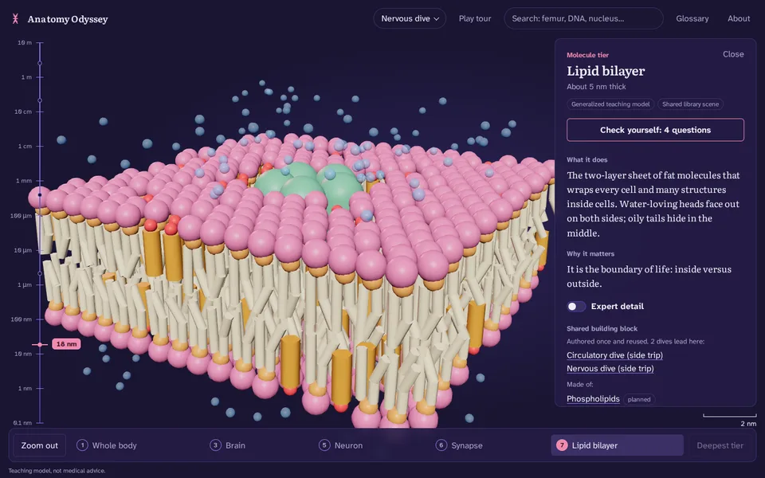</td>
<td>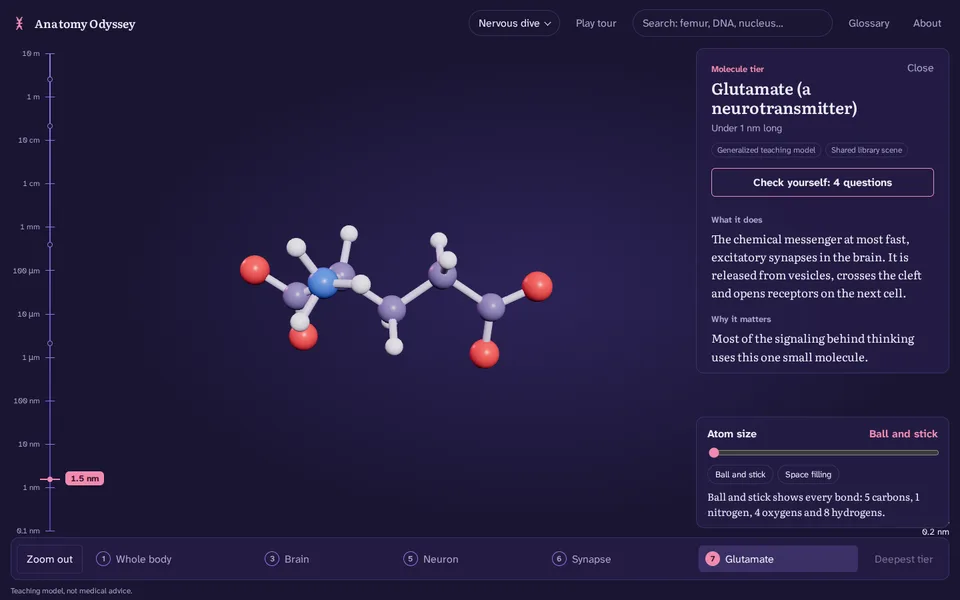</td>
</tr>
<tr>
<td></td>
<td>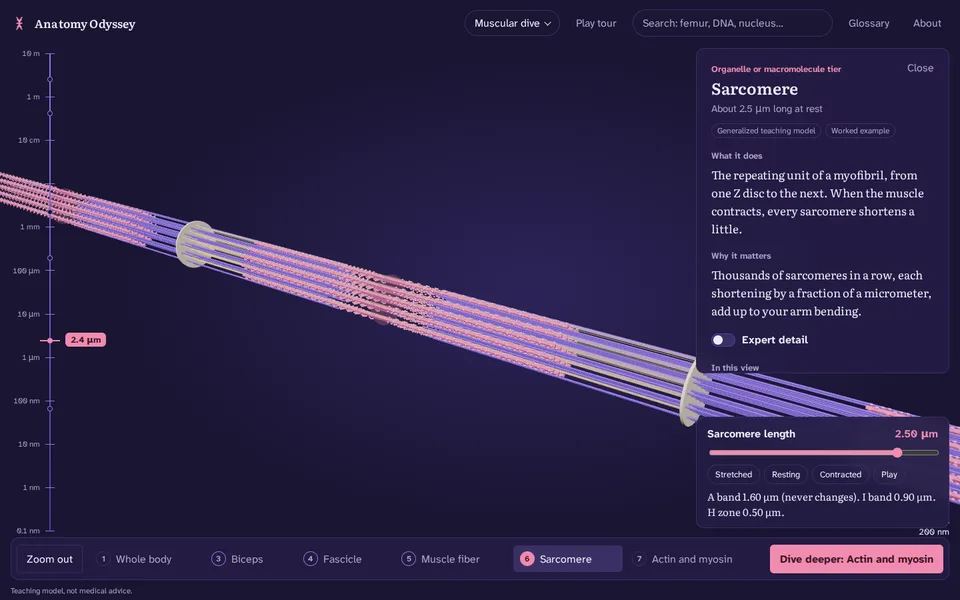</td>
<td>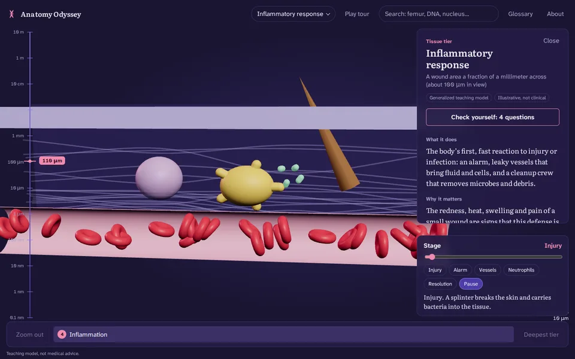</td>
</tr>
<tr>
<td></td>
<td></td>
<td>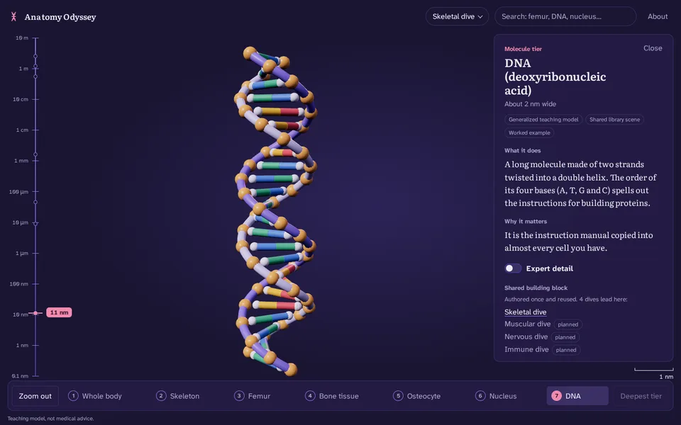</td>
</tr>
</table>

| Nervous dive | Respiratory dive |
|---|---|
|  |  |

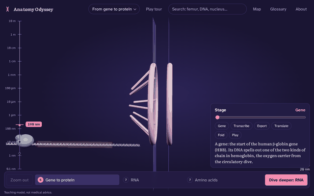

<table>
<tr>
<td></td>
<td>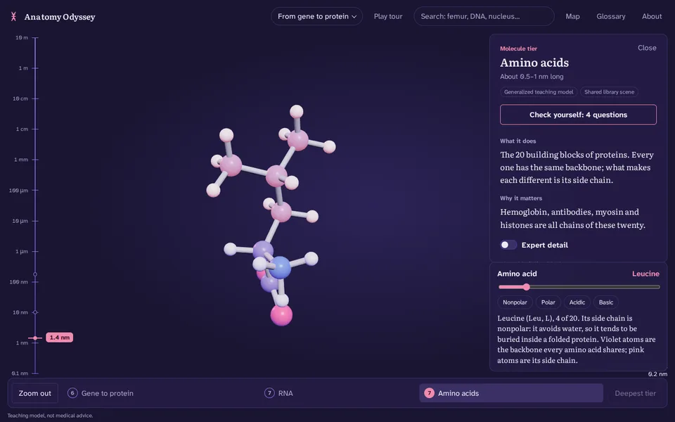</td>
<td>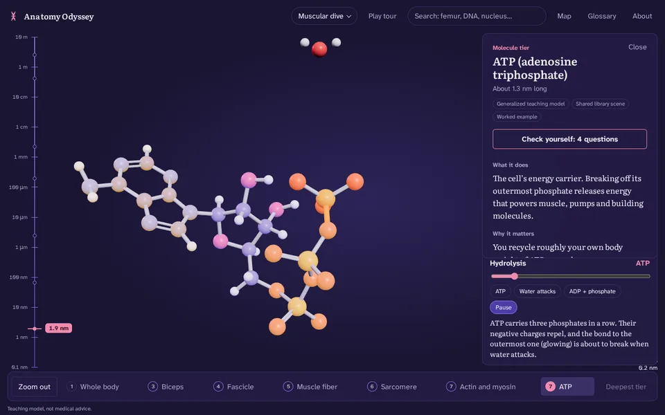</td>
</tr>
<tr>
<td>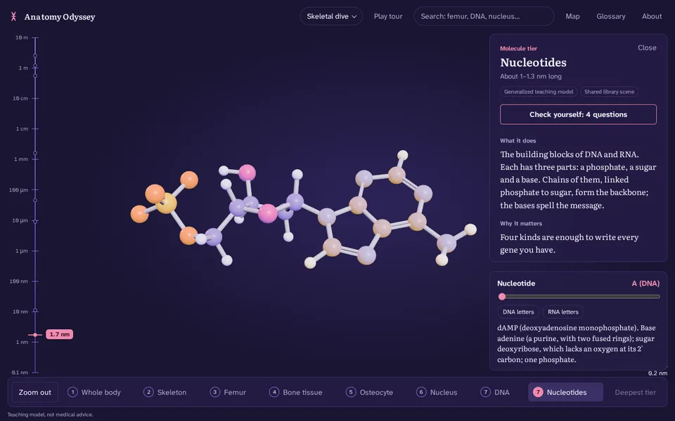</td>
<td>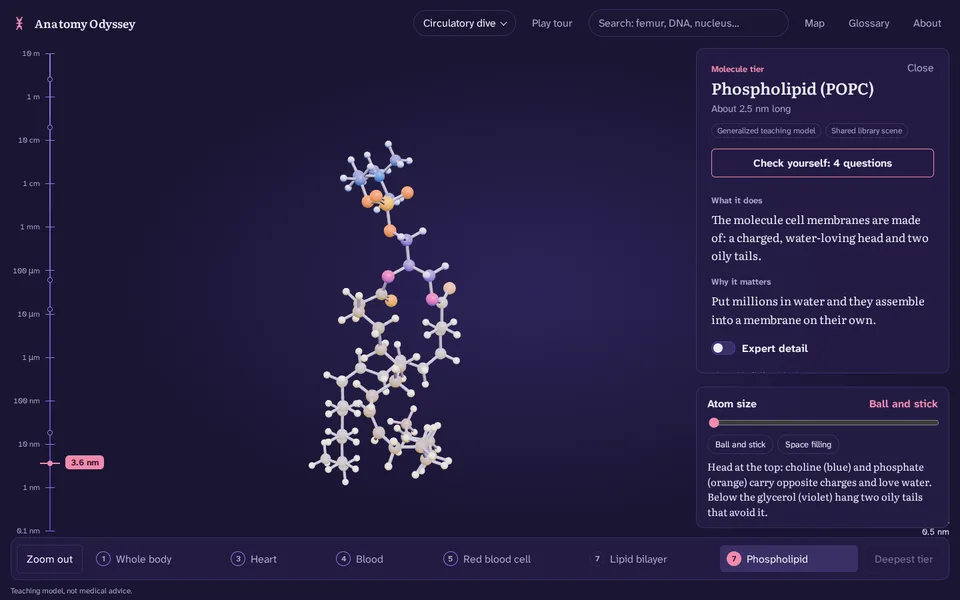</td>
<td></td>
</tr>
</table>

## Features

- **Tier-transition engine.** Each dive is a chain of scenes authored at their own scale (1 unit = 1 m for the body, 1 cm for organs, 1 µm for cells, 1 nm or 1 Å for molecules). The engine frames each by its real size and flies between them while the gauge sweeps on a log scale.
- **Click-to-learn cards** for every part: what it does, why it matters, an *Expert detail* switch, size, honesty labels, cited sources, and "In this view" links for keyboard users.
- **Shared library, complete.** Nucleus, nucleosome, DNA, RNA, nucleotides, hemoglobin, heme, actin and myosin, ATP, antibody, amino acids, glutamate, lipid bilayer, phospholipid, and O₂/CO₂ are each built once. Cards list every dive that reaches them and link up and down the "made of" chain; the app finds a route there from wherever you are.
- **Real small-molecule geometry.** The 20 amino acids, 8 nucleotides, ATP, ADP and a phospholipid are generated from their chemical structures with RDKit (ETKDG v3 + MMFF94), charged as at body pH. The generator checks every formula, charge and handedness (L-amino acids, D-sugars) before writing (`npm run molecules`).
- **Map by scale.** One view of every dive, side trip and shared building block, laid out by size on a log scale. Press M; choose any point to fly there.
- **Desktop app.** The same app in a native window for Windows, macOS and Linux (Tauri 2), fully offline, with no system permissions granted to the page.
- **Chemistry of life module.** What you are made of, counted by mass and by atoms; carbonic anhydrase speeding CO₂ hydration ten million times (a 41.6 kJ/mol drop in the barrier); and the bicarbonate buffer, where your breathing sets blood pH through the Henderson–Hasselbalch equation.
- **Immune response and memory module.** Thirteen immune cells and particles at true relative size, then a 140-day illustrative model of a first and second infection (solved with Runge–Kutta and tested for the textbook shape): slow first response, fast and five-fold bigger second one.
- **Scene controls** that run real equations: the Hill curve on hemoglobin, sliding filaments in the sarcomere, Hursh's conduction rule on the axon, first-order oxygen loading in the lung capillary, and ball-and-stick versus space-filling molecules.
- **Guided tour** with narration captions on every step, optionally read aloud.
- **Check yourself** quizzes (four questions per dive) and a **glossary** of every term, with fly-to buttons.
- **Search and jump** to any part, including planned building blocks.
- **Settings**: reduced motion, picture quality, and read-aloud captions. On first launch the app times a few seconds of frames and tunes the "Balanced" picture setting to the device (About shows the result and can measure again).
- **Local-first and private.** No accounts, analytics or network calls; progress stays in your browser.
- **Accessible.** Keyboard navigation (→ deeper, ← out, / search, M map, G glossary, T tour, Esc close), screen-reader announcements, `prefers-reduced-motion`, and a phone layout. An axe-core audit (`npm run a11y`) checks 18 states, including every dialog and a phone view, against WCAG 2.2 A and AA rules, with no violations.

## How the zoom works

A single continuous render from body to molecule is not feasible; the scale gap is about a billion-fold. Instead, each dive is a chain of discrete scenes, and the project grows by adding dives rather than re-modeling DNA for every cell.


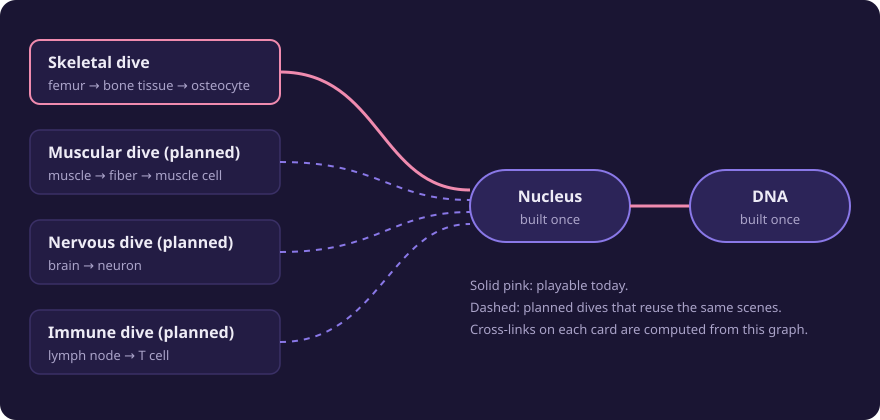

## Run it

You need Node.js 20 or newer.

```bash
git clone https://github.com/Normansrule/anatomy-odyssey.git
cd anatomy-odyssey
npm ci
npm run dev          # http://localhost:5173
```

Other scripts:

```bash
npm test               # 250 unit tests: scale math, every worked equation, the genetic code, the immune model, dive graph and routes, scenes, molecules, benchmark, security guards
npm run build          # production build in dist/ (what GitHub Pages serves)
npm run build:preview  # one self-contained HTML file in dist-preview/
npm run manifest       # rebuild assets/manifest.json after adding assets
npm run molecules      # regenerate src/library/data/molecules.json (needs: pip install rdkit)
npm run a11y           # axe-core accessibility audit against a running preview (needs Playwright, see below)
```

### Desktop app

Needs Rust (via [rustup](https://rustup.rs)) and, on Linux, the WebKitGTK development packages (`sudo apt install libwebkit2gtk-4.1-dev build-essential libssl-dev libayatana-appindicator3-dev librsvg2-dev`). Windows 10/11 already include the WebView2 runtime it uses.

```bash
npm run desktop:dev      # native window with live reload
npm run desktop:build    # installers in src-tauri/target/release/bundle/
```

Pushing a version tag (`git tag v0.5.0 && git push origin v0.5.0`) runs the `Desktop app` workflow, which builds Windows (.msi, .exe), macOS (.dmg) and Linux (.deb, .AppImage) installers and attaches them, with SHA-256 checksums, to a draft GitHub release. They are not code-signed yet, so your system may warn on first launch.

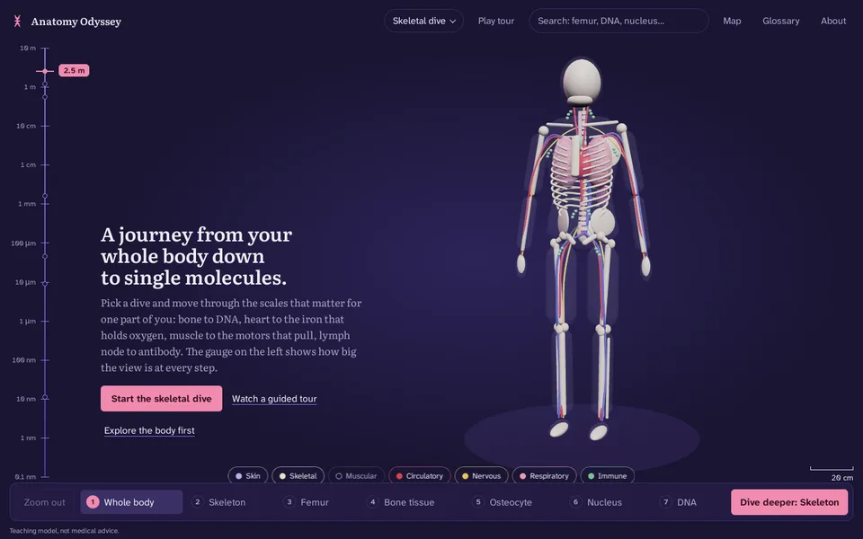

Screenshot every tier headlessly (software WebGL, no GPU needed):

```bash
npm run build && npx vite preview --port 4173 &
pip install playwright pillow && python3 -m playwright install chromium
python3 tools/screenshots.py --mobile            # fails on console errors or a blank tier
python3 tools/screenshots.py --only nervous      # one dive
python3 tools/record-hero.py --dive respiratory --out docs/media/respiratory-dive.gif
python3 tools/a11y-audit.py                      # axe-core, WCAG 2.2 A and AA; fails on any violation
```

URL parameters: `?dive=nervous&step=synapse` opens a step directly, `&trip=1` opens a side trip into a library step, and `?renderer=webgl` forces the WebGL 2 fallback.

### Deploy to GitHub Pages

Push to `main`, then in the repository settings set **Pages → Source** to **GitHub Actions**. The `Deploy to GitHub Pages` workflow tests, builds and publishes `dist/`.

[docs/PUBLISHING.md](docs/PUBLISHING.md) has the exact terminal commands, from a fresh Ubuntu terminal, for the first push and for updating the repo from a newer zip.

## Project layout

```
src/
  engine/      renderer (WebGPU with WebGL 2 fallback), tier engine, fades, first-launch benchmark
  scenes/      one builder per tier (body, femur, heart, neuron, lungs, …) + registry
  library/     shared scenes (nucleus, nucleosome, DNA, RNA, nucleotides, hemoglobin, heme,
               actin–myosin, ATP, antibody, amino acids, glutamate, lipid bilayer,
               phospholipid, gases), molecule helpers, and data/molecules.json
  data/        dives, library graph, cards, quizzes, references (all content lives here)
  science/     pure, tested math: scale, equations, chemistry, the immune model, dive-graph invariants
  security/    asset integrity checks for the glTF pipeline
  ui/          gauge, cards, search, scene controls, tour, quiz, glossary, map, about
src-tauri/     desktop app shell (Tauri 2): config, capabilities, icons
tests/         Vitest suites
tools/         screenshots, accessibility audit, GIF recorder, molecule generator, Z-Anatomy export script, asset manifest
docs/          state of the model, equations, security model, media
assets/        anatomy/ (CC BY-SA) and molecular/ (per-file licenses), CREDITS.md
```

## Adding a dive

1. Write scene builders in `src/scenes/` (return `root`, `metersPerUnit`, `view`, `focus`, `dispose`, and optionally `controls`, `update` and `branchFocus`).
2. Register them in `src/scenes/registry.js`.
3. Add the dive to `src/data/dives.js`. Use `libStep('dna')` to route into a shared scene, or a step's `branch` for a side trip.
4. Write cards (with sources from `src/data/references.js`), narration for each step, and four quiz questions.
5. `npm test` checks the invariants: frames shrink and tiers rise at every step (side trips too), scenes and cards exist, the focus part is clickable, and shared steps use the library's scene.

## Documentation

- [State of the model](docs/STATE_OF_THE_MODEL.md): what exists, where each dive honestly stops, and what is next
- [Equations](docs/EQUATIONS.md): each worked example with symbols, units and its test
- [Security model](docs/SECURITY_MODEL.md): trust boundaries, malicious assets, decompression bombs, supply chain
- [Asset credits](assets/CREDITS.md): source, author and license for every asset
- [Publishing](docs/PUBLISHING.md): commands to put the project on GitHub and update it

## Roadmap

1. ~~**MVP**: whole-body model, system toggles, cards, tier engine, the skeletal dive.~~
2. ~~**More dives on the shared library**: circulatory, muscular, immune, nervous and respiratory dives; side trips.~~
3. ~~**Modules and learning tools**: the inflammatory response, quizzes, glossary, guided tour.~~
4. ~~**Complete the shared library and the gene-to-protein module**, with generated small-molecule geometry and a map by scale.~~
5. ~~**Desktop app** (Tauri) with parity, a first-launch hardware benchmark and an accessibility audit.~~
6. ~~**Chemistry of life and immune response modules**, with tested equations and an illustrative immune model.~~
7. **Real assets**: Z-Anatomy meshes for the organ tiers and Protein Data Bank structures via Mol* for the large molecules (the export script and integrity checks are ready).
8. **Hardening**: reviewer accuracy pass against cited sources, full asset-license audit, code-signed releases.

## License

- **Code**: [MIT](LICENSE).
- **Anatomy assets** in `assets/anatomy/` (when added): CC BY-SA 4.0, as required by Z-Anatomy and BodyParts3D. ShareAlike applies to those assets only; they live in their own folder so it does not extend to the code.
- **Molecular assets** in `assets/molecular/`: each file's own license, listed in `assets/CREDITS.md`.
- **Fonts**: Atkinson Hyperlegible Next and Literata, SIL Open Font License 1.1.
