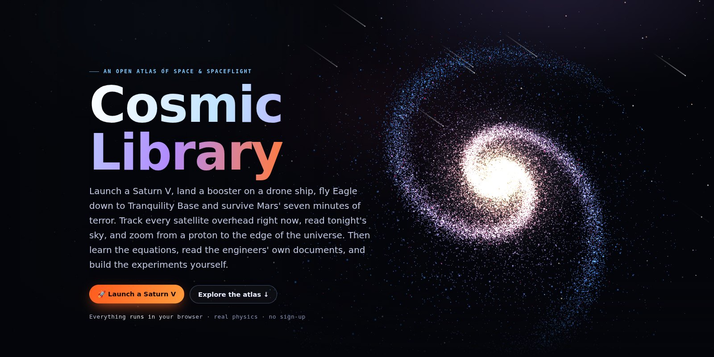
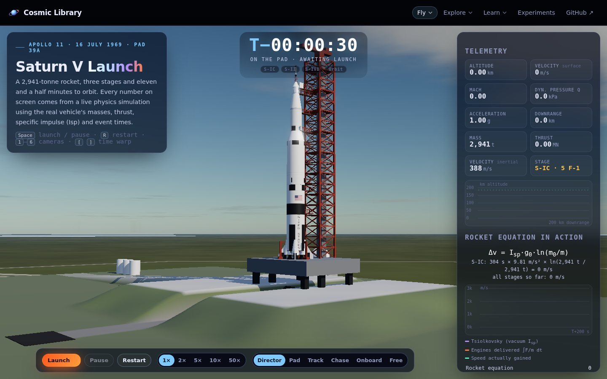
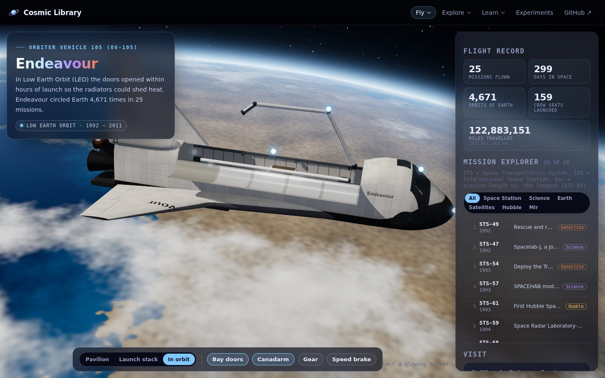
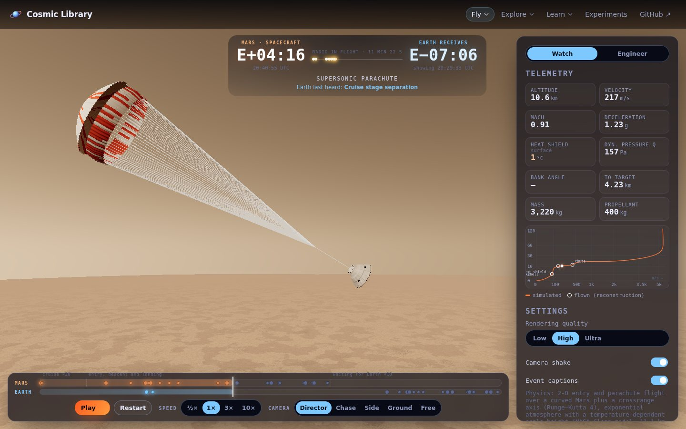
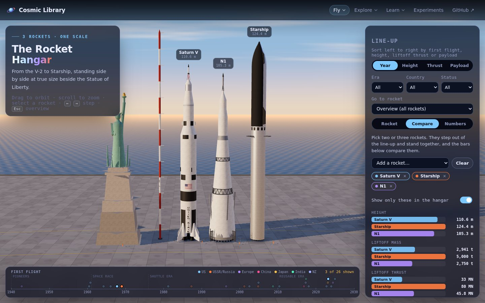
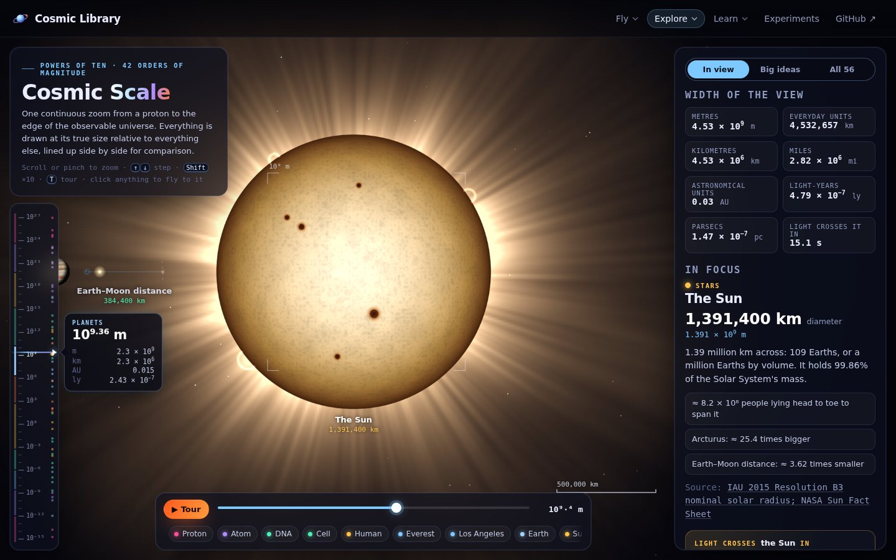
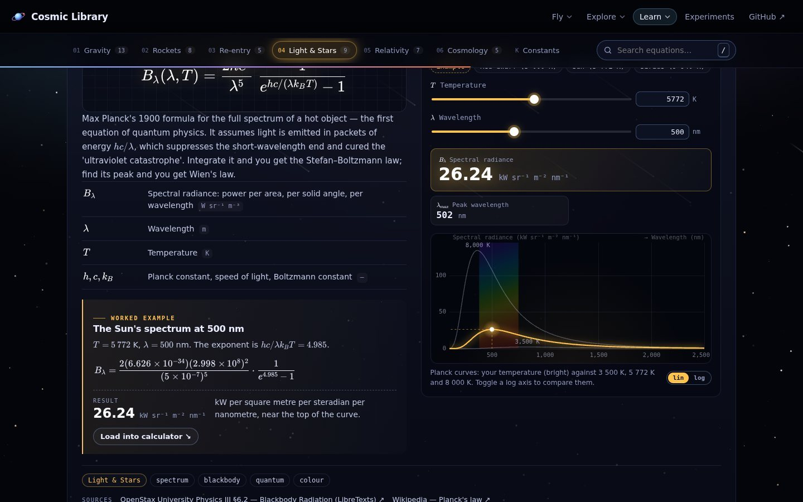
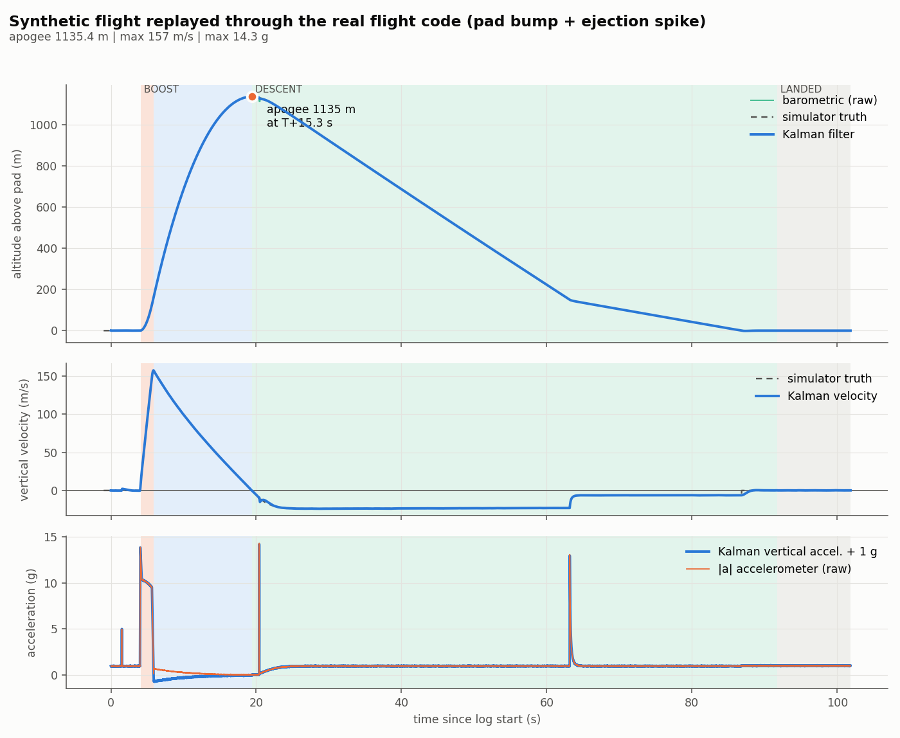
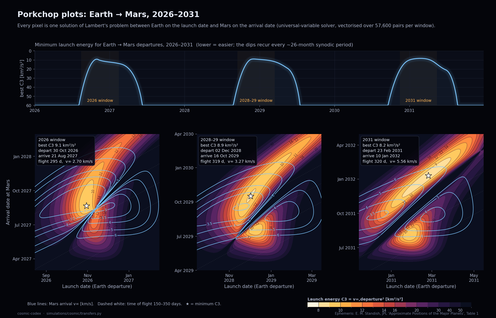
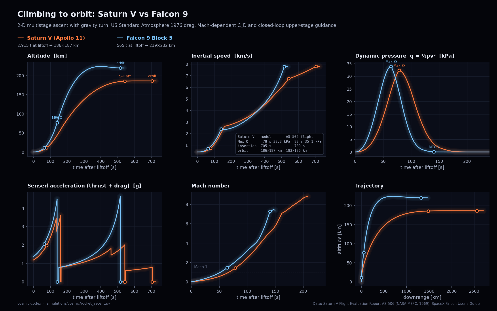

<div align="center">

<a href="https://normansrule.github.io/cosmic-library/"></a>

# Cosmic Library

**An open atlas of space and spaceflight.** Launch a Saturn V, land a booster, fly Apollo 11's lunar module down, survive Mars' seven minutes of terror, track every satellite overhead, read tonight's sky and zoom from a proton to the edge of the universe. Then learn the equations, read the engineers' own documents, and build the experiments yourself.

[](https://github.com/Normansrule/cosmic-library/actions/workflows/pages.yml)
[](https://github.com/Normansrule/cosmic-library/actions/workflows/ci.yml)
[](LICENSE)
[](https://threejs.org)
[](simulations/)
[](experiments/30-flight-computer-pcb/)

### [🚀 Open the live site →](https://normansrule.github.io/cosmic-library/)

**Fly:** [Saturn V launch](https://normansrule.github.io/cosmic-library/launch.html) · [Booster landing](https://normansrule.github.io/cosmic-library/booster.html) · [Moon landing](https://normansrule.github.io/cosmic-library/moon-landing.html) · [Mars landing](https://normansrule.github.io/cosmic-library/mars-landing.html) · [Endeavour](https://normansrule.github.io/cosmic-library/shuttle.html) · [Rocket hangar](https://normansrule.github.io/cosmic-library/hangar.html)<br>
**Explore:** [Live Earth orbit](https://normansrule.github.io/cosmic-library/earth.html) · [Night sky](https://normansrule.github.io/cosmic-library/sky.html) · [Solar system](https://normansrule.github.io/cosmic-library/solar-system.html) · [The Sun](https://normansrule.github.io/cosmic-library/sun.html) · [Black hole](https://normansrule.github.io/cosmic-library/black-hole.html) · [Cosmic scale](https://normansrule.github.io/cosmic-library/scale.html)<br>
**Learn:** [Orbit Lab](https://normansrule.github.io/cosmic-library/orbits.html) · [Equations](https://normansrule.github.io/cosmic-library/equations.html) · [Gallery](https://normansrule.github.io/cosmic-library/gallery.html) · [Timeline](https://normansrule.github.io/cosmic-library/timeline.html) · [Documents](https://normansrule.github.io/cosmic-library/library.html)<br>
**Build:** [Experiments](https://normansrule.github.io/cosmic-library/experiments.html)

</div>

---

## Contents

- [What's inside](#whats-inside)
- [Fly it: launch, land, and land again](#-fly-it-launch-land-and-land-again)
- [Explore it: from low Earth orbit to the edge of the universe](#-explore-it-from-low-earth-orbit-to-the-edge-of-the-universe)
- [Learn it: equations, gallery, timeline, documents](#-learn-it)
- [Build it: 20 experiments from $0 to a custom PCB](#-build-it-20-experiments)
- [Compute it: the Python toolkit](#-compute-it-the-python-toolkit)
- [Quick start (Ubuntu)](#-quick-start-ubuntu)
- [Repository layout](#-repository-layout)
- [How it's built, and what inspired it](#-how-its-built-and-what-inspired-it)
- [Contributing](#-contributing) · [Credits](#-credits) · [Licence](#-licence)

## What's inside

| | | |
|---|---|---|
| **19** interactive pages | **47** equations, each with a calculator and a plot | **50** iconic photographs, 1946 → 2022 |
| **110** milestones, 1903 → 2026 | **79** primary documents from NASA, JPL, SpaceX, ESA… | **20** hands-on builds in 5 levels |
| **7** Python simulations with **52** physics tests, plus Node test suites for every flight model | A KiCad **flight-computer PCB**, firmware and ground station | **32** 3D-printable parts from 11 parametric OpenSCAD sources |

Everything on the site runs in the browser with no build step and no sign-up. Every number on screen comes from a stated equation or a cited source.

---

## 🚀 Fly it: launch, land, and land again

<table>
<tr>
<td width="50%"><a href="https://normansrule.github.io/cosmic-library/launch.html"></a></td>
<td width="50%"><a href="https://normansrule.github.io/cosmic-library/launch.html"></a></td>
</tr>
<tr><td colspan="2">

### Saturn V launch · [`launch.html`](site/launch.html)
A fully modelled Apollo 11 Saturn V on Launch Complex 39A. Count down from T−10, watch ignition at T−8.9 s, the swing arms retract and the tower clear, then ride all three stages to orbit. The trajectory is **integrated live** from Apollo 11's stage masses, thrust and specific impulse, with a gravity turn and drag through the 1976 US Standard Atmosphere. It lands within a few percent of the real flight:

| Event | Simulated | Apollo 11 (AS-506 flight evaluation report) |
|---|---|---|
| Mach 1 | T+67.6 s | T+66.3 s |
| S-IVB cutoff | T+712 s | T+699 s |
| Parking orbit | 187 × 181 km | 185.9 × 183.2 km |

Six cameras (director, pad, ground tracking, chase, onboard, free), 1–50× time warp, live telemetry (altitude, Mach, dynamic pressure, g-load, downrange), an event log that explains each moment, and a **rocket-equation panel** comparing Tsiolkovsky's prediction with the speed the engines actually delivered.
</td></tr>
</table>

<table>
<tr>
<td width="50%"><a href="https://normansrule.github.io/cosmic-library/shuttle.html"></a></td>
<td width="50%"><a href="https://normansrule.github.io/cosmic-library/shuttle.html"></a></td>
</tr>
<tr><td colspan="2">

### Space Shuttle Endeavour · [`shuttle.html`](site/shuttle.html)
Orbiter Vehicle 105 (OV-105), home at the **California Science Center** in Los Angeles. Switch between its 2012–2023 horizontal display in the Samuel Oschin Pavilion, the **vertical launch stack** with External Tank ET-94 and two solid rocket boosters (the centrepiece of the Samuel Oschin Air and Space Center, opening **13 November 2026**), and low Earth orbit with the payload bay open. Open the bay doors, deploy the Canadarm, drop the gear, and click any part for an explanation. All **25 missions** are listed, from STS-49 (1992) to STS-134 (2011), each fact with its source in [`endeavour.json`](site/data/endeavour.json).
</td></tr>
</table>

<table>
<tr>
<td width="50%"><a href="https://normansrule.github.io/cosmic-library/booster.html"></a></td>
<td width="50%"><a href="https://normansrule.github.io/cosmic-library/moon-landing.html"></a></td>
</tr>
<tr>
<td valign="top">

### Booster landing · [`booster.html`](site/booster.html)
Land a Falcon 9-class reusable first stage on a drone ship, back at the launch site after a boostback burn, or from a 3 km final approach. Flip, entry burn, grid-fin steering, then the **hoverslam**: one engine at minimum throttle still out-lifts the empty stage, so it can't hover and the burn must end exactly at zero altitude. The HUD shows the ideal burn-start height $h = v^2 / 2a_{net}$ live. Fly it on keyboard or touch, or hand over to a transparent autopilot, which lands all three scenarios in the Node test suite.
</td>
<td valign="top">

### Moon landing · [`moon-landing.html`](site/moon-landing.html)
Apollo 11's Lunar Module *Eagle*, from Powered Descent Initiation (PDI) at 15 km through the braking (P63) and approach (P64) phases to touchdown. Take over in P66 like Armstrong did to fly past the boulder field; the model's automatic descent reaches High Gate within 3 s of the real flight plan. There's a Display and Keyboard (DSKY)-inspired panel, the Landing Point Designator (LPD) grid in the commander's window, optional 1202 alarms, and 38 real call-outs from the public-domain transcripts.
</td>
</tr>
<tr>
<td width="50%"><a href="https://normansrule.github.io/cosmic-library/mars-landing.html"></a></td>
<td width="50%"><a href="https://normansrule.github.io/cosmic-library/hangar.html"></a></td>
</tr>
<tr>
<td valign="top">

### Mars landing · [`mars-landing.html`](site/mars-landing.html)
Perseverance's Entry, Descent and Landing (EDL) at Jezero crater, 18 February 2021: guided entry with bank reversals, a 10 g peak, the supersonic parachute at Mach 1.8, Terrain-Relative Navigation (TRN), powered descent and the **sky crane**. A second clock shows what Earth knew, 11 minutes behind. In Engineer mode you choose the parachute trigger, bank profile, TRN and sky-crane settings and see the consequences. The default flight touches down at E+419.5 s; the real one took 419 s.
</td>
<td valign="top">

### Rocket hangar · [`hangar.html`](site/hangar.html)
26 rockets, from the V-2 to Starship, standing side by side at true scale with the Statue of Liberty and a person for reference. Sort by year, height, thrust or payload, filter by era, country or status, and compare two or three with bars and computed thrust-to-weight. Every figure is sourced in [`rockets.json`](site/data/rockets.json).
</td>
</tr>
</table>

---

## 🔭 Explore it: from low Earth orbit to the edge of the universe

<table>
<tr>
<td width="50%"><a href="https://normansrule.github.io/cosmic-library/earth.html"></a></td>
<td width="50%"><a href="https://normansrule.github.io/cosmic-library/sky.html"></a></td>
</tr>
<tr>
<td valign="top">

### Live Earth orbit · [`earth.html`](site/earth.html)
Every tracked satellite overhead right now: CelesTrak's General Perturbations (GP) elements propagated in your browser with Simplified General Perturbations 4 (SGP4) via [satellite.js](https://github.com/shashwatak/satellite-js). Space stations, GPS, Galileo, geostationary, weather, science and all of Starlink. Click any satellite for its orbit and ground track, see when the International Space Station (ISS) next passes over you, and follow upcoming launches ([Launch Library 2](https://thespacedevs.com/)) and the latest news ([Spaceflight News API](https://spaceflightnewsapi.net/)). Works offline with illustrative orbits.
</td>
<td valign="top">

### Night sky · [`sky.html`](site/sky.html)
A planetarium for any place and time: 5,044 stars, 88 constellations, the Milky Way, Messier objects, the planets and the Moon with its real phase. Twilight colours follow the Sun's altitude. There's a "Tonight" panel with rise and set times and the best objects for your location. The astronomy is tested against Meeus and the U.S. Naval Observatory sunrise tables (within 1 minute).
</td>
</tr>
<tr>
<td width="50%"><a href="https://normansrule.github.io/cosmic-library/scale.html"></a></td>
<td width="50%"><a href="https://normansrule.github.io/cosmic-library/scale.html"></a></td>
</tr>
<tr><td colspan="2">

### Cosmic scale · [`scale.html`](site/scale.html)
One continuous zoom across 42 powers of ten, from a proton to the observable universe (93 billion light-years across), through 56 objects drawn at true relative size, from DNA and a red blood cell to the Los Angeles basin, Voyager 1 (its distance updates live) and the Laniakea Supercluster. For each it shows how many would fit and how long light takes to cross it. A narrated tour flies you out and back.
</td></tr>
</table>

<table>
<tr>
<td width="50%"><a href="https://normansrule.github.io/cosmic-library/black-hole.html"></a></td>
<td width="50%"><a href="https://normansrule.github.io/cosmic-library/sun.html"></a></td>
</tr>
<tr>
<td valign="top">

### Black hole · [`black-hole.html`](site/black-hole.html)
A real-time **general-relativistic ray tracer**: every pixel is a light ray integrated backwards through Schwarzschild spacetime. It shows the lensed disk seen over and under the shadow, the photon ring, Doppler beaming and gravitational redshift. Tilt, zoom, toggle the physics off one effect at a time, then **fall in**. A calculator covers the Schwarzschild radius, tides and time dilation from Earth up to TON 618.
</td>
<td valign="top">

### The Sun · [`sun.html`](site/sun.html)
Granulation, sunspots, faculae and prominence loops, with differential rotation (about 25 days at the equator, 35 at the poles). Switch between white light, hydrogen-alpha and three of the Solar Dynamics Observatory's (SDO) ultraviolet channels; **trigger a flare and coronal mass ejection (CME)**; or **cut it open** to see the core, radiative zone, tachocline and convective zone with their temperatures and densities.
</td>
</tr>
<tr>
<td width="50%"><a href="https://normansrule.github.io/cosmic-library/solar-system.html"></a></td>
<td width="50%"><a href="https://normansrule.github.io/cosmic-library/orbits.html"></a></td>
</tr>
<tr>
<td valign="top">

### Solar system · [`solar-system.html`](site/solar-system.html)
A live orrery that puts every planet where it really is, using the Jet Propulsion Laboratory's (JPL) *Keplerian Elements for Approximate Positions of the Major Planets* (Standish), checked against real oppositions in [`test_ephemeris.mjs`](scripts/test_ephemeris.mjs). Fly to any world for its fact sheet, today's distance and light-time from Earth; switch to true scale; spot Voyager 1 and 2 and New Horizons; find the next opposition.
</td>
<td valign="top">

### Orbit Lab · [`orbits.html`](site/orbits.html)
Five hands-on labs, each with its equation beside it: **Newton's cannonball** (suborbital → circular → escape), **Kepler's laws** with equal-area wedges, **Hohmann vs bi-elliptic transfers** (LEO→GEO, Earth→Mars), a **Jupiter gravity assist** in both frames, and **Lagrange points** on an effective-potential map with test particles you can drop.
</td>
</tr>
</table>

---

## 📚 Learn it

<table>
<tr>
<td width="50%"><a href="https://normansrule.github.io/cosmic-library/equations.html"></a></td>
<td width="50%"><a href="https://normansrule.github.io/cosmic-library/timeline.html"></a></td>
</tr>
<tr>
<td valign="top">

### Equation Atlas · [`equations.html`](site/equations.html) · [`docs/EQUATIONS.md`](docs/EQUATIONS.md)
47 equations in six chapters (gravity and orbits, rockets, atmosphere and re-entry, light and stars, relativity and black holes, cosmology). Each has a symbol legend, a plain-language meaning, a worked example with real mission numbers, a **live calculator**, a **plot**, and a source. `scripts/check_equations.mjs` re-derives all of them (1,228 checks), including GPS's +38 µs/day clock correction and the 259-day Hohmann transfer to Mars.
</td>
<td valign="top">

### Timeline · [`timeline.html`](site/timeline.html)
110 milestones from Tsiolkovsky's rocket equation (1903) to **Artemis II**'s crewed lunar flyby (April 2026), filterable by agency: NASA, Soviet Union and Roscosmos, ESA, China (CNSA), India (ISRO), Japan (JAXA), SpaceX and others.
</td>
</tr>
<tr>
<td width="50%"><a href="https://normansrule.github.io/cosmic-library/library.html"></a></td>
<td width="50%"><a href="https://normansrule.github.io/cosmic-library/gallery.html"></a></td>
</tr>
<tr>
<td valign="top">

### Documents (Mission Library) · [`library.html`](site/library.html) · [`docs/REFERENCES.md`](docs/REFERENCES.md)
79 primary sources: the NASA Systems Engineering Handbook, JPL's *Basics of Space Flight*, Saturn V flight evaluation reports, the Apollo Flight Journal, SpaceX's Falcon user's guide, the Space Launch System reference guide, NAIF SPICE, JPL Horizons, the General Mission Analysis Tool (GMAT), MIT OpenCourseWare and more. They're organised as a **beginner → expert reading path**, plus curated [videos and channels](docs/VIDEOS.md) and [engineering primers](docs/engineering/).
</td>
<td valign="top">

### Gallery · [`gallery.html`](site/gallery.html)
Fifty photographs that changed how we see ourselves, each with the story of why it matters. Images load from NASA, ESA/Hubble, ESA/Webb, ESO and Wikimedia Commons. If one moves, the page automatically searches the NASA Image and Video Library, and a daily **Astronomy Picture of the Day** strip is included. Run `python scripts/fetch_gallery.py` for an offline copy.
</td>
</tr>
</table>

<details>
<summary><b>A few of the photographs</b> (click to expand)</summary>

| | | |
|---|---|---|
| <br>**A man on the Moon**, Apollo 11, 1969<br><sub>NASA</sub> | <br>**Pale Blue Dot**, Voyager 1, 1990<br><sub>NASA/JPL</sub> | <br>**First image of a black hole**, M87*, 2019<br><sub>EHT Collaboration (CC BY 4.0)</sub> |
| <br>**Webb's First Deep Field**, 2022<br><sub>NASA, ESA, CSA, STScI (CC BY 4.0)</sub> | <br>**Cosmic Cliffs in Carina**, 2022<br><sub>NASA, ESA, CSA, STScI (CC BY 4.0)</sub> | <br>**Pillars of Creation**, Webb, 2022<br><sub>NASA, ESA, CSA, STScI (CC BY 4.0)</sub> |

</details>

---

## 🔧 Build it: 20 experiments

A ladder from the kitchen table to research-grade hardware. **Every build** has a bill of materials with costs, numbered steps, the physics with equations, a data sheet, troubleshooting and "going further". Read [`experiments/SAFETY.md`](experiments/SAFETY.md) first: only commercially certified motors, the National Association of Rocketry (NAR) safety code, and FAA 14 CFR Part 101.

<table>
<tr>
<td width="33%"><br><sub>Parametric nose cones: conical, ogive, von Kármán, LV-Haack, elliptical</sub></td>
<td width="33%"><br><sub>RP2040 flight-logger printed circuit board (PCB), 38 mm airframe (KiCad)</sub></td>
<td width="33%"><br><sub>Flight state machine + Kalman filter replaying a synthetic flight</sub></td>
</tr>
</table>

| Level | Budget | Builds |
|---|---|---|
| **0 · Kitchen table** | under $10 | [Stomp rocket](experiments/00-stomp-rocket/) · [Balloon rocket: Newton's third law](experiments/01-balloon-rocket-newtons-third-law/) · [Film-canister rocket](experiments/02-film-canister-rocket/) · [Pinhole Sun projector & sunspots](experiments/03-pinhole-solar-projector-and-sunspots/) · [Impact craters](experiments/04-impact-craters/) |
| **1 · Garage & backyard** | $10–50 | [Water-bottle rocket + printed nose/fins](experiments/10-water-bottle-rocket/) · [DIY spectroscope](experiments/11-diy-spectroscope/) · [Cloud chamber (cosmic-ray muons)](experiments/12-cloud-chamber/) · [Moon & star-trail photography](experiments/13-moon-and-star-trail-photography/) |
| **2 · First real rockets** | $50–150 | [First model rocket (Barrowman stability)](experiments/20-first-model-rocket/) · [3D-printed model rocket](experiments/21-3d-printed-model-rocket/) · [Barometric altimeter payload (Pico + MicroPython)](experiments/22-barometric-altimeter-payload/) |
| **3 · Avionics** | $100–300 | [**Flight-computer PCB** (KiCad, firmware, sled)](experiments/30-flight-computer-pcb/) · [LoRa telemetry ground station](experiments/31-lora-telemetry-ground-station/) · [Barn-door star tracker](experiments/32-barn-door-star-tracker/) |
| **4 · Research grade** | $150+ | [High-power rocketry certification](experiments/40-high-power-rocketry-certification/) · [OpenRocket deep dive + our own simulator](experiments/41-openrocket-deep-dive/) · [Near-space balloon & 1U CubeSat](experiments/42-near-space-balloon-cubesat/) · [Hydrogen-line radio telescope](experiments/43-hydrogen-line-radio-telescope/) · [Exoplanet transit photometry](experiments/44-exoplanet-transit-photometry/) |

Printable parts can be spun in 3D on the [experiments page](https://normansrule.github.io/cosmic-library/experiments.html). Rebuild every STL from source with `python experiments/tools/build_cad.py` and `python experiments/tools/build_advanced_cad.py` (needs OpenSCAD).

---

## 🧮 Compute it: the Python toolkit

<table>
<tr>
<td width="50%"></td>
<td width="50%"></td>
</tr>
<tr>
<td width="50%"></td>
<td width="50%"></td>
</tr>
</table>

| Module | What it does |
|---|---|
| `black_hole_raytracer` | Schwarzschild photon orbits, thin disk, Doppler + gravitational redshift, primary and secondary images |
| `nbody` | Symplectic Yoshida-4 integrator: inner solar system, the figure-eight three-body choreography, a circumbinary planet |
| `rocket_ascent` | 2-D multistage ascent with gravity turn and Mach-dependent drag; Saturn V and Falcon 9 presets |
| `transfers` | Hohmann, bi-elliptic, a Lambert solver (checked against Curtis Example 5.2) and Earth→Mars porkchop plots 2026–2031 |
| `exoplanet_transit` | Box Least Squares transit search; optional real TESS data via `lightkurve` |
| `stellar` | Planck curves, Wien, Stefan–Boltzmann, blackbody colour, a synthetic Hertzsprung–Russell diagram |
| `orbital_elements` | Keplerian elements ↔ state vectors, ground tracks with J2 precession |

```bash
python simulations/run.py --help
python simulations/run.py transfers porkchop   # Earth → Mars launch windows
python -m pytest simulations/tests -q       # 52 physics tests, about 30 s
```
Full guide with every image: [`simulations/README.md`](simulations/README.md).

---

## ⚡ Quick start (Ubuntu)

From a fresh Ubuntu terminal (22.04, 24.04 or newer, native or WSL2):

```bash
# 1. Tools
sudo apt update && sudo apt install -y git python3 python3-venv python3-pip nodejs npm

# 2. Get the code
git clone https://github.com/Normansrule/cosmic-library.git
cd cosmic-library

# 3. Run the website locally → open http://localhost:8000
python3 -m http.server 8000 --directory site

# 4. (another terminal) Python toolkit + tests
python3 -m venv .venv && source .venv/bin/activate
pip install -r simulations/requirements.txt
python -m pytest simulations/tests -q
```

The full walkthrough, from a blank machine to a live GitHub Pages site (git identity, SSH keys, `gh`, Pages, CAD and PCB tools), is in **[`docs/SETUP_UBUNTU.md`](docs/SETUP_UBUNTU.md)**. [`scripts/setup_ubuntu.sh`](scripts/setup_ubuntu.sh) does the install steps in one go.

---

## 🗂 Repository layout

```
cosmic-library/
├── site/                     GitHub Pages website (static, no build step)
│   ├── index.html            landing page with a live WebGL galaxy
│   ├── launch.html           Saturn V launch          ├── booster.html      reusable booster landing
│   ├── moon-landing.html     Apollo 11 descent        ├── mars-landing.html Perseverance EDL
│   ├── shuttle.html          Endeavour                ├── hangar.html       26 rockets to scale
│   ├── earth.html            live satellites          ├── sky.html          planetarium
│   ├── solar-system.html     live orrery              ├── sun.html          the Sun
│   ├── black-hole.html       GR ray tracer            ├── scale.html        proton → universe
│   ├── orbits.html           Orbit Lab                ├── equations.html    Equation Atlas
│   ├── gallery.html          photographs              ├── timeline.html     1903 → 2026
│   ├── library.html          documents & videos       ├── experiments.html  build ladder + STL viewer
│   ├── assets/css/codex.css  the design system        ├── assets/js/        page logic
│   ├── data/*.json           curated, sourced data    ├── models/*.stl      printable parts
│   ├── data/sky/             star catalogue, constellations, Milky Way (d3-celestial)
│   └── vendor/               three.js r186, GSAP 3.15, KaTeX 0.18, satellite.js 7.1
├── simulations/              Python toolkit (cosmic/) + tests
├── experiments/              20 builds, levels 0–4: tutorials, OpenSCAD, STL, KiCad, firmware
├── docs/                     EQUATIONS, REFERENCES, VIDEOS, engineering primers, setup
├── media/                    README screenshots and simulation renders
├── scripts/                  screenshot tool, checks, gallery fetcher, setup
└── .github/workflows/        Pages deploy + CI
```

---

## 🎨 How it's built, and what inspired it

The site is plain HTML, CSS and ES modules, with **no framework and no build step**. Three.js, GSAP and KaTeX are vendored under `site/vendor/`, so it works offline and deploys by copying a folder. The shared design system lives in [`site/assets/css/codex.css`](site/assets/css/codex.css); conventions are in [`docs/DEVELOPING.md`](docs/DEVELOPING.md).

These projects set the quality bar. Here is what each one contributed:

| Project | What we took from it |
|---|---|
| [magicuidesign/magicui](https://github.com/magicuidesign/magicui) | Spotlight "MagicCard", border beam, meteors, number ticker and marquee, re-implemented in vanilla CSS/JS |
| [DavidHDev/react-bits](https://github.com/DavidHDev/react-bits) | Aurora background, shiny text, blur-in text reveal |
| [Animate UI](https://animate-ui.com/) · [ibelick/motion-primitives](https://github.com/ibelick/motion-primitives) | Motion vocabulary: staggered reveals, segmented controls, springy panels |
| [greensock/GSAP](https://github.com/greensock/GSAP) | Camera moves, ScrollTrigger timeline, Flip filtering (used directly) |
| [brunosimon/folio-2019](https://github.com/brunosimon/folio-2019) | Procedural three.js scenes you explore instead of read |
| [PavelDoGreat/WebGL-Fluid-Simulation](https://github.com/PavelDoGreat/WebGL-Fluid-Simulation) | Full-screen GPU shaders as the main event (black hole, Sun) |
| [bbycroft/llm-viz](https://github.com/bbycroft/llm-viz) · [poloclub/transformer-explainer](https://github.com/poloclub/transformer-explainer) | Explorable explanations: every visual paired with the maths driving it |
| [bilawalsidhu/gods-eye-view](https://github.com/bilawalsidhu/gods-eye-view) · [koala73/worldmonitor](https://github.com/koala73/worldmonitor) | Live, data-driven globes and HUD-style panels, used directly in the Live Earth Orbit page (real satellites, launches and news on one globe) |
| [remotion-dev/remotion](https://github.com/remotion-dev/remotion) | Programmatic media: the README's renders and GIFs are generated by code (`scripts/shot.py`, `simulations/make_showcase.py`) |

---

## 🤝 Contributing

Ideas, corrections and new experiments are welcome. See [`CONTRIBUTING.md`](CONTRIBUTING.md). The short version: keep numbers sourced, test pages with `python scripts/shot.py <page>.html out.png`, and run the checks before opening a pull request.

## 🙏 Credits

Built by **Aleksander Norman** ([@Normansrule](https://github.com/Normansrule)). Every library, dataset, image and reference is listed in [`CREDITS.md`](CREDITS.md). NASA imagery is generally not subject to copyright in the United States; ESA/Webb, ESA/Hubble and ESO images are CC BY 4.0. Cosmic Library is an independent educational project, **not affiliated with or endorsed by** NASA, JPL, SpaceX, ESA or the California Science Center.

## 📄 Licence

Code: [MIT](LICENSE). Written content and original diagrams: [CC BY 4.0](https://creativecommons.org/licenses/by/4.0/). Third-party images keep their own terms (see [`CREDITS.md`](CREDITS.md)).

<div align="center"><sub>Ad astra per aspera ✦</sub></div>
