<div align="center">

<a href="https://normansrule.github.io/cosmic-library/"></a>

[](https://github.com/Normansrule/cosmic-library/actions/workflows/pages.yml)
[](https://github.com/Normansrule/cosmic-library/actions/workflows/ci.yml)
[](LICENSE)
[](https://threejs.org)
[](simulations/)
[](experiments/30-flight-computer-pcb/)

**An open atlas of space and spaceflight that runs in your browser.**<br>
Launch a Saturn V, land a booster, fly Apollo 11's lunar module down, survive Mars' seven minutes of terror,<br>
track every satellite overhead, read tonight's sky, and zoom from a proton to the edge of the universe.<br>
Then learn the equations, read the engineers' own documents, and build the experiments yourself.

### [🚀 Open the live site →](https://normansrule.github.io/cosmic-library/)

<sub>No install · no sign-up · works on phones · every number sourced</sub>

</div>

---

## 🧭 Start here

Pick what you're in the mood for. Every link opens a live, interactive page.

| If you want to… | Go here | Time |
|---|---|---|
| 🤯 **See something amazing, right now** | [Black hole](https://normansrule.github.io/cosmic-library/black-hole.html) → [Cosmic scale](https://normansrule.github.io/cosmic-library/scale.html) | 2 min |
| 🎮 **Fly a mission yourself** | [Booster landing](https://normansrule.github.io/cosmic-library/booster.html) → [Moon landing](https://normansrule.github.io/cosmic-library/moon-landing.html) → [Mars landing](https://normansrule.github.io/cosmic-library/mars-landing.html) | 10 min |
| 🛠️ **Design your own rocket** | [Rocket builder](https://normansrule.github.io/cosmic-library/builder.html) → [Rocket hangar](https://normansrule.github.io/cosmic-library/hangar.html) | 10 min |
| 🌌 **Know what's in the sky tonight** | [Night sky](https://normansrule.github.io/cosmic-library/sky.html) → [Live Earth orbit](https://normansrule.github.io/cosmic-library/earth.html) → [Space weather](https://normansrule.github.io/cosmic-library/space-weather.html) | 5 min |
| 📐 **Actually understand orbital mechanics** | [Orbit Lab](https://normansrule.github.io/cosmic-library/orbits.html) → [Equations](https://normansrule.github.io/cosmic-library/equations.html) → [Documents](https://normansrule.github.io/cosmic-library/library.html) | an evening |
| 🔧 **Build something real** | [Experiments](https://normansrule.github.io/cosmic-library/experiments.html): paper rocket (under $10) → flight-computer circuit board | a weekend |
| 🐍 **Run the physics in Python** | [`simulations/`](simulations/): black hole ray tracer, Mars launch windows, N-body | 5 min |

<details>
<summary><b>🗺️ See the whole site as a metro map</b> (click to open)</summary>
<br>
<p align="center"></p>

Each coloured line is a group of pages and each station is a page. Interchanges are where topics connect: the Rocket builder is on both the Fly and Build lines, the Solar system on Explore and Learn, and the Equations on Learn and Build. Beginners can start at either **START HERE** marker.
</details>

---

## 🚀 Fly it

<sub>Click any card to open it. Each is a real flight model, checked against mission data in the test suite.</sub>

<table>
<tr>
<td align="center" width="33%"><a href="https://normansrule.github.io/cosmic-library/launch.html"></a></td>
<td align="center" width="33%"><a href="https://normansrule.github.io/cosmic-library/booster.html"></a></td>
<td align="center" width="33%"><a href="https://normansrule.github.io/cosmic-library/moon-landing.html"></a></td>
</tr>
<tr>
<td align="center"><a href="https://normansrule.github.io/cosmic-library/mars-landing.html"></a></td>
<td align="center"><a href="https://normansrule.github.io/cosmic-library/builder.html"></a></td>
<td align="center"><a href="https://normansrule.github.io/cosmic-library/hangar.html"></a></td>
</tr>
<tr>
<td align="center"><a href="https://normansrule.github.io/cosmic-library/shuttle.html"></a></td>
<td colspan="2" valign="middle">

**Try this:** open [Booster landing](https://normansrule.github.io/cosmic-library/booster.html), press **P** to hand over to the autopilot, and watch the *burn-start altitude* readout. That's the height where a single engine must light so the stage reaches zero speed exactly at the deck: $h = v^2/2a_{net}$.

</td>
</tr>
</table>

<details open>
<summary><b>🎬 Watch the real simulations</b> (recorded straight from the pages)</summary>
<br>

| | |
|:---:|:---:|
| <a href="https://normansrule.github.io/cosmic-library/launch.html"></a><br>**Saturn V** lifts off and clears the tower | <a href="https://normansrule.github.io/cosmic-library/booster.html"></a><br>**Booster** hoverslams onto the drone ship |
| <a href="https://normansrule.github.io/cosmic-library/moon-landing.html"></a><br>**Eagle**: the last 120 m to contact light | <a href="https://normansrule.github.io/cosmic-library/mars-landing.html"></a><br>**Sky crane** lowers Perseverance onto Jezero |
| <a href="https://normansrule.github.io/cosmic-library/builder.html"></a><br>**Your rocket** separating its stages | <a href="https://normansrule.github.io/cosmic-library/hangar.html"></a><br>**26 rockets** at true scale, V-2 to Starship |

</details>

<details>
<summary><b>📖 How each one works, and how close it gets to reality</b></summary>

#### Saturn V launch · [`launch.html`](site/launch.html)
A fully modelled Apollo 11 Saturn V on Launch Complex 39A. The trajectory is **integrated live** from Apollo 11's stage masses, thrust and specific impulse, with a gravity turn and drag through the 1976 US Standard Atmosphere. Six cameras, 1–50× time warp, live telemetry, an event log, and a rocket-equation panel comparing Tsiolkovsky's prediction with what the engines delivered.

| Event | Simulated | Apollo 11 (AS-506 flight evaluation report) |
|---|---|---|
| Mach 1 | T+67.6 s | T+66.3 s |
| S-IVB cutoff | T+712 s | T+699 s |
| Parking orbit | 187 × 181 km | 185.9 × 183.2 km |

#### Booster landing · [`booster.html`](site/booster.html)
A Falcon 9-class reusable first stage: drone ship, Return To Launch Site (RTLS) with boostback, or a 3 km final approach. Flip, entry burn, grid fins, then the **hoverslam**. One engine at minimum throttle still out-lifts the empty stage, so it can't hover. Keyboard, touch, or a transparent autopilot that lands all three scenarios in [`test_booster.mjs`](scripts/test_booster.mjs).

#### Moon landing · [`moon-landing.html`](site/moon-landing.html)
*Eagle*'s powered descent from Powered Descent Initiation (PDI) at 15 km through the braking (P63) and approach (P64) phases to touchdown. You can take over in P66 like Armstrong. The model reaches High Gate within 3 s of the flight plan and lands with about 58 s of hover propellant; NASA's post-flight figure is 63.5 s. There's a Display and Keyboard (DSKY)-inspired panel, optional 1202 alarms and 38 real call-outs.

#### Mars landing · [`mars-landing.html`](site/mars-landing.html)
Perseverance's Entry, Descent and Landing (EDL) at Jezero crater, 18 February 2021: bank reversals, a 10 g peak, the parachute at Mach 1.8, Terrain-Relative Navigation (TRN) and the sky crane. A second clock shows what Earth knew 11 min 22 s later. Engineer mode lets you make the calls. Touchdown in the model comes at E+418.4 s; the real one was E+419 s.

#### Rocket builder · [`builder.html`](site/builder.html)
Stack real engines (F-1, RS-25, Merlin, Raptor, RD-180…), tanks, boosters and payloads. The analysis updates as you build: Thrust-to-Weight Ratio (TWR), per-stage Δv, a Δv map to Low Earth Orbit (LEO), the Moon and Mars, and plain-language reasons a design fails. Then launch it on a 2-D gravity-turn ascent. Designs are shareable as links. A Saturn V-like preset reaches a 208 × 175 km orbit in the tests.

#### Rocket hangar · [`hangar.html`](site/hangar.html)
26 rockets at true scale beside the Statue of Liberty. Sort, filter, and compare height, thrust and payload. Every figure is sourced in [`rockets.json`](site/data/rockets.json).

#### Space Shuttle Endeavour · [`shuttle.html`](site/shuttle.html)
Orbiter Vehicle 105 (OV-105) at the California Science Center: the 2012–2023 pavilion display, the **vertical launch stack** of the Samuel Oschin Air and Space Center (opening 13 November 2026), and orbit. Bay doors, Canadarm, gear, clickable parts, and all 25 missions.
</details>

---

## 🔭 Explore it

<table>
<tr>
<td align="center" width="33%"><a href="https://normansrule.github.io/cosmic-library/earth.html"></a></td>
<td align="center" width="33%"><a href="https://normansrule.github.io/cosmic-library/space-weather.html"></a></td>
<td align="center" width="33%"><a href="https://normansrule.github.io/cosmic-library/sky.html"></a></td>
</tr>
<tr>
<td align="center"><a href="https://normansrule.github.io/cosmic-library/solar-system.html"></a></td>
<td align="center"><a href="https://normansrule.github.io/cosmic-library/sun.html"></a></td>
<td align="center"><a href="https://normansrule.github.io/cosmic-library/black-hole.html"></a></td>
</tr>
<tr>
<td align="center"><a href="https://normansrule.github.io/cosmic-library/galaxies.html"></a></td>
<td align="center"><a href="https://normansrule.github.io/cosmic-library/scale.html"></a></td>
<td valign="middle">

**Try this:** open [Night sky](https://normansrule.github.io/cosmic-library/sky.html), press play at 3600×, and watch the sky turn around Polaris. It sits at the same altitude as your latitude.

</td>
</tr>
</table>

<details open>
<summary><b>🎬 Watch the real simulations</b></summary>
<br>

| | |
|:---:|:---:|
| <a href="https://normansrule.github.io/cosmic-library/black-hole.html"></a><br>**Black hole**: every pixel is a light ray bent by gravity | <a href="https://normansrule.github.io/cosmic-library/scale.html"></a><br>**Cosmic scale**: a person to the Milky Way |
| <a href="https://normansrule.github.io/cosmic-library/earth.html"></a><br>**Live Earth orbit**: satellites propagated with SGP4 | <a href="https://normansrule.github.io/cosmic-library/galaxies.html"></a><br>**Milky Way meets Andromeda**, 4 billion years from now |
| <a href="https://normansrule.github.io/cosmic-library/sun.html"></a><br>**The Sun**: granulation, a flare and a CME | <a href="https://normansrule.github.io/cosmic-library/sky.html"></a><br>**Night sky** over Los Angeles, six hours in four seconds |
| <a href="https://normansrule.github.io/cosmic-library/solar-system.html"></a><br>**Solar system**: every planet where it really is | <a href="https://normansrule.github.io/cosmic-library/space-weather.html"></a><br>**Space weather**: solar wind against the magnetosphere |

</details>

<details>
<summary><b>📖 How each one works</b></summary>

#### Live Earth orbit · [`earth.html`](site/earth.html)
Every tracked satellite overhead right now. CelesTrak's General Perturbations (GP) elements are propagated in your browser with Simplified General Perturbations 4 (SGP4) via [satellite.js](https://github.com/shashwatak/satellite-js). The page also shows passes of the International Space Station (ISS) over your location, upcoming launches ([Launch Library 2](https://thespacedevs.com/)) and news ([Spaceflight News API](https://spaceflightnewsapi.net/)). Offline it falls back to illustrative orbits.

#### Space weather · [`space-weather.html`](site/space-weather.html)
Live solar-wind, magnetic-field, planetary K-index (Kp), X-ray and aurora data from NOAA's Space Weather Prediction Center (SWPC). The magnetosphere's size is computed from the solar wind's pressure (Shue et al. 1998). NOAA's R/S/G storm scales are shown as gauges, and a "could I see the aurora tonight?" answer is given for your location. Offline, it shows a labelled reconstruction of the May 2024 G5 storm.

#### Night sky · [`sky.html`](site/sky.html)
A planetarium for any place and time: 5,044 stars, 88 constellations, the Milky Way, Messier objects, the planets and the Moon's phase. Sidereal time, precession and refraction are tested against Meeus and the U.S. Naval Observatory sunrise tables (within 1 minute).

#### Galaxy collision · [`galaxies.html`](site/galaxies.html)
A GPU restricted N-body simulation in the style of Toomre & Toomre (1972). With the 2012 orbit the galaxies first meet at 4.0 billion years and merge at 6.2. With the 2019 Gaia orbit they may not merge at all, consistent with Sawala et al. (2025) finding only about a 50% chance within 10 billion years. It includes presets for the Antennae, the Mice and a Cartwheel-like collision, and a view of the night sky from the Sun.

#### Cosmic scale · [`scale.html`](site/scale.html)
42 powers of ten and 56 objects at true relative size, with how long light takes to cross each one and a narrated tour.

#### Solar system · Sun · Black hole
The **orrery** uses JPL's Keplerian elements (Standish), tested against real oppositions. The **Sun** shows five wavelengths, a flare and coronal mass ejection (CME), and a cutaway. The **black hole** is a real-time Schwarzschild ray tracer with Doppler beaming and gravitational redshift.
</details>

---

## 🧠 Ideas in motion

<sub>Each animation is drawn from real numbers. Click one to play with the idea on the site.</sub>

<p align="center"><a href="https://normansrule.github.io/cosmic-library/equations.html"></a></p>

**The rocket equation.** Each extra tonne of fuel has to lift all the fuel above it, so Δv grows only with the *logarithm* of the mass ratio. That's why rockets have stages.

<p align="center"><a href="https://normansrule.github.io/cosmic-library/orbits.html"></a></p>

**Two burns to geostationary orbit.** Speed up in low orbit and you coast up half an ellipse. Speed up again at the top to stay there: 3.89 km/s in total, 5.3 hours.

<p align="center"><a href="https://normansrule.github.io/cosmic-library/solar-system.html"></a></p>

**Light is fast, space is bigger.** Sunlight is 8 min 19 s old when it reaches you. A radio command to a spacecraft at Neptune takes about 4 hours.

<details open>
<summary><b>More animated explanations</b></summary>
<br>

<p align="center"><a href="https://normansrule.github.io/cosmic-library/orbits.html"></a></p>

**Kepler's second law.** A planet sweeps out equal areas in equal times, so it races near the Sun and dawdles far away.

<p align="center"><a href="https://normansrule.github.io/cosmic-library/solar-system.html"></a></p>

**The orbit race.** True relative periods: Mercury laps the Sun 684 times for every one Neptune completes (T² ∝ a³).

<p align="center"><a href="https://normansrule.github.io/cosmic-library/launch.html"></a></p>

**Three stages, eleven minutes, one orbit.** The Saturn V drops each stage as it empties.

<p align="center"><a href="https://normansrule.github.io/cosmic-library/booster.html"></a></p>

**The hoverslam.** The engine can't throttle low enough to hover, so the burn must start at exactly the right height.

<p align="center"><a href="https://normansrule.github.io/cosmic-library/mars-landing.html"></a></p>

**Seven minutes of terror.** From 5,320 m/s to 0.75 m/s. Earth only learns about each step 11 min 22 s later.

<p align="center"><a href="https://normansrule.github.io/cosmic-library/black-hole.html"></a></p>

**Anatomy of a black hole, to scale.** The event horizon is at 1 r<sub>s</sub>, light can orbit at 1.5 r<sub>s</sub>, and the innermost stable orbit for matter is at 3 r<sub>s</sub>.

<p align="center"><a href="https://normansrule.github.io/cosmic-library/scale.html"></a></p>

**42 powers of ten.** From a proton (10⁻¹⁵ m) to the observable universe (about 10²⁷ m).
</details>

---

## 📚 Learn it

<table>
<tr>
<td align="center" width="33%"><a href="https://normansrule.github.io/cosmic-library/orbits.html"></a></td>
<td align="center" width="33%"><a href="https://normansrule.github.io/cosmic-library/equations.html"></a></td>
<td align="center" width="33%"><a href="https://normansrule.github.io/cosmic-library/gallery.html"></a></td>
</tr>
<tr>
<td align="center"><a href="https://normansrule.github.io/cosmic-library/timeline.html"></a></td>
<td align="center"><a href="https://normansrule.github.io/cosmic-library/library.html"></a></td>
<td align="center"><a href="https://normansrule.github.io/cosmic-library/orbits.html"></a><br><sub><b>Orbit Lab</b>: fire faster until it never lands</sub></td>
</tr>
</table>

- **[Orbit Lab](site/orbits.html):** Newton's cannonball, Kepler's laws, Hohmann vs bi-elliptic transfers, a Jupiter gravity assist and Lagrange points, each with its equation beside it.
- **[Equation Atlas](site/equations.html) · [`docs/EQUATIONS.md`](docs/EQUATIONS.md):** 47 equations, each with a live calculator, a plot and a worked example using real mission numbers. `scripts/check_equations.mjs` re-derives all of them (1,228 checks).
- **[Documents](site/library.html) · [`docs/REFERENCES.md`](docs/REFERENCES.md):** 79 primary sources from NASA, the Jet Propulsion Laboratory (JPL), SpaceX, ESA and MIT OpenCourseWare, arranged as a beginner → expert reading path. Also [videos](docs/VIDEOS.md) and [engineering primers](docs/engineering/).
- **[Timeline](site/timeline.html):** 110 milestones, from Tsiolkovsky's rocket equation (1903) to Artemis II's crewed lunar flyby (April 2026).
- **[Gallery](site/gallery.html):** fifty photographs that changed how we see ourselves, from the first picture from space (1946) to Webb's deep fields.

<details>
<summary><b>📸 A few of the photographs</b></summary>

| | | |
|---|---|---|
| <br>**A man on the Moon**, Apollo 11, 1969<br><sub>NASA</sub> | <br>**Pale Blue Dot**, Voyager 1, 1990<br><sub>NASA/JPL</sub> | <br>**First image of a black hole**, M87*, 2019<br><sub>EHT Collaboration (CC BY 4.0)</sub> |
| <br>**Webb's First Deep Field**, 2022<br><sub>NASA, ESA, CSA, STScI (CC BY 4.0)</sub> | <br>**Cosmic Cliffs in Carina**, 2022<br><sub>NASA, ESA, CSA, STScI (CC BY 4.0)</sub> | <br>**Pillars of Creation**, Webb, 2022<br><sub>NASA, ESA, CSA, STScI (CC BY 4.0)</sub> |

</details>

### 🎯 Test yourself

<sub>Click a question to reveal the answer.</sub>

<details><summary><b>1.</b> Why can't a reusable booster just hover and then gently set down?</summary>

A single engine at its *lowest* throttle still pushes harder than the nearly empty stage weighs (thrust-to-weight ≈ 1.8), so it would climb. The burn has to begin at exactly the height where it brings the stage to zero speed at zero altitude. → [Try it](https://normansrule.github.io/cosmic-library/booster.html)
</details>

<details><summary><b>2.</b> How much fuel did Eagle have left when it touched down on the Moon?</summary>

About 45 seconds of flying, including the roughly 20-second abort reserve, or about 63.5 s of hover time by NASA's post-flight analysis. The "low level" light came on early because fuel sloshing uncovered the sensor. → [Fly it](https://normansrule.github.io/cosmic-library/moon-landing.html)
</details>

<details><summary><b>3.</b> When Perseverance touched down, how long before anyone on Earth knew?</summary>

11 minutes 22 seconds, the one-way light time to Mars that day. The whole landing was over before the signal saying it had begun reached Earth. → [Watch both clocks](https://normansrule.github.io/cosmic-library/mars-landing.html)
</details>

<details><summary><b>4.</b> Going from 300 km up to geostationary orbit takes how much Δv?</summary>

About 3.89 km/s with a Hohmann transfer: 2.43 km/s to raise the far point, then 1.47 km/s to circularise 5.3 hours later. → [Orbit Lab](https://normansrule.github.io/cosmic-library/orbits.html)
</details>

<details><summary><b>5.</b> Will the Milky Way collide with Andromeda?</summary>

Maybe. Older models said yes, in about 4–5 billion years. A 2025 study using Gaia and Hubble data (Sawala et al.) put the chance of a merger within 10 billion years at only about 50%. Either way the stars almost never hit each other, because the gaps between them are enormous. → [Run it](https://normansrule.github.io/cosmic-library/galaxies.html)
</details>

<details><summary><b>6.</b> Why does adding more fuel to a rocket help less and less?</summary>

Δv = vₑ ln(m₀/m_f). The logarithm means doubling the mass ratio adds a fixed amount of Δv, while every extra tonne of fuel has to lift itself. Staging throws away empty tanks to escape that trap. → [Build a rocket](https://normansrule.github.io/cosmic-library/builder.html)
</details>

---

## 🔧 Build it

<table>
<tr>
<td align="center" width="33%"><a href="https://normansrule.github.io/cosmic-library/experiments.html"></a></td>
<td align="center" width="33%">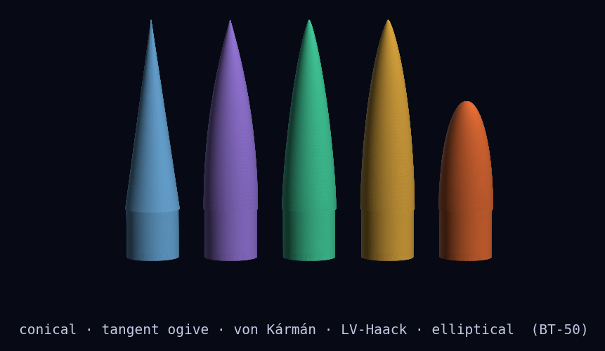<br><sub>Parametric nose cones (OpenSCAD → STL)</sub></td>
<td align="center" width="33%">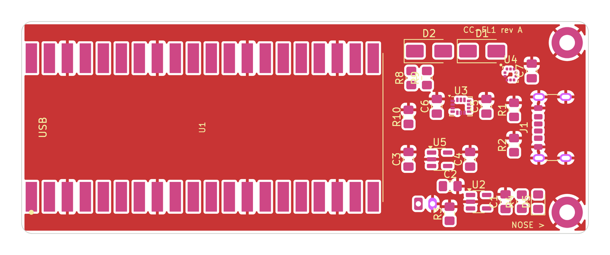<br><sub>RP2040 flight-logger printed circuit board (PCB), KiCad</sub></td>
</tr>
</table>

Twenty step-by-step builds, from the kitchen table to research-grade hardware. Each has a bill of materials with costs, numbered steps, the physics, a data sheet and troubleshooting. Read [`experiments/SAFETY.md`](experiments/SAFETY.md) first: only commercially certified motors, the National Association of Rocketry (NAR) safety code, and FAA 14 CFR Part 101.

| Level | Budget | Builds |
|---|---|---|
| **0 · Kitchen table** | under $10 | [Stomp rocket](experiments/00-stomp-rocket/) · [Balloon rocket: Newton's third law](experiments/01-balloon-rocket-newtons-third-law/) · [Film-canister rocket](experiments/02-film-canister-rocket/) · [Pinhole Sun projector & sunspots](experiments/03-pinhole-solar-projector-and-sunspots/) · [Impact craters](experiments/04-impact-craters/) |
| **1 · Garage & backyard** | $10–50 | [Water-bottle rocket + printed nose/fins](experiments/10-water-bottle-rocket/) · [DIY spectroscope](experiments/11-diy-spectroscope/) · [Cloud chamber (cosmic-ray muons)](experiments/12-cloud-chamber/) · [Moon & star-trail photography](experiments/13-moon-and-star-trail-photography/) |
| **2 · First real rockets** | $50–150 | [First model rocket (Barrowman stability)](experiments/20-first-model-rocket/) · [3D-printed model rocket](experiments/21-3d-printed-model-rocket/) · [Barometric altimeter payload (Pico + MicroPython)](experiments/22-barometric-altimeter-payload/) |
| **3 · Avionics** | $100–300 | [**Flight-computer PCB** (KiCad, firmware, sled)](experiments/30-flight-computer-pcb/) · [LoRa telemetry ground station](experiments/31-lora-telemetry-ground-station/) · [Barn-door star tracker](experiments/32-barn-door-star-tracker/) |
| **4 · Research grade** | $150+ | [High-power rocketry certification](experiments/40-high-power-rocketry-certification/) · [OpenRocket deep dive + our own simulator](experiments/41-openrocket-deep-dive/) · [Near-space balloon & 1U CubeSat](experiments/42-near-space-balloon-cubesat/) · [Hydrogen-line radio telescope](experiments/43-hydrogen-line-radio-telescope/) · [Exoplanet transit photometry](experiments/44-exoplanet-transit-photometry/) |

---

## 🧮 Compute it

<table>
<tr>
<td align="center" width="33%"><a href="simulations/"></a></td>
<td align="center" width="33%">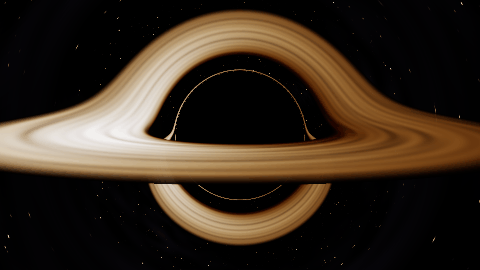<br><sub>Schwarzschild ray tracer</sub></td>
<td align="center" width="33%">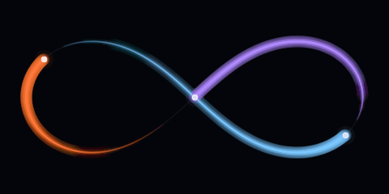<br><sub>Figure-eight three-body orbit</sub></td>
</tr>
</table>

Seven command-line simulations with 52 physics tests: a black hole ray tracer, a symplectic N-body integrator, Saturn V and Falcon 9 ascents, a Lambert solver for Earth→Mars porkchop plots (2026–2031), a transit search, stellar physics and ground tracks.

```bash
python simulations/run.py --help
python simulations/run.py transfers porkchop   # Earth → Mars launch windows
python -m pytest simulations/tests -q          # 52 physics tests
```
Full guide with every image: [`simulations/README.md`](simulations/README.md).

---

## ⚡ Quick start (Ubuntu)

```bash
sudo apt update && sudo apt install -y git python3 python3-venv python3-pip nodejs npm
git clone https://github.com/Normansrule/cosmic-library.git && cd cosmic-library
python3 -m http.server 8000 --directory site      # → http://localhost:8000
```

In a second terminal, for the Python toolkit and all the checks:

```bash
bash scripts/setup_ubuntu.sh                      # venv, dependencies, core tests
npm run check                                     # 8 Node suites: equations, ephemeris, sky, flight models
```

The full walkthrough from a blank machine to a live GitHub Pages site is in **[`docs/SETUP_UBUNTU.md`](docs/SETUP_UBUNTU.md)**.

<details>
<summary><b>🗂 Repository layout</b></summary>

```
cosmic-library/
├── site/                     GitHub Pages website (static, no build step), 22 pages
│   ├── index.html            landing page: live galaxy, start-here chooser, tonight's sky
│   ├── launch · booster · moon-landing · mars-landing · builder · hangar · shuttle   (Fly)
│   ├── earth · space-weather · sky · solar-system · sun · black-hole · galaxies · scale   (Explore)
│   ├── orbits · equations · gallery · timeline · library   (Learn)   ·   experiments   (Build)
│   ├── assets/css/codex.css  the design system        ├── assets/js/        page logic + physics modules
│   ├── data/*.json           curated, sourced data    ├── data/sky/         star catalogue (d3-celestial)
│   └── vendor/               three.js r186, GSAP 3.15, KaTeX 0.18, satellite.js 7.1
├── simulations/              Python toolkit (cosmic/) + tests
├── experiments/              20 builds, levels 0–4: tutorials, OpenSCAD, STL, KiCad, firmware
├── docs/                     EQUATIONS, REFERENCES, VIDEOS, engineering primers, setup
├── media/                    README art: readme/ (animated SVG), gifs/, screens/, sims/
├── scripts/                  test suites, screenshot + GIF capture, README art generators
└── .github/workflows/        Pages deploy + CI
```
</details>

<details>
<summary><b>🎨 How it's built, and what inspired it</b></summary>

The site is plain HTML, CSS and ES modules, with **no framework and no build step**. Three.js, GSAP, KaTeX and satellite.js are vendored under `site/vendor/`. The README art is generated by code: the SVGs by [`scripts/readme_art/`](scripts/readme_art/), and the GIFs recorded frame by frame from the live pages by [`capture_gifs.py`](scripts/readme_art/capture_gifs.py).

| Project | What we took from it |
|---|---|
| [magicuidesign/magicui](https://github.com/magicuidesign/magicui) | Spotlight card, border beam, meteors, number ticker, marquee (re-implemented in vanilla CSS/JS) |
| [DavidHDev/react-bits](https://github.com/DavidHDev/react-bits) | Aurora background, shiny text, blur-in reveals |
| [Animate UI](https://animate-ui.com/) · [ibelick/motion-primitives](https://github.com/ibelick/motion-primitives) | Motion vocabulary: staggered reveals, segmented controls, magnetic buttons, 3D tilt |
| [greensock/GSAP](https://github.com/greensock/GSAP) | Camera moves, ScrollTrigger, Flip (used directly) |
| [brunosimon/folio-2019](https://github.com/brunosimon/folio-2019) | Procedural three.js scenes you explore instead of read |
| [PavelDoGreat/WebGL-Fluid-Simulation](https://github.com/PavelDoGreat/WebGL-Fluid-Simulation) | GPU computation as the main event (black hole, galaxy collision) |
| [bbycroft/llm-viz](https://github.com/bbycroft/llm-viz) · [poloclub/transformer-explainer](https://github.com/poloclub/transformer-explainer) | Explorable explanations: every visual paired with its maths |
| [bilawalsidhu/gods-eye-view](https://github.com/bilawalsidhu/gods-eye-view) · [koala73/worldmonitor](https://github.com/koala73/worldmonitor) | Live, data-driven globes and dashboards (Live Earth orbit, Space weather) |
| [remotion-dev/remotion](https://github.com/remotion-dev/remotion) | Programmatic media: this README's animations and recordings are generated by code |
</details>

---

## 🤝 Contributing · 🙏 Credits · 📄 Licence

Corrections and new experiments are welcome. See [`CONTRIBUTING.md`](CONTRIBUTING.md): keep numbers sourced, screenshot pages with `python scripts/shot.py <page>.html out.png`, and run the checks.

Built by **Aleksander Norman** ([@Normansrule](https://github.com/Normansrule)). Every library, dataset, image and reference is in [`CREDITS.md`](CREDITS.md). NASA imagery is generally not subject to copyright in the United States; ESA/Webb, ESA/Hubble and ESO images are CC BY 4.0. Cosmic Library is an independent educational project, **not affiliated with or endorsed by** NASA, JPL, SpaceX, ESA, NOAA or the California Science Center.

Code: [MIT](LICENSE). Written content and original diagrams: [CC BY 4.0](https://creativecommons.org/licenses/by/4.0/). Third-party images keep their own terms.

<div align="center"><sub>Ad astra per aspera ✦</sub></div>
