<div align="center">

<a href="https://normansrule.github.io/cosmic-library/"></a>

### A free website about space. Fly missions, look at the real sky, use real telescopes.
**Nothing to install, no account: it runs in your web browser, on laptops, tablets and phones.**

<a href="https://normansrule.github.io/cosmic-library/"></a>

<a href="https://normansrule.github.io/cosmic-library/telescopes.html"></a>
<a href="https://normansrule.github.io/cosmic-library/solar-observatory.html"></a><br>
<a href="https://normansrule.github.io/cosmic-library/sky.html"></a>
<a href="https://normansrule.github.io/cosmic-library/eyepiece.html"></a><br>
<a href="https://normansrule.github.io/cosmic-library/launch.html"></a>
<a href="https://normansrule.github.io/cosmic-library/academy.html"></a>


</div>

<p align="center"></p>

**Click any link in the "Click" column.** Each one opens a live page in your browser.

| I want to… | Click | Takes |
|---|---|---|
| 🤯 See something amazing | **[Black hole](https://normansrule.github.io/cosmic-library/black-hole.html)** · then **[Cosmic scale](https://normansrule.github.io/cosmic-library/scale.html)** | 2 min |
| ☀️ See the Sun as it looks today | **[Solar observatory](https://normansrule.github.io/cosmic-library/solar-observatory.html)** | 2 min |
| 🌙 Know what's in the sky tonight | **[Night sky](https://normansrule.github.io/cosmic-library/sky.html)** · **[Moon explorer](https://normansrule.github.io/cosmic-library/moon.html)** | 5 min |
| 🔭 Use a real telescope, free | **[Use a telescope](https://normansrule.github.io/cosmic-library/telescopes.html)** | tonight |
| 🛒 Find out what a telescope would show me | **[Telescope simulator](https://normansrule.github.io/cosmic-library/eyepiece.html)** | 5 min |
| 🚀 Fly a rocket or land on the Moon | **[Saturn V](https://normansrule.github.io/cosmic-library/launch.html)** · **[Booster](https://normansrule.github.io/cosmic-library/booster.html)** · **[Moon](https://normansrule.github.io/cosmic-library/moon-landing.html)** · **[Mars](https://normansrule.github.io/cosmic-library/mars-landing.html)** | 10 min |
| 🛰️ See the satellites overhead right now | **[Live Earth orbit](https://normansrule.github.io/cosmic-library/earth.html)** | 3 min |
| 🎓 Actually learn how it all works | **[Space Academy](https://normansrule.github.io/cosmic-library/academy.html)**: 20 short lessons with quizzes | 10 min each |
| 🔧 Build something with my hands | **[Experiments](https://normansrule.github.io/cosmic-library/experiments.html)**: from a $5 paper rocket up | a weekend |

<details>
<summary><b>🗺️ See every page on one map</b></summary>
<br>
<p align="center"></p>

Each coloured line is a group of pages and each dot is a page. Start at **Saturn V launch** to fly, or at **Space Academy** to learn.
</details>

<p align="center"></p>

### 🕹️ How to use the simulations

- **Drag** to look around. **Scroll** (or pinch on a phone) to zoom. **Click or tap** anything for information.
- **Lost? Press the <kbd>?</kbd> button** in the top-right corner of any page. It shows that page's controls and "try this first" steps.
- **Slow?** On the heavier 3D pages, that same help panel has a **Switch to low graphics** button. It also helps to close other tabs and plug in your laptop.
- **Blank or black screen?** Your browser's 3D graphics are probably switched off. **[Here's the 1-minute fix](docs/FAQ.md#the-page-is-blank-or-black).**
- **"Offline" or "sample" label?** The live data couldn't be reached right now, so the page shows a clearly labelled example instead. [Why?](docs/FAQ.md#live-data-says-offline-or-sample)

<p align="center"></p>

<p align="center"><a href="docs/USER_GUIDE.md"></a></p>

<p align="center"></p>

<p align="center"></p>

These pages show **real light from real telescopes**, not simulations.

#### ☀️ 1. The Sun, right now

<sub>Live from the Solar Dynamics Observatory (SDO), a National Aeronautics and Space Administration (NASA) satellite. Each picture is one colour of ultraviolet or visible light, labelled by its wavelength in ångströms (Å). GitHub shows the most recent copy it has fetched; click for today's full view in 12 colours.</sub>

| Hot corona (600,000 °C) | Lower atmosphere | Hotter corona | Surface & sunspots |
|:---:|:---:|:---:|:---:|
| <a href="https://normansrule.github.io/cosmic-library/solar-observatory.html"></a> | <a href="https://normansrule.github.io/cosmic-library/solar-observatory.html"></a> | <a href="https://normansrule.github.io/cosmic-library/solar-observatory.html"></a> | <a href="https://normansrule.github.io/cosmic-library/solar-observatory.html"></a> |
| <sub>171 Å · NASA/SDO</sub> | <sub>304 Å · NASA/SDO</sub> | <sub>193 Å · NASA/SDO</sub> | <sub>visible · NASA/SDO</sub> |

> ⚠️ **Never look at the Sun through binoculars or a telescope without a certified solar filter.** These images are the safe way. For a safe do-it-yourself view, see the [pinhole projector](experiments/03-pinhole-solar-projector-and-sunspots/).

#### 🔭 2. Use a real telescope from your laptop, free

Real observatories will take a picture for you, or let you steer a radio dish. Pick one, follow the steps, and you'll have your own observation:

| Telescope | What you do | Cost |
|---|---|---|
| **[Serol's Cosmic Explorers](https://serol.lco.global)** · Las Cumbres Observatory (LCO) | Game-like challenges, each ending with a real picture from a robotic telescope (usually a few days) | Free (ages 8+) |
| **[MicroObservatory](https://mo-www.cfa.harvard.edu/OWN/)** · Harvard & Smithsonian | Pick an object (the Moon, a galaxy, a nebula) and a robotic telescope in Arizona emails you the picture, usually within a day or two | Free |
| **[PICTOR](https://pictortelescope.com/observe)** · a 1.5 m radio dish in Athens, Greece | Point it along the Milky Way and receive the glow of hydrogen gas at 1420 megahertz (MHz) | Free |
| **[Virtual Telescope Project](https://www.virtualtelescope.eu/webtv/)** · Italy | Watch live streams of asteroids, comets and eclipses with commentary | Free |
| **[Stellarium Web](https://stellarium-web.org/)** | A full planetarium in your browser, a good first step before observing | Free |

<sub>56 checked options (45 free), step-by-step first-observation guides, and a live map of which observatories are dark right now: <b><a href="https://normansrule.github.io/cosmic-library/telescopes.html">Use a telescope →</a></b></sub>

#### 🪐 3. Thinking of buying a telescope? Try before you buy

<table>
<tr>
<td width="40%"><a href="https://normansrule.github.io/cosmic-library/eyepiece.html"></a></td>
<td width="60%"><a href="https://normansrule.github.io/cosmic-library/eyepiece.html">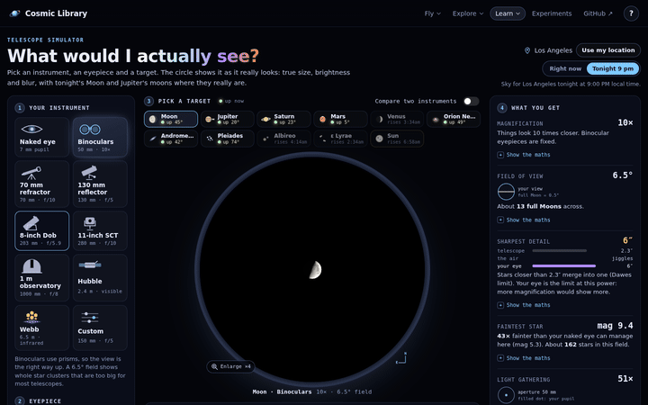</a></td>
</tr>
</table>

The **[Telescope simulator](https://normansrule.github.io/cosmic-library/eyepiece.html)** shows what tonight's Moon, Jupiter's moons, Saturn's rings or the Orion Nebula would really look like through binoculars, a beginner telescope, an 8-inch Dobsonian or Hubble. It includes honest details that photos hide: faint nebulae look grey to the eye, city light washes them out, and too much magnification just blurs. Compare two telescopes side by side.

#### 🌈 4. The whole sky in colours your eyes can't see

<p align="center"><a href="https://normansrule.github.io/cosmic-library/surveys.html"></a></p>

**[Sky surveys](https://normansrule.github.io/cosmic-library/surveys.html)** lets you pan and zoom real maps of the entire sky in 12 kinds of light, from radio waves to gamma rays, with a guided tour of 20 famous objects. Radio shows cold gas, infrared shows dust, visible light shows stars, and X-rays show gas at millions of degrees.

<p align="center"></p>

<p align="center"></p>

<sub>Real flight models, checked against mission data. Click a card to fly.</sub>

<table>
<tr>
<td align="center" width="33%"><a href="https://normansrule.github.io/cosmic-library/launch.html"></a></td>
<td align="center" width="33%"><a href="https://normansrule.github.io/cosmic-library/booster.html"></a></td>
<td align="center" width="33%"><a href="https://normansrule.github.io/cosmic-library/moon-landing.html"></a></td>
</tr>
<tr>
<td align="center"><a href="https://normansrule.github.io/cosmic-library/mars-landing.html"></a></td>
<td align="center"><a href="https://normansrule.github.io/cosmic-library/builder.html"></a></td>
<td align="center"><a href="https://normansrule.github.io/cosmic-library/mission-designer.html"></a></td>
</tr>
<tr>
<td align="center"><a href="https://normansrule.github.io/cosmic-library/hangar.html"></a></td>
<td align="center"><a href="https://normansrule.github.io/cosmic-library/shuttle.html"></a></td>
<td valign="middle">

**First time?** Open **[Booster landing](https://normansrule.github.io/cosmic-library/booster.html)** and press **Watch the autopilot**. Then try it yourself: **W/S** for throttle, **A/D** to tilt, **Space** to light the engines, **G** for the legs.

</td>
</tr>
</table>

<details open>
<summary><b>🎬 Watch them in action</b> (recorded from the real pages)</summary>
<br>

| | |
|:---:|:---:|
| <a href="https://normansrule.github.io/cosmic-library/launch.html"></a><br>**Saturn V** lifts off and clears the tower | <a href="https://normansrule.github.io/cosmic-library/booster.html"></a><br>**Booster** lands on the drone ship |
| <a href="https://normansrule.github.io/cosmic-library/moon-landing.html"></a><br>**Eagle** touches down on the Moon | <a href="https://normansrule.github.io/cosmic-library/mars-landing.html"></a><br>**Sky crane** lowers Perseverance onto Mars |
| <a href="https://normansrule.github.io/cosmic-library/mission-designer.html">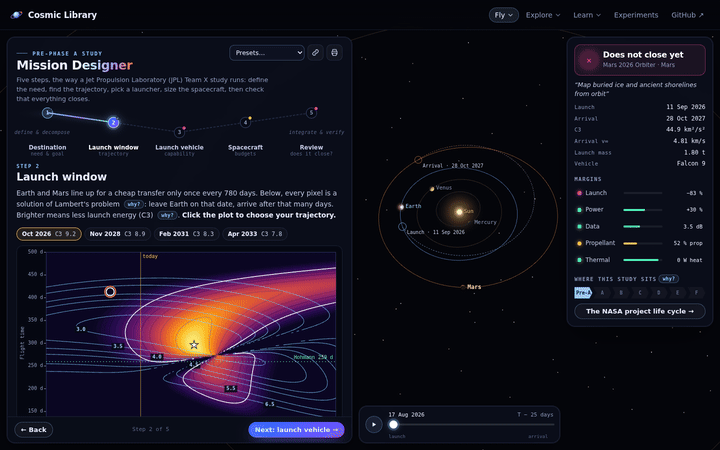</a><br>**Mission designer**: find the cheapest day to leave for Mars | <a href="https://normansrule.github.io/cosmic-library/hangar.html"></a><br>**Rocket hangar**: 26 rockets at true scale |

</details>

<details>
<summary><b>📏 How close are they to the real thing?</b></summary>

| Simulation | Simulated | Real mission |
|---|---|---|
| Saturn V parking orbit | 187 × 181 km | 185.9 × 183.2 km (Apollo 11) |
| Lunar module fuel left at touchdown | ≈ 58 s of hover | 63.5 s (NASA post-flight analysis) |
| Perseverance touchdown | 418 s after entry | 419 s |
| Cheapest 2026 Mars launch day | 30 Oct 2026 | late Oct–Nov 2026 window |

The flight and landing models have automated tests that compare them with mission data. The details are in the **[user guide](docs/USER_GUIDE.md#fly)**.
</details>

<p align="center"></p>

<table>
<tr>
<td align="center" width="33%"><a href="https://normansrule.github.io/cosmic-library/earth.html"></a></td>
<td align="center" width="33%"><a href="https://normansrule.github.io/cosmic-library/sky.html"></a></td>
<td align="center" width="33%"><a href="https://normansrule.github.io/cosmic-library/moon.html"></a></td>
</tr>
<tr>
<td align="center"><a href="https://normansrule.github.io/cosmic-library/solar-observatory.html"></a></td>
<td align="center"><a href="https://normansrule.github.io/cosmic-library/space-weather.html"></a></td>
<td align="center"><a href="https://normansrule.github.io/cosmic-library/dsn.html"></a></td>
</tr>
<tr>
<td align="center"><a href="https://normansrule.github.io/cosmic-library/solar-system.html"></a></td>
<td align="center"><a href="https://normansrule.github.io/cosmic-library/sun.html"></a></td>
<td align="center"><a href="https://normansrule.github.io/cosmic-library/black-hole.html"></a></td>
</tr>
<tr>
<td align="center"><a href="https://normansrule.github.io/cosmic-library/galaxies.html"></a></td>
<td align="center"><a href="https://normansrule.github.io/cosmic-library/scale.html"></a></td>
<td align="center"><a href="https://normansrule.github.io/cosmic-library/surveys.html"></a></td>
</tr>
</table>

<details open>
<summary><b>🎬 Watch them in action</b></summary>
<br>

| | |
|:---:|:---:|
| <a href="https://normansrule.github.io/cosmic-library/black-hole.html"></a><br>**Black hole**: light bent by gravity | <a href="https://normansrule.github.io/cosmic-library/scale.html"></a><br>**Cosmic scale**: from you to the Milky Way |
| <a href="https://normansrule.github.io/cosmic-library/moon.html">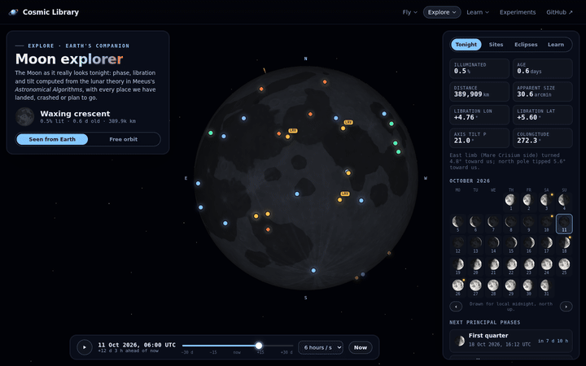</a><br>**Moon explorer**: a month of phases | <a href="https://normansrule.github.io/cosmic-library/earth.html"></a><br>**Live Earth orbit**: thousands of satellites |
| <a href="https://normansrule.github.io/cosmic-library/sky.html"></a><br>**Night sky**: six hours in four seconds | <a href="https://normansrule.github.io/cosmic-library/galaxies.html"></a><br>**Milky Way meets Andromeda** |
| <a href="https://normansrule.github.io/cosmic-library/dsn.html">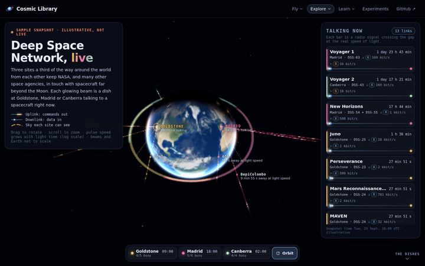</a><br>**Deep Space Network**: who's talking to Earth | <a href="https://normansrule.github.io/cosmic-library/sun.html"></a><br>**The Sun**: a flare and an eruption |

</details>

<p align="center"></p>

<p align="center"></p>

<table>
<tr>
<td align="center" width="33%"><a href="https://normansrule.github.io/cosmic-library/academy.html"></a></td>
<td align="center" width="33%"><a href="https://normansrule.github.io/cosmic-library/orbits.html"></a></td>
<td align="center" width="33%"><a href="https://normansrule.github.io/cosmic-library/equations.html"></a></td>
</tr>
<tr>
<td align="center"><a href="https://normansrule.github.io/cosmic-library/gallery.html"></a></td>
<td align="center"><a href="https://normansrule.github.io/cosmic-library/timeline.html"></a></td>
<td align="center"><a href="https://normansrule.github.io/cosmic-library/library.html"></a></td>
</tr>
</table>

- **[Space Academy](https://normansrule.github.io/cosmic-library/academy.html):** the best place to start learning. It has 20 short lessons in 4 tracks, each with a hands-on widget and a quick quiz. Your progress lights up a star map and earns badges.
- **[Orbit Lab](https://normansrule.github.io/cosmic-library/orbits.html):** fire Newton's cannonball faster and faster until it never lands, and see why orbiting is falling.
- **[Equations](https://normansrule.github.io/cosmic-library/equations.html):** 94 equations of spaceflight and astronomy, each explained in plain words, with a calculator you can play with.
- **[Gallery](https://normansrule.github.io/cosmic-library/gallery.html) · [Timeline](https://normansrule.github.io/cosmic-library/timeline.html) · [Documents](https://normansrule.github.io/cosmic-library/library.html):** 63 famous space photos and the story of each, 110 milestones from 1903 to 2026, and the real NASA and SpaceX manuals.

<details>
<summary><b>🧠 Big ideas in 10-second animations</b> (click to open)</summary>
<br>

<p align="center"><a href="https://normansrule.github.io/cosmic-library/builder.html"></a></p>

**Why rockets have stages.** Every extra tonne of fuel has to lift all the fuel above it, so adding fuel helps less and less.

<p align="center"><a href="https://normansrule.github.io/cosmic-library/solar-system.html"></a></p>

**Light is fast, space is bigger.** The sunlight on your face left the Sun 8 min 19 s ago.

<p align="center"><a href="https://normansrule.github.io/cosmic-library/orbits.html"></a></p>

**Getting to a higher orbit takes two pushes.** Speed up, coast halfway around, then speed up again.

<p align="center"><a href="https://normansrule.github.io/cosmic-library/eyepiece.html"></a></p>

**Why big telescopes see finer detail.** A wider mirror can tell apart two stars that are closer together.

<p align="center"><a href="https://normansrule.github.io/cosmic-library/equations.html"></a></p>

**How we find planets around other stars.** When a planet passes in front of its star, the star dims very slightly.

<p align="center"><a href="https://normansrule.github.io/cosmic-library/mars-landing.html"></a></p>

**Seven minutes of terror.** Landing on Mars is over before Earth even hears it started.

<p align="center"><a href="https://normansrule.github.io/cosmic-library/black-hole.html"></a></p>

**Anatomy of a black hole,** to scale.
</details>

<details>
<summary><b>🎯 Quick quiz: test yourself</b> (click a question for the answer)</summary>

<details><summary><b>1.</b> Why can't a reusable booster just hover and gently set down?</summary>

Even one engine at its lowest power pushes harder than the nearly empty rocket weighs, so it would climb back up. The engine has to light at exactly the right height to reach zero speed at the ground. → [Try it](https://normansrule.github.io/cosmic-library/booster.html)
</details>

<details><summary><b>2.</b> When Perseverance landed on Mars, how long before anyone on Earth knew?</summary>

11 minutes 22 seconds: the time radio signals took to reach Earth that day. The landing was already over. → [Watch both clocks](https://normansrule.github.io/cosmic-library/mars-landing.html)
</details>

<details><summary><b>3.</b> Will the Milky Way crash into Andromeda?</summary>

Maybe. A 2025 study put the chance of a merger within 10 billion years at about 50%. Even if they do, stars almost never hit each other because the gaps between them are enormous. → [Run it](https://normansrule.github.io/cosmic-library/galaxies.html)
</details>

<details><summary><b>4.</b> Why do pictures of the Sun come in so many colours?</summary>

Each colour is light given off by gas at one particular temperature, so each image is a thermometer for a different layer, from 50,000 °C to millions of degrees. → [Today's Sun](https://normansrule.github.io/cosmic-library/solar-observatory.html)
</details>

<details><summary><b>5.</b> Could I really use a radio telescope from my laptop tonight?</summary>

Yes. PICTOR in Athens is free. Point it along the Milky Way and you get back the radio glow of hydrogen gas. → [Use a telescope](https://normansrule.github.io/cosmic-library/telescopes.html)
</details>

<details><summary><b>6.</b> A telescope box says "675× magnification!" Is that good?</summary>

Usually not. The most magnification a telescope can usefully deliver is about 2× its aperture in millimetres, so about 140× for a 70 mm telescope. Beyond that the image just gets bigger and blurrier. → [See it for yourself](https://normansrule.github.io/cosmic-library/eyepiece.html)
</details>
</details>

<p align="center"></p>

**Twenty step-by-step projects** with shopping lists, photos and the science explained, from the kitchen table up to a rocket flight computer you design yourself. Read the **[safety guide](experiments/SAFETY.md)** first; model rockets use only store-bought certified motors.

| Level | Budget | Try |
|---|---|---|
| **0 · Kitchen table** | under $10 | [Stomp rocket](experiments/00-stomp-rocket/) · [Balloon rocket](experiments/01-balloon-rocket-newtons-third-law/) · [See sunspots safely](experiments/03-pinhole-solar-projector-and-sunspots/) · [Make craters](experiments/04-impact-craters/) |
| **1 · Garage & backyard** | $10–50 | [Water-bottle rocket](experiments/10-water-bottle-rocket/) · [DIY spectroscope](experiments/11-diy-spectroscope/) · [See cosmic rays (cloud chamber)](experiments/12-cloud-chamber/) · [Photograph the Moon & star trails](experiments/13-moon-and-star-trail-photography/) |
| **2 · First real rockets** | $50–150 | [First model rocket](experiments/20-first-model-rocket/) · [3D-printed rocket](experiments/21-3d-printed-model-rocket/) · [Altimeter payload](experiments/22-barometric-altimeter-payload/) |
| **3 · Electronics** | $100–300 | [Flight-computer circuit board](experiments/30-flight-computer-pcb/) · [Radio telemetry](experiments/31-lora-telemetry-ground-station/) · [Star tracker for astrophotography](experiments/32-barn-door-star-tracker/) |
| **4 · Research grade** | $150+ | [High-power rocketry](experiments/40-high-power-rocketry-certification/) · [Rocket simulation](experiments/41-openrocket-deep-dive/) · [Near-space balloon](experiments/42-near-space-balloon-cubesat/) · [Build a radio telescope](experiments/43-hydrogen-line-radio-telescope/) · [Find exoplanets](experiments/44-exoplanet-transit-photometry/) |

<p align="center"></p>

## ❓ Help & questions

- **[User guide](docs/USER_GUIDE.md):** every page, with its controls and what to try first.
- **[FAQ](docs/FAQ.md):** [blank screen](docs/FAQ.md#the-page-is-blank-or-black) · [slow](docs/FAQ.md#its-slow) · [phones](docs/FAQ.md#phones-and-tablets) · ["offline" labels](docs/FAQ.md#live-data-says-offline-or-sample) · [are the numbers real?](docs/FAQ.md#are-the-numbers-real) · [privacy](docs/FAQ.md#privacy) · [using it in class](docs/FAQ.md#can-i-use-this-in-my-class)
- **Found a mistake?** [Tell us here](https://github.com/Normansrule/cosmic-library/issues/new/choose); every number is meant to be traceable to a source.

<details>
<summary><b>👩‍💻 For developers, teachers and contributors</b></summary>

[](https://github.com/Normansrule/cosmic-library/actions/workflows/pages.yml)
[](https://github.com/Normansrule/cosmic-library/actions/workflows/ci.yml)
[](LICENSE)
[](https://threejs.org)
[](simulations/)
[](experiments/30-flight-computer-pcb/)

#### Run it on your own computer (Ubuntu)

```bash
sudo apt update && sudo apt install -y git python3 python3-venv python3-pip nodejs npm
git clone https://github.com/Normansrule/cosmic-library.git && cd cosmic-library
python3 -m http.server 8000 --directory site      # → http://localhost:8000
bash scripts/setup_ubuntu.sh                      # Python toolkit + core tests
npm run check                                     # all Node test suites + user-guide check
```

The full walkthrough is in [`docs/SETUP_UBUNTU.md`](docs/SETUP_UBUNTU.md); conventions are in [`docs/DEVELOPING.md`](docs/DEVELOPING.md).

#### What's in the repository

```
site/            the website: 30 pages, no build step (three.js, GSAP, KaTeX, satellite.js, Aladin Lite vendored)
  data/help.json   controls & tips for every page → shown by the "?" button and docs/USER_GUIDE.md
simulations/     Python toolkit: black hole ray tracer, N-body, ascent, Lambert/porkchop, transits, stars, ground tracks
experiments/     20 builds with OpenSCAD/STL parts, a KiCad circuit board and firmware
docs/            user guide, FAQ, 94 equations, references, videos, engineering primers, setup
media/readme/    all README art: animated SVGs generated by scripts/readme_art/build.py
media/gifs/      recordings of the live pages (scripts/readme_art/capture_gifs.py)
scripts/         test suites, screenshot and GIF tools, data builders
```

#### Python toolkit

```bash
python simulations/run.py --help
python simulations/run.py transfers porkchop   # Earth → Mars launch windows
python -m pytest simulations/tests -q          # physics tests
```

<table>
<tr>
<td width="50%"></td>
<td width="50%"></td>
</tr>
</table>

#### Built with and inspired by

[three.js](https://threejs.org) · [GSAP](https://gsap.com) · [KaTeX](https://katex.org) · [satellite.js](https://github.com/shashwatak/satellite-js) · [Aladin Lite](https://aladin.cds.unistra.fr/AladinLite/), with design ideas from [Magic UI](https://github.com/magicuidesign/magicui), [React Bits](https://github.com/DavidHDev/react-bits), [Animate UI](https://animate-ui.com/), [Motion Primitives](https://github.com/ibelick/motion-primitives), [Bruno Simon's folio](https://github.com/brunosimon/folio-2019), [WebGL Fluid Simulation](https://github.com/PavelDoGreat/WebGL-Fluid-Simulation), [llm-viz](https://github.com/bbycroft/llm-viz), [Transformer Explainer](https://github.com/poloclub/transformer-explainer), [God's Eye View](https://github.com/bilawalsidhu/gods-eye-view), [World Monitor](https://github.com/koala73/worldmonitor) and [Remotion](https://github.com/remotion-dev/remotion).

**Teachers:** everything is free to use in class. The code is MIT-licensed and the text is under Creative Commons Attribution 4.0 (CC BY 4.0). See the [FAQ](docs/FAQ.md#can-i-use-this-in-my-class). Contributions are welcome via [`CONTRIBUTING.md`](CONTRIBUTING.md).
</details>

<p align="center"></p>

Made by **Aleksander Norman** ([@Normansrule](https://github.com/Normansrule)). Live images: NASA/SDO and the Atmospheric Imaging Assembly (AIA) and Helioseismic and Magnetic Imager (HMI) science teams, the European Space Agency (ESA) and NASA's Solar and Heliospheric Observatory (SOHO), and the National Oceanic and Atmospheric Administration (NOAA). Every library, dataset and image is credited in [`CREDITS.md`](CREDITS.md). Cosmic Library is an independent educational project, **not affiliated with or endorsed by** NASA, the Jet Propulsion Laboratory (JPL), SpaceX, ESA, NOAA, the Strasbourg astronomical Data Centre (CDS) or the California Science Center. Code: [MIT](LICENSE) · text and original diagrams: [Creative Commons Attribution 4.0 (CC BY 4.0)](https://creativecommons.org/licenses/by/4.0/) · third-party images and Aladin Lite (GNU Lesser General Public License, LGPL-3.0) keep their own terms.

<div align="center"><sub>Ad astra per aspera ✦</sub></div>
