# The Equation Atlas

> 94 equations of space science and spaceflight, each with a symbol legend, a plain-language meaning and a worked example with real numbers. The [interactive edition](https://normansrule.github.io/cosmic-library/equations.html) adds a live calculator and plot for every one.
>
> *This file is generated from [`site/data/equations.json`](../site/data/equations.json) by [`scripts/build_equations_md.mjs`](../scripts/build_equations_md.mjs). Every worked-example result is recomputed and checked by [`scripts/check_equations.mjs`](../scripts/check_equations.mjs). Edit the JSON, not this file.*

Acronyms are written out in full the first time they appear on each card. Values of physical constants follow the Committee on Data of the International Science Council (CODATA) 2018 and the International Astronomical Union (IAU) 2015 nominal values — see [Constants](#constants).

## Contents

1. [Gravity & Orbits](#ch-gravity)
   - [1.1 Newton's law of universal gravitation](#newton-gravitation)
   - [1.2 Kepler's first law — orbits are ellipses](#kepler-first)
   - [1.3 Kepler's second law — equal areas in equal times](#kepler-second)
   - [1.4 Kepler's third law — the harmonic law](#kepler-third)
   - [1.5 Vis-viva equation](#vis-viva)
   - [1.6 Orbital period](#orbital-period)
   - [1.7 Circular orbital velocity](#circular-velocity)
   - [1.8 Escape velocity](#escape-velocity)
   - [1.9 Hohmann transfer Δv](#hohmann)
   - [1.10 Sphere of influence](#sphere-of-influence)
   - [1.11 Hill sphere](#hill-sphere)
   - [1.12 Roche limit](#roche-limit)
   - [1.13 L1 / L2 Lagrange-point distance](#l1-distance)
   - [1.14 Synodic period](#synodic-period)
   - [1.15 Tidal-locking timescale](#tidal-locking)
2. [Rockets](#ch-rockets)
   - [2.1 Tsiolkovsky rocket equation](#tsiolkovsky)
   - [2.2 Rocket thrust equation](#thrust-equation)
   - [2.3 Specific impulse and effective exhaust velocity](#specific-impulse)
   - [2.4 Mass ratio and propellant fraction](#mass-ratio)
   - [2.5 Multi-stage Δv](#multistage)
   - [2.6 Drag equation](#drag)
   - [2.7 Dynamic pressure and Max-Q](#dynamic-pressure)
   - [2.8 Gravity loss](#gravity-loss)
3. [Atmosphere & Re-entry](#ch-atmosphere)
   - [3.1 Barometric formula and scale height](#barometric)
   - [3.2 Speed of sound and Mach number](#speed-of-sound)
   - [3.3 Stagnation temperature](#stagnation-temperature)
   - [3.4 Sutton–Graves stagnation-point heat flux](#sutton-graves)
   - [3.5 Ballistic coefficient](#ballistic-coefficient)
   - [3.6 Jeans escape parameter](#jeans-escape)
4. [Spacecraft Engineering](#ch-spacecraft)
   - [4.1 Free-space path loss](#fspl)
   - [4.2 Friis link budget](#friis)
   - [4.3 Deep Space Network data rate](#dsn-data-rate)
   - [4.4 Solar array power versus distance](#solar-array-power)
   - [4.5 Spacecraft equilibrium temperature](#spacecraft-temperature)
   - [4.6 Radiation shielding (simplified)](#radiation-shielding)
   - [4.7 Ion thruster thrust and power](#ion-thruster)
   - [4.8 Reaction-wheel momentum storage](#reaction-wheel)
5. [Light & Stars](#ch-light)
   - [5.1 Stefan–Boltzmann law](#stefan-boltzmann)
   - [5.2 Wien's displacement law](#wien)
   - [5.3 Planck's law](#planck)
   - [5.4 Inverse-square law of flux](#inverse-square)
   - [5.5 Apparent magnitude and distance modulus](#magnitude)
   - [5.6 Doppler shift](#doppler)
   - [5.7 Parallax distance](#parallax)
   - [5.8 Mass–luminosity relation](#mass-luminosity)
   - [5.9 Eddington luminosity](#eddington)
   - [5.10 Main-sequence lifetime](#ms-lifetime)
   - [5.11 Jeans mass](#jeans-mass)
   - [5.12 Chandrasekhar limit](#chandrasekhar)
   - [5.13 Stellar radius from luminosity and temperature](#star-radius)
6. [Telescopes & Optics](#ch-optics)
   - [6.1 Angular resolution — the Rayleigh criterion](#rayleigh)
   - [6.2 Light-gathering power](#light-gathering)
   - [6.3 Limiting magnitude of a telescope](#limiting-magnitude)
   - [6.4 Magnification, exit pupil and field of view](#magnification)
   - [6.5 Focal ratio (f-number)](#focal-ratio)
   - [6.6 Plate scale and pixel scale](#plate-scale)
   - [6.7 Sampling the seeing — Nyquist for cameras](#nyquist-sampling)
   - [6.8 Diffraction-limited versus seeing-limited](#seeing-limit)
   - [6.9 Isoplanatic angle of adaptive optics](#isoplanatic-angle)
   - [6.10 Interferometer resolution](#interferometer)
7. [The Sun & Space Weather](#ch-sun)
   - [7.1 The solar constant from the Sun's surface](#solar-constant)
   - [7.2 Differential rotation of the Sun](#differential-rotation)
   - [7.3 Parker's solar wind](#parker-wind)
   - [7.4 Sun-to-Earth travel time of the solar wind](#solar-wind-transit)
   - [7.5 Dynamic pressure of the solar wind](#solar-wind-pressure)
   - [7.6 Magnetopause standoff distance](#magnetopause)
   - [7.7 Alfvén speed](#alfven-speed)
   - [7.8 Solar flare X-ray class](#flare-class)
   - [7.9 Magnetic energy of a flare](#flare-energy)
8. [Exoplanets](#ch-exoplanets)
   - [8.1 Transit depth](#transit-depth)
   - [8.2 Transit duration](#transit-duration)
   - [8.3 Transit probability](#transit-probability)
   - [8.4 Radial-velocity semi-amplitude](#rv-semi-amplitude)
   - [8.5 Habitable-zone distance](#habitable-zone)
   - [8.6 Planetary equilibrium temperature](#equilibrium-temperature)
   - [8.7 Surface gravity of a planet](#surface-gravity)
   - [8.8 The Drake equation](#drake)
9. [Relativity & Black Holes](#ch-relativity)
   - [9.1 Lorentz factor](#lorentz-factor)
   - [9.2 Special-relativistic time dilation](#time-dilation)
   - [9.3 Mass–energy equivalence](#mass-energy)
   - [9.4 Schwarzschild radius](#schwarzschild)
   - [9.5 Gravitational time dilation and redshift](#gravitational-time-dilation)
   - [9.6 Hawking temperature](#hawking)
   - [9.7 GPS clock correction](#gps-clock)
   - [9.8 Shapiro time delay](#shapiro-delay)
   - [9.9 Perihelion precession of Mercury](#perihelion-precession)
10. [Cosmology](#ch-cosmology)
   - [10.1 Hubble–Lemaître law](#hubble-lemaitre)
   - [10.2 Cosmological redshift and scale factor](#redshift-scale-factor)
   - [10.3 Friedmann equation](#friedmann)
   - [10.4 Critical density](#critical-density)
   - [10.5 Temperature of the cosmic microwave background](#cmb-temperature)
   - [10.6 Hubble time and Hubble radius](#hubble-time)
   - [10.7 Lookback time and the age of the Universe](#lookback-time)
   - [10.8 Angular-diameter distance](#angular-diameter-distance)
11. [Constants](#constants)

---

## 1. Gravity & Orbits

One inverse-square law, three laws of Kepler, and the handful of formulas every mission designer carries in their head: how fast, how long, how far, and how much velocity change (Δv) it costs to go somewhere else.

### 1.1 Newton's law of universal gravitation

*Inverse-square law of gravity*

$$
F = G\thinspace \frac{m_1\thinspace m_2}{r^2}
$$

| Symbol | Meaning | Unit |
|:--|:--|:--|
| $`F`$ | Attractive force between the two bodies | N |
| $`G`$ | Newtonian constant of gravitation | m³ kg⁻¹ s⁻² |
| $`m_1, m_2`$ | The two masses | kg |
| $`r`$ | Distance between their centres | m |

**What it means.** Every mass pulls on every other mass along the line joining them. Double either mass and the pull doubles; double the distance and it falls to a quarter. The same law drops an apple, holds the Moon in orbit and shapes galaxies. Isaac Newton published it in the Principia (1687).

**Worked example — How hard do the Earth and Moon pull on each other?** Earth $`m_1 = 5.972\times10^{24}`$ kg, Moon $`m_2 = 7.346\times10^{22}`$ kg, mean separation $`r = 384\thinspace 400`$ km.

$$
F = \frac{(6.674\times10^{-11})(5.972\times10^{24})(7.346\times10^{22})}{(3.844\times10^{8})^2}
$$

**Result: 1.982 × 10²⁰ N** — about 20 billion billion newtons — enough to raise tides of metres in the oceans.

[Open the live calculator ↗](https://normansrule.github.io/cosmic-library/equations.html#newton-gravitation) · Sources: [NASA/JPL — Basics of Space Flight, Chapter 3: Gravity & Mechanics](https://science.nasa.gov/learn/basics-of-space-flight/chapter3-3/) · [Wikipedia — Newton's law of universal gravitation](https://en.wikipedia.org/wiki/Newton%27s_law_of_universal_gravitation)

### 1.2 Kepler's first law — orbits are ellipses

*Orbit equation (conic section)*

$$
r(\theta) = \frac{a\thinspace (1-e^2)}{1 + e\cos\theta}
$$

| Symbol | Meaning | Unit |
|:--|:--|:--|
| $`r`$ | Distance from the focus (the Sun) to the planet | m |
| $`a`$ | Semi-major axis (half the long axis of the ellipse) | m |
| $`e`$ | Eccentricity: 0 is a circle, close to 1 is a long thin ellipse | — |
| $`\theta`$ | True anomaly: angle from the closest point (periapsis) | rad |

**What it means.** Planets do not move in circles. Johannes Kepler found in 1609, from Tycho Brahe's observations of Mars, that each orbit is an ellipse with the Sun at one focus — not at the centre. The closest point is $`r_p = a(1-e)`$ (perihelion) and the farthest is $`r_a = a(1+e)`$ (aphelion).

**Worked example — How close does Mars get to the Sun?** Mars: $`a = 1.5237`$ AU, $`e = 0.0934`$. Perihelion is at $`\theta = 0`$.

$$
r(0) = \frac{1.5237\thinspace (1 - 0.0934^2)}{1 + 0.0934} = 1.5237\thinspace (1-0.0934)
$$

**Result: 1.381 AU** — about 206.7 million km; at aphelion Mars is 1.666 AU away — a 21 % swing.

[Open the live calculator ↗](https://normansrule.github.io/cosmic-library/equations.html#kepler-first) · Sources: [NASA Science — Orbits and Kepler's Laws](https://science.nasa.gov/solar-system/orbits-and-keplers-laws/) · [Wikipedia — Kepler's laws of planetary motion](https://en.wikipedia.org/wiki/Kepler%27s_laws_of_planetary_motion)

### 1.3 Kepler's second law — equal areas in equal times

*Conservation of angular momentum*

$$
\frac{dA}{dt} = \tfrac12\thinspace r^2\dot\theta = \tfrac12\sqrt{\mu\thinspace a\thinspace (1-e^2)} = \text{constant}
$$

| Symbol | Meaning | Unit |
|:--|:--|:--|
| $`dA/dt`$ | Area swept per second by the Sun–planet line | m²/s |
| $`r`$ | Sun–planet distance | m |
| $`\dot\theta`$ | Angular speed around the Sun | rad/s |
| $`\mu = GM`$ | Gravitational parameter of the central body | m³/s² |
| $`a, e`$ | Semi-major axis and eccentricity | m, — |

**What it means.** A line from the Sun to a planet sweeps out equal areas in equal times. Close to the Sun the line is short, so the planet must move fast; far away it crawls. Physically this is conservation of angular momentum, and it gives the speed ratio $`v_p/v_a = (1+e)/(1-e)`$ between perihelion and aphelion.

**Worked example — How much faster is Earth in January than in July?** Earth: $`a = 1`$ AU, $`e = 0.0167`$, $`\mu_\odot = 1.327\times10^{20}`$ m³/s². Perihelion speed:

$$
v_p = \sqrt{\frac{\mu_\odot}{a}\thinspace \frac{1+e}{1-e}} = \sqrt{\frac{1.327\times10^{20}}{1.496\times10^{11}}\cdot\frac{1.0167}{0.9833}}
$$

**Result: 30.29 km/s** — at perihelion (early January) versus 29.29 km/s at aphelion (early July) — 3.4 % faster.

[Open the live calculator ↗](https://normansrule.github.io/cosmic-library/equations.html#kepler-second) · Sources: [NASA Science — Orbits and Kepler's Laws](https://science.nasa.gov/solar-system/orbits-and-keplers-laws/) · [Wikipedia — Kepler's laws of planetary motion](https://en.wikipedia.org/wiki/Kepler%27s_laws_of_planetary_motion)

### 1.4 Kepler's third law — the harmonic law

*Period–distance relation*

$$
T^2 = \frac{4\pi^2}{G\thinspace (M+m)}\thinspace a^3
$$

| Symbol | Meaning | Unit |
|:--|:--|:--|
| $`T`$ | Orbital period | s |
| $`a`$ | Semi-major axis | m |
| $`M, m`$ | Central mass and orbiting mass (here $`m \ll M`$ is neglected) | kg |
| $`G`$ | Gravitational constant | m³ kg⁻¹ s⁻² |

**What it means.** The square of a planet's year is proportional to the cube of its orbit size. In units of years and astronomical units (AU) around the Sun it collapses to $`T^2 = a^3`$. Newton showed where the constant comes from, which turns the law into a scale: measure an orbit and you have weighed the central body.

**Worked example — How long is a year on Mars?** Mars orbits at $`a = 1.5237`$ AU around a Sun of $`1\thinspace M_\odot`$. In solar units $`T = a^{3/2}`$ years:

$$
T = 1.5237^{3/2}~\text{yr}
$$

**Result: 1.881 yr** — that is 687 Earth days.

[Open the live calculator ↗](https://normansrule.github.io/cosmic-library/equations.html#kepler-third) · Sources: [NASA Science — Orbits and Kepler's Laws](https://science.nasa.gov/solar-system/orbits-and-keplers-laws/) · [Wikipedia — Kepler's laws of planetary motion](https://en.wikipedia.org/wiki/Kepler%27s_laws_of_planetary_motion)

### 1.5 Vis-viva equation

*Orbital energy equation*

$$
v^2 = \mu\left(\frac{2}{r} - \frac{1}{a}\right)
$$

| Symbol | Meaning | Unit |
|:--|:--|:--|
| $`v`$ | Orbital speed at distance $`r`$ | m/s |
| $`\mu = GM`$ | Standard gravitational parameter of the central body | m³/s² |
| $`r`$ | Current distance from the centre of the central body | m |
| $`a`$ | Semi-major axis of the orbit | m |

**What it means.** The single most useful equation in orbital mechanics. It is conservation of energy for an orbit: kinetic plus potential energy per kilogram is fixed by the orbit's size, $`-\mu/2a`$. Know where you are ($`r`$) and which orbit you are on ($`a`$) and you know your speed. A circle ($`r = a`$) and an escape trajectory ($`a \to \infty`$) are special cases.

**Worked example — Speed at the low point of a geostationary transfer orbit (GTO)** Perigee at 200 km altitude ($`r = 6\thinspace 578`$ km), apogee at geostationary radius (42 164 km), so $`a = 24\thinspace 371`$ km.

$$
v = \sqrt{3.986\times10^{14}\left(\frac{2}{6.578\times10^{6}} - \frac{1}{2.4371\times10^{7}}\right)}
$$

**Result: 10.24 km/s** — about 2.45 km/s faster than a circular orbit at the same height (7.78 km/s).

[Open the live calculator ↗](https://normansrule.github.io/cosmic-library/equations.html#vis-viva) · Sources: [R. A. Braeunig — Rocket & Space Technology: Orbital Mechanics](http://www.braeunig.us/space/orbmech.htm) · [Wikipedia — Vis-viva equation](https://en.wikipedia.org/wiki/Vis-viva_equation)

### 1.6 Orbital period

*Period of an elliptical orbit*

$$
T = 2\pi\sqrt{\frac{a^3}{\mu}}
$$

| Symbol | Meaning | Unit |
|:--|:--|:--|
| $`T`$ | Time for one full orbit | s |
| $`a`$ | Semi-major axis (orbit radius for a circle) | m |
| $`\mu = GM`$ | Gravitational parameter of the central body | m³/s² |

**What it means.** Kepler's third law written for satellites. The period depends only on the size of the orbit, not on its shape or on the satellite's mass. That is why every satellite at 35 786 km altitude takes one sidereal day (23 h 56 min) and appears to hang still over the equator.

**Worked example — How long does the International Space Station (ISS) take to lap Earth?** The ISS flies about 420 km above Earth's mean radius of 6 371 km, so $`a \approx 6\thinspace 791`$ km.

$$
T = 2\pi\sqrt{\frac{(6.791\times10^{6})^3}{3.986\times10^{14}}}
$$

**Result: 92.82 min** — ≈ 92.8 minutes — about 15.5 orbits and 16 sunrises a day.

[Open the live calculator ↗](https://normansrule.github.io/cosmic-library/equations.html#orbital-period) · Sources: [NASA/JPL — Basics of Space Flight, Chapter 3: Gravity & Mechanics](https://science.nasa.gov/learn/basics-of-space-flight/chapter3-3/) · [Wikipedia — Orbital period](https://en.wikipedia.org/wiki/Orbital_period)

### 1.7 Circular orbital velocity

*First cosmic velocity*

$$
v_c = \sqrt{\frac{\mu}{r}}
$$

| Symbol | Meaning | Unit |
|:--|:--|:--|
| $`v_c`$ | Speed needed for a circular orbit | m/s |
| $`\mu = GM`$ | Gravitational parameter | m³/s² |
| $`r`$ | Orbit radius from the body's centre | m |

**What it means.** In a circular orbit gravity supplies exactly the centripetal force: $`GMm/r^2 = mv^2/r`$. The spacecraft is always falling, but it moves sideways fast enough that the ground curves away beneath it just as fast. Higher orbits are slower.

**Worked example — How fast is the ISS moving?** Radius $`r = 6\thinspace 791`$ km around Earth.

$$
v_c = \sqrt{\frac{3.986\times10^{14}}{6.791\times10^{6}}}
$$

**Result: 7.661 km/s** — about 27 600 km/h — London to New York in 12 minutes.

[Open the live calculator ↗](https://normansrule.github.io/cosmic-library/equations.html#circular-velocity) · Sources: [NASA/JPL — Basics of Space Flight, Chapter 3: Gravity & Mechanics](https://science.nasa.gov/learn/basics-of-space-flight/chapter3-3/) · [Wikipedia — Circular orbit](https://en.wikipedia.org/wiki/Circular_orbit)

### 1.8 Escape velocity

*Second cosmic velocity*

$$
v_{esc} = \sqrt{\frac{2\mu}{r}} = \sqrt{2}\thickspace v_c
$$

| Symbol | Meaning | Unit |
|:--|:--|:--|
| $`v_{esc}`$ | Speed at which kinetic energy equals the depth of the gravity well | m/s |
| $`\mu = GM`$ | Gravitational parameter | m³/s² |
| $`r`$ | Starting distance from the centre | m |

**What it means.** Throw something at this speed (ignoring air) and it coasts away forever, slowing down but never quite stopping. Set kinetic energy $`\tfrac12 v^2`$ equal to the gravitational binding energy $`\mu/r`$. It is always exactly $`\sqrt2 \approx 1.414`$ times the circular speed at the same radius.

**Worked example — Escape velocity from Earth's surface** Mean radius $`r = 6\thinspace 371`$ km.

$$
v_{esc} = \sqrt{\frac{2\thinspace (3.986\times10^{14})}{6.371\times10^{6}}}
$$

**Result: 11.19 km/s** — roughly 40 000 km/h. From the Moon's surface it is only 2.38 km/s.

[Open the live calculator ↗](https://normansrule.github.io/cosmic-library/equations.html#escape-velocity) · Sources: [NASA/JPL — Basics of Space Flight, Chapter 3: Gravity & Mechanics](https://science.nasa.gov/learn/basics-of-space-flight/chapter3-3/) · [Wikipedia — Escape velocity](https://en.wikipedia.org/wiki/Escape_velocity)

### 1.9 Hohmann transfer Δv

*Two-impulse transfer between circular orbits*

$$
\begin{aligned}\Delta v_1 &= \sqrt{\frac{\mu}{r_1}}\left(\sqrt{\frac{2r_2}{r_1+r_2}} - 1\right) \cr \Delta v_2 &= \sqrt{\frac{\mu}{r_2}}\left(1 - \sqrt{\frac{2r_1}{r_1+r_2}}\right) \cr t_H &= \pi\sqrt{\frac{(r_1+r_2)^3}{8\mu}}\end{aligned}
$$

| Symbol | Meaning | Unit |
|:--|:--|:--|
| $`\Delta v_1, \Delta v_2`$ | Burn at departure (periapsis) and arrival (apoapsis) | m/s |
| $`r_1, r_2`$ | Radii of the starting and target circular orbits | m |
| $`\mu`$ | Gravitational parameter of the central body | m³/s² |
| $`t_H`$ | Transfer time (half the transfer ellipse's period) | s |

**What it means.** Walter Hohmann showed in 1925 that the cheapest two-burn route between circular orbits is half an ellipse that just touches both. Burn prograde to stretch the orbit, coast half an orbit, burn again to circularise. It is slow but fuel-efficient, and it is how most satellites reach geostationary orbit and how Mars missions are timed.

**Worked example — Low Earth orbit (LEO) to geostationary orbit (GEO)** From a 300 km circular orbit ($`r_1 = 6\thinspace 678`$ km) to GEO ($`r_2 = 42\thinspace 164`$ km).

$$
\Delta v_1 = 7.726\left(\sqrt{\tfrac{2(42\thinspace 164)}{48\thinspace 842}} - 1\right),\quad \Delta v_2 = 3.075\left(1 - \sqrt{\tfrac{2(6\thinspace 678)}{48\thinspace 842}}\right)~\text{km/s}
$$

**Result: 3.893 km/s** — 2.43 + 1.47 km/s, with a 5.3-hour coast. (A real GEO transfer also changes inclination, which costs more.)

[Open the live calculator ↗](https://normansrule.github.io/cosmic-library/equations.html#hohmann) · Sources: [R. A. Braeunig — Rocket & Space Technology: Orbital Mechanics](http://www.braeunig.us/space/orbmech.htm) · [Wikipedia — Hohmann transfer orbit](https://en.wikipedia.org/wiki/Hohmann_transfer_orbit)

### 1.10 Sphere of influence

*Laplace sphere; patched-conic boundary*

$$
r_{SOI} \approx a\left(\frac{m}{M}\right)^{2/5}
$$

| Symbol | Meaning | Unit |
|:--|:--|:--|
| $`r_{SOI}`$ | Radius of the planet's sphere of influence (SOI) | m |
| $`a`$ | Planet's orbital distance from the larger body | m |
| $`m, M`$ | Mass of the planet and of the body it orbits | kg |

**What it means.** Inside this radius it is more accurate to treat a spacecraft as orbiting the planet (with the Sun as a small disturbance); outside, as orbiting the Sun. Mission designers use it to stitch simple two-body orbits together — the 'patched conic' method used to plan the Apollo and Voyager trajectories.

**Worked example — Earth's sphere of influence** $`a = 1.496\times10^{8}`$ km, $`m = 5.972\times10^{24}`$ kg, $`M_\odot = 1.988\times10^{30}`$ kg.

$$
r_{SOI} = 1.496\times10^{8}~\text{km}\times\left(\frac{5.972\times10^{24}}{1.988\times10^{30}}\right)^{0.4}
$$

**Result: 924,649 km** — about 2.4 times the Moon's distance.

[Open the live calculator ↗](https://normansrule.github.io/cosmic-library/equations.html#sphere-of-influence) · Sources: [Wikipedia — Sphere of influence (astrodynamics)](https://en.wikipedia.org/wiki/Sphere_of_influence_(astrodynamics)) · [R. A. Braeunig — Rocket & Space Technology: Orbital Mechanics](http://www.braeunig.us/space/orbmech.htm)

### 1.11 Hill sphere

*Roche sphere (of a planet)*

$$
r_H \approx a\thinspace (1-e)\thinspace \sqrt[3]{\frac{m}{3M}}
$$

| Symbol | Meaning | Unit |
|:--|:--|:--|
| $`r_H`$ | Hill radius: where the planet's gravity dominates the tidal pull of the star | m |
| $`a, e`$ | Planet's semi-major axis and eccentricity | m, — |
| $`m, M`$ | Planet mass and star mass | kg |

**What it means.** A moon must orbit well inside this radius to stay bound to its planet; in practice stable moons live within about a third to a half of $`r_H`$. It is set by the balance of the planet's gravity against the star's tidal stretching, which is why the cube root appears. The Sun–Earth L1 and L2 points sit almost exactly on it.

**Worked example — Earth's Hill sphere** $`a = 1`$ AU, $`e = 0.0167`$, $`m/M_\odot = 3.00\times10^{-6}`$.

$$
r_H = 1.496\times10^{8}~\text{km}\times(1-0.0167)\times\sqrt[3]{\frac{3.00\times10^{-6}}{3}}
$$

**Result: 1.472 × 10⁶ km** — about 1.47 million km; the Moon, at 0.38 million km, is comfortably inside.

[Open the live calculator ↗](https://normansrule.github.io/cosmic-library/equations.html#hill-sphere) · Sources: [Wikipedia — Hill sphere](https://en.wikipedia.org/wiki/Hill_sphere) · [NASA Science — What is a Lagrange Point?](https://science.nasa.gov/resource/what-is-a-lagrange-point/)

### 1.12 Roche limit

*Tidal disruption distance*

$$
d_{rigid} = R_M\left(2\thinspace \frac{\rho_M}{\rho_m}\right)^{1/3}\qquad d_{fluid} \approx 2.44\thinspace R_M\left(\frac{\rho_M}{\rho_m}\right)^{1/3}
$$

| Symbol | Meaning | Unit |
|:--|:--|:--|
| $`d`$ | Closest distance (centre to centre) a moon can orbit without being torn apart | m |
| $`R_M`$ | Radius of the primary (planet or star) | m |
| $`\rho_M, \rho_m`$ | Mean densities of the primary and the satellite | kg/m³ |

**What it means.** Closer than this, the difference in the planet's pull across a moon (the tide) beats the moon's own gravity, and a moon held together only by gravity comes apart. Édouard Roche computed it in 1848. A rigid body survives closer in; a fluid rubble pile breaks up farther out. Saturn's bright rings lie inside Saturn's Roche limit, and comet Shoemaker–Levy 9 was shredded passing inside Jupiter's in 1992.

**Worked example — How close could the Moon come to Earth?** $`R_\oplus = 6\thinspace 371`$ km, $`\rho_\oplus = 5\thinspace 513`$ kg/m³, $`\rho_{Moon} = 3\thinspace 344`$ kg/m³. Fluid (rubble-pile) limit:

$$
d_{fluid} = 2.44 \times 6\thinspace 371~\text{km}\times\left(\frac{5\thinspace 513}{3\thinspace 344}\right)^{1/3}
$$

**Result: 18,364 km** — about 18 400 km (rigid-body limit 9 490 km). Today the Moon is 21 times farther away.

[Open the live calculator ↗](https://normansrule.github.io/cosmic-library/equations.html#roche-limit) · Sources: [Wikipedia — Roche limit](https://en.wikipedia.org/wiki/Roche_limit)

### 1.13 L1 / L2 Lagrange-point distance

*Collinear Lagrange points (small mass ratio)*

$$
r_{L1} \approx r_{L2} \approx R\thinspace \sqrt[3]{\frac{m}{3M}}
$$

| Symbol | Meaning | Unit |
|:--|:--|:--|
| $`r_{L1}`$ | Distance of L1 (or L2) from the smaller body | m |
| $`R`$ | Separation of the two bodies | m |
| $`m, M`$ | Smaller and larger mass ($`m \ll M`$) | kg |

**What it means.** L1 and L2 are the two points on the line through a star and planet where a spacecraft can orbit the star in lock-step with the planet: gravity and the rotating frame's centrifugal effect balance. For a small mass ratio both sit about one Hill radius from the planet. The Solar and Heliospheric Observatory (SOHO) watches the Sun from Sun–Earth L1; the James Webb Space Telescope (JWST) hides from it at L2.

**Worked example — How far away is JWST's home, Sun–Earth L2?** $`R = 1`$ AU $`= 1.496\times10^{8}`$ km, $`m/M = 3.00\times10^{-6}`$.

$$
r_{L2} \approx 1.496\times10^{8}~\text{km}\times\sqrt[3]{\frac{3.00\times10^{-6}}{3}}
$$

**Result: 1.497 × 10⁶ km** — about 1.5 million km — four times farther than the Moon. (The approximation errs by about 1 % here.)

[Open the live calculator ↗](https://normansrule.github.io/cosmic-library/equations.html#l1-distance) · Sources: [NASA Science — What is a Lagrange Point?](https://science.nasa.gov/resource/what-is-a-lagrange-point/) · [Wikipedia — Lagrange point](https://en.wikipedia.org/wiki/Lagrange_point)

### 1.14 Synodic period

*How often two orbiting bodies line up*

$$
\frac{1}{S} = \left|\frac{1}{P_1} - \frac{1}{P_2}\right|
$$

| Symbol | Meaning | Unit |
|:--|:--|:--|
| $`S`$ | Synodic period: time between successive identical alignments | days |
| $`P_1, P_2`$ | Orbital periods of the two bodies around the same centre | days |

**What it means.** Two runners on a circular track: the faster one laps the slower one at a rate equal to the difference of their angular speeds. That is why Mars comes to opposition — and Earth–Mars launch windows open — only every 26 months, and why the lunar month (new Moon to new Moon) is two days longer than the Moon's true orbit. The closer the two periods, the longer the wait.

**Worked example — Earth and Mars launch windows** $`P_\oplus = 365.256`$ days, $`P_{Mars} = 686.98`$ days.

$$
S = \left(\frac{1}{365.256} - \frac{1}{686.98}\right)^{-1} = (0.0027378 - 0.0014557)^{-1}
$$

**Result: 779.93 days** — days (2.14 years) between Mars oppositions and between launch windows.

[Open the live calculator ↗](https://normansrule.github.io/cosmic-library/equations.html#synodic-period) · Sources: [NASA — Mars fact sheet](https://nssdc.gsfc.nasa.gov/planetary/factsheet/marsfact.html) · [Wikipedia — Orbital period: synodic period](https://en.wikipedia.org/wiki/Orbital_period#Synodic_period)

### 1.15 Tidal-locking timescale

*Why the Moon shows us one face (order of magnitude)*

$$
t_{lock} \approx \frac{\omega\thinspace a^6\thinspace I\thinspace Q}{3\thinspace G\thinspace m_p^2\thinspace k_2\thinspace R^5}, \qquad I \approx 0.4\thinspace m_s R^2
$$

| Symbol | Meaning | Unit |
|:--|:--|:--|
| $`t_{lock}`$ | Time to despin a satellite until its day equals its orbit | s |
| $`\omega`$ | Initial spin rate of the satellite | rad/s |
| $`a`$ | Orbital distance | m |
| $`I, m_s, R`$ | Moment of inertia, mass and radius of the satellite | kg m², kg, m |
| $`m_p`$ | Mass of the body it orbits | kg |
| $`Q/k_2`$ | Tidal dissipation factor over Love number (≈ 100/0.03 for rocky bodies) | — |

**What it means.** The planet raises tidal bulges on the satellite; if the satellite spins, friction drags the bulges off the planet–satellite line and the planet's gravity pulls them back, slowing the spin until the same face always points inward. The strength falls as the sixth power of distance, so close moons lock almost immediately and distant ones never do. Following Gladman et al. (1996); $`Q`$ and $`k_2`$ are poorly known, so trust only the order of magnitude.

**Worked example — The Moon at today's distance** $`a = 384\thinspace 400`$ km, $`R = 1\thinspace 737`$ km, $`m_s = 0.0123\thinspace M_\oplus`$, $`m_p = 1\thinspace M_\oplus`$, starting with a 12-hour day, $`Q/k_2 = 3\thinspace 333`$.

$$
t = \frac{1.45\times10^{-4}\thinspace (3.844\times10^{8})^6\thinspace (8.87\times10^{34})\thinspace 3333}{3\thinspace (6.674\times10^{-11})(5.97\times10^{24})^2(1.737\times10^{6})^5}
$$

**Result: 3.9 × 10⁷ yr** — years — tens of millions of years, and less while the young Moon was closer; a blink next to 4.5 billion.

[Open the live calculator ↗](https://normansrule.github.io/cosmic-library/equations.html#tidal-locking) · Sources: [Gladman et al. (1996), Synchronous locking of tidally evolving satellites](https://doi.org/10.1006/icar.1996.0117) · [Wikipedia — Tidal locking](https://en.wikipedia.org/wiki/Tidal_locking)

---

## 2. Rockets

A rocket is a machine for throwing mass backwards very fast. These equations say how much speed that buys, why we build rockets in stages, and what the atmosphere and gravity take back on the way up.

### 2.1 Tsiolkovsky rocket equation

*Ideal rocket equation*

$$
\Delta v = I_{sp}\thinspace g_0\thinspace \ln\frac{m_0}{m_f} = v_e\ln\frac{m_0}{m_f}
$$

| Symbol | Meaning | Unit |
|:--|:--|:--|
| $`\Delta v`$ | Change in velocity the rocket can achieve (no gravity or drag) | m/s |
| $`I_{sp}`$ | Specific impulse of the engine | s |
| $`g_0`$ | Standard gravity, 9.806 65 m/s² | m/s² |
| $`v_e`$ | Effective exhaust velocity, $`I_{sp}g_0`$ | m/s |
| $`m_0, m_f`$ | Initial (fuelled) and final (empty) mass | kg |

**What it means.** Konstantin Tsiolkovsky published this in 1903 and it rules all of rocketry. Because each kilogram of propellant must also accelerate the propellant still on board, Δv grows only with the logarithm of the mass ratio. Doubling Δv means squaring the mass ratio — the 'tyranny of the rocket equation'.

**Worked example — A hydrogen–oxygen stage with a mass ratio of 4** An RS-25-class engine in vacuum ($`I_{sp} = 452`$ s) on a stage that is 75 % propellant ($`m_0/m_f = 4`$).

$$
\Delta v = 452 \times 9.80665 \times \ln 4
$$

**Result: 6.145 km/s** — about two-thirds of what it takes to reach low Earth orbit (≈ 9.4 km/s including losses).

[Open the live calculator ↗](https://normansrule.github.io/cosmic-library/equations.html#tsiolkovsky) · Sources: [NASA Glenn Research Center — Ideal Rocket Equation](https://www1.grc.nasa.gov/beginners-guide-to-aeronautics/ideal-rocket-equation/) · [Wikipedia — Tsiolkovsky rocket equation](https://en.wikipedia.org/wiki/Tsiolkovsky_rocket_equation)

### 2.2 Rocket thrust equation

*Momentum thrust + pressure thrust*

$$
F = \dot m\thinspace v_e + (p_e - p_a)\thinspace A_e
$$

| Symbol | Meaning | Unit |
|:--|:--|:--|
| $`F`$ | Thrust | N |
| $`\dot m`$ | Propellant mass flow rate | kg/s |
| $`v_e`$ | Exhaust velocity at the nozzle exit | m/s |
| $`p_e, p_a`$ | Exhaust pressure at the nozzle exit, and ambient pressure | Pa |
| $`A_e`$ | Nozzle exit area | m² |

**What it means.** Thrust has two parts. The big one is momentum: mass thrown back each second times its speed. The second is a pressure imbalance across the nozzle exit. At sea level the air pushes back on an engine designed for altitude ($`p_a > p_e`$), so the same engine gains thrust as it climbs into thinner air.

**Worked example — An F-1-class engine at sea level (illustrative round numbers)** $`\dot m = 2\thinspace 580`$ kg/s, $`v_e = 2\thinspace 750`$ m/s, $`p_e = 70`$ kPa, $`p_a = 101.3`$ kPa, $`A_e = 10.8`$ m².

$$
F = 2\thinspace 580\times2\thinspace 750 + (70\thinspace 000 - 101\thinspace 325)\times10.8
$$

**Result: 6,757 kN** — about 6.76 MN; the pressure term costs 338 kN at sea level and becomes a bonus of 756 kN in vacuum. (The real F-1 made about 6.77 MN at sea level.)

[Open the live calculator ↗](https://normansrule.github.io/cosmic-library/equations.html#thrust-equation) · Sources: [NASA Glenn Research Center — Rocket Thrust Equation](https://www1.grc.nasa.gov/beginners-guide-to-aeronautics/rocket-thrust-equation/)

### 2.3 Specific impulse and effective exhaust velocity

*Engine efficiency*

$$
I_{sp} = \frac{F}{\dot m\thinspace g_0},\qquad v_e = I_{sp}\thinspace g_0
$$

| Symbol | Meaning | Unit |
|:--|:--|:--|
| $`I_{sp}`$ | Specific impulse: seconds a unit weight of propellant can produce thrust equal to its weight | s |
| $`F`$ | Thrust | N |
| $`\dot m`$ | Propellant mass flow rate | kg/s |
| $`g_0`$ | Standard gravity (a unit convention, not local gravity) | m/s² |
| $`v_e`$ | Effective exhaust velocity | m/s |

**What it means.** Specific impulse is the 'miles per gallon' of a rocket engine: thrust per unit of propellant flow. Multiply by $`g_0`$ and you get the effective exhaust velocity that goes straight into the rocket equation. Chemical engines top out near 450 s; electric thrusters reach thousands of seconds but with tiny thrust.

**Worked example — The Space Shuttle Main Engine (RS-25) in vacuum** Thrust about $`2\thinspace 279`$ kN with a propellant flow of about $`514`$ kg/s.

$$
I_{sp} = \frac{2.279\times10^{6}}{514\times9.80665}
$$

**Result: 452.1 s** — matching the published ≈ 452 s; exhaust velocity ≈ 4.43 km/s.

[Open the live calculator ↗](https://normansrule.github.io/cosmic-library/equations.html#specific-impulse) · Sources: [NASA Glenn Research Center — Specific Impulse](https://www1.grc.nasa.gov/beginners-guide-to-aeronautics/specific-impulse/) · [Wikipedia — Specific impulse](https://en.wikipedia.org/wiki/Specific_impulse)

### 2.4 Mass ratio and propellant fraction

*How much of a rocket is fuel*

$$
R = \frac{m_0}{m_f},\qquad \zeta = \frac{m_p}{m_0} = 1 - \frac{1}{R}
$$

| Symbol | Meaning | Unit |
|:--|:--|:--|
| $`R`$ | Mass ratio | — |
| $`m_0`$ | Initial mass, $`m_p + m_f`$ | kg |
| $`m_f`$ | Final mass: structure, engines, upper stages and payload | kg |
| $`m_p`$ | Propellant burned | kg |
| $`\zeta`$ | Propellant (mass) fraction | — |

**What it means.** Two ways to say the same thing. The mass ratio goes into the logarithm of the rocket equation; the propellant fraction says how much of the vehicle is fuel. Orbital rockets are over 85 % propellant at liftoff — proportionally less 'container' than an egg's shell.

**Worked example — The Saturn V first-stage (S-IC) burn** S-IC propellant ≈ 2 077 t. Everything left at burnout — the empty S-IC (137 t) plus the fuelled upper stages and Apollo spacecraft — ≈ 771 t.

$$
R = \frac{2\thinspace 077 + 771}{771}
$$

**Result: 3.694** — so ζ ≈ 72.9 % of the whole stack was burned in the first 2½ minutes.

[Open the live calculator ↗](https://normansrule.github.io/cosmic-library/equations.html#mass-ratio) · Sources: [NASA Glenn Research Center — Mass Ratios](https://www1.grc.nasa.gov/beginners-guide-to-aeronautics/mass-ratios/) · [Wikipedia — S-IC](https://en.wikipedia.org/wiki/S-IC)

### 2.5 Multi-stage Δv

*Staging*

$$
\Delta v_{total} = \sum_{i=1}^{n} I_{sp,i}\thinspace g_0\thinspace \ln\frac{m_{0,i}}{m_{f,i}}
$$

| Symbol | Meaning | Unit |
|:--|:--|:--|
| $`\Delta v_{total}`$ | Ideal velocity change of the whole vehicle | m/s |
| $`I_{sp,i}`$ | Specific impulse of stage $`i`$ | s |
| $`m_{0,i}`$ | Mass when stage $`i`$ ignites (it and everything above it) | kg |
| $`m_{f,i}`$ | Mass when stage $`i`$ burns out, $`m_{0,i} - m_{p,i}`$ | kg |

**What it means.** Staging beats the rocket equation by throwing away empty tanks and heavy engines as soon as they stop being useful. Each stage runs the rocket equation on a lighter vehicle, and the Δv values simply add. That is why every orbital launcher so far has used at least two stages.

**Worked example — Saturn V: pad to the Moon** Payload (Apollo spacecraft) 43.5 t. S-IC: 2 077 t propellant, 137 t dry, $`I_{sp}\approx 283`$ s averaged over the climb. S-II: 427 t / 43 t, 424 s. S-IVB: 105.3 t / 15.2 t, 424 s (rounded published figures).

$$
\Delta v = 283g_0\ln\tfrac{2848}{771} + 424g_0\ln\tfrac{634}{207} + 424g_0\ln\tfrac{164}{58.7}
$$

**Result: 12.55 km/s** — ideal (3.63 + 4.65 + 4.27 km/s): enough for ≈ 9.4 km/s to orbit including gravity and drag losses, plus ≈ 3.1 km/s for trans-lunar injection.

[Open the live calculator ↗](https://normansrule.github.io/cosmic-library/equations.html#multistage) · Sources: [Wikipedia — Saturn V](https://en.wikipedia.org/wiki/Saturn_V) · [Wikipedia — Multistage rocket](https://en.wikipedia.org/wiki/Multistage_rocket)

### 2.6 Drag equation

*Aerodynamic drag force*

$$
D = \tfrac12\thinspace \rho\thinspace v^2\thinspace C_D\thinspace A
$$

| Symbol | Meaning | Unit |
|:--|:--|:--|
| $`D`$ | Drag force opposing motion through the air | N |
| $`\rho`$ | Air density | kg/m³ |
| $`v`$ | Speed relative to the air | m/s |
| $`C_D`$ | Drag coefficient (shape; varies with Mach number) | — |
| $`A`$ | Reference (frontal) area | m² |

**What it means.** Drag grows with the square of speed and in direct proportion to air density. Launch vehicles are slim and pointed to keep $`C_D A`$ small and climb out of the dense lower air before going fast. Capsules do the opposite on the way home: blunt, high-drag shapes that shed speed high up.

**Worked example — A 3.66 m-diameter rocket at 10 km altitude** Air density at 10 km $`\rho = 0.4135`$ kg/m³ (U.S. Standard Atmosphere 1976), $`v = 500`$ m/s, $`C_D = 0.3`$ (illustrative), $`A = \pi(1.83)^2 = 10.52`$ m².

$$
D = \tfrac12\times0.4135\times500^2\times0.3\times10.52
$$

**Result: 163.1 kN** — about 16.6 tonnes-force pushing back on the vehicle.

[Open the live calculator ↗](https://normansrule.github.io/cosmic-library/equations.html#drag) · Sources: [NASA Glenn Research Center — Drag Equation](https://www1.grc.nasa.gov/beginners-guide-to-aeronautics/drag-equation/)

### 2.7 Dynamic pressure and Max-Q

*Max Q*

$$
q = \tfrac12\thinspace \rho(h)\thinspace v^2,\qquad \rho(h) \approx \rho_0\thinspace e^{-h/H}
$$

| Symbol | Meaning | Unit |
|:--|:--|:--|
| $`q`$ | Dynamic pressure: the kinetic energy per unit volume of the oncoming air | Pa |
| $`\rho_0`$ | Sea-level air density, 1.225 kg/m³ | kg/m³ |
| $`H`$ | Density scale height, here 8.5 km (simple exponential model) | m |
| $`h, v`$ | Altitude and airspeed | m, m/s |

**What it means.** During launch the rocket speeds up while the air thins out, so $`q`$ rises, peaks and falls. That peak is 'Max-Q', the moment of greatest aerodynamic stress, typically about a minute after liftoff at 10–14 km. Many rockets throttle down through it — a 'throttle bucket'.

**Worked example — A typical Max-Q** Altitude $`h = 11`$ km, speed $`v = 420`$ m/s, exponential atmosphere.

$$
q = \tfrac12\times\left(1.225\thinspace e^{-11/8.5}\right)\times420^2
$$

**Result: 29.62 kPa** — about 30 kPa, the same order as the Space Shuttle's Max-Q of ≈ 35 kPa.

[Open the live calculator ↗](https://normansrule.github.io/cosmic-library/equations.html#dynamic-pressure) · Sources: [NASA Glenn Research Center — Dynamic Pressure](https://www1.grc.nasa.gov/beginners-guide-to-aeronautics/dynamic-pressure-2/) · [Wikipedia — Max q](https://en.wikipedia.org/wiki/Max_q)

### 2.8 Gravity loss

*Gravity drag*

$$
\Delta v_g = \int_0^{t_b} g\thinspace \sin\gamma\thickspace dt \thickspace \approx\thickspace g\thinspace t_b\thinspace \overline{\sin\gamma}
$$

| Symbol | Meaning | Unit |
|:--|:--|:--|
| $`\Delta v_g`$ | Velocity lost to gravity during the burn | m/s |
| $`g`$ | Local gravitational acceleration | m/s² |
| $`t_b`$ | Burn time | s |
| $`\gamma`$ | Flight-path angle above the horizon ($`90^\circ`$ = straight up) | rad |

**What it means.** Every second a rocket spends climbing, gravity steals $`g\sin\gamma`$ metres per second of the velocity its engines produce. Burning faster (a higher thrust-to-weight ratio) and pitching over towards horizontal sooner both cut the loss — but pitching over too early means more drag in dense air. Real launches lose roughly 1–1.5 km/s this way.

**Worked example — A first-stage burn** 150 s burn at $`g = 9.81`$ m/s² with an average flight-path angle of 50°.

$$
\Delta v_g \approx 9.80665\times150\times\sin 50^\circ
$$

**Result: 1,127 m/s** — over a kilometre per second that the engines had to supply but that never became speed.

[Open the live calculator ↗](https://normansrule.github.io/cosmic-library/equations.html#gravity-loss) · Sources: [Wikipedia — Gravity drag](https://en.wikipedia.org/wiki/Gravity_drag) · [R. A. Braeunig — Rocket & Space Technology: Orbital Mechanics](http://www.braeunig.us/space/orbmech.htm)

---

## 3. Atmosphere & Re-entry

Air thins exponentially with height, sound has a speed limit, and a capsule coming home at 11 km/s turns its kinetic energy into a shock layer hotter than the surface of the Sun.

### 3.1 Barometric formula and scale height

*Isothermal atmosphere*

$$
p(h) = p_0\thinspace e^{-h/H},\qquad H = \frac{R\thinspace T}{\mathcal{M}\thinspace g}
$$

| Symbol | Meaning | Unit |
|:--|:--|:--|
| $`p, p_0`$ | Pressure at height $`h`$ and at the surface | Pa |
| $`H`$ | Scale height: climb by $`H`$ and pressure falls by a factor $`e \approx 2.718`$ | m |
| $`R`$ | Molar gas constant, 8.314 J mol⁻¹ K⁻¹ | J/(mol·K) |
| $`T`$ | Temperature (assumed constant with height) | K |
| $`\mathcal{M}`$ | Molar mass of the gas | kg/mol |
| $`g`$ | Surface gravity | m/s² |

**What it means.** Each layer of air is squashed by the weight of all the air above it, which makes pressure fall off exponentially. A warm atmosphere of light gas on a low-gravity world is puffy (large $`H`$); a cold, heavy one on a massive planet hugs the ground. Earth's scale height is about 8 km.

**Worked example — Air pressure on the summit of Everest** $`h = 8\thinspace 849`$ m, $`T = 288`$ K, dry air $`\mathcal M = 0.02896`$ kg/mol, $`p_0 = 101.3`$ kPa.

$$
H = \frac{8.314\times288.15}{0.02896\times9.807} = 8.43~\text{km},\quad p = 101.3\thinspace e^{-8.849/8.43}
$$

**Result: 35.49 kPa** — about a third of sea-level pressure (measured ≈ 34 kPa — the real atmosphere is colder aloft).

[Open the live calculator ↗](https://normansrule.github.io/cosmic-library/equations.html#barometric) · Sources: [Wikipedia — Scale height](https://en.wikipedia.org/wiki/Scale_height) · [Wikipedia — Barometric formula](https://en.wikipedia.org/wiki/Barometric_formula)

### 3.2 Speed of sound and Mach number

*Acoustic speed in an ideal gas*

$$
a = \sqrt{\frac{\gamma\thinspace R\thinspace T}{\mathcal{M}}},\qquad M = \frac{v}{a}
$$

| Symbol | Meaning | Unit |
|:--|:--|:--|
| $`a`$ | Speed of sound | m/s |
| $`\gamma`$ | Ratio of specific heats (1.40 for air, ≈ 1.29 for CO₂) | — |
| $`R`$ | Molar gas constant | J/(mol·K) |
| $`T`$ | Absolute temperature | K |
| $`\mathcal{M}`$ | Molar mass | kg/mol |
| $`M`$ | Mach number, speed as a multiple of $`a`$ | — |

**What it means.** Sound is a pressure wave carried by molecules bumping into each other, so it travels at roughly the speed of those molecules — which depends only on temperature and molecular mass, not on pressure. Above Mach 1 the air ahead cannot 'hear' you coming, and shock waves form.

**Worked example — Concorde at cruise** In the stratosphere $`T = 216.65`$ K. Concorde cruised near $`v = 600`$ m/s.

$$
a = \sqrt{\frac{1.4\times8.314\times216.65}{0.02896}} = 295~\text{m/s},\qquad M = \frac{600}{295}
$$

**Result: 2.033** — Mach 2 — twice the local speed of sound.

[Open the live calculator ↗](https://normansrule.github.io/cosmic-library/equations.html#speed-of-sound) · Sources: [NASA Glenn Research Center — Speed of Sound](https://www1.grc.nasa.gov/beginners-guide-to-aeronautics/speed-of-sound-interactive/) · [NASA Glenn Research Center — Role of the Mach Number](https://www1.grc.nasa.gov/beginners-guide-to-aeronautics/role-of-the-mach-number/)

### 3.3 Stagnation temperature

*Total temperature*

$$
T_0 = T\left(1 + \frac{\gamma-1}{2}\thinspace M^2\right)
$$

| Symbol | Meaning | Unit |
|:--|:--|:--|
| $`T_0`$ | Stagnation (total) temperature: air brought to rest against the vehicle | K |
| $`T`$ | Static temperature of the free air | K |
| $`\gamma`$ | Ratio of specific heats | — |
| $`M`$ | Mach number | — |

**What it means.** When fast-moving air is slowed to a stop on a nose or leading edge, its kinetic energy turns back into heat. The temperature rise grows with the square of the Mach number, which is why supersonic aircraft need heat-resistant skins. For true re-entry speeds the formula over-predicts, because the air molecules break apart and absorb energy.

**Worked example — The SR-71 Blackbird at Mach 3.2** Stratospheric air $`T = 216.65`$ K, $`\gamma = 1.4`$.

$$
T_0 = 216.65\left(1 + 0.2\times3.2^2\right)
$$

**Result: 660.3 K** — about 387 °C — the aircraft's titanium skin got hot enough to stretch in flight.

[Open the live calculator ↗](https://normansrule.github.io/cosmic-library/equations.html#stagnation-temperature) · Sources: [NASA Glenn Research Center — Stagnation Temperature](https://www.grc.nasa.gov/www/BGH/stagtmp.html) · [NASA Glenn Research Center — Isentropic Flow Equations](https://www.grc.nasa.gov/www/k-12/airplane/isentrop.html)

### 3.4 Sutton–Graves stagnation-point heat flux

*Convective heating correlation*

$$
\dot q_s = k\thinspace \sqrt{\frac{\rho}{R_n}}\thickspace v^3
$$

| Symbol | Meaning | Unit |
|:--|:--|:--|
| $`\dot q_s`$ | Convective heat flux at the stagnation point (the nose) | W/m² |
| $`k`$ | Atmosphere constant: $`1.7415\times10^{-4}`$ for Earth, $`1.9027\times10^{-4}`$ for Mars | kg^½ m⁻¹ |
| $`\rho`$ | Free-stream air density | kg/m³ |
| $`R_n`$ | Nose radius of the vehicle | m |
| $`v`$ | Entry speed | m/s |

**What it means.** Kenneth Sutton and Randolph Graves (NASA Langley, 1971) fitted this to detailed boundary-layer calculations. Heating grows with the cube of speed, so a lunar return at 11 km/s heats the nose about 3.4 times as hard as a return from orbit at 7.5 km/s. It also explains the blunt-body idea: a bigger nose radius means less heat flux, which is why capsules are wide and rounded, not pointed.

**Worked example — An Apollo-style lunar return** At about 60 km altitude $`\rho = 3.1\times10^{-4}`$ kg/m³, speed 11 km/s, heat-shield radius of curvature $`R_n = 4.69`$ m.

$$
\dot q_s = 1.7415\times10^{-4}\sqrt{\frac{3.1\times10^{-4}}{4.69}}\thickspace (11\thinspace 000)^3
$$

**Result: 188.4 W/cm²** — about 1.9 MW per square metre from convection alone (at lunar-return speeds, radiation from the hot shock layer adds more).

[Open the live calculator ↗](https://normansrule.github.io/cosmic-library/equations.html#sutton-graves) · Sources: [Sutton & Graves (1971), NASA TR R-376 (NASA Technical Reports Server)](https://ntrs.nasa.gov/api/citations/19720003329/downloads/19720003329.pdf) · [Wikipedia — Planar reentry equations](https://en.wikipedia.org/wiki/Planar_reentry_equations)

### 3.5 Ballistic coefficient

*Mass per unit drag area*

$$
\beta = \frac{m}{C_D\thinspace A},\qquad a_{drag} = \frac{\rho\thinspace v^2}{2\thinspace \beta}
$$

| Symbol | Meaning | Unit |
|:--|:--|:--|
| $`\beta`$ | Ballistic coefficient | kg/m² |
| $`m`$ | Vehicle mass | kg |
| $`C_D, A`$ | Drag coefficient and reference area | —, m² |
| $`a_{drag}`$ | Deceleration caused by drag | m/s² |
| $`\rho, v`$ | Air density and speed | kg/m³, m/s |

**What it means.** One number that says how easily the atmosphere slows a falling object. Low $`\beta`$ (light and draggy: a capsule, a parachute) decelerates high in thin air where heating is gentler; high $`\beta`$ (dense and slim: a meteorite, a warhead) punches deep before slowing. Entry, descent and landing designers juggle it against heat-shield mass.

**Worked example — The Apollo command module** Entry mass ≈ 5 560 kg, diameter 3.9 m ($`A = 11.95`$ m²), $`C_D \approx 1.3`$ (illustrative).

$$
\beta = \frac{5\thinspace 560}{1.3\times11.95}
$$

**Result: 358 kg/m²** — kg/m²; at 60 km and 11 km/s that means about 5.3 g of deceleration.

[Open the live calculator ↗](https://normansrule.github.io/cosmic-library/equations.html#ballistic-coefficient) · Sources: [Wikipedia — Ballistic coefficient](https://en.wikipedia.org/wiki/Ballistic_coefficient) · [Wikipedia — Planar reentry equations](https://en.wikipedia.org/wiki/Planar_reentry_equations)

### 3.6 Jeans escape parameter

*Which gases can a planet keep?*

$$
\lambda_{esc} = \frac{GMm}{k_BT\thinspace r} = \left(\frac{v_{esc}}{v_0}\right)^2, \qquad v_0 = \sqrt{\frac{2k_BT}{m}}
$$

| Symbol | Meaning | Unit |
|:--|:--|:--|
| $`\lambda_{esc}`$ | Escape parameter: gravitational binding energy over thermal energy of one molecule | — |
| $`M`$ | Planet mass | kg |
| $`m`$ | Molecule mass | kg |
| $`T, r`$ | Temperature and radius of the exobase (where collisions stop) | K, m |
| $`v_0`$ | Most probable thermal speed | m/s |

**What it means.** At the top of an atmosphere (the exobase) molecules fly freely, and the fastest ones in the Maxwell–Boltzmann tail escape. James Jeans's parameter compares gravity with temperature. The rough textbook rule is that a gas is retained for billions of years when $`v_{esc}`$ exceeds about six times the root-mean-square speed ($`\lambda \gtrsim 54`$). Earth loses hydrogen but keeps oxygen and nitrogen; small, warm worlds keep almost nothing.

**Worked example — Atomic hydrogen at Earth's exobase** Exobase about 500 km up ($`r = 6\thinspace 871`$ km) at $`T = 1\thinspace 000`$ K; hydrogen $`m = 1.008`$ u.

$$
\lambda = \frac{3.986\times10^{14}\times1.674\times10^{-27}}{1.381\times10^{-23}\times1000\times6.871\times10^{6}}
$$

**Result: 7.03** — small enough that Earth steadily loses hydrogen to space (about 3 kg/s), but not oxygen (λ ≈ 112).

[Open the live calculator ↗](https://normansrule.github.io/cosmic-library/equations.html#jeans-escape) · Sources: [Wikipedia — Atmospheric escape](https://en.wikipedia.org/wiki/Atmospheric_escape) · [Catling & Zahnle (2009), The planetary air leak — Scientific American](https://www.scientificamerican.com/article/the-planetary-air-leak/)

---

## 4. Spacecraft Engineering

Once a spacecraft is flying, the problems change: talking across billions of kilometres, living off sunlight that fades with distance, staying neither too hot nor too cold, surviving radiation, and pointing and pushing with tiny forces for years.

### 4.1 Free-space path loss

*How radio signals fade with distance*

$$
L_{fs} = \left(\frac{4\pi d f}{c}\right)^2, \qquad L_{fs}[\text{dB}] = 20\log_{10}\frac{4\pi d f}{c}
$$

| Symbol | Meaning | Unit |
|:--|:--|:--|
| $`L_{fs}`$ | Free-space path loss between two ideal (isotropic) antennas | — (dB) |
| $`d`$ | Distance | m |
| $`f`$ | Carrier frequency | Hz |
| $`c`$ | Speed of light | m/s |

**What it means.** A radio wave spreads over a sphere, so its power per square metre falls as $`1/d^2`$; the frequency enters because an ideal antenna's collecting area is $`\lambda^2/4\pi`$. Engineers write it in decibels (dB), where every factor of 10 is 10 dB, so a whole link can be added up instead of multiplied. Twice the distance costs 6 dB. At the edge of the Solar System the loss exceeds 300 dB — a factor of 10³¹.

**Worked example — Voyager 1 in 2025** $`d \approx 25`$ billion km (167 AU), X-band downlink $`f = 8.4`$ GHz.

$$
L_{fs} = 20\log_{10}\frac{4\pi\times2.5\times10^{13}\times8.4\times10^{9}}{2.998\times10^{8}}
$$

**Result: 318.9 dB** — dB — a factor of 10³² between what Voyager sends and what an isotropic antenna on Earth would catch.

[Open the live calculator ↗](https://normansrule.github.io/cosmic-library/equations.html#fspl) · Sources: [Wikipedia — Free-space path loss](https://en.wikipedia.org/wiki/Free-space_path_loss) · [NASA — Voyager spacecraft](https://science.nasa.gov/mission/voyager/spacecraft)

### 4.2 Friis link budget

*Received power of a radio link*

$$
P_r = P_t\thinspace G_t\thinspace G_r\left(\frac{\lambda}{4\pi d}\right)^2 \thickspace \Longleftrightarrow\thickspace P_r[\text{dBW}] = P_t + G_t + G_r - L_{fs}
$$

| Symbol | Meaning | Unit |
|:--|:--|:--|
| $`P_r, P_t`$ | Received and transmitted power (dBW = decibels relative to 1 W) | W |
| $`G_t, G_r`$ | Antenna gains relative to an isotropic antenna (dBi); a dish of diameter $`D`$ has $`G \approx \eta(\pi D/\lambda)^2`$ | — (dBi) |
| $`\lambda`$ | Wavelength, $`c/f`$ | m |
| $`d`$ | Distance | m |

**What it means.** Harald Friis's 1946 formula is the backbone of every link budget. Antennas focus power instead of spreading it evenly, and focusing is worth as much as extra transmitter power: 3 dB more gain doubles the received signal. In decibels the whole link is a sum, and engineers keep a table of every gain and loss (cables, pointing, rain, polarisation) to be sure the signal stays above the noise.

**Worked example — Satellite TV from geostationary orbit** Transmitter 120 W ($`20.8`$ dBW) through a 34 dBi spot-beam antenna, 38 000 km slant range at 12 GHz, received by a 60 cm dish (35 dBi).

$$
P_r = 20.8 + 34 + 35 - 20\log_{10}\frac{4\pi\times3.8\times10^{7}\times1.2\times10^{10}}{2.998\times10^{8}}~\text{dBW}
$$

**Result: −85.84 dBm** — dBm — a few picowatts, plenty for a high-definition TV signal.

[Open the live calculator ↗](https://normansrule.github.io/cosmic-library/equations.html#friis) · Sources: [Wikipedia — Friis transmission equation](https://en.wikipedia.org/wiki/Friis_transmission_equation) · [Wikipedia — Link budget](https://en.wikipedia.org/wiki/Link_budget)

### 4.3 Deep Space Network data rate

*Bits per second from across the Solar System*

$$
R_b = \frac{P_r}{k_B T_{sys}\thinspace (E_b/N_0)}, \qquad P_r = P_t\thinspace \eta\Big(\frac{\pi D_t}{\lambda}\Big)^2\eta\Big(\frac{\pi D_r}{\lambda}\Big)^2\Big(\frac{\lambda}{4\pi d}\Big)^2
$$

| Symbol | Meaning | Unit |
|:--|:--|:--|
| $`R_b`$ | Achievable data rate | bit/s |
| $`P_r`$ | Received power (Friis, with dish gains at aperture efficiency $`\eta = 0.6`$) | W |
| $`D_t, D_r`$ | Spacecraft and ground dish diameters | m |
| $`k_B T_{sys}`$ | Noise power per hertz of the receiving system (cryogenic masers reach ≈ 20–30 K) | W/Hz |
| $`E_b/N_0`$ | Energy per bit over noise density needed for the error-correcting code, plus link margin | dB |

**What it means.** Each bit needs a minimum energy above the thermal noise floor $`k_BT`$. Divide the received power by the energy per bit and you have the data rate. Because $`P_r \propto 1/d^2`$, a spacecraft twice as far can send only a quarter as many bits per second — which is why NASA's Deep Space Network (DSN) uses 70 m dishes, arrays them together, and cools its receivers to a few kelvin. The η = 0.6 efficiency and the margin are typical round numbers, so treat results as order-of-magnitude.

**Worked example — Voyager 1 at 167 AU** 23 W X-band (8.42 GHz) transmitter, 3.66 m dish, received by a 70 m DSN antenna; $`T_{sys} = 25`$ K; code plus margins need $`E_b/N_0 = 7`$ dB.

$$
P_r = 23\times6.3\times10^{4}\times2.3\times10^{7}\times\left(\frac{0.0356}{4\pi\times2.50\times10^{13}}\right)^2,\qquad R_b = \frac{P_r}{k_B\thinspace 25\thinspace \times10^{0.7}}
$$

**Result: 245 bit/s** — bit/s — same order as Voyager 1's actual 160 bit/s engineering and science downlink.

[Open the live calculator ↗](https://normansrule.github.io/cosmic-library/equations.html#dsn-data-rate) · Sources: [Ludwig & Taylor (2002), Voyager telecommunications — JPL DESCANSO](https://descanso.jpl.nasa.gov/DPSummary/Descanso4--Voyager_new.pdf) · [NASA — Voyager spacecraft](https://science.nasa.gov/mission/voyager/spacecraft) · [Wikipedia — Eb/N0](https://en.wikipedia.org/wiki/Eb/N0)

### 4.4 Solar array power versus distance

*Why Juno needed huge wings*

$$
P = \eta\thinspace A\thinspace \frac{S_\oplus}{r^2}\cos\theta, \qquad S_\oplus = \frac{L_\odot}{4\pi\thinspace (1~\text{AU})^2}
$$

| Symbol | Meaning | Unit |
|:--|:--|:--|
| $`P`$ | Electrical power from the array | W |
| $`\eta`$ | Overall efficiency: cell efficiency × packing, temperature and ageing losses | — |
| $`A`$ | Array area | m² |
| $`S_\oplus`$ | Solar constant at 1 AU (≈ 1 361 W/m²) | W/m² |
| $`r`$ | Distance from the Sun | AU |
| $`\theta`$ | Angle between the Sun and the panel's normal | ° |

**What it means.** Sunlight weakens with the square of distance, so an array that powers a house at Earth delivers only 4 % of that at Jupiter. Juno (2011) was the first spacecraft to run on solar power at Jupiter, with three wings nine metres long; beyond Jupiter, missions still carry radioisotope power. Tilting panels away from the Sun (cosine factor) is how spacecraft shed excess power near the Sun.

**Worked example — Juno at Jupiter** About $`A = 60`$ m² of cells with overall $`\eta = 0.17`$, facing the Sun at $`r = 5.2`$ AU.

$$
P = 0.17\times60\times\frac{1361}{5.2^2} = 0.17\times60\times50.3
$$

**Result: 513.5 W** — watts — NASA quotes about 14 kW at Earth falling to about 500 W at Jupiter.

[Open the live calculator ↗](https://normansrule.github.io/cosmic-library/equations.html#solar-array-power) · Sources: [NASA — Juno mission](https://science.nasa.gov/mission/juno/) · [Wikipedia — Juno (spacecraft): power](https://en.wikipedia.org/wiki/Juno_(spacecraft)#Power)

### 4.5 Spacecraft equilibrium temperature

*Absorptivity, emissivity and thermal paint*

$$
T = \left(\frac{\alpha\thinspace S\thinspace A_{abs}}{\varepsilon\thinspace \sigma\thinspace A_{rad}}\right)^{1/4}, \qquad S = \frac{S_\oplus}{r^2}
$$

| Symbol | Meaning | Unit |
|:--|:--|:--|
| $`T`$ | Equilibrium temperature of a passive body in sunlight | K |
| $`\alpha`$ | Solar absorptivity of the surface | — |
| $`\varepsilon`$ | Infrared emissivity | — |
| $`A_{abs}/A_{rad}`$ | Sun-facing area over radiating area: ¼ for a sphere, ½ for a flat plate radiating from both faces, 1 for an insulated plate | — |
| $`S`$ | Solar flux at distance $`r`$ | W/m² |

**What it means.** A spacecraft in vacuum can only cool by radiating. It warms until it emits as much infrared as it absorbs sunlight; the temperature depends on the ratio $`\alpha/\varepsilon`$, not on either alone. White paint (low $`\alpha`$, high $`\varepsilon`$) runs cold; polished gold or aluminium (low $`\varepsilon`$) runs hot. Thermal engineers choose coatings and blankets to keep electronics between roughly −20 and +50 °C. Simplified: no internal heat, no planet below, uniform temperature.

**Worked example — A white-painted sphere near Earth** White paint: $`\alpha = 0.25`$, $`\varepsilon = 0.88`$; sphere ($`A_{abs}/A_{rad} = 1/4`$) at 1 AU.

$$
T = \left(\frac{0.25\times1361\times0.25}{0.88\times5.670\times10^{-8}}\right)^{1/4}
$$

**Result: 203.2 K** — kelvin (≈ −70 °C) — a black sphere would sit at 279 K; paint alone moves it by 75 K.

[Open the live calculator ↗](https://normansrule.github.io/cosmic-library/equations.html#spacecraft-temperature) · Sources: [Wikipedia — Spacecraft thermal control](https://en.wikipedia.org/wiki/Spacecraft_thermal_control) · [Wikipedia — Planetary equilibrium temperature](https://en.wikipedia.org/wiki/Planetary_equilibrium_temperature)

### 4.6 Radiation shielding (simplified)

*Exponential attenuation and the half-value layer*

$$
D = D_0\thinspace e^{-\mu x} = D_0\thinspace e^{-(\mu/\rho)\thinspace \rho x}, \qquad x_{1/2} = \frac{\ln 2}{\mu}
$$

| Symbol | Meaning | Unit |
|:--|:--|:--|
| $`D, D_0`$ | Dose rate behind and in front of the shield | μSv/h |
| $`\mu/\rho`$ | Mass attenuation coefficient of the material at the photon energy (NIST tables) | cm²/g |
| $`\rho x`$ | Areal density: density × thickness, the "g/cm²" engineers quote | g/cm² |
| $`x_{1/2}`$ | Half-value layer: thickness that halves the dose | cm |

**What it means.** A narrow beam of gamma rays loses a fixed fraction of its photons in each layer of material, so the dose falls exponentially. SIMPLIFIED: this holds for photons in "good geometry". Space radiation is mostly energetic protons and heavy nuclei; they shatter into secondary particles in the shield, so thin shields help against solar-storm protons but thick metal can even raise the dose from galactic cosmic rays. Light, hydrogen-rich materials such as water and polyethylene work best. For scale, the Curiosity rover's detector measured 1.8 mSv per day inside its cruise capsule.

**Worked example — 1 MeV gamma rays through an aluminium wall** $`\mu/\rho = 0.0615`$ cm²/g (NIST), $`\rho = 2.70`$ g/cm³, $`x = 3.7`$ cm (10 g/cm²), $`D_0 = 100`$ μSv/h.

$$
D = 100\thinspace e^{-0.0615\times2.70\times3.7} = 100\thinspace e^{-0.614}
$$

**Result: 54.1 μSv/h** — μSv/h — the wall roughly halves the dose (half-value layer 4.2 cm of aluminium).

[Open the live calculator ↗](https://normansrule.github.io/cosmic-library/equations.html#radiation-shielding) · Sources: [NIST — X-ray mass attenuation coefficients (Hubbell & Seltzer)](https://physics.nist.gov/PhysRefData/XrayMassCoef/tab3.html) · [Zeitlin et al. (2013), Measurements of energetic particle radiation in transit to Mars](https://doi.org/10.1126/science.1235989)

### 4.7 Ion thruster thrust and power

*Electric propulsion's trade-off*

$$
T = \frac{2\eta P}{v_e}, \qquad v_e = I_{sp}\thinspace g_0, \qquad \dot m = \frac{T}{v_e}
$$

| Symbol | Meaning | Unit |
|:--|:--|:--|
| $`T`$ | Thrust | N |
| $`\eta`$ | Total efficiency: jet kinetic power ÷ electrical input power | — |
| $`P`$ | Electrical power into the thruster | W |
| $`v_e, I_{sp}`$ | Exhaust velocity and specific impulse | m/s, s |
| $`\dot m`$ | Propellant (xenon) flow rate | kg/s |

**What it means.** The jet's kinetic power is $`\tfrac12\dot m v_e^2 = \tfrac12 T v_e`$, and it cannot exceed the electrical power. So at fixed power, a faster exhaust (higher $`I_{sp}`$, less propellant used) means less thrust. Ion engines accelerate xenon to 30 km/s or more, ten times faster than chemical rockets, but push with the weight of a sheet of paper. Running for years, they add up to enormous velocity changes: Dawn gained over 11 km/s from its thrusters.

**Worked example — NASA's NSTAR thruster (Deep Space 1, Dawn) at full throttle** $`P = 2.3`$ kW, $`I_{sp} = 3\thinspace 100`$ s, total efficiency $`\eta = 0.61`$; Dawn weighed 1 218 kg at launch.

$$
T = \frac{2\times0.61\times2300}{3100\times9.80665}
$$

**Result: 92.3 mN** — millinewtons (≈ 92 mN published) — "zero to 60 mph in four days", as the Dawn team put it.

[Open the live calculator ↗](https://normansrule.github.io/cosmic-library/equations.html#ion-thruster) · Sources: [Wikipedia — NSTAR (NASA Solar Technology Application Readiness)](https://en.wikipedia.org/wiki/NASA_Solar_Technology_Application_Readiness) · [NASA — Dawn mission](https://science.nasa.gov/mission/dawn/) · [Wikipedia — Ion thruster](https://en.wikipedia.org/wiki/Ion_thruster)

### 4.8 Reaction-wheel momentum storage

*Turning a spacecraft without fuel*

$$
H = I_w\thinspace \omega = k\thinspace m r^2\omega, \qquad t_{sat} = \frac{H}{\tau_d}, \qquad \omega_{sc} = \frac{H}{I_{sc}}
$$

| Symbol | Meaning | Unit |
|:--|:--|:--|
| $`H`$ | Angular momentum stored in the wheel | N m s |
| $`I_w = k m r^2`$ | Wheel moment of inertia: $`k = \tfrac12`$ for a solid disc, 1 for a thin rim | kg m² |
| $`\omega`$ | Wheel spin rate | rad/s |
| $`\tau_d`$ | Steady disturbance torque (solar pressure, gravity gradient, drag) | N m |
| $`I_{sc}, \omega_{sc}`$ | Spacecraft moment of inertia and the slew rate the stored momentum can give it | kg m², rad/s |

**What it means.** Angular momentum is conserved: spin a wheel one way and the spacecraft turns the other. Reaction wheels point telescopes such as Hubble to a few milliarcseconds without using propellant. But small steady torques from sunlight and gravity keep adding momentum, the wheels spin faster, and when they near their speed limit (saturation) thrusters or magnetic torquers must "dump" momentum. Failed wheels ended the Kepler mission's original survey and constrain Hubble today.

**Worked example — A mid-size wheel** Solid disc: $`m = 5`$ kg, $`r = 15`$ cm, at 6 000 rpm; disturbance torque $`10^{-4}`$ N m.

$$
H = \tfrac12\times5\times0.15^2\times\frac{6000\times2\pi}{60} = 0.05625\times628.3
$$

**Result: 35.34 N m s** — N m s — about four days of steady disturbance before the wheel saturates.

[Open the live calculator ↗](https://normansrule.github.io/cosmic-library/equations.html#reaction-wheel) · Sources: [Wikipedia — Reaction wheel](https://en.wikipedia.org/wiki/Reaction_wheel) · [Wikipedia — Kepler space telescope: reaction wheel failures](https://en.wikipedia.org/wiki/Kepler_space_telescope)

---

## 5. Light & Stars

Almost everything we know about stars arrives as light. Temperature sets the colour, size and temperature set the power, distance dims it, and motion shifts it.

### 5.1 Stefan–Boltzmann law

*Luminosity of a blackbody sphere*

$$
L = 4\pi R^2\thinspace \sigma\thinspace T^4
$$

| Symbol | Meaning | Unit |
|:--|:--|:--|
| $`L`$ | Luminosity: total power radiated | W |
| $`R`$ | Radius of the star | m |
| $`\sigma`$ | Stefan–Boltzmann constant | W m⁻² K⁻⁴ |
| $`T`$ | Effective surface temperature | K |

**What it means.** Each square metre of a hot surface radiates $`\sigma T^4`$ watts, so doubling the temperature multiplies the power by sixteen. Multiply by the surface area of a sphere and you have a star's total output. This is how astronomers estimate the sizes of stars they can never resolve: measure $`L`$ and $`T`$, solve for $`R`$.

**Worked example — The Sun's power output** IAU nominal values: $`R_\odot = 6.957\times10^{8}`$ m, $`T_{eff} = 5\thinspace 772`$ K.

$$
L = 4\pi\thinspace (6.957\times10^{8})^2\thinspace (5.670\times10^{-8})\thinspace (5\thinspace 772)^4
$$

**Result: 3.828 × 10²⁶ W** — watts — the IAU nominal solar luminosity.

[Open the live calculator ↗](https://normansrule.github.io/cosmic-library/equations.html#stefan-boltzmann) · Sources: [OpenStax University Physics III §6.2 — Blackbody Radiation (LibreTexts)](https://phys.libretexts.org/Bookshelves/University_Physics/University_Physics_(OpenStax)/University_Physics_III_-_Optics_and_Modern_Physics_(OpenStax)/06:_Photons_and_Matter_Waves/6.02:_Blackbody_Radiation) · [Prša et al. — IAU 2015 Resolution B3 (nominal solar & planetary constants)](https://arxiv.org/abs/1510.07674)

### 5.2 Wien's displacement law

*Peak wavelength of a blackbody*

$$
\lambda_{max} = \frac{b}{T}
$$

| Symbol | Meaning | Unit |
|:--|:--|:--|
| $`\lambda_{max}`$ | Wavelength at which the blackbody spectrum peaks | m |
| $`b`$ | Wien's displacement constant, $`2.898\times10^{-3}`$ m·K | m·K |
| $`T`$ | Temperature | K |

**What it means.** Hotter objects glow at shorter wavelengths. A stove ring goes from dull red to orange as it heats; stars run from red (cool) through yellow and white to blue (hot). One division gives a star's temperature from its colour, a person's glow in the thermal infrared, or the microwave peak of the Big Bang's afterglow.

**Worked example — Where does sunlight peak?** Sun's effective temperature $`T = 5\thinspace 772`$ K.

$$
\lambda_{max} = \frac{2.8978\times10^{-3}}{5\thinspace 772}
$$

**Result: 502 nm** — nm — blue-green, right in the middle of the band our eyes evolved to see.

[Open the live calculator ↗](https://normansrule.github.io/cosmic-library/equations.html#wien) · Sources: [OpenStax University Physics III §6.2 — Blackbody Radiation (LibreTexts)](https://phys.libretexts.org/Bookshelves/University_Physics/University_Physics_(OpenStax)/University_Physics_III_-_Optics_and_Modern_Physics_(OpenStax)/06:_Photons_and_Matter_Waves/6.02:_Blackbody_Radiation) · [Wikipedia — Wien's displacement law](https://en.wikipedia.org/wiki/Wien%27s_displacement_law)

### 5.3 Planck's law

*Blackbody spectral radiance*

$$
B_\lambda(\lambda, T) = \frac{2hc^2}{\lambda^5}\thickspace \frac{1}{e^{hc/(\lambda k_B T)} - 1}
$$

| Symbol | Meaning | Unit |
|:--|:--|:--|
| $`B_\lambda`$ | Spectral radiance: power per area, per solid angle, per wavelength | W sr⁻¹ m⁻³ |
| $`\lambda`$ | Wavelength | m |
| $`T`$ | Temperature | K |
| $`h, c, k_B`$ | Planck constant, speed of light, Boltzmann constant | — |

**What it means.** Max Planck's 1900 formula for the full spectrum of a hot object — the first equation of quantum physics. It assumes light is emitted in packets of energy $`hc/\lambda`$, which suppresses the short-wavelength end and cured the 'ultraviolet catastrophe'. Integrate it and you get the Stefan–Boltzmann law; find its peak and you get Wien's law.

**Worked example — The Sun's spectrum at 500 nm** $`T = 5\thinspace 772`$ K, $`\lambda = 500`$ nm. The exponent is $`hc/\lambda k_B T = 4.985`$.

$$
B_\lambda = \frac{2(6.626\times10^{-34})(2.998\times10^{8})^2}{(5\times10^{-7})^5}\cdot\frac{1}{e^{4.985}-1}
$$

**Result: 26.24 kW sr⁻¹ m⁻² nm⁻¹** — kW per square metre per steradian per nanometre, near the top of the curve.

[Open the live calculator ↗](https://normansrule.github.io/cosmic-library/equations.html#planck) · Sources: [OpenStax University Physics III §6.2 — Blackbody Radiation (LibreTexts)](https://phys.libretexts.org/Bookshelves/University_Physics/University_Physics_(OpenStax)/University_Physics_III_-_Optics_and_Modern_Physics_(OpenStax)/06:_Photons_and_Matter_Waves/6.02:_Blackbody_Radiation) · [Wikipedia — Planck's law](https://en.wikipedia.org/wiki/Planck%27s_law)

### 5.4 Inverse-square law of flux

*Solar constant; insolation*

$$
F = \frac{L}{4\pi d^2}
$$

| Symbol | Meaning | Unit |
|:--|:--|:--|
| $`F`$ | Flux: power per unit area arriving at distance $`d`$ | W/m² |
| $`L`$ | Luminosity of the source | W |
| $`d`$ | Distance from the source | m |

**What it means.** A star's light spreads over an ever-larger sphere, whose area grows as $`d^2`$. Twice as far, a quarter of the light. This sets the solar power available to spacecraft (why missions beyond Jupiter use nuclear power), the temperature of planets, and — with a known luminosity — the distance to a star.

**Worked example — The solar constant at Earth** $`L_\odot = 3.828\times10^{26}`$ W, $`d = 1`$ AU $`= 1.496\times10^{11}`$ m.

$$
F = \frac{3.828\times10^{26}}{4\pi\thinspace (1.496\times10^{11})^2}
$$

**Result: 1,361 W/m²** — W/m² — what satellites measure above the atmosphere (≈ 1 361 W/m²).

[Open the live calculator ↗](https://normansrule.github.io/cosmic-library/equations.html#inverse-square) · Sources: [Wikipedia — Inverse-square law](https://en.wikipedia.org/wiki/Inverse-square_law) · [Prša et al. — IAU 2015 Resolution B3 (nominal solar & planetary constants)](https://arxiv.org/abs/1510.07674)

### 5.5 Apparent magnitude and distance modulus

*Pogson's magnitude scale*

$$
m_1 - m_2 = -2.5\log_{10}\frac{F_1}{F_2},\qquad m - M = 5\log_{10}\frac{d}{10~\text{pc}}
$$

| Symbol | Meaning | Unit |
|:--|:--|:--|
| $`m`$ | Apparent magnitude (how bright it looks; smaller is brighter) | mag |
| $`M`$ | Absolute magnitude (how bright it would look from 10 parsecs) | mag |
| $`F_1/F_2`$ | Ratio of measured fluxes | — |
| $`d`$ | Distance | pc |

**What it means.** Astronomers still use the ancient Greek scale, made precise by Norman Pogson in 1856: 5 magnitudes is exactly a factor of 100 in brightness, and bigger numbers are fainter. The distance modulus $`m - M`$ is the inverse-square law in magnitude form: compare how bright a star looks with how bright it really is, and you get its distance.

**Worked example — How bright is the Sun in our sky?** Sun: $`M = 4.83`$. Distance 1 AU $`= 4.848\times10^{-6}`$ pc.

$$
m = 4.83 + 5\log_{10}\frac{4.848\times10^{-6}}{10}
$$

**Result: −26.74 mag** — about 13 billion times brighter than Sirius (m = −1.46).

[Open the live calculator ↗](https://normansrule.github.io/cosmic-library/equations.html#magnitude) · Sources: [OpenStax Astronomy 2e §17.4 — Using spectra to measure stellar radius, composition, and motion](https://openstax.org/books/astronomy-2e/pages/17-4-using-spectra-to-measure-stellar-radius-composition-and-motion) · [Wikipedia — Distance modulus](https://en.wikipedia.org/wiki/Distance_modulus)

### 5.6 Doppler shift

*Relativistic Doppler effect (radial)*

$$
1 + z = \frac{\lambda_{obs}}{\lambda_{emit}} = \sqrt{\frac{1+\beta}{1-\beta}} \thickspace \approx\thickspace 1 + \frac{v}{c}\quad(v \ll c)
$$

| Symbol | Meaning | Unit |
|:--|:--|:--|
| $`z`$ | Redshift (negative means blueshift) | — |
| $`\lambda_{obs}, \lambda_{emit}`$ | Observed and emitted wavelength | m |
| $`\beta = v/c`$ | Radial speed as a fraction of light speed (positive = receding) | — |

**What it means.** Light from a source moving away is stretched to longer, redder wavelengths; from one approaching, squeezed bluer. Measuring the shift of known spectral lines gives a star's speed towards or away from us. Tiny periodic shifts of a few metres per second revealed the first exoplanet around a Sun-like star, 51 Pegasi b, in 1995.

**Worked example — Hydrogen-alpha from a star receding at 30 km/s** Rest wavelength of the H-alpha line: 656.28 nm.

$$
\Delta\lambda \approx \lambda\thinspace \frac{v}{c} = 656.28~\text{nm}\times\frac{30}{299\thinspace 792}
$$

**Result: 0.06568 nm** — nm — a shift of one part in 10 000, easily measured by a spectrograph.

[Open the live calculator ↗](https://normansrule.github.io/cosmic-library/equations.html#doppler) · Sources: [OpenStax Astronomy 2e §5.6 — The Doppler Effect](https://openstax.org/books/astronomy-2e/pages/5-6-the-doppler-effect) · [Wikipedia — Relativistic Doppler effect](https://en.wikipedia.org/wiki/Relativistic_Doppler_effect)

### 5.7 Parallax distance

*Definition of the parsec*

$$
d~[\text{pc}] = \frac{1}{p~[\text{arcsec}]}
$$

| Symbol | Meaning | Unit |
|:--|:--|:--|
| $`d`$ | Distance to the star | pc |
| $`p`$ | Parallax angle: half the star's apparent shift over a year | arcsec |

**What it means.** As Earth circles the Sun, nearby stars appear to shift back and forth against distant ones. The bigger the wobble, the closer the star. A star with a parallax of one arcsecond is one parsec away (3.26 light-years) — that is the definition of the parsec. The European Space Agency's (ESA) Gaia mission has measured parallaxes of more than a billion stars.

**Worked example — Distance to Proxima Centauri, our nearest star** Gaia Data Release 3 (DR3) parallax: $`p = 768.07`$ milliarcseconds.

$$
d = \frac{1}{0.76807}~\text{pc}
$$

**Result: 1.302 pc** — pc = 4.25 light-years = 268 500 AU.

[Open the live calculator ↗](https://normansrule.github.io/cosmic-library/equations.html#parallax) · Sources: [ESA — Gaia: Parallax](https://www.esa.int/Science_Exploration/Space_Science/Gaia/Parallax) · [ESA Science & Technology — Measuring stellar distances by parallax](https://sci.esa.int/web/gaia/-/53278-measuring-stellar-distances-by-parallax)

### 5.8 Mass–luminosity relation

*Main-sequence scaling*

$$
\frac{L}{L_\odot} \approx \begin{cases} 0.23\thinspace (M/M_\odot)^{2.3} & M < 0.43\thinspace M_\odot \cr (M/M_\odot)^{4} & 0.43 \le M/M_\odot < 2 \cr 1.4\thinspace (M/M_\odot)^{3.5} & 2 \le M/M_\odot < 55 \cr 32\thinspace 000\thinspace (M/M_\odot) & M \ge 55\thinspace M_\odot\end{cases}
$$

| Symbol | Meaning | Unit |
|:--|:--|:--|
| $`L/L_\odot`$ | Luminosity in units of the Sun's | — |
| $`M/M_\odot`$ | Mass in units of the Sun's | — |
| $`t`$ | Main-sequence lifetime, $`t \approx 10^{10}\thinspace \text{yr}\times(M/M_\odot)/(L/L_\odot)`$ | yr |

**What it means.** For stars fusing hydrogen in their cores (the main sequence), luminosity climbs steeply with mass: a star twice the Sun's mass is about sixteen times brighter. Since fuel only grows in proportion to mass, massive stars burn out in a few million years while red dwarfs will shine for trillions. This is an empirical fit, good to tens of per cent.

**Worked example — Alpha Centauri A** Mass $`M = 1.1\thinspace M_\odot`$ (in the $`M^4`$ range).

$$
L \approx 1.1^{4}\thinspace L_\odot
$$

**Result: 1.464 L☉** — L☉, close to the measured ≈ 1.5 L☉, with a main-sequence life of about 7.5 billion years.

[Open the live calculator ↗](https://normansrule.github.io/cosmic-library/equations.html#mass-luminosity) · Sources: [OpenStax Astronomy 2e §18.2 — Measuring Stellar Masses](https://openstax.org/books/astronomy-2e/pages/18-2-measuring-stellar-masses) · [Wikipedia — Mass–luminosity relation](https://en.wikipedia.org/wiki/Mass%E2%80%93luminosity_relation)

### 5.9 Eddington luminosity

*Eddington limit*

$$
L_{Edd} = \frac{4\pi\thinspace G\thinspace M\thinspace m_p\thinspace c}{\sigma_T} \approx 1.26\times10^{31}\left(\frac{M}{M_\odot}\right)~\text{W}
$$

| Symbol | Meaning | Unit |
|:--|:--|:--|
| $`L_{Edd}`$ | Luminosity at which radiation pressure balances gravity | W |
| $`M`$ | Mass of the star or black hole | kg |
| $`m_p`$ | Proton mass | kg |
| $`\sigma_T`$ | Thomson cross-section of the electron | m² |

**What it means.** Light pushes. Shine too brightly and the outward push of photons on electrons (which drag protons with them) beats gravity's pull, blowing gas away. Arthur Eddington derived this ceiling in the 1920s. It caps how bright a star can be and how fast a black hole can swallow gas — the brightest quasars shine near it.

**Worked example — The Eddington limit of the Sun** $`M = 1\thinspace M_\odot`$.

$$
L_{Edd} = \frac{4\pi(1.327\times10^{20})(1.673\times10^{-27})(2.998\times10^{8})}{6.652\times10^{-29}}
$$

**Result: 1.257 × 10³¹ W** — W ≈ 33 000 L☉. The Sun shines at only 0.003 % of its limit.

[Open the live calculator ↗](https://normansrule.github.io/cosmic-library/equations.html#eddington) · Sources: [Wikipedia — Eddington luminosity](https://en.wikipedia.org/wiki/Eddington_luminosity) · [NIST — CODATA 2018 fundamental physical constants](https://physics.nist.gov/cuu/Constants/)

### 5.10 Main-sequence lifetime

*Big stars live fast and die young*

$$
t_{MS} \approx 10^{10}~\text{yr}\left(\frac{M}{M_\odot}\right)^{-2.5}
$$

| Symbol | Meaning | Unit |
|:--|:--|:--|
| $`t_{MS}`$ | Time a star spends fusing hydrogen in its core | yr |
| $`M`$ | Stellar mass | M☉ |
| $`10^{10}~\text{yr}`$ | The Sun's main-sequence lifetime | yr |

**What it means.** A star's fuel goes as its mass $`M`$, but its power goes roughly as $`M^{3.5}`$, so its lifetime goes as $`M/M^{3.5} = M^{-2.5}`$. Double the mass and the star burns out almost six times sooner. The most massive stars live a few million years — too short for life to evolve around them — while the smallest red dwarfs will shine for trillions of years, far longer than the Universe has existed. The exponent varies along the main sequence, so treat this as a rule of thumb.

**Worked example — Sirius A** The brightest star in the night sky has $`M = 2.06\thinspace M_\odot`$.

$$
t = 10^{10}\times2.06^{-2.5} = \frac{10^{10}}{6.09}~\text{yr}
$$

**Result: 1.64 Gyr** — billion years — Sirius A will leave the main sequence long before the Sun.

[Open the live calculator ↗](https://normansrule.github.io/cosmic-library/equations.html#ms-lifetime) · Sources: [Wikipedia — Stellar evolution](https://en.wikipedia.org/wiki/Stellar_evolution) · [Wikipedia — Main sequence](https://en.wikipedia.org/wiki/Main_sequence)

### 5.11 Jeans mass

*When does a gas cloud collapse into stars?*

$$
M_J = \left(\frac{5k_BT}{G\thinspace \mu\thinspace m_u}\right)^{3/2}\left(\frac{3}{4\pi\rho}\right)^{1/2}
$$

| Symbol | Meaning | Unit |
|:--|:--|:--|
| $`M_J`$ | Smallest mass whose gravity beats its own thermal pressure | kg |
| $`T`$ | Gas temperature | K |
| $`\mu`$ | Mean mass per particle in atomic mass units (2.33 for molecular gas with helium) | — |
| $`m_u`$ | Atomic mass unit | kg |
| $`\rho`$ | Gas density, $`n\mu m_u`$ | kg/m³ |

**What it means.** James Jeans (1902) compared a cloud's gravitational binding energy with its thermal energy. Above the Jeans mass gravity wins and the cloud collapses. Cold, dense clouds have small Jeans masses, which is why stars form in the coldest, darkest molecular cores. As a collapsing cloud gets denser its Jeans mass drops, so it fragments into many stars — stars are born in clusters. (Prefactors differ between textbooks by factors of order unity.)

**Worked example — A cold molecular-cloud core** $`T = 10`$ K, $`n = 10^4`$ molecules/cm³, $`\mu = 2.33`$, so $`\rho = 3.9\times10^{-17}`$ kg/m³.

$$
M_J = \left(\frac{5\times1.381\times10^{-23}\times10}{6.674\times10^{-11}\times2.33\times1.661\times10^{-27}}\right)^{3/2}\left(\frac{3}{4\pi\times3.87\times10^{-17}}\right)^{1/2}
$$

**Result: 5.46 M☉** — solar masses — just what is needed to make a few Sun-like stars.

[Open the live calculator ↗](https://normansrule.github.io/cosmic-library/equations.html#jeans-mass) · Sources: [Wikipedia — Jeans instability](https://en.wikipedia.org/wiki/Jeans_instability)

### 5.12 Chandrasekhar limit

*The heaviest possible white dwarf*

$$
M_{Ch} = \frac{\omega_3^0\sqrt{3\pi}}{2}\left(\frac{\hbar c}{G}\right)^{3/2}\frac{1}{(\mu_e m_H)^2} \approx \frac{5.8}{\mu_e^2}\thinspace M_\odot
$$

| Symbol | Meaning | Unit |
|:--|:--|:--|
| $`M_{Ch}`$ | Maximum mass a star can have when supported only by electron degeneracy pressure | kg |
| $`\omega_3^0`$ | Constant from the Lane–Emden solution for n = 3: 2.01824 | — |
| $`\hbar, c, G`$ | Quantum, relativity and gravity in one formula | SI |
| $`\mu_e`$ | Nucleons per electron: 2 for helium, carbon and oxygen | — |
| $`m_H`$ | Mass of a hydrogen atom | kg |

**What it means.** A white dwarf is held up by the Pauli exclusion principle: electrons cannot share quantum states, so squeezing them costs energy. Subrahmanyan Chandrasekhar showed in 1930–31 that when the electrons become relativistic this pressure can no longer keep up with gravity, and there is a maximum mass. Every white dwarf ever weighed is lighter. Push one past the limit by feeding it gas and it explodes as a type Ia supernova, the "standard candle" that revealed dark energy. (Coulomb and general-relativistic corrections bring the realistic value to about 1.38–1.44 M☉.)

**Worked example — A carbon–oxygen white dwarf** $`\mu_e = 2`$ (six protons and six neutrons per six electrons, and the same for oxygen).

$$
M_{Ch} = \frac{2.018\sqrt{3\pi}}{2}\left(\frac{1.055\times10^{-34}\times2.998\times10^{8}}{6.674\times10^{-11}}\right)^{3/2}\frac{1}{(2\times1.674\times10^{-27})^2}
$$

**Result: 1.434 M☉** — solar masses — the classic "1.4 M☉" limit.

[Open the live calculator ↗](https://normansrule.github.io/cosmic-library/equations.html#chandrasekhar) · Sources: [Wikipedia — Chandrasekhar limit](https://en.wikipedia.org/wiki/Chandrasekhar_limit) · [Chandrasekhar (1931), The maximum mass of ideal white dwarfs](https://ui.adsabs.harvard.edu/abs/1931ApJ....74...81C)

### 5.13 Stellar radius from luminosity and temperature

*Reading sizes off the Hertzsprung–Russell diagram*

$$
\frac{R}{R_\odot} = \left(\frac{L}{L_\odot}\right)^{1/2}\left(\frac{T_\odot}{T}\right)^{2}
$$

| Symbol | Meaning | Unit |
|:--|:--|:--|
| $`R`$ | Stellar radius | R☉ |
| $`L`$ | Luminosity (from brightness and distance) | L☉ |
| $`T`$ | Effective surface temperature (from colour or spectrum) | K |
| $`T_\odot`$ | Nominal solar effective temperature, 5 772 K | K |

**What it means.** This is the Stefan–Boltzmann law, $`L = 4\pi R^2\sigma T^4`$, turned around: stars are too far away to measure their size directly, but their temperature and luminosity reveal it. On a Hertzsprung–Russell (HR) diagram — luminosity against temperature, hot on the left — lines of constant radius are straight diagonals, so giants sit top right and white dwarfs bottom left without anyone measuring a diameter. The bolometric magnitude uses the IAU 2015 zero point, $`M_{bol,\odot} = 4.74`$.

**Worked example — Arcturus, an orange giant** $`L \approx 170\thinspace L_\odot`$, $`T \approx 4\thinspace 286`$ K.

$$
\frac{R}{R_\odot} = \sqrt{170}\times\left(\frac{5772}{4286}\right)^2 = 13.04\times1.814
$$

**Result: 23.65 R☉** — solar radii — interferometry measures 25.4 R☉, agreement within 7 % given the uncertainty in L.

[Open the live calculator ↗](https://normansrule.github.io/cosmic-library/equations.html#star-radius) · Sources: [Wikipedia — Hertzsprung–Russell diagram](https://en.wikipedia.org/wiki/Hertzsprung%E2%80%93Russell_diagram) · [Mamajek et al. — IAU 2015 Resolution B2 (bolometric magnitude scale)](https://arxiv.org/abs/1510.06262)

---

## 6. Telescopes & Optics

A telescope does two jobs: it collects light and it resolves detail. Aperture sets both, the atmosphere spoils the second, and cameras, adaptive optics and planet-wide arrays are how astronomers fight back.

### 6.1 Angular resolution — the Rayleigh criterion

*Diffraction limit of a circular aperture*

$$
\theta \approx 1.22\thinspace \frac{\lambda}{D}
$$

| Symbol | Meaning | Unit |
|:--|:--|:--|
| $`\theta`$ | Smallest angle between two point sources that can still be seen as two (shown in arcseconds, ″) | rad |
| $`\lambda`$ | Wavelength of the light | m |
| $`D`$ | Diameter of the telescope's aperture (main mirror or lens) | m |
| $`1.22`$ | First zero of the Airy pattern: $`3.8317/\pi`$ (from the Bessel function $`J_1`$) | — |

**What it means.** Light passing through a round opening spreads into an Airy pattern: a bright core (the Airy disk) ringed by faint circles. Two stars are "just resolved" when the core of one sits on the first dark ring of the other — Lord Rayleigh's 1879 criterion. Bigger mirrors and shorter wavelengths shrink the pattern. On the ground the atmosphere usually blurs things far more than this (see seeing), which is one reason the Hubble Space Telescope (HST) was put in orbit. Drag the separation slider to watch two stars merge.

**Worked example — Hubble Space Telescope in visible light** HST's primary mirror is $`D = 2.4`$ m; take green light, $`\lambda = 500`$ nm.

$$
\theta = 1.22\times\frac{500\times10^{-9}}{2.4} = 2.54\times10^{-7}~\text{rad}\times 206\thinspace 265~\tfrac{''}{\text{rad}}
$$

**Result: 0.0524 ″** — arcseconds — the ≈ 0.05″ usually quoted for Hubble; a coin seen from 80 km.

[Open the live calculator ↗](https://normansrule.github.io/cosmic-library/equations.html#rayleigh) · Sources: [Wikipedia — Angular resolution](https://en.wikipedia.org/wiki/Angular_resolution) · [Wikipedia — Airy disk](https://en.wikipedia.org/wiki/Airy_disk) · [NASA — Hubble Space Telescope](https://science.nasa.gov/mission/hubble/)

### 6.2 Light-gathering power

*Why astronomers want bigger mirrors*

$$
\frac{P_1}{P_2} = \left(\frac{D_1}{D_2}\right)^2, \qquad \Delta m = 5\log_{10}\frac{D_1}{D_2}
$$

| Symbol | Meaning | Unit |
|:--|:--|:--|
| $`P_1/P_2`$ | How much more light telescope 1 collects than aperture 2 in the same time | — |
| $`D_1, D_2`$ | Aperture diameters (for the eye, the dark-adapted pupil, ≈ 7 mm) | m |
| $`\Delta m`$ | The same gain written as magnitudes: how much fainter you can see | mag |

**What it means.** A telescope is first of all a light bucket. The light collected goes as the area of the aperture, $`\pi D^2/4`$, so doubling the diameter collects four times the light. Five magnitudes are a factor of 100 in brightness, which is why the magnitude gain is $`5\log_{10}`$ of the diameter ratio. Real reflectors lose a little area to the secondary mirror; refractors do not.

**Worked example — The Yerkes 40-inch refractor versus your eye** The largest refracting telescope ever used for science has a $`D_1 = 1.02`$ m lens; a dark-adapted eye has $`D_2 = 7`$ mm.

$$
\frac{P_1}{P_2} = \left(\frac{1.02}{0.007}\right)^2 = 145.7^2
$$

**Result: 21,233 ×** — times more light than your eye — 10.8 magnitudes deeper in the same glance.

[Open the live calculator ↗](https://normansrule.github.io/cosmic-library/equations.html#light-gathering) · Sources: [Wikipedia — Optical telescope: light-gathering power](https://en.wikipedia.org/wiki/Optical_telescope#Light-gathering_power) · [Wikipedia — Yerkes Observatory](https://en.wikipedia.org/wiki/Yerkes_Observatory)

### 6.3 Limiting magnitude of a telescope

*How faint can I see?*

$$
m_{lim} \approx m_{eye} + 5\log_{10}\frac{D}{d_{eye}} + 2.5\log_{10}\tau
$$

| Symbol | Meaning | Unit |
|:--|:--|:--|
| $`m_{lim}`$ | Faintest star visible through the eyepiece | mag |
| $`m_{eye}`$ | Faintest star you can see with the naked eye at your site (6 under a dark sky, 3–4 in a city) | mag |
| $`D, d_{eye}`$ | Telescope aperture and your dark-adapted pupil | mm |
| $`\tau`$ | Fraction of light the optics transmit (mirrors, lenses) | — |

**What it means.** This is the light-gathering gain applied to your own eye: the telescope collects $`(D/d_{eye})^2`$ times more light and loses a little in the optics. It is a rule of thumb — experienced observers using averted vision beat it by about a magnitude, high magnification darkens the sky background and helps further, and a camera that integrates for minutes goes much deeper still.

**Worked example — An 8-inch Dobsonian under a dark sky** $`D = 200`$ mm, naked-eye limit $`m_{eye} = 6.0`$, pupil $`d_{eye} = 7`$ mm, transmission $`\tau = 0.8`$.

$$
m_{lim} = 6.0 + 5\log_{10}\frac{200}{7} + 2.5\log_{10}0.8 = 6.0 + 7.28 - 0.24
$$

**Result: 13 mag** — magnitude — some 200 000 stars become visible, against about 5 000 for the naked eye.

[Open the live calculator ↗](https://normansrule.github.io/cosmic-library/equations.html#limiting-magnitude) · Sources: [Wikipedia — Limiting magnitude](https://en.wikipedia.org/wiki/Limiting_magnitude) · [Wikipedia — Apparent magnitude](https://en.wikipedia.org/wiki/Apparent_magnitude)

### 6.4 Magnification, exit pupil and field of view

*What the eyepiece does*

$$
M = \frac{f_{obj}}{f_{ep}}, \qquad d_{exit} = \frac{D}{M}, \qquad \theta_{true} = \frac{\theta_{app}}{M}
$$

| Symbol | Meaning | Unit |
|:--|:--|:--|
| $`M`$ | Magnification | × |
| $`f_{obj}, f_{ep}`$ | Focal lengths of the telescope (objective) and the eyepiece | mm |
| $`D`$ | Aperture | mm |
| $`d_{exit}`$ | Exit pupil: width of the beam leaving the eyepiece (useful between ≈ 0.5 and 7 mm) | mm |
| $`\theta_{app}, \theta_{true}`$ | Apparent field of the eyepiece and the true patch of sky you see | ° |

**What it means.** Magnification is the least important number on a telescope box: it only sets how the image is spread across your retina. Swap eyepieces to change it. The beam leaving the eyepiece (exit pupil) must fit into your pupil, which sets a lowest useful magnification of about $`D/7`$ mm; beyond about $`2\times`$ the aperture in millimetres you only enlarge the blur ("empty magnification").

**Worked example — A 200 mm f/6 Dobsonian with a 25 mm eyepiece** $`f_{obj} = 1\thinspace 200`$ mm, $`f_{ep} = 25`$ mm with a 52° apparent field, $`D = 200`$ mm.

$$
M = \frac{1200}{25} = 48\times,\quad d_{exit} = \frac{200}{48} = 4.2~\text{mm},\quad \theta_{true} = \frac{52^\circ}{48} = 1.08^\circ
$$

**Result: 48 ×** — times — a field just over two full Moons wide; ideal for star clusters.

[Open the live calculator ↗](https://normansrule.github.io/cosmic-library/equations.html#magnification) · Sources: [Wikipedia — Optical telescope: magnification](https://en.wikipedia.org/wiki/Optical_telescope#Magnification) · [Wikipedia — Exit pupil](https://en.wikipedia.org/wiki/Exit_pupil)

### 6.5 Focal ratio (f-number)

*Fast and slow telescopes*

$$
N = \frac{f}{D}, \qquad t \propto N^2, \qquad d_{Airy} = 2.44\thinspace \lambda N
$$

| Symbol | Meaning | Unit |
|:--|:--|:--|
| $`N`$ | Focal ratio, written f/N | — |
| $`f, D`$ | Focal length and aperture | m |
| $`t`$ | Exposure needed to reach the same signal on an extended object (nebula, galaxy) | s |
| $`d_{Airy}`$ | Diameter of the Airy disk on the detector (to the first dark ring) | m |

**What it means.** The f-number sets how bright an extended object looks on the detector: the aperture collects light in proportion to $`D^2`$ while the image area grows as $`f^2`$, so surface brightness goes as $`1/N^2`$. A "fast" f/2 system reaches a given depth on a nebula 25 times sooner than an f/10 one. For point-like stars what matters is aperture instead. The f-number also fixes the size of the diffraction spot in micrometres, which is how pixel sizes are chosen.

**Worked example — The Hubble Space Telescope** HST has a 2.4 m mirror and a 57.6 m effective focal length (a Ritchey–Chrétien design).

$$
N = \frac{57.6}{2.4},\qquad d_{Airy} = 2.44\times550~\text{nm}\times24 = 32~\mu\text{m}
$$

**Result: 24** — Hubble is an f/24 telescope: slow, but with a large, finely sampled image.

[Open the live calculator ↗](https://normansrule.github.io/cosmic-library/equations.html#focal-ratio) · Sources: [Wikipedia — F-number](https://en.wikipedia.org/wiki/F-number) · [Wikipedia — Hubble Space Telescope](https://en.wikipedia.org/wiki/Hubble_Space_Telescope)

### 6.6 Plate scale and pixel scale

*Arcseconds per pixel*

$$
s = \frac{206\thinspace 265''}{f}, \qquad p_{px} = 206.265\thinspace \frac{p\thinspace [\mu\text{m}]}{f\thinspace [\text{mm}]}~~''/\text{px}
$$

| Symbol | Meaning | Unit |
|:--|:--|:--|
| $`s`$ | Plate scale: angle on the sky per millimetre at the focal plane | ″/mm |
| $`p_{px}`$ | Pixel scale: angle on the sky covered by one pixel | ″/px |
| $`p`$ | Pixel size | μm |
| $`f`$ | Effective focal length | mm |
| $`206\thinspace 265`$ | Arcseconds in one radian | ″/rad |

**What it means.** A lens of focal length $`f`$ maps an angle $`\theta`$ (in radians) to a distance $`f\theta`$ on the detector. Divide one pixel by the focal length and you have the patch of sky each pixel sees. Multiply by the number of pixels across the sensor for the field of view. This is the first number to work out before buying a camera for a telescope.

**Worked example — An 8-inch Schmidt–Cassegrain with a modern camera** $`f = 2\thinspace 032`$ mm, 3.76 μm pixels, 6 248 pixels across the sensor.

$$
p_{px} = 206.265\times\frac{3.76}{2032}
$$

**Result: 0.3817 ″/px** — arcseconds per pixel, and a field about 40′ wide — a little wider than the full Moon.

[Open the live calculator ↗](https://normansrule.github.io/cosmic-library/equations.html#plate-scale) · Sources: [Wikipedia — Plate scale](https://en.wikipedia.org/wiki/Plate_scale) · [Wikipedia — Vera C. Rubin Observatory](https://en.wikipedia.org/wiki/Vera_C._Rubin_Observatory)

### 6.7 Sampling the seeing — Nyquist for cameras

*Is my camera over- or undersampled?*

$$
n = \frac{\text{FWHM}}{p_{px}}, \qquad n_{ideal} \approx 2\text{–}3, \qquad f_{ideal} = \frac{n_{ideal}\thinspace p}{\text{FWHM}}
$$

| Symbol | Meaning | Unit |
|:--|:--|:--|
| $`n`$ | Pixels across the star image's full width at half maximum (FWHM) | px |
| $`\text{FWHM}`$ | Blur size of a star, usually set by the atmosphere (seeing) | ″ |
| $`p_{px}`$ | Pixel scale, $`p/f`$ | ″/px |
| $`p, f`$ | Pixel size and focal length | μm, mm |

**What it means.** The Nyquist–Shannon sampling theorem says a signal must be sampled at least twice per finest detail to be captured. For a star image that means about 2 (in practice 2–3) pixels across the FWHM. Fewer and stars look square (undersampled); many more and the light is spread thinly over pixels, each adding read noise, for no extra detail (oversampled) — bin the pixels or use a focal reducer.

**Worked example — An 8-inch SCT on a 2″ night** $`f = 2\thinspace 032`$ mm, 3.76 μm pixels, seeing FWHM = 2″, aiming for 2 pixels per FWHM.

$$
p_{px} = 206.265\times\tfrac{3.76}{2032} = 0.382'',\qquad n = \frac{2''}{0.382''}
$$

**Result: 5.24 px** — pixels per FWHM — oversampled: bin 2×2 or aim for ≈ 780 mm of focal length.

[Open the live calculator ↗](https://normansrule.github.io/cosmic-library/equations.html#nyquist-sampling) · Sources: [Wikipedia — Nyquist–Shannon sampling theorem](https://en.wikipedia.org/wiki/Nyquist%E2%80%93Shannon_sampling_theorem) · [Wikipedia — Astronomical seeing](https://en.wikipedia.org/wiki/Astronomical_seeing)

### 6.8 Diffraction-limited versus seeing-limited

*Fried parameter r₀*

$$
\theta_{see} \approx 0.98\thinspace \frac{\lambda}{r_0}, \qquad r_0 \propto \lambda^{6/5}, \qquad \theta_{diff} = 1.22\thinspace \frac{\lambda}{D}
$$

| Symbol | Meaning | Unit |
|:--|:--|:--|
| $`\theta_{see}`$ | Long-exposure image size (FWHM) through a turbulent atmosphere | rad |
| $`r_0`$ | Fried parameter: the size of a patch of air that is "calm"; 5–20 cm at 500 nm on good nights | m |
| $`\theta_{diff}`$ | Diffraction limit of an aperture $`D`$ | rad |
| $`\lambda`$ | Wavelength | m |

**What it means.** Turbulent air breaks the incoming wavefront into cells of size $`r_0`$. A telescope bigger than $`r_0`$ is no sharper than one of size $`r_0`$ — its resolution is "seeing-limited" at roughly $`\lambda/r_0`$, whatever its diameter. Because $`r_0`$ grows as $`\lambda^{6/5}`$, seeing improves slowly towards the infrared, which is where adaptive optics (AO) works best. The dim curves show the two limits; the bright one is their rough quadrature sum.

**Worked example — A Keck 10 m telescope on Maunakea** A good night: $`r_0 = 20`$ cm at 500 nm; $`D = 10`$ m.

$$
\theta_{see} = 0.98\times\frac{500\times10^{-9}}{0.20}\times206\thinspace 265,\qquad \theta_{diff} = 1.22\times\frac{500\times10^{-9}}{10}\times206\thinspace 265 = 0.013''
$$

**Result: 0.505 ″** — arcseconds of seeing — 40× worse than the mirror could deliver. Adaptive optics wins most of that back.

[Open the live calculator ↗](https://normansrule.github.io/cosmic-library/equations.html#seeing-limit) · Sources: [Wikipedia — Astronomical seeing](https://en.wikipedia.org/wiki/Astronomical_seeing) · [Wikipedia — Fried parameter](https://en.wikipedia.org/wiki/Fried_parameter) · [Wikipedia — Adaptive optics](https://en.wikipedia.org/wiki/Adaptive_optics)

### 6.9 Isoplanatic angle of adaptive optics

*How far from the guide star the correction holds*

$$
\theta_0 \approx 0.314\thinspace \frac{r_0(\lambda)}{\bar h}, \qquad r_0(\lambda) = r_0(500\thinspace \text{nm})\left(\frac{\lambda}{500\thinspace \text{nm}}\right)^{6/5}
$$

| Symbol | Meaning | Unit |
|:--|:--|:--|
| $`\theta_0`$ | Isoplanatic angle: radius on the sky over which one AO correction still works | rad |
| $`r_0(\lambda)`$ | Fried parameter at the observing wavelength | m |
| $`\bar h`$ | Effective height of the turbulence (weighted average), typically 3–10 km | m |

**What it means.** Adaptive optics (AO) measures the turbulence along the line of sight to a bright guide star and bends a deformable mirror to cancel it. Light from a target at a small angle $`\theta`$ crosses the turbulent layer at a height $`\bar h`$ a distance $`\theta\bar h`$ away; once that offset is comparable to $`r_0`$ the correction no longer fits. That is why AO needs a guide star (natural or laser) within a few arcseconds in visible light and tens of arcseconds in the infrared.

**Worked example — K band (2.2 μm) on a good site** $`r_0 = 15`$ cm at 500 nm, turbulence at $`\bar h = 5`$ km.

$$
r_0(2.2\thinspace \mu\text{m}) = 0.15\left(\tfrac{2200}{500}\right)^{1.2} = 0.89~\text{m},\qquad \theta_0 = 0.314\times\frac{0.89}{5000}\times206\thinspace 265
$$

**Result: 11.5 ″** — arcseconds — the corrected patch is only about 20″ across; in visible light it shrinks to ≈ 2″.

[Open the live calculator ↗](https://normansrule.github.io/cosmic-library/equations.html#isoplanatic-angle) · Sources: [Wikipedia — Adaptive optics](https://en.wikipedia.org/wiki/Adaptive_optics) · [Wikipedia — Isoplanatic patch](https://en.wikipedia.org/wiki/Isoplanatic_patch)

### 6.10 Interferometer resolution

*A telescope as big as the Earth*

$$
\theta \approx \frac{\lambda}{B}
$$

| Symbol | Meaning | Unit |
|:--|:--|:--|
| $`\theta`$ | Finest angular detail the array can measure (shown in microarcseconds, μas) | rad |
| $`\lambda`$ | Observing wavelength | m |
| $`B`$ | Baseline: the longest projected distance between two telescopes of the array | m |

**What it means.** Two telescopes a distance $`B`$ apart that record the same wavefront, with precise clocks, measure interference fringes as if they were pieces of one mirror of size $`B`$. With very-long-baseline interferometry (VLBI) the pieces can be on different continents. They collect only a tiny fraction of the light, but the resolution is that of the whole virtual dish. The Event Horizon Telescope (EHT) used this to image the shadows of the black holes M87* and Sagittarius A*.

**Worked example — The Event Horizon Telescope** $`\lambda = 1.3`$ mm (230 GHz) across an Earth-sized baseline, $`B = 12\thinspace 742`$ km.

$$
\theta = \frac{1.3\times10^{-3}}{1.2742\times10^{7}} = 1.02\times10^{-10}~\text{rad}
$$

**Result: 21 μas** — microarcseconds — enough to see a golf ball on the Moon, and to resolve M87*'s 42 μas ring.

[Open the live calculator ↗](https://normansrule.github.io/cosmic-library/equations.html#interferometer) · Sources: [Wikipedia — Event Horizon Telescope](https://en.wikipedia.org/wiki/Event_Horizon_Telescope) · [EHT Collaboration (2019), First M87 results I](https://arxiv.org/abs/1906.11238) · [Wikipedia — Very-long-baseline interferometry](https://en.wikipedia.org/wiki/Very-long-baseline_interferometry)

---

## 7. The Sun & Space Weather

Our star is a variable magnetic furnace. Its light sets the solar constant; its differential rotation winds up magnetic fields; its wind, flares and coronal mass ejections buffet Earth's magnetosphere and the technology that depends on it.

### 7.1 The solar constant from the Sun's surface

*Total solar irradiance*

$$
S = \sigma T_\odot^4\left(\frac{R_\odot}{d}\right)^2 = \frac{L_\odot}{4\pi d^2}
$$

| Symbol | Meaning | Unit |
|:--|:--|:--|
| $`S`$ | Power per square metre arriving at distance $`d`$ | W/m² |
| $`\sigma T_\odot^4`$ | Power leaving each square metre of the Sun's photosphere | W/m² |
| $`R_\odot`$ | Solar radius | m |
| $`d`$ | Distance from the Sun's centre | m |

**What it means.** Every square metre of the Sun's surface radiates $`\sigma T^4`$, about 63 MW. That power spreads out, so at distance $`d`$ it is diluted by the ratio of the two sphere areas, $`(R_\odot/d)^2`$. At Earth that gives the total solar irradiance (TSI), the "solar constant" — which in fact varies by about 0.1 % over the 11-year solar cycle. It drives climate, solar panels and spacecraft heating.

**Worked example — Sunlight above Earth's atmosphere** $`T_\odot = 5\thinspace 772`$ K, $`R_\odot = 695\thinspace 700`$ km, $`d = 1`$ AU.

$$
S = 5.670\times10^{-8}\times5772^4\times\left(\frac{6.957\times10^{8}}{1.496\times10^{11}}\right)^2 = 6.29\times10^{7}\times2.16\times10^{-5}
$$

**Result: 1,361 W/m²** — W/m² — satellites measure 1 360.8 ± 0.5 W/m² at solar minimum (Kopp & Lean 2011).

[Open the live calculator ↗](https://normansrule.github.io/cosmic-library/equations.html#solar-constant) · Sources: [Wikipedia — Solar constant](https://en.wikipedia.org/wiki/Solar_constant) · [Kopp & Lean (2011), A new, lower value of total solar irradiance](https://doi.org/10.1029/2010GL045777)

### 7.2 Differential rotation of the Sun

*Tracking sunspots*

$$
\omega(\varphi) = A + B\sin^2\varphi + C\sin^4\varphi, \qquad \frac{1}{P_{syn}} = \frac{1}{P_{sid}} - \frac{1}{P_\oplus}
$$

| Symbol | Meaning | Unit |
|:--|:--|:--|
| $`\omega`$ | Sidereal rotation rate at latitude $`\varphi`$ | °/day |
| $`A, B, C`$ | Snodgrass & Ulrich (1990): 14.713, −2.396, −1.787 °/day (from Doppler shifts of the photosphere) | °/day |
| $`\varphi`$ | Heliographic latitude | ° |
| $`P_{sid}, P_{syn}`$ | Rotation period relative to the stars, and as seen from the moving Earth | days |
| $`P_\oplus`$ | Earth's orbital period, 365.256 days | days |

**What it means.** The Sun is not solid: its equator turns in about 25 days, its poles in more than 34. Galileo and later Richard Carrington measured this by following sunspots across the disc day after day. Because Earth moves along its orbit in the same direction, a spot takes about two days longer to come back to the same place as seen from Earth (the synodic period). The shear between latitudes winds up the Sun's magnetic field and helps drive the 11-year cycle. Enter your own sunspot measurements below to compare.

**Worked example — A sunspot at 30° latitude** $`\varphi = 30°`$, so $`\sin^2\varphi = 0.25`$ and $`\sin^4\varphi = 0.0625`$.

$$
\omega = 14.713 - 2.396(0.25) - 1.787(0.0625) = 14.00~^\circ/\text{day},\quad P_{sid} = \frac{360^\circ}{14.00}
$$

**Result: 25.71 days** — days sidereal — 27.7 days as seen from Earth. At the equator it is 24.5 days.

[Open the live calculator ↗](https://normansrule.github.io/cosmic-library/equations.html#differential-rotation) · Sources: [Wikipedia — Solar rotation](https://en.wikipedia.org/wiki/Solar_rotation) · [Snodgrass & Ulrich (1990), Rotation of Doppler features in the solar photosphere](https://ui.adsabs.harvard.edu/abs/1990ApJ...351..309S)

### 7.3 Parker's solar wind

*Why the corona blows outward*

$$
\left(\frac{v}{c_s}\right)^2 - \ln\left(\frac{v}{c_s}\right)^2 = 4\ln\frac{r}{r_c} + 4\frac{r_c}{r} - 3, \quad c_s = \sqrt{\frac{2k_BT}{m_p}}, \quad r_c = \frac{GM_\odot}{2c_s^2}
$$

| Symbol | Meaning | Unit |
|:--|:--|:--|
| $`v`$ | Wind speed at distance $`r`$ | m/s |
| $`c_s`$ | Isothermal sound speed of a fully ionised hydrogen plasma (protons + electrons) | m/s |
| $`T`$ | Coronal temperature (assumed the same everywhere) | K |
| $`r_c`$ | Critical (sonic) point, where the wind passes the speed of sound | m |

**What it means.** In 1958 Eugene Parker showed that a million-degree corona cannot sit still in the Sun's gravity: the only solution that starts slow at the Sun and has vanishing pressure far away accelerates smoothly through the speed of sound at $`r_c`$ and keeps speeding up. The transonic solution of this equation is found numerically here. The model is idealised (one temperature, no magnetic field) but gets the order of magnitude right: hundreds of kilometres per second at Earth. Satellites confirmed the wind in 1959–62.

**Worked example — A one-million-kelvin corona** $`T = 10^6`$ K gives $`c_s = 128`$ km/s and a sonic point at $`r_c = 5.8\thinspace R_\odot`$; evaluate at $`r = 1`$ AU.

$$
u - \ln u = 4\ln\frac{1~\text{AU}}{5.78\thinspace R_\odot} + 4\thinspace \frac{5.78\thinspace R_\odot}{1~\text{AU}} - 3,\quad u = (v/c_s)^2
$$

**Result: 485 km/s** — km/s at Earth — close to the measured slow solar wind (300–500 km/s).

[Open the live calculator ↗](https://normansrule.github.io/cosmic-library/equations.html#parker-wind) · Sources: [Parker (1958), Dynamics of the interplanetary gas and magnetic fields](https://ui.adsabs.harvard.edu/abs/1958ApJ...128..664P) · [Wikipedia — Solar wind](https://en.wikipedia.org/wiki/Solar_wind)

### 7.4 Sun-to-Earth travel time of the solar wind

*When will the storm arrive?*

$$
t = \frac{d}{v}
$$

| Symbol | Meaning | Unit |
|:--|:--|:--|
| $`t`$ | Travel time | s |
| $`d`$ | Distance travelled (1 AU to Earth) | m |
| $`v`$ | Average speed of the solar wind or of a coronal mass ejection (CME) | m/s |

**What it means.** The simplest space-weather forecast. Light from a solar flare reaches Earth in 8.3 minutes, but the plasma itself travels at hundreds to a few thousand kilometres per second, so it arrives days later. Forecasters at the National Oceanic and Atmospheric Administration (NOAA) Space Weather Prediction Center watch coronal mass ejections leave the Sun in coronagraph images, measure their speed and warn power-grid operators and satellite owners. Real CMEs slow down or speed up on the way, so modern forecasts use models such as WSA–ENLIL.

**Worked example — The ordinary slow solar wind** $`v = 400`$ km/s over $`d = 1`$ AU $`= 1.496\times10^{8}`$ km.

$$
t = \frac{1.496\times10^{11}~\text{m}}{4.00\times10^{5}~\text{m/s}} = 3.74\times10^{5}~\text{s}
$$

**Result: 4.329 days** — the familiar "about four days" for solar wind to reach Earth.

[Open the live calculator ↗](https://normansrule.github.io/cosmic-library/equations.html#solar-wind-transit) · Sources: [NOAA SWPC — Coronal mass ejections](https://www.swpc.noaa.gov/phenomena/coronal-mass-ejections) · [Wikipedia — Carrington Event](https://en.wikipedia.org/wiki/Carrington_Event)

### 7.5 Dynamic pressure of the solar wind

*The push on Earth's magnetic field*

$$
P_{dyn} = \rho v^2 = n\thinspace m_p\thinspace v^2
$$

| Symbol | Meaning | Unit |
|:--|:--|:--|
| $`P_{dyn}`$ | Dynamic (ram) pressure of the flow | Pa |
| $`n`$ | Proton number density | m⁻³ |
| $`m_p`$ | Proton mass | kg |
| $`v`$ | Flow speed | m/s |

**What it means.** The solar wind is almost a vacuum — a few protons per cubic centimetre — but it moves at hundreds of kilometres per second, and momentum flux goes as $`\rho v^2`$. The result is a few nanopascals: a hundred-billionth of air pressure, yet enough to squash Earth's magnetic field into a comet-shaped magnetosphere. Space-weather dashboards plot this number live; spikes of 10–50 nPa mark the arrival of shocks and coronal mass ejections (CMEs).

**Worked example — A quiet day at L1** The Advanced Composition Explorer (ACE) and DSCOVR at the Sun–Earth L1 point typically measure $`n = 5`$ cm⁻³ and $`v = 400`$ km/s.

$$
P = 5\times10^{6}\times1.673\times10^{-27}\times(4\times10^{5})^2
$$

**Result: 1.34 nPa** — nanopascals — the textbook "quiet" value (storms reach tens of nPa).

[Open the live calculator ↗](https://normansrule.github.io/cosmic-library/equations.html#solar-wind-pressure) · Sources: [Wikipedia — Solar wind](https://en.wikipedia.org/wiki/Solar_wind) · [NOAA SWPC — Real-time solar wind](https://www.swpc.noaa.gov/products/real-time-solar-wind)

### 7.6 Magnetopause standoff distance

*Chapman–Ferraro balance and the Shue model*

$$
\begin{aligned}\frac{r_{mp}}{R_\oplus} &= \left(\frac{2B_0^2}{\mu_0\thinspace \rho v^2}\right)^{1/6} \cr r_0 &= \left[10.22 + 1.29\tanh\big(0.184(B_z + 8.14)\big)\right]P_{dyn}^{-1/6.6}\end{aligned}
$$

| Symbol | Meaning | Unit |
|:--|:--|:--|
| $`r_{mp}`$ | Distance of the magnetopause nose, where magnetic pressure balances the wind | R⊕ |
| $`B_0`$ | Earth's dipole field at the equator, 3.12 × 10⁻⁵ T; the factor 2 accounts for field compression | T |
| $`\mu_0`$ | Vacuum magnetic permeability | N/A² |
| $`\rho v^2`$ | Solar-wind dynamic pressure | Pa |
| $`r_0, B_z, P_{dyn}`$ | Shue et al. (1998) empirical fit: $`B_z`$ is the north–south interplanetary field in nT, $`P_{dyn}`$ in nPa | R⊕, nT, nPa |

**What it means.** A dipole field falls off as $`r^{-3}`$, so its magnetic pressure $`B^2/2\mu_0`$ falls as $`r^{-6}`$. The magnetopause sits where that pressure balances the solar wind's push — hence the sixth root, which makes the boundary remarkably stable: squeezing it by half needs 64 times the pressure. The empirical Shue model adds erosion by a southward interplanetary field ($`B_z < 0`$). When the nose is pushed inside 6.6 Earth radii, geostationary satellites find themselves out in the raw solar wind.

**Worked example — A quiet day** $`n = 5`$ cm⁻³ and $`v = 400`$ km/s, so $`\rho v^2 = 1.34`$ nPa; $`B_0 = 3.12\times10^{-5}`$ T.

$$
\frac{r_{mp}}{R_\oplus} = \left(\frac{2\thinspace (3.12\times10^{-5})^2}{4\pi\times10^{-7}\times1.34\times10^{-9}}\right)^{1/6} = (1.16\times10^{6})^{1/6}
$$

**Result: 10.2 R⊕** — Earth radii — spacecraft find the nose at ≈ 10–11 R⊕ in quiet conditions.

[Open the live calculator ↗](https://normansrule.github.io/cosmic-library/equations.html#magnetopause) · Sources: [Shue et al. (1998), Magnetopause location under extreme solar wind conditions](https://doi.org/10.1029/98JA01103) · [Wikipedia — Magnetopause](https://en.wikipedia.org/wiki/Magnetopause)

### 7.7 Alfvén speed

*How fast magnetic waves travel in a plasma*

$$
v_A = \frac{B}{\sqrt{\mu_0\thinspace \rho}}, \qquad M_A = \frac{v}{v_A}
$$

| Symbol | Meaning | Unit |
|:--|:--|:--|
| $`v_A`$ | Alfvén speed: speed of waves travelling along magnetic field lines | m/s |
| $`B`$ | Magnetic field strength | T |
| $`\rho`$ | Mass density of the plasma ($`n\thinspace m_p`$ for hydrogen) | kg/m³ |
| $`M_A`$ | Alfvén Mach number of a flow at speed $`v`$ | — |

**What it means.** Hannes Alfvén (Nobel Prize 1970) showed that magnetic field lines in a plasma behave like stretched strings loaded with the plasma's mass: tension $`B^2/\mu_0`$, density $`\rho`$, wave speed $`\sqrt{\text{tension}/\rho}`$. In the corona the Alfvén speed is enormous, which is how energy moves so quickly there. At Earth the solar wind outruns its own Alfvén waves several times over — so a bow shock must form in front of the magnetosphere.

**Worked example — The solar wind at Earth** $`B = 5`$ nT, $`n = 5`$ protons/cm³, flow at 400 km/s.

$$
v_A = \frac{5\times10^{-9}}{\sqrt{4\pi\times10^{-7}\times5\times10^{6}\times1.673\times10^{-27}}}
$$

**Result: 48.8 km/s** — km/s — the wind is super-Alfvénic (Mach ≈ 8), hence Earth's bow shock.

[Open the live calculator ↗](https://normansrule.github.io/cosmic-library/equations.html#alfven-speed) · Sources: [Wikipedia — Alfvén wave](https://en.wikipedia.org/wiki/Alfv%C3%A9n_wave) · [Wikipedia — Bow shock](https://en.wikipedia.org/wiki/Bow_shock)

### 7.8 Solar flare X-ray class

*A, B, C, M and X flares*

$$
F_{0.1\text{–}0.8\thinspace \text{nm}} = k\times10^{\thinspace n}~\text{W m}^{-2} \thickspace \Rightarrow\thickspace \text{class } \{\text{A,B,C,M,X}\}_{n=-8\ldots-4}\thinspace k
$$

| Symbol | Meaning | Unit |
|:--|:--|:--|
| $`F`$ | Peak soft X-ray flux (0.1–0.8 nm) measured by the Geostationary Operational Environmental Satellites (GOES) | W/m² |
| $`n`$ | Decade: A = 10⁻⁸, B = 10⁻⁷, C = 10⁻⁶, M = 10⁻⁵, X = 10⁻⁴ W/m² | — |
| $`k`$ | Multiplier within the decade, e.g. M5 = 5 × 10⁻⁵ W/m²; the X class is open-ended (X28, X45 …) | — |

**What it means.** Flares are classified like earthquakes, on a logarithmic scale, but by the peak X-ray brightness seen at Earth. Each letter is ten times the previous one. X-class flares ionise the dayside upper atmosphere and black out high-frequency radio; NOAA's R scale (R1–R5) rates that effect. The largest flare of the space age, on 4 November 2003, saturated the GOES detectors above X17 and was later estimated at about X28–X45. The 1859 Carrington flare is estimated at about X45 from its magnetic signature.

**Worked example — The flare of 6 September 2017** GOES measured a peak of $`9.3\times10^{-4}`$ W/m² — the largest flare of solar cycle 24.

$$
\frac{9.3\times10^{-4}}{10^{-4}} = 9.3 \thickspace \Rightarrow\thickspace \text{X}9.3
$$

**Result: X9.3** — a strong (R3) radio blackout over the sunlit side of Earth.

[Open the live calculator ↗](https://normansrule.github.io/cosmic-library/equations.html#flare-class) · Sources: [NOAA SWPC — Solar flares (radio blackouts)](https://www.swpc.noaa.gov/phenomena/solar-flares-radio-blackouts) · [NOAA SWPC — Space weather scales](https://www.swpc.noaa.gov/noaa-scales-explanation) · [Cliver & Dietrich (2013), The 1859 space weather event revisited](https://www.swsc-journal.org/articles/swsc/full_html/2013/01/swsc130015/swsc130015.html)

### 7.9 Magnetic energy of a flare

*A Carrington-type estimate*

$$
E \approx f\thinspace \frac{B^2}{2\mu_0}\thinspace L^3
$$

| Symbol | Meaning | Unit |
|:--|:--|:--|
| $`E`$ | Energy released by the flare | J |
| $`B`$ | Magnetic field in the active region (1 gauss = 10⁻⁴ T) | T |
| $`B^2/2\mu_0`$ | Magnetic energy density | J/m³ |
| $`L`$ | Size of the region (volume ≈ $`L^3`$) | m |
| $`f`$ | Fraction of that energy released (the "free" energy stored in twisted fields) | — |

**What it means.** A flare is magnetic energy suddenly converted into heat, light, fast particles and moving plasma. The field above a big sunspot group stores energy at a density $`B^2/2\mu_0`$; when twisted field lines reconnect, part of it is let go in minutes. This back-of-the-envelope estimate lands in the right range: the largest flares release $`10^{25}`$–$`10^{26}`$ J — the energy of billions of megatons of TNT, released over a region larger than Earth.

**Worked example — A Carrington-class event** A strong active region: $`B = 1\thinspace 000`$ G (0.1 T), $`L = 40`$ Mm, releasing $`f = 20\%`$ of its energy.

$$
E = 0.2\times\frac{(0.1)^2}{2\times4\pi\times10^{-7}}\times(4\times10^{7})^3 = 0.2\times3\thinspace 979\times6.4\times10^{22}
$$

**Result: 5.09 × 10²⁵ J** — joules — the ≈ 5 × 10²⁵ J (5 × 10³² erg) estimated for 1859 by Cliver & Dietrich (2013).

[Open the live calculator ↗](https://normansrule.github.io/cosmic-library/equations.html#flare-energy) · Sources: [Cliver & Dietrich (2013), The 1859 space weather event revisited](https://www.swsc-journal.org/articles/swsc/full_html/2013/01/swsc130015/swsc130015.html) · [Wikipedia — Solar flare](https://en.wikipedia.org/wiki/Solar_flare)

---

## 8. Exoplanets

More than 5 000 planets are now known around other stars. A handful of equations turn a faint dip or a tiny wobble into a planet's size, mass, temperature and gravity — and frame the question of whether anyone lives there.

### 8.1 Transit depth

*How much a planet dims its star*

$$
\delta = \frac{\Delta F}{F} \approx \left(\frac{R_p}{R_\star}\right)^2
$$

| Symbol | Meaning | Unit |
|:--|:--|:--|
| $`\delta`$ | Fractional drop in the star's brightness during transit | — |
| $`R_p`$ | Planet radius | m |
| $`R_\star`$ | Star radius | m |

**What it means.** When a planet crosses the face of its star it blocks a disc of area $`\pi R_p^2`$ out of the star's $`\pi R_\star^2`$. Measure the dip and you know the planet's size relative to the star. This is how NASA's Kepler and the Transiting Exoplanet Survey Satellite (TESS) found thousands of planets. A Jupiter dims a Sun-like star by 1 %; an Earth by less than a hundredth of that, which is why finding Earth twins needs space telescopes. (Limb darkening makes real dips a little rounder and deeper at the centre.)

**Worked example — Earth seen transiting the Sun** $`R_p = 6\thinspace 371`$ km, $`R_\star = 695\thinspace 700`$ km.

$$
\delta = \left(\frac{6\thinspace 371}{695\thinspace 700}\right)^2 = (9.158\times10^{-3})^2
$$

**Result: 83.86 ppm** — parts per million — the famous "84 ppm" an alien astronomer would need to detect Earth.

[Open the live calculator ↗](https://normansrule.github.io/cosmic-library/equations.html#transit-depth) · Sources: [Wikipedia — Transit method](https://en.wikipedia.org/wiki/Methods_of_detecting_exoplanets#Transit_photometry) · [Winn (2010), Transits and occultations](https://arxiv.org/abs/1001.2010)

### 8.2 Transit duration

*How long the dip lasts*

$$
T_{14} = \frac{P}{\pi}\arcsin\negthinspace \left[\frac{R_\star}{a}\thinspace \frac{\sqrt{(1+k)^2 - b^2}}{\sin i}\right], \quad k = \frac{R_p}{R_\star},\quad b = \frac{a\cos i}{R_\star}
$$

| Symbol | Meaning | Unit |
|:--|:--|:--|
| $`T_{14}`$ | Time from first to last contact | s |
| $`P`$ | Orbital period | s |
| $`a`$ | Orbital semi-major axis (here from Kepler's third law, $`a^3 = GM_\star P^2/4\pi^2`$) | m |
| $`b`$ | Impact parameter: how far from the star's centre the chord passes, in star radii (0 = central) | — |
| $`i`$ | Orbital inclination (90° = edge-on) | ° |

**What it means.** The planet moves at its orbital speed $`2\pi a/P`$ across a chord of the star's disc. A long period means a slow, long transit; a grazing chord (large $`b`$) means a short one. Duration and depth together pin down the star's density — a check that the dip is really a planet. The formula assumes a circular orbit (Seager & Mallén-Ornelas 2003).

**Worked example — Earth crossing the Sun, seen edge-on** $`P = 365.256`$ days, $`M_\star = 1\thinspace M_\odot`$ (so $`a = 1`$ AU), $`R_\star = 1\thinspace R_\odot`$, central transit $`b = 0`$.

$$
T = \frac{365.256~\text{d}}{\pi}\arcsin\negthinspace \left[\frac{6.957\times10^{8}}{1.496\times10^{11}}\times1.0092\right]
$$

**Result: 13.1 h** — hours — an alien watching would see Earth's 84 ppm dip last about half a day, once a year.

[Open the live calculator ↗](https://normansrule.github.io/cosmic-library/equations.html#transit-duration) · Sources: [Seager & Mallén-Ornelas (2003), A unique solution of planet and star parameters from an extrasolar planet transit light curve](https://arxiv.org/abs/astro-ph/0206228) · [Winn (2010), Transits and occultations](https://arxiv.org/abs/1001.2010)

### 8.3 Transit probability

*Why most planets never transit*

$$
p_{tr} \approx \frac{R_\star}{a}
$$

| Symbol | Meaning | Unit |
|:--|:--|:--|
| $`p_{tr}`$ | Chance that a randomly oriented circular orbit is lined up to transit | — |
| $`R_\star`$ | Star radius | m |
| $`a`$ | Orbital distance | m |

**What it means.** Seen from a random direction, a planet transits only if we lie within an angle of about $`R_\star/a`$ of its orbital plane. Close-in planets transit often; an Earth around a Sun-like star does so for only 1 in 215 observers. That is why transit surveys stare at hundreds of thousands of stars at once, and why every transiting Earth twin implies about 200 hidden ones.

**Worked example — An Earth twin** $`R_\star = 1\thinspace R_\odot`$ at $`a = 1`$ AU.

$$
p = \frac{6.957\times10^{8}}{1.496\times10^{11}} = 4.65\times10^{-3}
$$

**Result: 0.465 %** — % — about one in 215 Sun-like stars with an Earth would show a transit.

[Open the live calculator ↗](https://normansrule.github.io/cosmic-library/equations.html#transit-probability) · Sources: [Winn (2010), Transits and occultations](https://arxiv.org/abs/1001.2010) · [Wikipedia — Transit method](https://en.wikipedia.org/wiki/Methods_of_detecting_exoplanets#Transit_photometry)

### 8.4 Radial-velocity semi-amplitude

*How hard a planet tugs its star*

$$
K = \left(\frac{2\pi G}{P}\right)^{1/3}\frac{M_p\sin i}{(M_\star + M_p)^{2/3}}\thinspace \frac{1}{\sqrt{1-e^2}}
$$

| Symbol | Meaning | Unit |
|:--|:--|:--|
| $`K`$ | Half the peak-to-peak swing in the star's line-of-sight velocity | m/s |
| $`P`$ | Orbital period | s |
| $`M_p, M_\star`$ | Planet and star masses | kg |
| $`i`$ | Inclination (90° = edge-on); only $`M_p\sin i`$ can be measured from velocities alone | ° |
| $`e`$ | Orbital eccentricity | — |

**What it means.** Star and planet orbit their common centre of mass, so the star wobbles, and its spectral lines shift back and forth by the Doppler effect. Heavy, close-in planets make big wobbles. In 1995 Michel Mayor and Didier Queloz found 51 Pegasi b this way (Nobel Prize 2019). Today's best spectrographs reach tens of centimetres per second — still short of the 9 cm/s an Earth twin induces.

**Worked example — Jupiter pulling on the Sun** $`P = 4\thinspace 332.6`$ days, $`M_p = 317.8\thinspace M_\oplus`$, $`M_\star = 1\thinspace M_\odot`$, circular, edge-on.

$$
K = \left(\frac{2\pi\times6.674\times10^{-11}}{3.743\times10^{8}}\right)^{1/3}\frac{1.898\times10^{27}}{(1.990\times10^{30})^{2/3}}
$$

**Result: 12.46 m/s** — m/s — a brisk walk. Earth, by comparison, moves the Sun at only 9 cm/s.

[Open the live calculator ↗](https://normansrule.github.io/cosmic-library/equations.html#rv-semi-amplitude) · Sources: [Wikipedia — Doppler spectroscopy](https://en.wikipedia.org/wiki/Doppler_spectroscopy) · [Mayor & Queloz (1995), A Jupiter-mass companion to a solar-type star](https://doi.org/10.1038/378355a0)

### 8.5 Habitable-zone distance

*Where liquid water could last*

$$
d = \sqrt{\frac{L_\star/L_\odot}{S_{eff}}}~\text{AU}
$$

| Symbol | Meaning | Unit |
|:--|:--|:--|
| $`d`$ | Distance of a habitable-zone edge | AU |
| $`L_\star`$ | Star luminosity | L☉ |
| $`S_{eff}`$ | Stellar flux at the edge relative to Earth's. Conservative (Kopparapu et al. 2013, Sun-like star): 1.0146 inner (moist greenhouse), 0.3507 outer (maximum greenhouse); optimistic: 1.7753 (recent Venus) and 0.3207 (early Mars) | — |

**What it means.** A planet can keep surface water liquid only if it receives neither too much nor too little starlight. Climate models give the limits as fluxes relative to Earth's, $`S_{eff}`$; the inverse-square law turns a flux into a distance. Dim red dwarfs have habitable zones a few hundredths of an AU wide; bright stars push them out. Simplified: the real limits shift a little with the star's temperature and the planet's mass, and "habitable zone" says nothing about whether a planet actually has water or life.

**Worked example — TRAPPIST-1, a nearby red dwarf with seven planets** $`L_\star = 5.53\times10^{-4}\thinspace L_\odot`$; planets e, f, g orbit at 0.029, 0.039 and 0.047 AU.

$$
d_{in} = \sqrt{\frac{5.53\times10^{-4}}{1.0146}},\qquad d_{out} = \sqrt{\frac{5.53\times10^{-4}}{0.3507}} = 0.040~\text{AU}
$$

**Result: 0.0233 AU** — AU inner edge — planets e and f sit inside the conservative zone, g just outside.

[Open the live calculator ↗](https://normansrule.github.io/cosmic-library/equations.html#habitable-zone) · Sources: [Kopparapu et al. (2013), Habitable zones around main-sequence stars: new estimates](https://arxiv.org/abs/1301.6674) · [Agol et al. (2021), Refining the transit timing and photometric analysis of TRAPPIST-1](https://arxiv.org/abs/2010.01074)

### 8.6 Planetary equilibrium temperature

*How warm starlight alone makes a planet*

$$
T_{eq} = T_\star\sqrt{\frac{R_\star}{2a}}\thinspace (1-A)^{1/4}
$$

| Symbol | Meaning | Unit |
|:--|:--|:--|
| $`T_{eq}`$ | Temperature at which the planet radiates away what it absorbs (no greenhouse effect) | K |
| $`T_\star, R_\star`$ | Star's effective temperature and radius | K, m |
| $`a`$ | Orbital distance | m |
| $`A`$ | Bond albedo: the fraction of all light reflected | — |

**What it means.** The planet absorbs starlight on a disc of area $`\pi R_p^2`$ and, if winds spread the heat around, radiates it from its whole sphere, $`4\pi R_p^2`$. Balance the two and the planet's radius cancels. For Earth this gives 254 K (−19 °C); the real average surface is 288 K because the greenhouse effect adds about 34 K. Venus, with its bright clouds, has a lower equilibrium temperature than Earth yet a 737 K surface.

**Worked example — Earth** Sun: $`T_\star = 5\thinspace 772`$ K, $`R_\star = 1\thinspace R_\odot`$; $`a = 1`$ AU; Bond albedo $`A = 0.306`$.

$$
T_{eq} = 5772\sqrt{\frac{6.957\times10^{8}}{2\times1.496\times10^{11}}}\thinspace (0.694)^{1/4} = 5772\times0.04822\times0.9127
$$

**Result: 254 K** — kelvin — the "black-body temperature" in NASA's Earth fact sheet (254.0 K).

[Open the live calculator ↗](https://normansrule.github.io/cosmic-library/equations.html#equilibrium-temperature) · Sources: [NASA — Earth fact sheet](https://nssdc.gsfc.nasa.gov/planetary/factsheet/earthfact.html) · [Wikipedia — Planetary equilibrium temperature](https://en.wikipedia.org/wiki/Planetary_equilibrium_temperature)

### 8.7 Surface gravity of a planet

*What would I weigh there?*

$$
g = \frac{GM}{R^2} = g_\oplus\thinspace \frac{M/M_\oplus}{(R/R_\oplus)^2}
$$

| Symbol | Meaning | Unit |
|:--|:--|:--|
| $`g`$ | Gravitational acceleration at the surface (or cloud tops) | m/s² |
| $`M`$ | Planet mass (from radial velocities or transit timing) | kg |
| $`R`$ | Planet radius (from the transit depth) | m |

**What it means.** Transits give a planet's radius, wobbles or timing give its mass; together they give surface gravity and mean density — the first clue to whether a world is rock, water or gas. Gravity grows with mass but falls with the square of radius, so a puffy super-Earth can have Earth-like gravity, and Saturn's cloud tops pull only slightly harder than Earth.

**Worked example — TRAPPIST-1e** Agol et al. (2021): $`M = 0.692\thinspace M_\oplus`$, $`R = 0.920\thinspace R_\oplus`$.

$$
g = \frac{3.986\times10^{14}\times0.692}{(0.920\times6.371\times10^{6})^2}
$$

**Result: 8.029 m/s²** — m/s² — about 0.82 g; you would feel a little lighter than at home.

[Open the live calculator ↗](https://normansrule.github.io/cosmic-library/equations.html#surface-gravity) · Sources: [NASA — Mars fact sheet](https://nssdc.gsfc.nasa.gov/planetary/factsheet/marsfact.html) · [Agol et al. (2021), TRAPPIST-1 masses and radii](https://arxiv.org/abs/2010.01074)

### 8.8 The Drake equation

*How many civilisations could we hear?*

$$
N = R_\star \cdot f_p \cdot n_e \cdot f_l \cdot f_i \cdot f_c \cdot L
$$

| Symbol | Meaning | Unit |
|:--|:--|:--|
| $`N`$ | Civilisations in the Milky Way whose radio signals we could detect now | — |
| $`R_\star`$ | Rate of star formation in the Galaxy (≈ 1.5–3 per year) | yr⁻¹ |
| $`f_p`$ | Fraction of stars with planets (≈ 1, from exoplanet surveys) | — |
| $`n_e`$ | Habitable planets per planetary system (≈ 0.1–0.5, from Kepler statistics) | — |
| $`f_l, f_i, f_c`$ | Fractions that develop life, intelligence and detectable technology — unknown, each could be anywhere from ~1 to vanishingly small | — |
| $`L`$ | How long such a civilisation keeps transmitting | yr |

**What it means.** Frank Drake wrote this for the first Search for Extraterrestrial Intelligence (SETI) meeting in 1961 — not as a calculation but as an agenda: it breaks one unanswerable question into seven smaller ones. Exoplanet surveys have since measured the first three factors. The last four remain guesses spanning many orders of magnitude, so honest answers range from "we are alone in the Galaxy" to "millions". Try the presets: the spread is the lesson. The distance output assumes civilisations spread evenly over a disc 100 000 light-years across.

**Worked example — One set of moderate guesses** $`R_\star = 1.5`$/yr, $`f_p = 1`$, $`n_e = 0.2`$, $`f_l = f_i = f_c = 0.1`$, $`L = 10\thinspace 000`$ yr.

$$
N = 1.5\times1\times0.2\times0.1\times0.1\times0.1\times10\thinspace 000
$$

**Result: 3** — civilisations — change $`f_l`$ to 10⁻⁶ and it becomes 3 in a million. Nobody knows which is closer.

[Open the live calculator ↗](https://normansrule.github.io/cosmic-library/equations.html#drake) · Sources: [Wikipedia — Drake equation](https://en.wikipedia.org/wiki/Drake_equation) · [SETI Institute — The Drake equation](https://www.seti.org/drake-equation-index)

---

## 9. Relativity & Black Holes

Moving clocks run slow, clocks deep in gravity run slower, and enough mass in a small enough space closes off a region of spacetime entirely. Satellite navigation depends on all of it.

### 9.1 Lorentz factor

*Gamma factor*

$$
\gamma = \frac{1}{\sqrt{1 - v^2/c^2}}
$$

| Symbol | Meaning | Unit |
|:--|:--|:--|
| $`\gamma`$ | Lorentz factor (1 at rest, infinite at light speed) | — |
| $`v`$ | Relative speed | m/s |
| $`c`$ | Speed of light in vacuum, 299 792 458 m/s (exact) | m/s |

**What it means.** The one number behind special relativity: moving clocks tick slow by $`\gamma`$, moving rulers shrink by $`\gamma`$, and kinetic energy is $`(\gamma - 1)mc^2`$. It stays within a whisker of 1 at everyday and even spaceflight speeds, then shoots to infinity as $`v \to c`$ — which is why nothing with mass reaches light speed.

**Worked example — A spaceship at 90 % of light speed** $`v = 0.9\thinspace c`$.

$$
\gamma = \frac{1}{\sqrt{1 - 0.9^2}} = \frac{1}{\sqrt{0.19}}
$$

**Result: 2.294** — one year aboard is 2.29 years for the people back home.

[Open the live calculator ↗](https://normansrule.github.io/cosmic-library/equations.html#lorentz-factor) · Sources: [Wikipedia — Lorentz factor](https://en.wikipedia.org/wiki/Lorentz_factor)

### 9.2 Special-relativistic time dilation

*Moving clocks run slow*

$$
\Delta t = \gamma\thinspace \Delta\tau \quad\Rightarrow\quad \Delta t - \Delta\tau \approx \frac{v^2}{2c^2}\thinspace \Delta t\quad (v \ll c)
$$

| Symbol | Meaning | Unit |
|:--|:--|:--|
| $`\Delta t`$ | Time elapsed for the stay-at-home observer | s |
| $`\Delta\tau`$ | Proper time elapsed on the moving clock | s |
| $`\gamma`$ | Lorentz factor | — |
| $`v`$ | Speed of the moving clock | m/s |

**What it means.** A clock moving relative to you ticks slower, by the factor $`\gamma`$. At everyday speeds the effect is tiny but real: atomic clocks flown around the world (Hafele and Keating, 1971) and clocks in orbit confirm it. Astronauts come home very slightly younger than they would otherwise be.

**Worked example — Scott Kelly's Year in Space** 340 days aboard the ISS at $`v \approx 7.66`$ km/s (special-relativistic part only; the gravitational effect partly offsets it).

$$
\Delta t - \Delta\tau \approx \frac{(7\thinspace 660)^2}{2\thinspace (2.998\times10^{8})^2}\times340\times86\thinspace 400~\text{s}
$$

**Result: 9.589 ms** — about 9.6 milliseconds younger than his twin, from speed alone.

[Open the live calculator ↗](https://normansrule.github.io/cosmic-library/equations.html#time-dilation) · Sources: [Wikipedia — Time dilation](https://en.wikipedia.org/wiki/Time_dilation) · [Ashby (2003), Relativity in the Global Positioning System — Living Reviews in Relativity](https://link.springer.com/article/10.12942/lrr-2003-1)

### 9.3 Mass–energy equivalence

*E = mc²*

$$
E = m\thinspace c^2
$$

| Symbol | Meaning | Unit |
|:--|:--|:--|
| $`E`$ | Rest energy | J |
| $`m`$ | Mass | kg |
| $`c`$ | Speed of light | m/s |

**What it means.** Albert Einstein's 1905 result: mass is a form of energy, and $`c^2`$ (about $`9\times10^{16}`$) is the exchange rate. Nuclear reactions release energy by converting a small fraction of mass — the Sun turns about 4 million tonnes of mass into sunlight every second, and a fusion reaction converts about 0.7 % of the hydrogen's mass.

**Worked example — The energy in one gram of matter** $`m = 1`$ g $`= 10^{-3}`$ kg.

$$
E = 10^{-3}\times(2.998\times10^{8})^2
$$

**Result: 8.988 × 10¹³ J** — joules ≈ 21.5 kilotons of TNT — more than the Hiroshima bomb (≈ 15 kt).

[Open the live calculator ↗](https://normansrule.github.io/cosmic-library/equations.html#mass-energy) · Sources: [Wikipedia — Mass–energy equivalence](https://en.wikipedia.org/wiki/Mass%E2%80%93energy_equivalence) · [NIST — CODATA 2018 fundamental physical constants](https://physics.nist.gov/cuu/Constants/)

### 9.4 Schwarzschild radius

*Event-horizon radius of a non-rotating black hole*

$$
r_s = \frac{2GM}{c^2}
$$

| Symbol | Meaning | Unit |
|:--|:--|:--|
| $`r_s`$ | Radius of the event horizon | m |
| $`M`$ | Mass of the black hole | kg |
| $`G, c`$ | Gravitational constant and speed of light | — |

**What it means.** Karl Schwarzschild found this in 1916, weeks after Einstein published general relativity. Squeeze any mass inside this radius and not even light can climb out. It is also the radius at which the Newtonian escape velocity would equal $`c`$. It scales linearly with mass: about 3 km per solar mass.

**Worked example — If the Sun were a black hole** $`GM_\odot = 1.327\times10^{20}`$ m³/s².

$$
r_s = \frac{2\times1.327\times10^{20}}{(2.998\times10^{8})^2}
$$

**Result: 2.953 km** — km — the whole Sun crushed to the size of a small town.

[Open the live calculator ↗](https://normansrule.github.io/cosmic-library/equations.html#schwarzschild) · Sources: [A. Hamilton (JILA, University of Colorado) — More about the Schwarzschild geometry](https://jila.colorado.edu/~ajsh/courses/bh/schwp.html) · [Wikipedia — Schwarzschild radius](https://en.wikipedia.org/wiki/Schwarzschild_radius)

### 9.5 Gravitational time dilation and redshift

*Clocks run slow in a gravity well*

$$
\frac{d\tau}{dt} = \sqrt{1 - \frac{r_s}{r}},\qquad 1 + z = \left(1 - \frac{r_s}{r}\right)^{-1/2}
$$

| Symbol | Meaning | Unit |
|:--|:--|:--|
| $`d\tau/dt`$ | Rate of a clock at radius $`r`$ compared with one far away | — |
| $`r_s`$ | Schwarzschild radius of the mass, $`2GM/c^2`$ | m |
| $`r`$ | Distance from the centre ($`r > r_s`$) | m |
| $`z`$ | Gravitational redshift of light climbing out to infinity | — |

**What it means.** In general relativity, clocks deeper in a gravitational well tick more slowly, and light climbing out loses energy and reddens. On Earth's surface the effect is about 60 microseconds per day relative to deep space; at a neutron star's surface clocks run 20 % slow; at the event horizon of a black hole they appear to stop.

**Worked example — The surface of a neutron star** $`M = 1.4\thinspace M_\odot`$ ($`r_s = 4.13`$ km), radius $`r = 12`$ km.

$$
1+z = \left(1 - \frac{4.13}{12}\right)^{-1/2}
$$

**Result: 0.2352** — so surface clocks run at 81 % of the rate of distant clocks, and X-ray lines arrive 24 % redder.

[Open the live calculator ↗](https://normansrule.github.io/cosmic-library/equations.html#gravitational-time-dilation) · Sources: [Wikipedia — Gravitational redshift](https://en.wikipedia.org/wiki/Gravitational_redshift) · [Ashby (2003), Relativity in the Global Positioning System — Living Reviews in Relativity](https://link.springer.com/article/10.12942/lrr-2003-1)

### 9.6 Hawking temperature

*Black-hole evaporation*

$$
T_H = \frac{\hbar\thinspace c^3}{8\pi\thinspace G\thinspace M\thinspace k_B},\qquad t_{evap} \approx \frac{5120\thinspace \pi\thinspace G^2 M^3}{\hbar\thinspace c^4}
$$

| Symbol | Meaning | Unit |
|:--|:--|:--|
| $`T_H`$ | Temperature of the black hole's thermal radiation | K |
| $`M`$ | Black-hole mass | kg |
| $`\hbar`$ | Reduced Planck constant | J s |
| $`k_B`$ | Boltzmann constant | J/K |
| $`t_{evap}`$ | Time to evaporate completely (photons only, idealised) | s |

**What it means.** Stephen Hawking showed in 1974 that quantum effects make black holes glow faintly, like a blackbody. Bigger black holes are colder: a stellar-mass one is far colder than the 2.7 K cosmic background, so today it absorbs more than it emits. Only tiny black holes would be hot enough to evaporate within the age of the Universe.

**Worked example — A black hole with the mass of the Sun** $`M = 1.989\times10^{30}`$ kg.

$$
T_H = \frac{(1.055\times10^{-34})(2.998\times10^{8})^3}{8\pi\thinspace (6.674\times10^{-11})(1.989\times10^{30})(1.381\times10^{-23})}
$$

**Result: 6.17 × 10⁻⁸ K** — K — sixty billionths of a kelvin, with an evaporation time of about 10⁶⁷ years.

[Open the live calculator ↗](https://normansrule.github.io/cosmic-library/equations.html#hawking) · Sources: [Wikipedia — Hawking radiation](https://en.wikipedia.org/wiki/Hawking_radiation) · [NIST — CODATA 2018 fundamental physical constants](https://physics.nist.gov/cuu/Constants/)

### 9.7 GPS clock correction

*Why satellite navigation needs relativity*

$$
\begin{aligned}\frac{\Delta f}{f} &\approx \underbrace{\frac{GM_\oplus}{c^2}\left(\frac{1}{R_\oplus} - \frac{1}{r}\right)}_{\text{gravity: faster}} - \underbrace{\frac{v^2}{2c^2}}_{\text{speed: slower}} \cr v &= \sqrt{\frac{GM_\oplus}{r}}\end{aligned}
$$

| Symbol | Meaning | Unit |
|:--|:--|:--|
| $`\Delta f/f`$ | Fractional rate difference, orbiting clock minus ground clock | — |
| $`GM_\oplus`$ | Earth's gravitational parameter | m³/s² |
| $`R_\oplus`$ | Earth's radius (ground clock) | m |
| $`r, v`$ | Orbit radius and orbital speed of the satellite | m, m/s |

**What it means.** Global Positioning System (GPS) clocks sit higher in Earth's gravity well, so general relativity makes them run fast by about 45.7 μs a day; their orbital speed makes them run slow by about 7.2 μs a day. The net is about +38 μs/day. Light travels 11 km in 38 μs, so without correction positions would drift by kilometres every day. The satellite clocks are deliberately tuned slightly slow before launch.

**Worked example — A GPS satellite** Orbit radius $`r = 26\thinspace 562`$ km, ground clock at $`R_\oplus = 6\thinspace 371`$ km.

$$
\begin{aligned}\Delta t_g &= \frac{3.986\times10^{14}}{c^2}\left(\frac{1}{6.371\times10^{6}} - \frac{1}{2.6562\times10^{7}}\right)\times86\thinspace 400~\text{s} \cr \Delta t_v &= -\frac{3.986\times10^{14}}{2c^2\thinspace (2.6562\times10^{7})}\times86\thinspace 400~\text{s}\end{aligned}
$$

**Result: 38.51 μs/day** — μs per day fast (45.72 from gravity − 7.21 from speed), ≈ 11.5 km of ranging error per day if ignored.

[Open the live calculator ↗](https://normansrule.github.io/cosmic-library/equations.html#gps-clock) · Sources: [Ashby (2003), Relativity in the Global Positioning System — Living Reviews in Relativity](https://link.springer.com/article/10.12942/lrr-2003-1)

### 9.8 Shapiro time delay

*The fourth test of general relativity*

$$
\Delta t \approx \frac{4GM}{c^3}\thinspace \ln\negthinspace \left(\frac{4\thinspace r_1 r_2}{b^2}\right)\quad\text{(round trip)}
$$

| Symbol | Meaning | Unit |
|:--|:--|:--|
| $`\Delta t`$ | Extra round-trip travel time of a radar signal passing a mass | s |
| $`M`$ | Mass of the deflecting body (the Sun) | kg |
| $`r_1, r_2`$ | Distances of Earth and of the target from the Sun | m |
| $`b`$ | Closest approach of the signal to the Sun's centre | m |

**What it means.** In 1964 Irwin Shapiro realised that radar echoes grazing the Sun should arrive late, because clocks run slow and space is stretched deep in the Sun's gravity. The first measurements bounced radar off Mercury and Venus; the best, with the Cassini spacecraft in 2002, matched general relativity to 0.002 % — the tightest bound on the parameter γ of the parametrised post-Newtonian framework for decades. Pulsar astronomers use the same effect to weigh neutron stars.

**Worked example — Radar to Venus at superior conjunction** Earth at $`r_1 = 1`$ AU, Venus at $`r_2 = 0.723`$ AU on the far side, signal grazing the Sun: $`b = 1\thinspace R_\odot`$.

$$
\Delta t = \frac{4\times1.327\times10^{20}}{(2.998\times10^{8})^3}\thinspace \ln\frac{4\times1.496\times10^{11}\times1.082\times10^{11}}{(6.957\times10^{8})^2} = 19.7~\mu\text{s}\times11.8
$$

**Result: 232.6 μs** — microseconds of delay — the ≈ 200 μs effect Shapiro predicted, 70 km of extra radar path.

[Open the live calculator ↗](https://normansrule.github.io/cosmic-library/equations.html#shapiro-delay) · Sources: [Bertotti, Iess & Tortora (2003), A test of general relativity using radio links with the Cassini spacecraft](https://doi.org/10.1038/nature01997) · [Wikipedia — Shapiro time delay](https://en.wikipedia.org/wiki/Shapiro_time_delay)

### 9.9 Perihelion precession of Mercury

*Einstein's first triumph*

$$
\Delta\varphi = \frac{6\pi GM}{c^2\thinspace a\thinspace (1-e^2)}~\text{per orbit}
$$

| Symbol | Meaning | Unit |
|:--|:--|:--|
| $`\Delta\varphi`$ | Extra rotation of the orbit's long axis each revolution, beyond Newton | rad |
| $`M`$ | Mass of the central body | kg |
| $`a, e`$ | Semi-major axis and eccentricity of the orbit | m, — |

**What it means.** Newton's gravity predicts closed ellipses; the tug of other planets makes Mercury's orbit turn slowly, 532″ per century. In 1859 Urbain Le Verrier found 43″ per century left unexplained, and astronomers even searched for a planet "Vulcan". In November 1915 Albert Einstein computed this formula from general relativity and got exactly the missing 43″ — he later said the result gave him heart palpitations. The same effect has since been measured for the star S2 orbiting the Milky Way's black hole.

**Worked example — Mercury** $`a = 0.387\thinspace 098`$ AU, $`e = 0.205\thinspace 630`$, around the Sun; its period (from Kepler's third law) is 87.97 days.

$$
\Delta\varphi = \frac{6\pi\times1.327\times10^{20}}{(2.998\times10^{8})^2\times5.791\times10^{10}\times(1 - 0.2056^2)} = 5.02\times10^{-7}~\text{rad} \times 415.2~\tfrac{\text{orbits}}{\text{century}}
$$

**Result: 42.98 ″/century** — arcseconds per century — the famous 43″ that Newtonian gravity could not explain.

[Open the live calculator ↗](https://normansrule.github.io/cosmic-library/equations.html#perihelion-precession) · Sources: [Wikipedia — Tests of general relativity: perihelion precession of Mercury](https://en.wikipedia.org/wiki/Tests_of_general_relativity#Perihelion_precession_of_Mercury) · [GRAVITY Collaboration (2020), Detection of the Schwarzschild precession in the orbit of the star S2](https://arxiv.org/abs/2004.07187)

---

## 10. Cosmology

The Universe is expanding. A few equations connect the redshift of distant galaxies to the size, age, density and temperature of the whole cosmos.

### 10.1 Hubble–Lemaître law

*Recession velocity and the Hubble time*

$$
v = H_0\thinspace d,\qquad t_H = \frac{1}{H_0}
$$

| Symbol | Meaning | Unit |
|:--|:--|:--|
| $`v`$ | Recession velocity of a galaxy | km/s |
| $`H_0`$ | Hubble constant (expansion rate today) | km s⁻¹ Mpc⁻¹ |
| $`d`$ | Proper distance to the galaxy | Mpc |
| $`t_H`$ | Hubble time: a rough age scale of the Universe | s |

**What it means.** Georges Lemaître (1927) and Edwin Hubble (1929) found that galaxies recede at speeds proportional to their distance — the signature of a uniformly expanding Universe. Early-Universe measurements (Planck: 67.4) and nearby supernova distances (SH0ES: ≈ 73) disagree slightly; that 'Hubble tension' is one of cosmology's open problems.

**Worked example — A galaxy 100 megaparsecs away** Roughly the distance of the Coma Cluster, with $`H_0 = 67.4`$ km/s/Mpc (Planck 2018).

$$
v = 67.4~\tfrac{\text{km/s}}{\text{Mpc}}\times100~\text{Mpc}
$$

**Result: 6,740 km/s** — km/s (z ≈ 0.022); the Hubble time is 14.5 billion years.

[Open the live calculator ↗](https://normansrule.github.io/cosmic-library/equations.html#hubble-lemaitre) · Sources: [NASA Science — Hubble Cosmological Redshift](https://science.nasa.gov/mission/hubble/science/science-behind-the-discoveries/hubble-cosmological-redshift/) · [Planck Collaboration (2018), Cosmological parameters](https://arxiv.org/abs/1807.06209)

### 10.2 Cosmological redshift and scale factor

*Stretching of light by expansion*

$$
1 + z = \frac{\lambda_{obs}}{\lambda_{emit}} = \frac{a(t_{obs})}{a(t_{emit})} = \frac{1}{a}
$$

| Symbol | Meaning | Unit |
|:--|:--|:--|
| $`z`$ | Cosmological redshift | — |
| $`a`$ | Scale factor: size of the Universe then, relative to today ($`a_0 = 1`$) | — |
| $`\lambda_{obs}, \lambda_{emit}`$ | Observed and emitted wavelengths | m |

**What it means.** Cosmological redshift is not a Doppler shift through space: the wavelength of light stretches in step with space itself while it travels. A galaxy at $`z = 10`$ sent its light when every distance in the Universe was 11 times smaller. This is why the James Webb Space Telescope observes in the infrared: the ultraviolet light of the first galaxies arrives stretched.

**Worked example — Galaxy GN-z11** Spectroscopic redshift $`z = 10.60`$. Its hydrogen Lyman-alpha line is emitted at 121.567 nm (ultraviolet).

$$
\lambda_{obs} = (1 + 10.60)\times121.567~\text{nm},\qquad a = \frac{1}{11.60}
$$

**Result: 1,410 nm** — nm (1.41 µm, near-infrared); the Universe was 8.6 % of its present size.

[Open the live calculator ↗](https://normansrule.github.io/cosmic-library/equations.html#redshift-scale-factor) · Sources: [NASA Science — What is Cosmological Redshift?](https://science.nasa.gov/asset/hubble/what-is-cosmological-redshift/) · [Wikipedia — Scale factor (cosmology)](https://en.wikipedia.org/wiki/Scale_factor_(cosmology))

### 10.3 Friedmann equation

*Expansion rate of the Universe*

$$
\begin{aligned} H^2 &= \frac{8\pi G}{3}\rho - \frac{k c^2}{a^2} + \frac{\Lambda c^2}{3} \cr H(z) &= H_0\sqrt{\Omega_r(1+z)^4 + \Omega_m(1+z)^3 + \Omega_k(1+z)^2 + \Omega_\Lambda}\end{aligned}
$$

| Symbol | Meaning | Unit |
|:--|:--|:--|
| $`H`$ | Hubble parameter, $`\dot a/a`$ | s⁻¹ |
| $`\rho`$ | Density of matter and radiation | kg/m³ |
| $`k`$ | Spatial curvature (0 = flat) | — |
| $`\Lambda`$ | Cosmological constant (dark energy) | m⁻² |
| $`\Omega_r, \Omega_m, \Omega_\Lambda`$ | Today's radiation, matter and dark-energy densities as fractions of critical ($`\Omega_r \approx 9.2\times10^{-5}`$ fixed here) | — |
| $`\Omega_k`$ | Curvature term, $`1 - \Omega_r - \Omega_m - \Omega_\Lambda`$ | — |

**What it means.** Alexander Friedmann derived this from general relativity in 1922. It is the energy budget of the expanding Universe: the expansion rate is set by what the Universe contains. Because radiation dilutes as $`(1+z)^4`$, matter as $`(1+z)^3`$ and dark energy not at all, each dominated in turn — radiation first, then matter, and now dark energy, which is making the expansion speed up.

**Worked example — The expansion rate when the Universe was half its size** $`z = 1`$ with Planck 2018 values $`H_0 = 67.4`$, $`\Omega_m = 0.315`$, $`\Omega_\Lambda = 0.685`$.

$$
H(1) = 67.4\sqrt{9.2\times10^{-5}(2)^4 + 0.315\thinspace (2)^3 + \Omega_k(2)^2 + 0.685}
$$

**Result: 120.7 km/s/Mpc** — km/s/Mpc — the Universe was expanding almost twice as fast (in this sense) 7.9 billion years ago.

[Open the live calculator ↗](https://normansrule.github.io/cosmic-library/equations.html#friedmann) · Sources: [Wikipedia — Friedmann equations](https://en.wikipedia.org/wiki/Friedmann_equations) · [Planck Collaboration (2018), Cosmological parameters](https://arxiv.org/abs/1807.06209)

### 10.4 Critical density

*Density of a flat Universe*

$$
\rho_c = \frac{3H^2}{8\pi G}
$$

| Symbol | Meaning | Unit |
|:--|:--|:--|
| $`\rho_c`$ | Density that makes the Universe spatially flat | kg/m³ |
| $`H`$ | Hubble parameter | s⁻¹ |
| $`G`$ | Gravitational constant | m³ kg⁻¹ s⁻² |

**What it means.** Set curvature and dark energy to zero in the Friedmann equation and solve for the density: that is the critical density, the dividing line between a Universe that would recollapse and one that expands forever. Cosmologists quote everything as a fraction of it ($`\Omega = \rho/\rho_c`$). Observations say the total is within a fraction of a per cent of 1: space is flat.

**Worked example — Critical density today** $`H_0 = 67.4`$ km/s/Mpc $`= 2.184\times10^{-18}`$ s⁻¹.

$$
\rho_c = \frac{3\thinspace (2.184\times10^{-18})^2}{8\pi\thinspace (6.674\times10^{-11})}
$$

**Result: 8.533 × 10⁻²⁷ kg/m³** — kg/m³ — about 5 hydrogen atoms per cubic metre, emptier than any laboratory vacuum.

[Open the live calculator ↗](https://normansrule.github.io/cosmic-library/equations.html#critical-density) · Sources: [Wikipedia — Friedmann equations](https://en.wikipedia.org/wiki/Friedmann_equations) · [Planck Collaboration (2018), Cosmological parameters](https://arxiv.org/abs/1807.06209)

### 10.5 Temperature of the cosmic microwave background

*CMB temperature scaling*

$$
T(z) = T_0\thinspace (1 + z),\qquad T_0 = 2.72548~\text{K}
$$

| Symbol | Meaning | Unit |
|:--|:--|:--|
| $`T(z)`$ | Temperature of the background radiation at redshift $`z`$ | K |
| $`T_0`$ | Temperature measured today (Fixsen 2009, from COBE/FIRAS) | K |
| $`z`$ | Redshift | — |

**What it means.** The cosmic microwave background (CMB) is light from when the Universe first became transparent. Expansion stretches each photon's wavelength by $`(1+z)`$, and a stretched blackbody stays a blackbody with its temperature divided by $`(1+z)`$. Run it backwards and at $`z \approx 1\thinspace 090`$ the Universe was about 3 000 K — hot enough to keep hydrogen ionised, which is exactly when it cleared.

**Worked example — Temperature at recombination** $`z = 1\thinspace 090`$ (the CMB's last-scattering surface).

$$
T = 2.72548~\text{K}\times(1 + 1\thinspace 090)
$$

**Result: 2,973 K** — K — the glow of a red dwarf's surface, filling all of space.

[Open the live calculator ↗](https://normansrule.github.io/cosmic-library/equations.html#cmb-temperature) · Sources: [Fixsen (2009), The Temperature of the Cosmic Microwave Background](https://arxiv.org/abs/0911.1955) · [Planck Collaboration (2018), Cosmological parameters](https://arxiv.org/abs/1807.06209)

### 10.6 Hubble time and Hubble radius

*The Hubble tension in one number*

$$
t_H = \frac{1}{H_0}, \qquad D_H = \frac{c}{H_0}
$$

| Symbol | Meaning | Unit |
|:--|:--|:--|
| $`t_H`$ | Hubble time: how long the Universe would have taken to reach its size at today's expansion rate | s |
| $`D_H`$ | Hubble radius: distance at which galaxies recede at the speed of light | m |
| $`H_0`$ | Hubble constant | km/s/Mpc |

**What it means.** Run the expansion backwards at a constant rate and everything meets after $`1/H_0`$ — the natural clock of cosmology. The real age differs because the expansion first slowed (matter) and then sped up (dark energy); by coincidence the two nearly cancel in our Universe (13.8 vs 14.5 Gyr). Measurements disagree: the cosmic microwave background (CMB) with ΛCDM gives 67.4, while the SH0ES distance ladder of Cepheids and supernovae gives 73.0 km/s/Mpc. This "Hubble tension" is one of the biggest open questions in cosmology.

**Worked example — Planck versus SH0ES** Planck 2018: $`H_0 = 67.4`$ km/s/Mpc; SH0ES (Riess et al. 2022): $`H_0 = 73.04`$.

$$
t_H = \frac{3.086\times10^{19}~\text{km/Mpc}}{67.4~\text{km/s/Mpc}} = 4.58\times10^{17}~\text{s}
$$

**Result: 14.51 Gyr** — billion years — or 13.39 with the SH0ES value. A 1.1-billion-year disagreement about the same Universe.

[Open the live calculator ↗](https://normansrule.github.io/cosmic-library/equations.html#hubble-time) · Sources: [Riess et al. (2022), A comprehensive measurement of the local value of the Hubble constant](https://arxiv.org/abs/2112.04510) · [Planck Collaboration (2018), Cosmological parameters](https://arxiv.org/abs/1807.06209)

### 10.7 Lookback time and the age of the Universe

*How long ago did that light leave?*

$$
t_L(z) = \frac{1}{H_0}\int_0^{z}\frac{dz'}{(1+z')\thinspace E(z')}, \qquad E = \sqrt{\Omega_r(1+z)^4 + \Omega_m(1+z)^3 + \Omega_k(1+z)^2 + \Omega_\Lambda}
$$

| Symbol | Meaning | Unit |
|:--|:--|:--|
| $`t_L`$ | Lookback time: how long the light has been travelling | s |
| $`z`$ | Redshift of the source | — |
| $`E(z)`$ | Expansion rate relative to today, $`H(z)/H_0`$, from the Friedmann equation | — |
| $`\Omega_r, \Omega_m, \Omega_k, \Omega_\Lambda`$ | Radiation (9.2 × 10⁻⁵), matter, curvature and dark-energy densities | — |

**What it means.** Light from a redshift-$`z`$ galaxy left when the Universe was $`1/(1+z)`$ of its present size. How long ago that was depends on the whole expansion history, so it is an integral over the Friedmann equation — computed here numerically (Simpson's rule, in the scale factor) each time you move a slider. Integrating all the way to $`z \to \infty`$ gives the age of the Universe: 13.79 billion years for the Planck 2018 parameters.

**Worked example — A galaxy at redshift 1, with Planck 2018 parameters** $`z = 1`$, $`H_0 = 67.4`$ km/s/Mpc, $`\Omega_m = 0.315`$, $`\Omega_\Lambda = 0.685`$ (flat).

$$
t_L = \frac{1}{H_0}\int_{1/2}^{1}\frac{a\thinspace da}{\sqrt{\Omega_r + \Omega_m a + \Omega_k a^2 + \Omega_\Lambda a^4}},\qquad \frac{1}{H_0} = 14.51~\text{Gyr}
$$

**Result: 7.95 Gyr** — billion years ago — the light set out when the Universe was 5.8 Gyr old, before the Sun existed.

[Open the live calculator ↗](https://normansrule.github.io/cosmic-library/equations.html#lookback-time) · Sources: [Hogg (1999), Distance measures in cosmology](https://arxiv.org/abs/astro-ph/9905116) · [Planck Collaboration (2018), Cosmological parameters](https://arxiv.org/abs/1807.06209)

### 10.8 Angular-diameter distance

*Why the most distant galaxies look bigger*

$$
D_C = \frac{c}{H_0}\int_0^z\frac{dz'}{E(z')}, \qquad D_A = \frac{D_M}{1+z}, \qquad D_L = (1+z)\thinspace D_M, \qquad \theta = \frac{\ell}{D_A}
$$

| Symbol | Meaning | Unit |
|:--|:--|:--|
| $`D_C`$ | Line-of-sight comoving distance (distance today to where the light was emitted) | m |
| $`D_M`$ | Transverse comoving distance ($`= D_C`$ in a flat universe; sinh/sin forms otherwise) | m |
| $`D_A`$ | Angular-diameter distance: object size ÷ angle it covers | m |
| $`D_L`$ | Luminosity distance: sets how faint it looks | m |
| $`\ell, \theta`$ | Physical size of an object and the angle it covers | m, rad |

**What it means.** In an expanding universe "distance" has several meanings. The light we see from a distant galaxy left it when the galaxy was much closer to us, so its angular size corresponds to that smaller distance, $`D_A`$. Beyond $`z \approx 1.6`$, $`D_A`$ actually shrinks: more distant galaxies look larger again. The same integral fixes the angle of the sound-wave pattern in the cosmic microwave background (CMB), one of the most precise measurements in cosmology.

**Worked example — A galaxy at redshift 1** Planck 2018 parameters; a galaxy 10 kpc across.

$$
D_C = \frac{c}{H_0}\int_{1/2}^{1}\frac{da}{\sqrt{\Omega_r + \Omega_m a + \Omega_k a^2 + \Omega_\Lambda a^4}},\qquad D_A = \frac{D_C}{2}
$$

**Result: 1,700 Mpc** — Mpc — so 1″ spans 8.2 kpc and a 10 kpc galaxy covers only 1.2″.

[Open the live calculator ↗](https://normansrule.github.io/cosmic-library/equations.html#angular-diameter-distance) · Sources: [Hogg (1999), Distance measures in cosmology](https://arxiv.org/abs/astro-ph/9905116) · [Planck Collaboration (2018), Cosmological parameters](https://arxiv.org/abs/1807.06209)

---

## Constants

Every calculator uses these values. “Exact” values are definitions of the International System of Units (SI) or of the IAU.

| Symbol | Quantity | Value | Unit | Source |
|:--|:--|--:|:--|:--|
| **Fundamental** | | | | |
| $`G`$ | Newtonian constant of gravitation | 6.674 30 × 10⁻¹¹ | m³ kg⁻¹ s⁻² | CODATA 2018 |
| $`c`$ | Speed of light in vacuum | 299 792 458 | m/s | SI (exact) |
| $`h`$ | Planck constant | 6.626 070 15 × 10⁻³⁴ | J s | SI (exact) |
| $`\hbar`$ | Reduced Planck constant | 1.054 571 817 × 10⁻³⁴ | J s | CODATA 2018 |
| $`k_B`$ | Boltzmann constant | 1.380 649 × 10⁻²³ | J/K | SI (exact) |
| $`\sigma`$ | Stefan–Boltzmann constant | 5.670 374 419 × 10⁻⁸ | W m⁻² K⁻⁴ | CODATA 2018 |
| $`b`$ | Wien wavelength displacement constant | 0.002 897 771 955 | m K | CODATA 2018 |
| $`m_p`$ | Proton mass | 1.672 621 923 69 × 10⁻²⁷ | kg | CODATA 2018 |
| $`\sigma_T`$ | Thomson cross-section | 6.652 458 732 1 × 10⁻²⁹ | m² | CODATA 2018 |
| $`R`$ | Molar gas constant | 8.314 462 618 | J mol⁻¹ K⁻¹ | CODATA 2018 |
| $`g_0`$ | Standard acceleration of gravity | 9.806 65 | m/s² | CGPM 1901 (exact) |
| $`\mu_0`$ | Vacuum magnetic permeability | 1.256 637 062 12 × 10⁻⁶ | N A⁻² | CODATA 2018 |
| $`m_u`$ | Atomic mass constant (1 u) | 1.660 539 066 6 × 10⁻²⁷ | kg | CODATA 2018 |
| **Astronomical** | | | | |
| $`\text{au}`$ | Astronomical unit | 149 597 870 700 | m | IAU 2012 B2 (exact) |
| $`\text{pc}`$ | Parsec | 3.085 677 581 491 367 × 10¹⁶ | m | IAU 2015 B2 (exact) |
| $`\text{Mpc}`$ | Megaparsec | 3.085 677 581 491 367 × 10²² | m | 10⁶ pc |
| $`\text{ly}`$ | Light-year | 9.460 730 472 580 8 × 10¹⁵ | m | IAU (Julian year × c) |
| $`\text{yr}`$ | Julian year | 31 557 600 | s | IAU (exact) |
| $`\text{d}`$ | Day | 86 400 | s | SI |
| **Sun & Earth** | | | | |
| $`R_\odot`$ | Nominal solar radius | 695 700 000 | m | IAU 2015 B3 |
| $`L_\odot`$ | Nominal solar luminosity | 3.828 × 10²⁶ | W | IAU 2015 B3 |
| $`T_{\odot}`$ | Nominal solar effective temperature | 5 772 | K | IAU 2015 B3 |
| $`\mu_\odot`$ | Nominal solar mass parameter GM☉ | 1.327 124 4 × 10²⁰ | m³/s² | IAU 2015 B3 |
| $`M_\odot`$ | Solar mass (GM☉ / G) | 1.988 41 × 10³⁰ | kg | derived from IAU 2015 B3 + CODATA 2018 |
| $`R_\oplus`$ | Mean radius of Earth | 6 371 000 | m | IUGG / NASA Earth fact sheet |
| $`R_{\oplus,eq}`$ | Nominal equatorial radius of Earth | 6 378 100 | m | IAU 2015 B3 |
| $`\mu_\oplus`$ | Nominal terrestrial mass parameter GM⊕ | 3.986 004 × 10¹⁴ | m³/s² | IAU 2015 B3 |
| $`M_\oplus`$ | Earth mass (GM⊕ / G) | 5.972 2 × 10²⁴ | kg | derived from IAU 2015 B3 + CODATA 2018 |
| $`M_{\mathrm{Moon}}`$ | Moon mass | 7.346 × 10²² | kg | NASA Moon fact sheet |
| $`a_{\mathrm{Moon}}`$ | Mean Earth–Moon distance | 384 400 000 | m | NASA Moon fact sheet |
| **Cosmology** | | | | |
| $`T_0`$ | CMB temperature today | 2.725 48 | K | Fixsen 2009 |
| $`H_0`$ | Hubble constant (Planck 2018) | 67.4 | km s⁻¹ Mpc⁻¹ | Planck 2018 VI |
| **Conversions** | | | | |
| $`E_{kt}`$ | Kiloton of TNT (conventional) | 4.184 × 10¹² | J | convention |
| $`\text{atm}`$ | Standard atmosphere | 101 325 | Pa | exact |

Sources: [NIST — CODATA 2018 fundamental physical constants](https://physics.nist.gov/cuu/Constants/) · [Prša et al. — IAU 2015 Resolution B3 (nominal solar & planetary constants)](https://arxiv.org/abs/1510.07674) · [Fixsen (2009), The Temperature of the Cosmic Microwave Background](https://arxiv.org/abs/0911.1955) · [Planck Collaboration (2018), Cosmological parameters](https://arxiv.org/abs/1807.06209) · [CODATA 2018 wall chart (NIST PDF)](https://physics.nist.gov/cuu/pdf/wall_2018.pdf)
