<!-- Generated by scripts/build_user_guide.mjs from site/data/help.json. Edit those, not this file. -->



# Cosmic Library user guide

Cosmic Library is a free website about space: simulations you can fly, live data you can explore, and lessons you can learn from. You need nothing but a web browser. **[Open it ↗](https://normansrule.github.io/cosmic-library/)**

## The basics

- **Press the <kbd>?</kbd> button** at the top right of any page (or the <kbd>?</kbd> key) for that page's controls and tips (and, on the heavier 3D pages, a *Switch to low graphics* button).
- **3D pages:** drag to look around, scroll or pinch to zoom. Each page's exact controls are below.
- **Slow?** Use *Switch to low graphics* in the help panel where there is one, close other tabs, and plug in your laptop. See the [FAQ](FAQ.md#its-slow).
- **Blank or black page?** Your browser's graphics acceleration (Web Graphics Library, WebGL) is probably off. See the [FAQ](FAQ.md#the-page-is-blank-or-black).
- **No account, no tracking.** A few pages remember settings on your own device. See [privacy](FAQ.md#privacy).

## Contents

- [Home](#home)
- **Fly** · Launch, land and design rockets.
  - [Saturn V launch](#saturn-v-launch): Ride Apollo 11 from the pad to orbit
  - [Booster landing](#booster-landing): Land a reusable first stage yourself
  - [Moon landing](#moon-landing): Fly the Apollo lunar module down
  - [Mars landing](#mars-landing): Seven minutes of terror, step by step
  - [Endeavour](#endeavour): The Space Shuttle in Los Angeles
  - [Rocket hangar](#rocket-hangar): Every major rocket, side by side to scale
  - [Rocket builder](#rocket-builder): Design a rocket, then fly it to orbit
  - [Mission designer](#mission-designer): Plan a real interplanetary mission, end to end
- **Explore** · Live data and 3D worlds, from satellites to galaxies.
  - [Live Earth orbit](#live-earth-orbit): Real satellites, launches and news, live
  - [Night sky](#night-sky): A planetarium for your location, tonight
  - [Moon explorer](#moon-explorer): Every landing site, phases and eclipses
  - [Solar system](#solar-system): Every planet where it is today
  - [The Sun](#the-sun): Five wavelengths, flares, and the inside
  - [Solar observatory](#solar-observatory): Today's real Sun from SDO, SOHO and GOES
  - [Black hole](#black-hole): Light bent through curved spacetime
  - [Cosmic scale](#cosmic-scale): Zoom from a person to the whole universe
  - [Space weather](#space-weather): Solar wind, storms and aurora, live
  - [Galaxy collision](#galaxy-collision): Milky Way meets Andromeda
  - [Sky surveys](#sky-surveys): Pan the real sky in a dozen wavelengths
  - [Deep Space Network](#deep-space-network): Which spacecraft are talking to Earth right now
- **Learn** · Courses, equations, pictures, history and documents.
  - [Space Academy](#space-academy): A guided course with quizzes and badges
  - [Orbit Lab](#orbit-lab): Newton, Kepler, Hohmann and Lagrange
  - [Equations](#equations): 94 equations with live calculators
  - [Gallery](#gallery): Photographs that changed how we see
  - [Timeline](#timeline): 1903 to today, every milestone
  - [Documents](#documents): Flight manuals, reports and user guides
  - [Use a telescope](#use-a-telescope): Free robotic telescopes, live feeds, simulators
  - [Telescope simulator](#telescope-simulator): See what a telescope would really show you
- **Build** · Hands-on experiments you can make.
  - [Experiments](#experiments): 20 builds from $0 to a custom circuit board
- [Questions? Read the FAQ](FAQ.md)

---

## Home

<a href="https://normansrule.github.io/cosmic-library/">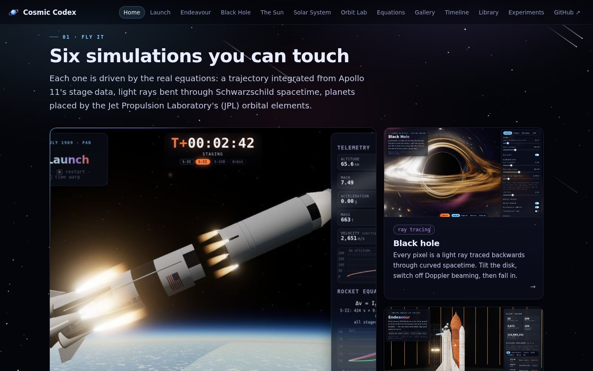</a>

**[▶ Open it](https://normansrule.github.io/cosmic-library/)** · The front door: a tour of every page, tonight's sky over your city and a zoom from a proton to the universe.

**Try this first**

1. Pick a mood under "Where do you want to start?" and follow the suggested pages.
2. Drag the handle under "Drag from a proton to the universe" to feel the powers of ten.
3. Press "Use my location" to see tonight's sky for where you are (optional; nothing is sent anywhere).

 

| | Do this | To |
|---|---|---|
| **Mouse** | Click | Open any card or tile |
|  | Drag | Move the zoom handle and the sky time slider |
| **Touch** | Tap | Open any card or tile |
|  | One-finger drag | Move the zoom handle and the sky time slider |
| **Keyboard** | <kbd>Tab</kbd> | Move between links and controls |
|  | <kbd>←</kbd> <kbd>→</kbd> | Step the zoom handle when it has focus |
|  | <kbd>Enter</kbd> | Open the page for the current zoom stop |

- **Calculated in your browser.** Planet and Moon positions are calculated in your browser from published orbital elements. Nothing on this page is fetched live. *Offline:* Everything works offline once the page has loaded.
- **If it's slow:** This page is light. If it stutters, turn on reduced motion in your system settings: the starfield and meteors stop.
- **On a phone:** yes. Fully usable on phones.
- **Next:** [Space Academy](#space-academy) · [Night sky](#night-sky) · [Saturn V launch](#saturn-v-launch)

 

---



## Fly

Launch, land and design rockets.

### Saturn V launch

<a href="https://normansrule.github.io/cosmic-library/launch.html">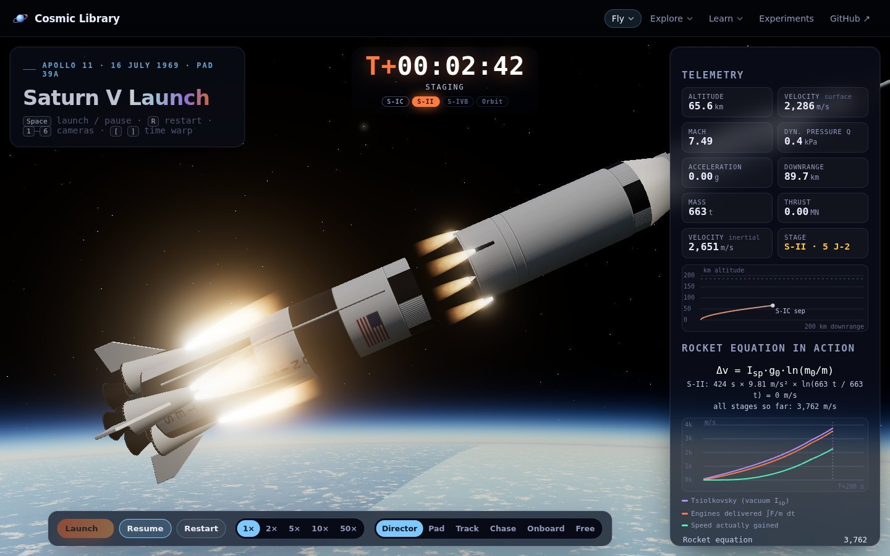</a>

**[▶ Open it](https://normansrule.github.io/cosmic-library/launch.html)** · Ride Apollo 11 from the launch pad to Earth orbit, with live telemetry computed from the real flight report.

**Try this first**

1. Press Launch (or Space) and watch the director camera follow the climb.
2. Try the cameras: 1 Director, 2 Pad, 3 Track, 4 Chase, 5 Onboard, 6 Free.
3. Speed things up with the time-warp buttons or [ and ].
4. Open Telemetry to see speed, altitude and the rocket equation update live.

 

| | Do this | To |
|---|---|---|
| **Mouse** | Click | Launch, pause, restart, change camera and time warp with the on-screen buttons |
|  | Drag | Orbit the rocket (Free camera only) |
|  | Scroll wheel | Zoom (Free camera only) |
| **Touch** | Tap | Use the on-screen Launch, camera and warp buttons |
|  | One-finger drag | Orbit the rocket (Free camera only) |
|  | Pinch | Zoom (Free camera only) |
| **Keyboard** | <kbd>Space</kbd> | Launch, then pause / resume |
|  | <kbd>R</kbd> | Restart |
|  | <kbd>1</kbd>–<kbd>6</kbd> | Cameras: Director, Pad, Track, Chase, Onboard, Free |
|  | <kbd>[</kbd> <kbd>]</kbd> | Slower / faster time warp (1× to 50×) |

- **Simulation.** A physics simulation of the real flight, tuned to the Saturn V Flight Evaluation Report for Apollo 11 (AS-506). *Offline:* Everything is built in your browser, so it works offline.
- **If it's slow:** Open Settings and choose Rendering quality: Low. Your choice is remembered on this device.
- **On a phone:** yes. Works on phones; the telemetry sheet starts folded so the rocket stays in view.
- **Next:** [Booster landing](#booster-landing) · [Rocket builder](#rocket-builder) · [Orbit Lab](#orbit-lab)

 

### Booster landing

<a href="https://normansrule.github.io/cosmic-library/booster.html">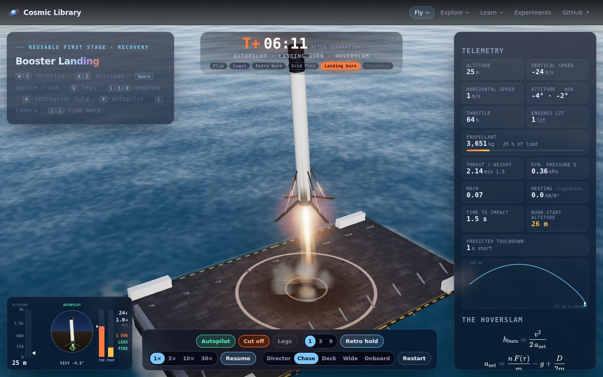</a>

**[▶ Open it](https://normansrule.github.io/cosmic-library/booster.html)** · Land a reusable first stage on a drone ship or back at the launch site, by hand or with the autopilot.

**Try this first**

1. Pick a scenario (Drone ship, Return to launch site or Final approach).
2. Press "Watch the autopilot" first to see a good landing.
3. Then press "Fly it yourself": W / S throttle, A / D tilt, Space to light the engines, G for legs.
4. Watch the dashed yellow predicted path: land with it on the pad and your speed near zero.

 

| | Do this | To |
|---|---|---|
| **Mouse** | Drag | Swing the camera around the booster |
|  | Scroll wheel | Zoom in and out |
|  | Click | Autopilot, ignite, legs, engines, camera and warp buttons |
| **Touch** | One-finger drag | Swing the camera around the booster |
|  | Press and hold | Hold ◀ ▶ to tilt and ▲ ▼ to throttle (flight pad appears while flying) |
|  | Tap | IGNITE, LEGS, AUTO, CAM and warp buttons |
| **Keyboard** | <kbd>W</kbd> <kbd>S</kbd> | Throttle up / down (also ↑ ↓) |
|  | <kbd>A</kbd> <kbd>D</kbd> | Tilt left / right (also ← →) |
|  | <kbd>Space</kbd> | Start, then ignite / cut the engines |
|  | <kbd>G</kbd> | Landing legs |
|  | <kbd>1</kbd> <kbd>3</kbd> <kbd>9</kbd> | Number of engines |
|  | <kbd>H</kbd> | Retrograde hold |
|  | <kbd>P</kbd> | Autopilot on / off |
|  | <kbd>C</kbd> | Next camera |
|  | <kbd>R</kbd> | Restart |
|  | <kbd>[</kbd> <kbd>]</kbd> | Time warp (1×, 3×, 10×, 30×) |
|  | <kbd>Esc</kbd> | Pause (or close the result card) |

- **Simulation.** A rigid-body flight simulation with a real atmosphere model and published Falcon 9-class numbers. Not live. *Offline:* Works offline.
- **If it's slow:** Open Settings and choose Low, or add ?q=low to the address. Phones start on Low automatically. Low graphics link: [`?q=low`](https://normansrule.github.io/cosmic-library/booster.html?q=low).
- **On a phone:** yes. On-screen hold buttons appear while you fly.
- **Next:** [Saturn V launch](#saturn-v-launch) · [Moon landing](#moon-landing) · [Rocket builder](#rocket-builder)

 

### Moon landing

<a href="https://normansrule.github.io/cosmic-library/moon-landing.html">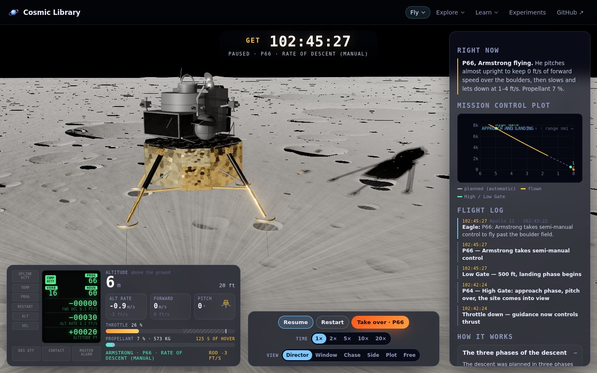</a>

**[▶ Open it](https://normansrule.github.io/cosmic-library/moon-landing.html)** · Fly the Apollo 11 lunar module down to the Sea of Tranquility, or watch Neil Armstrong's real descent.

**Try this first**

1. Choose where to start: the whole descent (Powered Descent Initiation), High Gate or Low Gate.
2. Pick "Watch Armstrong" to see the real flight, or "I'll fly" to try it yourself.
3. Press Begin descent (or Space). Press P to take over by hand for the last few hundred feet.
4. Use ↑ ↓ to change the descent rate by 1 foot per second and ← → to lean forward or back.

 

| | Do this | To |
|---|---|---|
| **Mouse** | Click | Begin, pause, take over, cameras, warp, and the ▲ ▼ ◀ ▶ pads |
|  | Drag | Orbit the lander (Free camera only) |
|  | Scroll wheel | Zoom (Free camera only) |
| **Touch** | Tap | Tap ▲ ▼ for descent rate, hold ◀ ▶ to pitch |
|  | One-finger drag | Orbit the lander (Free camera only) |
|  | Pinch | Zoom (Free camera only) |
| **Keyboard** | <kbd>Space</kbd> | Begin, then pause / resume |
|  | <kbd>P</kbd> | Take over by hand (P66) / give control back |
|  | <kbd>↑</kbd> <kbd>↓</kbd> | Descent rate ±1 ft/s (also W / S) |
|  | <kbd>←</kbd> <kbd>→</kbd> | Pitch back / forward, or move the landing point (also A / D) |
|  | <kbd>X</kbd> | Engine off after contact (manual only) |
|  | <kbd>1</kbd>–<kbd>6</kbd> | Cameras: Director, Window, Chase, Side, Plot, Free |
|  | <kbd>[</kbd> <kbd>]</kbd> | Time warp (1× to 20×) |
|  | <kbd>R</kbd> | Restart |

- **Simulation.** A guidance and flight simulation checked against the Apollo 11 descent record (including the 1202 and 1201 alarms). *Offline:* Works offline.
- **If it's slow:** Open Settings and choose Low, or add ?q=low to the address. Phones start on Low automatically. Low graphics link: [`?q=low`](https://normansrule.github.io/cosmic-library/moon-landing.html?q=low).
- **On a phone:** yes. Use the ▲ ▼ ◀ ▶ pads on screen.
- **Next:** [Moon explorer](#moon-explorer) · [Booster landing](#booster-landing) · [Mars landing](#mars-landing)

 

### Mars landing

<a href="https://normansrule.github.io/cosmic-library/mars-landing.html">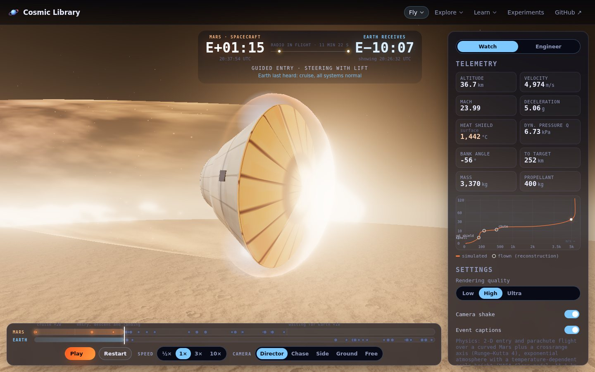</a>

**[▶ Open it](https://normansrule.github.io/cosmic-library/mars-landing.html)** · The Perseverance rover's "seven minutes of terror": entry, parachute, powered descent and sky crane, step by step.

**Try this first**

1. Press "Watch the landing" and let the director camera tell the story.
2. Use ← → to jump between events (parachute, heat shield, sky crane…).
3. Press "Why Mars is hard" for a short explainer.
4. Switch to "Be the engineer", change the parachute trigger or crane height, then "Fly my landing".

 

| | Do this | To |
|---|---|---|
| **Mouse** | Click | Play, restart, speed, cameras and the timeline |
|  | Drag | Scrub the timeline; orbit the spacecraft in the Free camera |
|  | Scroll wheel | Zoom (Free camera only) |
| **Touch** | Tap | Play, cameras, and events on the timeline |
|  | One-finger drag | Scrub the timeline; orbit in the Free camera |
| **Keyboard** | <kbd>Space</kbd> | Play / pause |
|  | <kbd>←</kbd> <kbd>→</kbd> | Previous / next event |
|  | <kbd>1</kbd>–<kbd>5</kbd> | Cameras: Director, Chase, Side, Ground, Free |
|  | <kbd>E</kbd> | Switch between Watch and Engineer |
|  | <kbd>Esc</kbd> | Close the explainer |

- **Simulation.** A reconstruction of the Mars 2020 entry, descent and landing from published Jet Propulsion Laboratory (JPL) numbers. Your engineer runs are simulated with the same physics. *Offline:* Works offline (event notes come from a local file).
- **If it's slow:** Open Settings and choose Low, or add ?q=low to the address. Low graphics link: [`?q=low`](https://normansrule.github.io/cosmic-library/mars-landing.html?q=low).
- **On a phone:** yes. The telemetry sheet starts folded.
- **Next:** [Moon landing](#moon-landing) · [Booster landing](#booster-landing) · [Mission designer](#mission-designer)

 

### Endeavour

<a href="https://normansrule.github.io/cosmic-library/shuttle.html">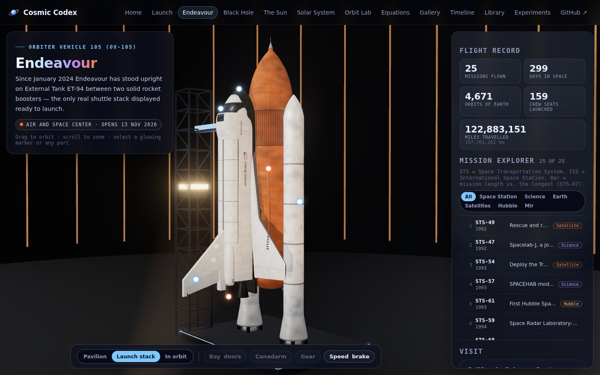</a>

**[▶ Open it](https://normansrule.github.io/cosmic-library/shuttle.html)** · A 3D model of Space Shuttle Endeavour: see it on display in Los Angeles, stacked for launch, or in orbit.

**Try this first**

1. Drag to walk around the orbiter, scroll to get close.
2. Select a glowing marker to read about that part.
3. Switch between Pavilion, Launch stack and In orbit at the top.
4. In orbit, open the bay doors and move the Canadarm.

 

| | Do this | To |
|---|---|---|
| **Mouse** | Drag | Orbit the shuttle |
|  | Right-drag | Pan (right-drag) |
|  | Scroll wheel | Zoom |
|  | Click | Select a glowing marker or any part |
| **Touch** | One-finger drag | Orbit the shuttle |
|  | Pinch | Zoom |
|  | Two-finger drag | Pan with two fingers |
|  | Tap | Select a marker or part |
| **Keyboard** | <kbd>Tab</kbd> | Move between the buttons and markers |
|  | <kbd>Esc</kbd> | Close the part card |

- **Simulation.** An original 3D model built from public reference drawings; the mission facts come from NASA and the California Science Center. *Offline:* Works offline.
- **If it's slow:** Open Settings → Render quality → Low, or add ?q=low to the address. Low graphics link: [`?q=low`](https://normansrule.github.io/cosmic-library/shuttle.html?q=low).
- **On a phone:** yes. Phones start on Balanced quality.
- **Next:** [Rocket hangar](#rocket-hangar) · [Saturn V launch](#saturn-v-launch) · [Live Earth orbit](#live-earth-orbit)

 

### Rocket hangar

<a href="https://normansrule.github.io/cosmic-library/hangar.html">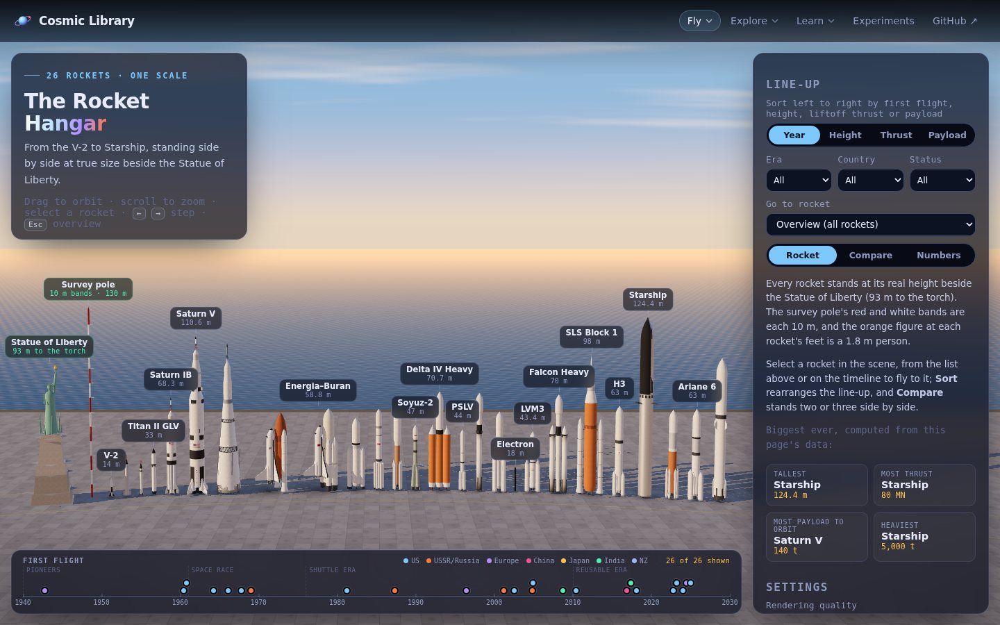</a>

**[▶ Open it](https://normansrule.github.io/cosmic-library/hangar.html)** · Every major rocket, from the V-2 to Starship, standing side by side at true scale.

**Try this first**

1. Sort the line-up by Year, Height, Thrust or Payload.
2. Click a rocket to fly to it; use ← → to step along the line.
3. Open the Compare tab and add two or three rockets.
4. Press Esc to go back to the overview.

 

| | Do this | To |
|---|---|---|
| **Mouse** | Drag | Orbit the camera |
|  | Right-drag | Pan (right-drag) |
|  | Scroll wheel | Zoom toward the cursor |
|  | Click | Select a rocket |
|  | Double-click | Double-click empty ground: back to the overview |
| **Touch** | One-finger drag | Orbit the camera |
|  | Pinch | Zoom |
|  | Two-finger drag | Pan with two fingers |
|  | Tap | Select a rocket |
| **Keyboard** | <kbd>←</kbd> <kbd>→</kbd> | Previous / next rocket |
|  | <kbd>Esc</kbd> | Back to the overview |

- **Simulation.** Original 3D models drawn to published dimensions; heights, thrust and payload come from the sources listed on the page. *Offline:* Works offline.
- **If it's slow:** Open Settings and choose Low, or add ?q=low to the address. Low graphics link: [`?q=low`](https://normansrule.github.io/cosmic-library/hangar.html?q=low).
- **On a phone:** yes.
- **Next:** [Rocket builder](#rocket-builder) · [Saturn V launch](#saturn-v-launch) · [Endeavour](#endeavour)

 

### Rocket builder

<a href="https://normansrule.github.io/cosmic-library/builder.html">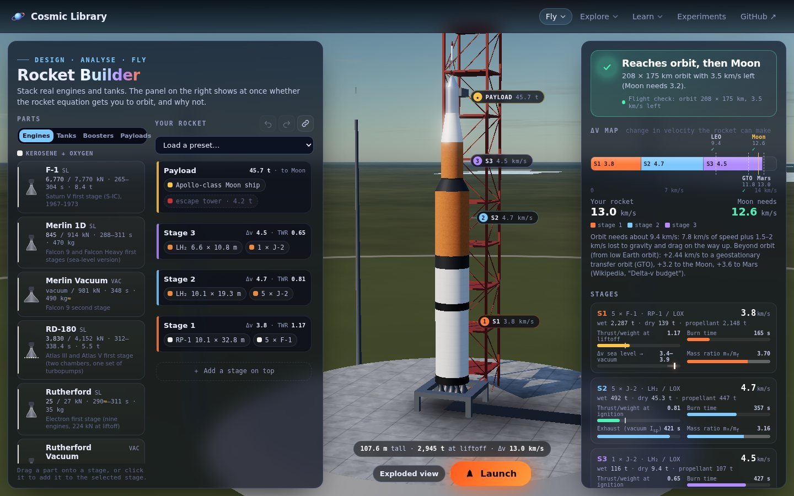</a>

**[▶ Open it](https://normansrule.github.io/cosmic-library/builder.html)** · Design a rocket from real engines and tanks, check its change in velocity (Δv), then fly it to orbit.

**Try this first**

1. Load a preset from "Load a preset…" to start from a working rocket.
2. Drag a part from Parts onto a stage, or click it to add it to the selected stage.
3. Open Analysis to see where the mass goes and whether you can reach orbit.
4. Press Launch (or Shift + Enter) and watch the flight; press Esc to come back and improve it.

 

| | Do this | To |
|---|---|---|
| **Mouse** | Drag | Orbit the rocket; drag parts from the palette onto a stage |
|  | Right-drag | Pan (right-drag) |
|  | Scroll wheel | Zoom |
|  | Click | Click part of the 3D rocket to select its stage |
| **Touch** | Tap | Tap a part to add it to the selected stage |
|  | One-finger drag | Orbit the rocket |
|  | Pinch | Zoom |
| **Keyboard** | <kbd>Ctrl</kbd> + <kbd>Z</kbd> | Undo (⌘ on a Mac) |
|  | <kbd>Ctrl</kbd> + <kbd>Y</kbd> | Redo (also Ctrl + Shift + Z) |
|  | <kbd>Shift</kbd> + <kbd>Enter</kbd> | Launch the design |
|  | <kbd>Space</kbd> | Pause / resume the flight |
|  | <kbd>Esc</kbd> | Back to the builder |

- **Simulation.** A two-dimensional ascent simulation (real atmosphere, Earth's rotation and gravity) using published engine data. *Offline:* Works offline. Your design lives in the page address, so "Copy link" shares it.
- **If it's slow:** Add ?q=low to the address (phones start on low automatically). Low graphics link: [`?q=low`](https://normansrule.github.io/cosmic-library/builder.html?q=low).
- **On a phone:** partly. Works, but building is easier on a larger screen.
- **Next:** [Rocket hangar](#rocket-hangar) · [Saturn V launch](#saturn-v-launch) · [Mission designer](#mission-designer)

 

### Mission designer

<a href="https://normansrule.github.io/cosmic-library/mission-designer.html">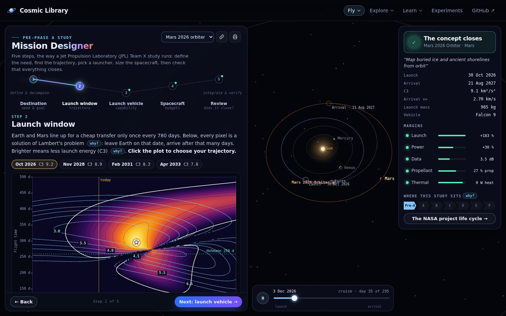</a>

**[▶ Open it](https://normansrule.github.io/cosmic-library/mission-designer.html)** · Plan a real interplanetary mission in five steps: destination, launch window, launch vehicle, spacecraft budgets, review.

**Try this first**

1. Pick a destination in step 1 (or a ready-made mission from Presets…).
2. In step 2, click a cool colour on the porkchop plot to choose a cheap launch date.
3. Walk through steps 3–5 with Next and keep an eye on the Margins box.
4. Press any "why?" button for a short explanation.

 

| | Do this | To |
|---|---|---|
| **Mouse** | Click | Pick a destination, a porkchop cell and the step buttons |
|  | Drag | Rotate the 3D trajectory view |
|  | Scroll wheel | Zoom the 3D view |
| **Touch** | Tap | Pick a destination, a porkchop cell and the step buttons |
|  | One-finger drag | Rotate the 3D view |
|  | Pinch | Zoom the 3D view |
| **Keyboard** | <kbd>←</kbd> <kbd>→</kbd> <kbd>↑</kbd> <kbd>↓</kbd> | Move on the porkchop plot or the destination list (when focused) |
|  | <kbd>Shift</kbd> | Hold for bigger porkchop steps |
|  | <kbd>Esc</kbd> | Close pop-ups |

- **Calculated in your browser.** Trajectories are calculated in your browser (Lambert solutions from planet positions); vehicle and spacecraft numbers come from published sources. *Offline:* Works offline. Your plan is saved in the page address, so you can bookmark or share it.
- **If it's slow:** Add ?q=low to the address for a lighter 3D view. Low graphics link: [`?q=low`](https://normansrule.github.io/cosmic-library/mission-designer.html?q=low).
- **On a phone:** partly. Works; the porkchop plot is small on a phone.
- **Next:** [Orbit Lab](#orbit-lab) · [Rocket builder](#rocket-builder) · [Solar system](#solar-system)

 

---



## Explore

Live data and 3D worlds, from satellites to galaxies.

### Live Earth orbit

<a href="https://normansrule.github.io/cosmic-library/earth.html">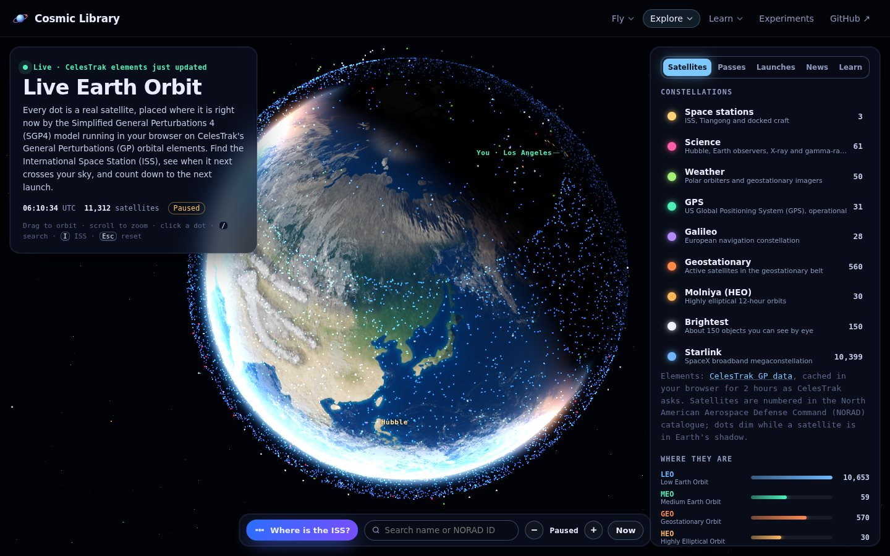</a>

**[▶ Open it](https://normansrule.github.io/cosmic-library/earth.html)** · A globe with thousands of real satellites where they are right now, plus upcoming launches and spaceflight news.

**Try this first**

1. Press "Where is the ISS?" (or I) to fly to the International Space Station (ISS).
2. Click any dot to see which satellite it is and draw its orbit.
3. Open the Passes tab and press "Use my location" to see when the ISS flies over you.
4. Speed time up with + and press Now to come back to the present.

 

| | Do this | To |
|---|---|---|
| **Mouse** | Drag | Spin the globe |
|  | Scroll wheel | Zoom |
|  | Click | Select a satellite |
| **Touch** | One-finger drag | Spin the globe |
|  | Pinch | Zoom |
|  | Tap | Select a satellite |
| **Keyboard** | <kbd>/</kbd> | Search satellites |
|  | <kbd>I</kbd> | Fly to the ISS |
|  | <kbd>F</kbd> | Follow the selected satellite |
|  | <kbd>N</kbd> | Back to now |
|  | <kbd>+</kbd> <kbd>−</kbd> | Faster / slower time |
|  | <kbd>Esc</kbd> | Deselect and reset the view |

- **Live data.** Live: orbits from CelesTrak, launches from The Space Devs and news from the Spaceflight News API, cached for a while on your device. *Offline:* If CelesTrak can't be reached, the page builds illustrative constellations from a local file and says so. Add ?offline to see that mode.
- **If it's slow:** No quality switch here. Turn off Labels and Clouds in the Satellites tab, and close other tabs.
- **On a phone:** yes. The panel becomes a bottom sheet.
- **Next:** [Night sky](#night-sky) · [Deep Space Network](#deep-space-network) · [Space weather](#space-weather)

 

### Night sky

<a href="https://normansrule.github.io/cosmic-library/sky.html">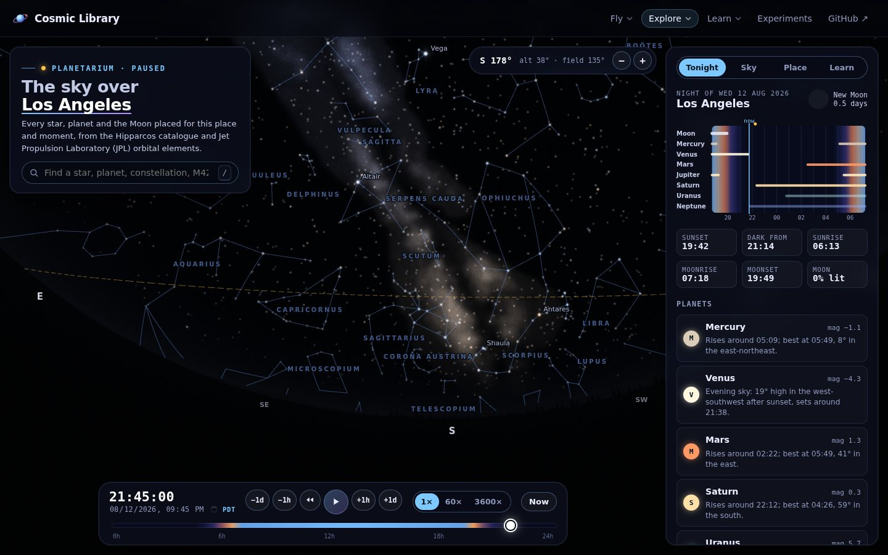</a>

**[▶ Open it](https://normansrule.github.io/cosmic-library/sky.html)** · A planetarium for any place and time: stars, planets, the Moon and constellations as they are above you tonight.

**Try this first**

1. Press the place button at the top (it starts on Los Angeles) or "Use my location".
2. Drag to look around; scroll or pinch to zoom in on the Moon or a planet.
3. Click a star or planet for its name, distance and rise and set times.
4. Open the Tonight tab for five highlights, or press 3600× to watch the sky turn.

 

| | Do this | To |
|---|---|---|
| **Mouse** | Drag | Look around |
|  | Scroll wheel | Zoom (field of view 10° to 180°) |
|  | Click | Select a star, planet or deep-sky object |
|  | Double-click | Centre the view on that spot |
| **Touch** | One-finger drag | Look around |
|  | Pinch | Zoom |
|  | Tap | Select an object |
| **Keyboard** | <kbd>←</kbd> <kbd>→</kbd> <kbd>↑</kbd> <kbd>↓</kbd> | Look around |
|  | <kbd>+</kbd> <kbd>−</kbd> | Zoom in / out |
|  | <kbd>/</kbd> | Search |
|  | <kbd>Space</kbd> | Play / pause time |
|  | <kbd>N</kbd> | Back to now |
|  | <kbd>R</kbd> | Run time backwards / forwards |
|  | <kbd>C</kbd> <kbd>V</kbd> <kbd>B</kbd> <kbd>L</kbd> | Constellation lines, names, boundaries, star names |
|  | <kbd>M</kbd> <kbd>P</kbd> <kbd>K</kbd> | Messier objects, planet labels, ecliptic |
|  | <kbd>Z</kbd> <kbd>E</kbd> <kbd>G</kbd> <kbd>A</kbd> | Alt-azimuth grid, equatorial grid, ground, atmosphere |
|  | <kbd>Esc</kbd> | Close the info card |

- **Calculated in your browser.** Calculated in your browser from a real star catalogue (Hipparcos, via d3-celestial) and standard astronomy formulas. Nothing is fetched live. *Offline:* Works offline. "Use my location" asks your browser once and keeps the answer on the page only.
- **If it's slow:** No quality switch: the page lowers its own resolution when frames are slow. Turning off Atmosphere (A) and Twinkling also helps.
- **On a phone:** yes. Made for holding up to the real sky.
- **Next:** [Sky surveys](#sky-surveys) · [Moon explorer](#moon-explorer) · [Solar system](#solar-system)

 

### Moon explorer

<a href="https://normansrule.github.io/cosmic-library/moon.html">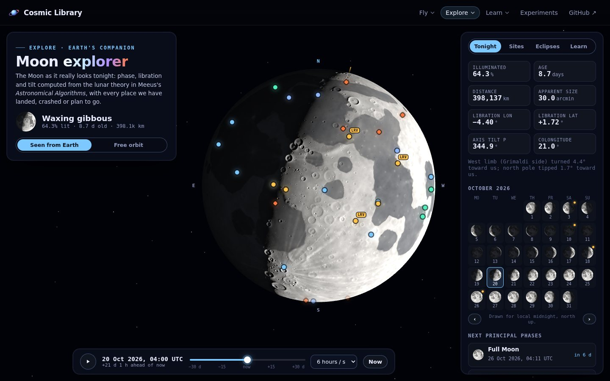</a>

**[▶ Open it](https://normansrule.github.io/cosmic-library/moon.html)** · A 3D Moon with every landing site, today's phase and libration, and the eclipses coming up.

**Try this first**

1. "Seen from Earth" shows tonight's Moon as you would see it; press Now any time.
2. Switch to "Free orbit" and drag to fly around the far side.
3. Open Sites and pick a landing (Apollo 11, Chang'e 4…) to fly there.
4. Open Eclipses and play one of the coming lunar or solar eclipses.

 

| | Do this | To |
|---|---|---|
| **Mouse** | Drag | Rotate the Moon (Free orbit only) |
|  | Scroll wheel | Zoom |
|  | Click | Select a landing-site pin |
|  | Double-click | Fly toward that point |
| **Touch** | One-finger drag | Rotate the Moon (Free orbit only) |
|  | Pinch | Zoom |
|  | Tap | Select a landing-site pin |
| **Keyboard** | <kbd>Space</kbd> | Play / pause time |
|  | <kbd>[</kbd> <kbd>]</kbd> | One day back / forward |
|  | <kbd>Esc</kbd> | Close the site card |

- **Calculated in your browser.** Phase, libration and eclipses are calculated in your browser with Jean Meeus's Astronomical Algorithms; the surface is an original procedural map. *Offline:* Works offline.
- **If it's slow:** Add ?q=low to the address (fewer triangles, no close-up detail). Low graphics link: [`?q=low`](https://normansrule.github.io/cosmic-library/moon.html?q=low).
- **On a phone:** yes. The panel becomes a bottom sheet.
- **Next:** [Moon landing](#moon-landing) · [Night sky](#night-sky) · [Solar system](#solar-system)

 

### Solar system

<a href="https://normansrule.github.io/cosmic-library/solar-system.html">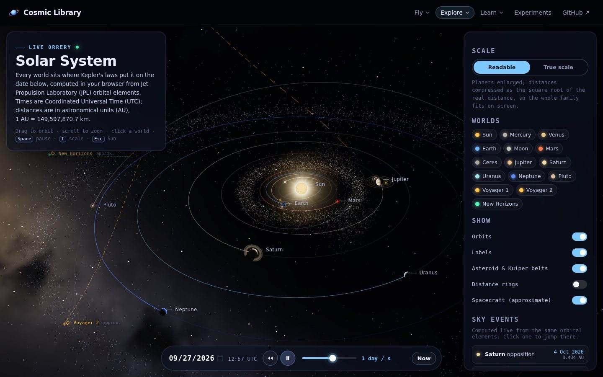</a>

**[▶ Open it](https://normansrule.github.io/cosmic-library/solar-system.html)** · An orrery with every planet where it is today, switchable between a readable view and true scale.

**Try this first**

1. Click a planet (or press 1–9) to fly to it; press 0 or Esc for the Sun.
2. Press T to switch between Readable and True scale and see how empty space is.
3. Drag the speed slider to spin the planets; press Now to return to today.
4. Turn on Spacecraft to see where the Voyagers are.

 

| | Do this | To |
|---|---|---|
| **Mouse** | Drag | Orbit the camera |
|  | Scroll wheel | Zoom |
|  | Click | Fly to a world |
| **Touch** | One-finger drag | Orbit the camera |
|  | Pinch | Zoom |
|  | Tap | Fly to a world |
| **Keyboard** | <kbd>0</kbd>–<kbd>9</kbd> | Sun, Mercury … Neptune, Pluto |
|  | <kbd>Space</kbd> | Play / pause |
|  | <kbd>R</kbd> | Reverse time |
|  | <kbd>N</kbd> | Back to now |
|  | <kbd>T</kbd> | Readable / true scale |
|  | <kbd>Esc</kbd> | Back to the Sun |

- **Calculated in your browser.** Positions are calculated in your browser from Jet Propulsion Laboratory (JPL) orbital elements; the planet facts are from the NASA Planetary Fact Sheet. *Offline:* Works offline.
- **If it's slow:** Add ?quality=low to the address for smaller planet textures. Low graphics link: [`?quality=low`](https://normansrule.github.io/cosmic-library/solar-system.html?quality=low).
- **On a phone:** yes. The controls start folded.
- **Next:** [Orbit Lab](#orbit-lab) · [Night sky](#night-sky) · [Cosmic scale](#cosmic-scale)

 

### The Sun

<a href="https://normansrule.github.io/cosmic-library/sun.html">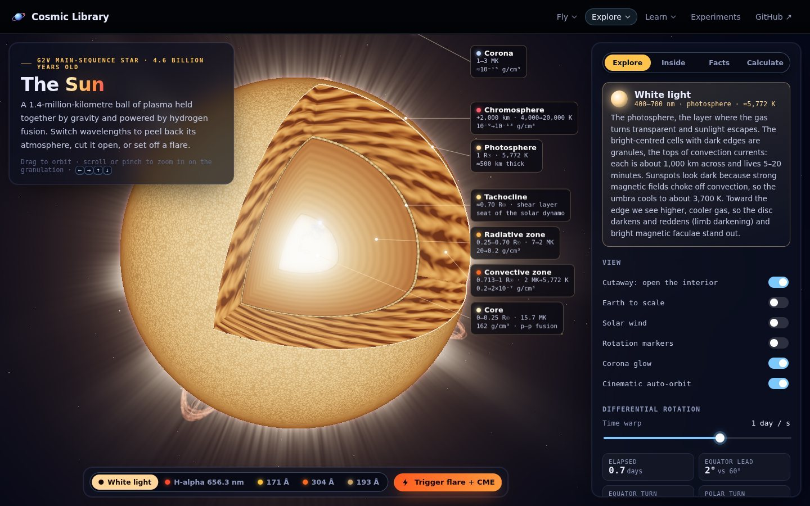</a>

**[▶ Open it](https://normansrule.github.io/cosmic-library/sun.html)** · A 3D model of our star in five wavelengths, with flares, a cutaway of the inside and calculators.

**Try this first**

1. Drag to turn the Sun; scroll or pinch all the way in to see the granulation.
2. Switch wavelength: White light, H-alpha, 171, 304, 193.
3. Press Flare to trigger a flare and coronal mass ejection (CME).
4. Open the Inside tab and press "Open the cutaway".

 

| | Do this | To |
|---|---|---|
| **Mouse** | Drag | Orbit the Sun |
|  | Scroll wheel | Zoom |
| **Touch** | One-finger drag | Orbit the Sun |
|  | Pinch | Zoom |
| **Keyboard** | <kbd>Shift</kbd> + <kbd>←</kbd> <kbd>Shift</kbd> + <kbd>→</kbd> | Rotate left / right |
|  | <kbd>Shift</kbd> + <kbd>↑</kbd> <kbd>Shift</kbd> + <kbd>↓</kbd> | Rotate up / down |

- **Simulation.** A procedural model: nothing on the disc is a photograph, but every number shown comes from a cited source. For today's real Sun see the Solar observatory. *Offline:* Works offline.
- **If it's slow:** Rendering → Quality → Low, or add ?q=low to the address. Low graphics link: [`?q=low`](https://normansrule.github.io/cosmic-library/sun.html?q=low).
- **On a phone:** yes. Phones start on Medium.
- **Next:** [Solar observatory](#solar-observatory) · [Space weather](#space-weather) · [Solar system](#solar-system)

 

### Solar observatory

<a href="https://normansrule.github.io/cosmic-library/solar-observatory.html">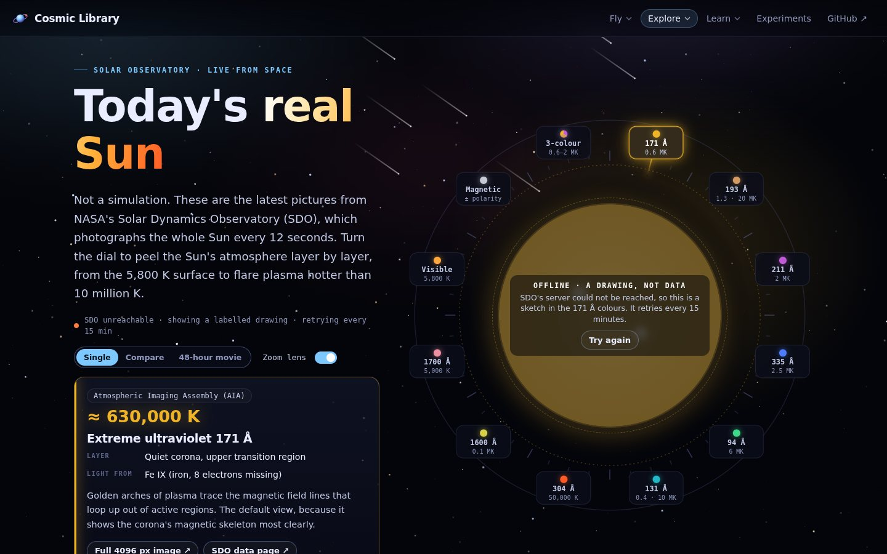</a>

**[▶ Open it](https://normansrule.github.io/cosmic-library/solar-observatory.html)** · Today's real Sun, straight from the Solar Dynamics Observatory (SDO), the Solar and Heliospheric Observatory (SOHO) and the GOES weather satellites, plus great solar images.

**Try this first**

1. Pick a channel to see the Sun in a different colour of light.
2. Press Compare and drag the divider to wipe between two channels.
3. Press "48-hour movie" to watch the last two days.
4. Scroll to "The Sun on the day you choose" and pick your birthday.

 

| | Do this | To |
|---|---|---|
| **Mouse** | Click | Choose channels, modes and gallery images |
|  | Drag | Move the compare divider |
| **Touch** | Tap | Choose channels, modes and gallery images |
|  | One-finger drag | Move the compare divider |
| **Keyboard** | <kbd>←</kbd> <kbd>→</kbd> | Move the divider (when focused); browse the gallery viewer |
|  | <kbd>Esc</kbd> | Close the gallery viewer |

- **Live data.** Live pictures loaded straight from NASA and National Oceanic and Atmospheric Administration (NOAA) servers, refreshed at most every 15 minutes. Past dates come from Helioviewer. *Offline:* If a server can't be reached you see a clearly labelled drawing, never an old picture passed off as new.
- **If it's slow:** On a slow connection the page uses smaller images (and honours your browser's Save-Data setting).
- **On a phone:** yes. Phones get 512-pixel images.
- **Next:** [The Sun](#the-sun) · [Space weather](#space-weather) · [Gallery](#gallery)

 

### Black hole

<a href="https://normansrule.github.io/cosmic-library/black-hole.html">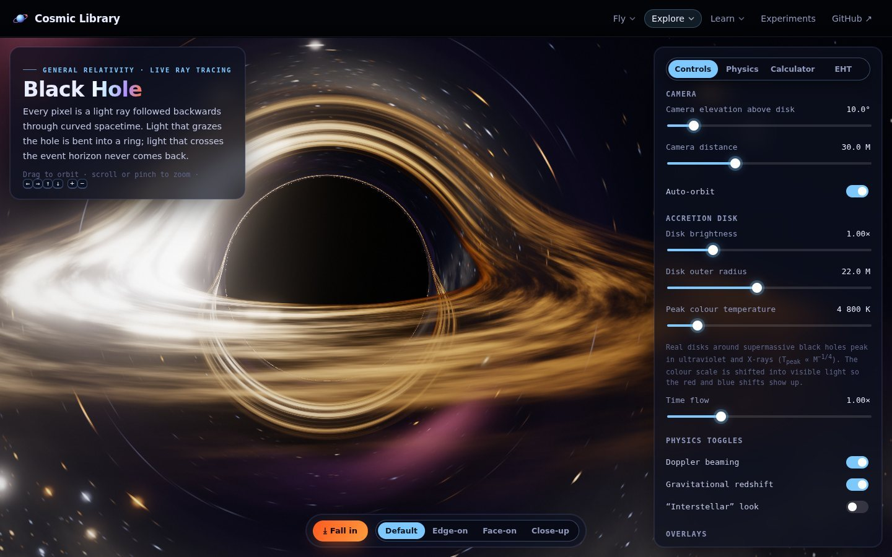</a>

**[▶ Open it](https://normansrule.github.io/cosmic-library/black-hole.html)** · A real-time ray tracer that bends light around a black hole, the way Einstein's general relativity says it should.

**Try this first**

1. Drag to orbit and watch the disk's light wrap over the top of the hole.
2. Try the camera buttons: Edge-on, Face-on, Close-up.
3. Press "Fall in" to ride toward the event horizon.
4. Open the Calculator tab to see how time slows near the hole.

 

| | Do this | To |
|---|---|---|
| **Mouse** | Drag | Orbit the black hole |
|  | Scroll wheel | Zoom |
| **Touch** | One-finger drag | Orbit the black hole |
|  | Pinch | Zoom |
| **Keyboard** | <kbd>←</kbd> <kbd>→</kbd> | Orbit around |
|  | <kbd>↑</kbd> <kbd>↓</kbd> | Raise / lower the camera |
|  | <kbd>+</kbd> <kbd>−</kbd> | Zoom in / out |

- **Simulation.** Every pixel is traced through Schwarzschild spacetime in your graphics card. The EHT tab shows the real Event Horizon Telescope (EHT) images. *Offline:* Works offline.
- **If it's slow:** Rendering → lower Ray-tracing quality and Render resolution, keep Adaptive resolution on; or add ?scale=0.5 to the address. Low graphics link: [`?scale=0.5`](https://normansrule.github.io/cosmic-library/black-hole.html?scale=0.5).
- **On a phone:** partly. Works on recent phones; older ones run at low resolution.
- **Next:** [Galaxy collision](#galaxy-collision) · [Cosmic scale](#cosmic-scale) · [Equations](#equations)

 

### Cosmic scale

<a href="https://normansrule.github.io/cosmic-library/scale.html">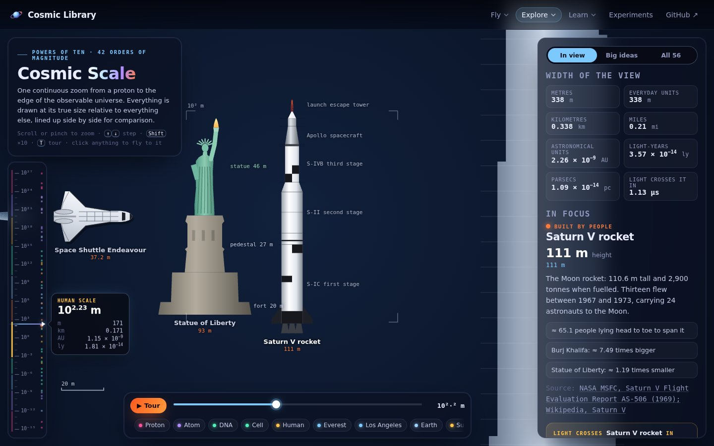</a>

**[▶ Open it](https://normansrule.github.io/cosmic-library/scale.html)** · One continuous zoom from a proton to the whole observable universe, with everything drawn at its true relative size.

**Try this first**

1. Scroll (or pinch) to zoom out from a person to the Earth, the Sun and beyond.
2. Press ▶ Tour (or T) for a guided trip through 42 powers of ten.
3. Click anything on screen to fly to it.
4. Open "All 56" to jump straight to one object.

 

| | Do this | To |
|---|---|---|
| **Mouse** | Scroll wheel | Zoom |
|  | Drag | Drag up / down to zoom; drag the ruler to scrub |
|  | Click | Fly to an object |
| **Touch** | Pinch | Zoom |
|  | One-finger drag | Drag up / down to zoom |
|  | Tap | Fly to an object |
| **Keyboard** | <kbd>↑</kbd> <kbd>↓</kbd> | Zoom out / in a little (also ← → + −) |
|  | <kbd>Shift</kbd> | Hold with an arrow: jump a whole power of ten |
|  | <kbd>PgUp</kbd> <kbd>PgDn</kbd> | Jump a power of ten |
|  | <kbd>Home</kbd> | Back to the human |
|  | <kbd>T</kbd> | Start / end the tour |
|  | <kbd>Space</kbd> | Pause the tour |
|  | <kbd>Esc</kbd> | End the tour |

- **Calculated in your browser.** Sizes and distances come from the sources listed on each object; everything is drawn in your browser. Nothing is downloaded. *Offline:* Works offline.
- **If it's slow:** No quality switch: this is a 2D canvas and runs on almost anything. Close other tabs if it stutters.
- **On a phone:** yes. Pinch to zoom.
- **Next:** [Solar system](#solar-system) · [Galaxy collision](#galaxy-collision) · [Home](#home)

 

### Space weather

<a href="https://normansrule.github.io/cosmic-library/space-weather.html">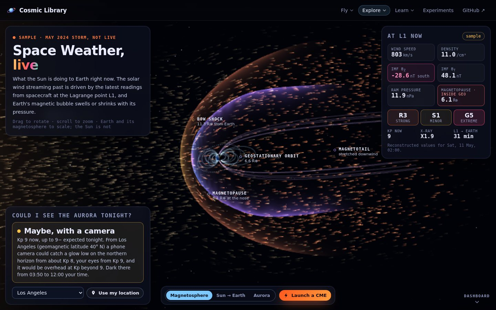</a>

**[▶ Open it](https://normansrule.github.io/cosmic-library/space-weather.html)** · Live solar wind, geomagnetic storms and your chance of seeing the aurora tonight, with a 3D magnetosphere.

**Try this first**

1. Read "At L1 now" for the solar wind reaching Earth right now.
2. Pick your city (or "Use my location") under "Could I see the aurora tonight?".
3. Switch the 3D view: Magnetosphere, Sun → Earth, Aurora; press "Launch a CME".
4. Scroll down to the dashboard and the step-by-step explainer.

 

| | Do this | To |
|---|---|---|
| **Mouse** | Drag | Rotate the 3D view |
|  | Scroll wheel | Zoom the 3D view |
|  | Click | Views, CME launch and chart points |
| **Touch** | One-finger drag | Rotate the 3D view |
|  | Pinch | Zoom the 3D view |
|  | Tap | Views, CME launch and chart points |
| **Keyboard** | <kbd>←</kbd> <kbd>→</kbd> | Move along a focused chart (Shift: 12 steps) |
|  | <kbd>Home</kbd> <kbd>End</kbd> | First / latest point on a focused chart |

- **Live data.** Live from the Space Weather Prediction Center (SWPC) of the National Oceanic and Atmospheric Administration (NOAA), refreshed every few minutes and cached on your device. *Offline:* If NOAA can't be reached and nothing is cached, the page replays the May 2024 storm and labels it clearly. Add ?offline to see that mode.
- **If it's slow:** No quality switch. The 3D view pauses when scrolled away; close other tabs if it stutters.
- **On a phone:** yes.
- **Next:** [The Sun](#the-sun) · [Solar observatory](#solar-observatory) · [Live Earth orbit](#live-earth-orbit)

 

### Galaxy collision

<a href="https://normansrule.github.io/cosmic-library/galaxies.html">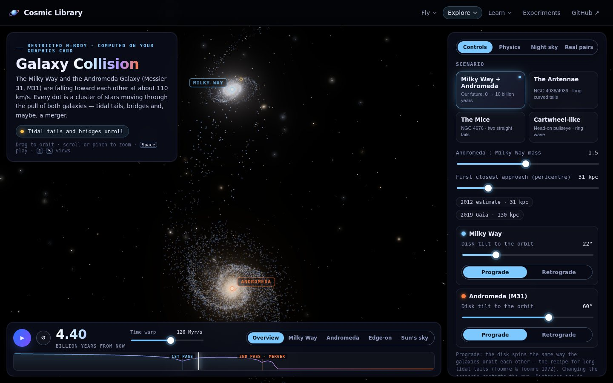</a>

**[▶ Open it](https://normansrule.github.io/cosmic-library/galaxies.html)** · The Milky Way and Andromeda colliding over ten billion years, with up to a quarter of a million stars on your graphics card.

**Try this first**

1. Press play (Space) and watch the first close pass.
2. Try the views: 1 Overview, 2 Milky Way, 3 Andromeda, 4 Edge-on, 5 View from the Sun.
3. Drag the timeline at the bottom to jump in time.
4. Try another scenario: The Antennae, The Mice or Cartwheel-like.

 

| | Do this | To |
|---|---|---|
| **Mouse** | Drag | Orbit the camera (look around in the View from the Sun) |
|  | Scroll wheel | Zoom |
|  | Click | Play, reset, views and the timeline |
| **Touch** | One-finger drag | Orbit the camera |
|  | Pinch | Zoom |
|  | Tap | Play, views and the timeline |
| **Keyboard** | <kbd>Space</kbd> | Play / pause |
|  | <kbd>R</kbd> | Reset |
|  | <kbd>1</kbd>–<kbd>5</kbd> | Views: overview, Milky Way, Andromeda, edge-on, from the Sun |
|  | <kbd>[</kbd> <kbd>]</kbd> | Slower / faster time warp |
|  | <kbd>←</kbd> <kbd>→</kbd> | Step the timeline (when focused) |

- **Simulation.** A restricted N-body simulation on your graphics card, set up from published masses and orbits (including the 2019 Gaia estimate). *Offline:* Works offline.
- **If it's slow:** Lower "Star particles" in Controls, or add ?q=low&n=32768 to the address. Low graphics link: [`?q=low&n=32768`](https://normansrule.github.io/cosmic-library/galaxies.html?q=low&n=32768).
- **On a phone:** partly. Works on recent phones with fewer stars; needs WebGL 2.
- **Next:** [Black hole](#black-hole) · [Cosmic scale](#cosmic-scale) · [Sky surveys](#sky-surveys)

 

### Sky surveys

<a href="https://normansrule.github.io/cosmic-library/surveys.html">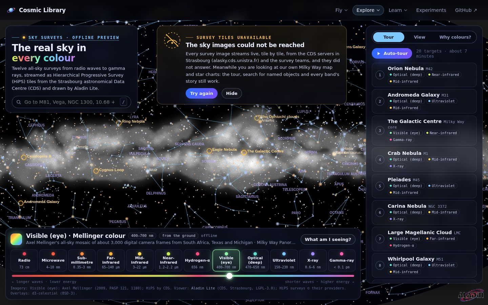</a>

**[▶ Open it](https://normansrule.github.io/cosmic-library/surveys.html)** · Pan the real sky in a dozen wavelengths, from radio to gamma rays, with a guided tour.

**Try this first**

1. Drag the wavelength slider at the bottom to blend from visible light to infrared or X-rays.
2. Press Auto-tour (or P) for famous targets.
3. Search for a name like M31 or Orion Nebula.
4. Press W to wipe between two wavelengths side by side.

 

| | Do this | To |
|---|---|---|
| **Mouse** | Drag | Pan the sky |
|  | Scroll wheel | Zoom |
|  | Click | Pick a wavelength, a tour target or an overlay |
| **Touch** | One-finger drag | Pan the sky |
|  | Pinch | Zoom |
|  | Tap | Pick a wavelength or a tour target |
| **Keyboard** | <kbd>/</kbd> | Search |
|  | <kbd>[</kbd> <kbd>]</kbd> | Previous / next wavelength |
|  | <kbd>P</kbd> | Start / stop the tour |
|  | <kbd>W</kbd> | Wipe comparison on / off |
|  | <kbd>G</kbd> <kbd>C</kbd> <kbd>N</kbd> | Grid, constellation lines, constellation names |
|  | <kbd>M</kbd> <kbd>S</kbd> <kbd>T</kbd> | Messier objects, bright-star names, tour targets |
|  | <kbd>Esc</kbd> | Close the caption |

- **Live data.** Survey images stream live from the Strasbourg astronomical Data Centre (CDS) through Aladin Lite; name search uses its Sesame service. *Offline:* Offline you get a local Milky Way map with our overlays, clearly labelled "offline preview".
- **If it's slow:** No quality switch. Choose a lower-resolution survey, zoom out, and turn off the wipe comparison.
- **On a phone:** yes. Needs WebGL 2.
- **Next:** [Night sky](#night-sky) · [Use a telescope](#use-a-telescope) · [Galaxy collision](#galaxy-collision)

 

### Deep Space Network

<a href="https://normansrule.github.io/cosmic-library/dsn.html">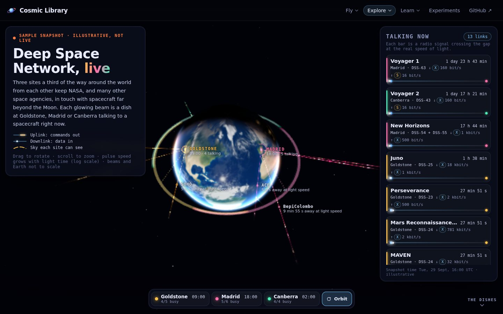</a>

**[▶ Open it](https://normansrule.github.io/cosmic-library/dsn.html)** · Which spacecraft are talking to the Deep Space Network (DSN), NASA's giant dishes in California, Spain and Australia right now.

**Try this first**

1. Read "Talking now" for each live link and how long its signal takes.
2. Drag the globe to see which dishes point where; press Orbit to spin it.
3. Scroll to "Every dish, right now" for each antenna's status.
4. Scroll to "A conversation that takes two days" to feel the delay to Voyager.

 

| | Do this | To |
|---|---|---|
| **Mouse** | Drag | Rotate the globe |
|  | Scroll wheel | Zoom the globe |
|  | Click | Open a dish or a spacecraft |
| **Touch** | One-finger drag | Rotate the globe |
|  | Pinch | Zoom the globe |
|  | Tap | Open a dish or a spacecraft |
| **Keyboard** | <kbd>Tab</kbd> | Move between links and dishes |

- **Live data.** Live from DSN Now, run by NASA's Jet Propulsion Laboratory (JPL), refreshed every 5 seconds. The last good copy is kept on your device. *Offline:* Offline it shows that saved copy with its age; with no copy it shows an illustrative sample, clearly labelled. Add ?offline to see it.
- **If it's slow:** No quality switch. The globe is light; close other tabs if it stutters.
- **On a phone:** yes.
- **Next:** [Live Earth orbit](#live-earth-orbit) · [Mission designer](#mission-designer) · [Solar system](#solar-system)

 

---



## Learn

Courses, equations, pictures, history and documents.

### Space Academy

<a href="https://normansrule.github.io/cosmic-library/academy.html">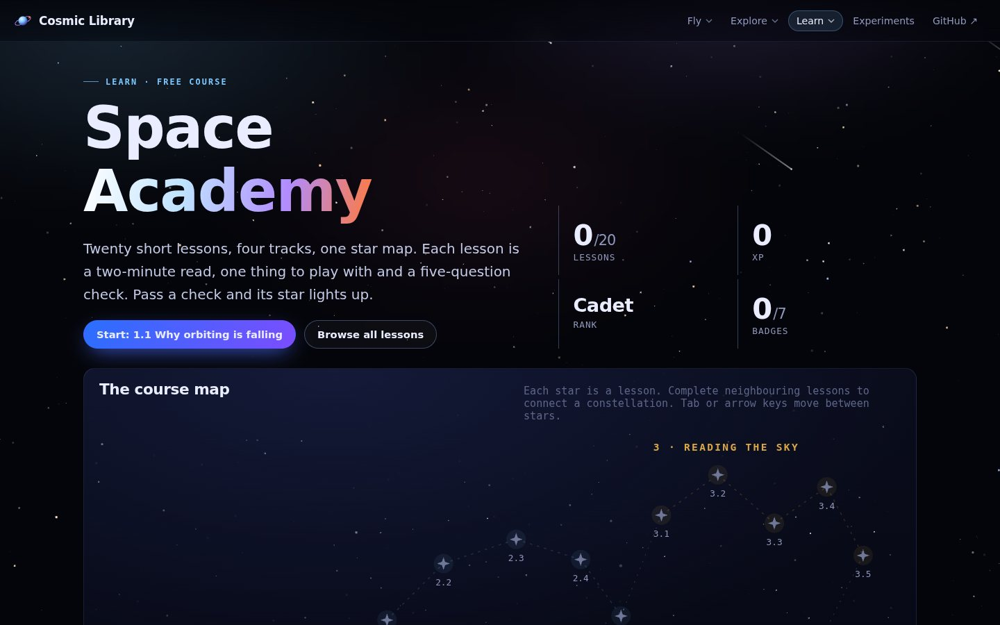</a>

**[▶ Open it](https://normansrule.github.io/cosmic-library/academy.html)** · A guided course: short lessons with interactive widgets, quizzes, mission patches and a printable certificate.

**Try this first**

1. Start at the first star on the course map, or pick a track under "Pick up anywhere".
2. Play with each lesson's widget, then answer its quiz.
3. Collect mission patches as you finish tracks.
4. Use "Copy code" to move your progress to another device.

 

| | Do this | To |
|---|---|---|
| **Mouse** | Click | Open lessons, answer quizzes |
|  | Drag | Use the sliders and plots inside lessons |
| **Touch** | Tap | Open lessons, answer quizzes |
|  | One-finger drag | Scroll the course map sideways; use sliders |
| **Keyboard** | <kbd>←</kbd> <kbd>→</kbd> | Move between stars on the course map |
|  | <kbd>Enter</kbd> | Open the focused lesson |
|  | <kbd>Tab</kbd> | Move through answers and controls |

- **Calculated in your browser.** Lessons and widgets run in your browser from the site's own data files. *Offline:* Works offline. Progress is saved only in this browser (use "Copy code" to take it with you).
- **If it's slow:** This page is light. Turn on reduced motion in your system settings to stop the background animation.
- **On a phone:** yes.
- **Next:** [Orbit Lab](#orbit-lab) · [Equations](#equations) · [Documents](#documents)

 

### Orbit Lab

<a href="https://normansrule.github.io/cosmic-library/orbits.html">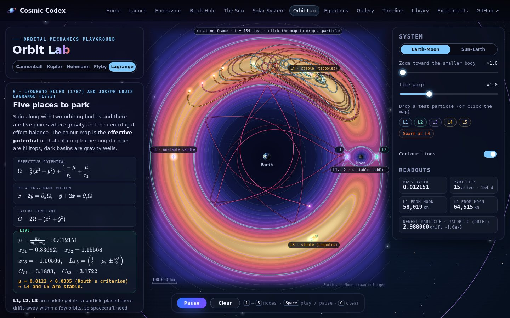</a>

**[▶ Open it](https://normansrule.github.io/cosmic-library/orbits.html)** · Five hands-on experiments: Newton's cannonball, Kepler's laws, a Hohmann transfer, a gravity assist and Lagrange points.

**Try this first**

1. In Cannonball (1), press Fire (Space) at 6.2, then at circular speed, then at escape speed.
2. In Kepler (2), turn on the equal-area wedges and watch the planet speed up near the Sun.
3. In Hohmann (3), pick Earth → Mars and see the two burns.
4. In Lagrange (5), click the canvas to drop test particles.

 

| | Do this | To |
|---|---|---|
| **Mouse** | Click | Fire the cannon (1) or drop a particle (5) on the canvas |
|  | Drag | Move the sliders |
| **Touch** | Tap | Fire the cannon (1) or drop a particle (5) |
|  | One-finger drag | Move the sliders |
| **Keyboard** | <kbd>1</kbd>–<kbd>5</kbd> | Cannonball, Kepler, Hohmann, Flyby, Lagrange |
|  | <kbd>Space</kbd> | Fire, or play / pause |
|  | <kbd>C</kbd> | Clear (Cannonball, Lagrange) |
|  | <kbd>R</kbd> | Replay (Hohmann, Flyby) |

- **Calculated in your browser.** Every orbit is integrated in your browser from textbook equations with standard constants (listed under "How this is computed"). *Offline:* Works offline.
- **If it's slow:** No quality switch: it is a light 2D canvas.
- **On a phone:** yes.
- **Next:** [Mission designer](#mission-designer) · [Equations](#equations) · [Solar system](#solar-system)

 

### Equations

<a href="https://normansrule.github.io/cosmic-library/equations.html">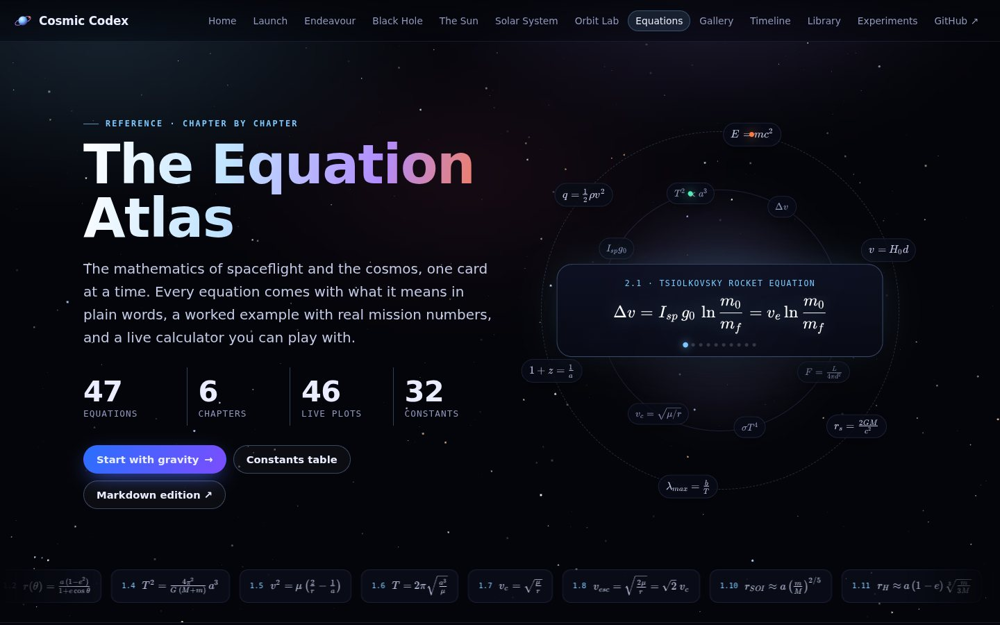</a>

**[▶ Open it](https://normansrule.github.io/cosmic-library/equations.html)** · 94 equations of spaceflight and astronomy, each with a worked example and a live calculator.

**Try this first**

1. Press / and search for "rocket" or "orbit".
2. Change a number in any calculator and watch the answer update.
3. Press j / k to step through equations, r for a random one.
4. Press c to copy the current equation as LaTeX.

 

| | Do this | To |
|---|---|---|
| **Mouse** | Click | Open chapters, copy formulas, use calculators |
| **Touch** | Tap | Open chapters, copy formulas, use calculators |
| **Keyboard** | <kbd>/</kbd> | Search |
|  | <kbd>J</kbd> <kbd>K</kbd> | Next / previous equation |
|  | <kbd>[</kbd> <kbd>]</kbd> | Previous / next chapter |
|  | <kbd>R</kbd> | Random equation |
|  | <kbd>C</kbd> | Copy the LaTeX of the current equation |
|  | <kbd>?</kbd> | This page's own shortcut list |
|  | <kbd>Esc</kbd> | Clear the search |

- **Calculated in your browser.** Equations and constants come from the cited references; calculators run in your browser. *Offline:* Works offline.
- **If it's slow:** This page is light.
- **On a phone:** yes.
- **Next:** [Orbit Lab](#orbit-lab) · [Space Academy](#space-academy) · [Documents](#documents)

 

### Gallery

<a href="https://normansrule.github.io/cosmic-library/gallery.html">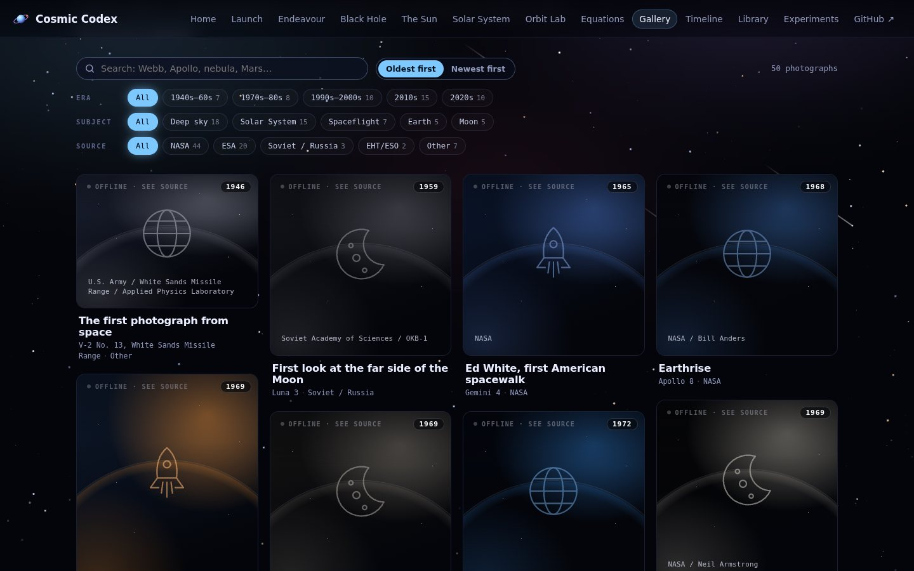</a>

**[▶ Open it](https://normansrule.github.io/cosmic-library/gallery.html)** · Photographs that changed how we see the universe, each with its story, date and credit.

**Try this first**

1. Open any photograph for its story; use ← → to browse.
2. Drag across the time machine axis to show only a range of years.
3. Press Cinema mode for a full-screen slideshow.
4. Scroll down for today's Astronomy Picture of the Day (APOD).

 

| | Do this | To |
|---|---|---|
| **Mouse** | Click | Open a photograph |
|  | Drag | Pick a window of years on the time machine |
| **Touch** | Tap | Open a photograph |
|  | One-finger drag | Swipe in the viewer to browse |
| **Keyboard** | <kbd>←</kbd> <kbd>→</kbd> | Previous / next photograph (viewer and cinema) |
|  | <kbd>Space</kbd> | Pause cinema mode |
|  | <kbd>Esc</kbd> | Close the viewer |

- **Live data.** Images load from NASA, ESA, ESO and Wikimedia servers (hotlinked, not copied). APOD comes live from NASA's API. *Offline:* Offline the stories still show; images are marked unavailable and the APOD section hides.
- **If it's slow:** Images load as you scroll; a slow connection just fills in more slowly.
- **On a phone:** yes. Swipe in the viewer.
- **Next:** [Timeline](#timeline) · [Solar observatory](#solar-observatory) · [Sky surveys](#sky-surveys)

 

### Timeline

<a href="https://normansrule.github.io/cosmic-library/timeline.html">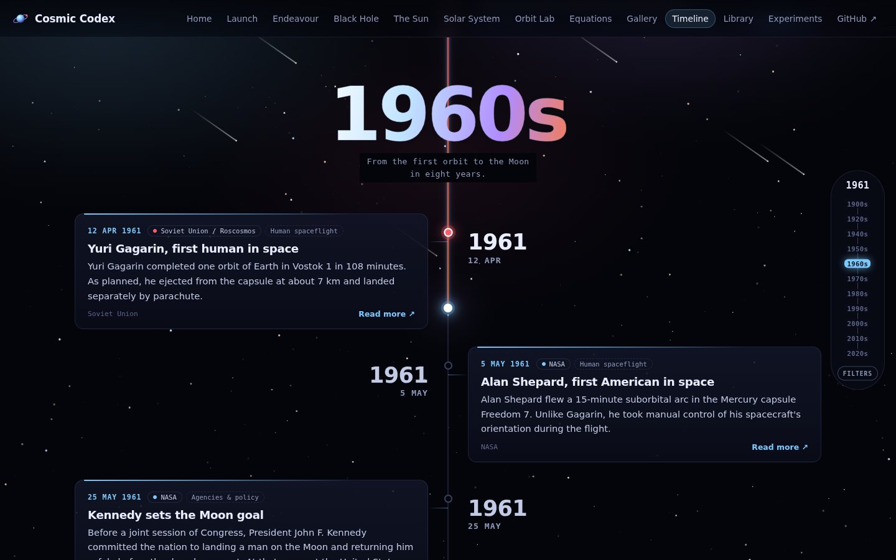</a>

**[▶ Open it](https://normansrule.github.io/cosmic-library/timeline.html)** · Every spaceflight milestone from 1903 to today, filterable by agency and kind, with a race chart of who did it first.

**Try this first**

1. Press "Jump to 2026" to see the latest events.
2. Filter by agency or category to follow one story.
3. Click a band on "Who reached the milestones, and when?" to highlight one agency.

 

| | Do this | To |
|---|---|---|
| **Mouse** | Click | Filters, chart bands and stars |
| **Touch** | Tap | Filters, chart bands and stars |
| **Keyboard** | <kbd>Tab</kbd> | Move to a chart band or star |
|  | <kbd>Enter</kbd> | Select it |

- **Calculated in your browser.** A curated list of events with sources, stored with the site. *Offline:* Works offline.
- **If it's slow:** This page is light.
- **On a phone:** yes.
- **Next:** [Gallery](#gallery) · [Documents](#documents) · [Rocket hangar](#rocket-hangar)

 

### Documents

<a href="https://normansrule.github.io/cosmic-library/library.html">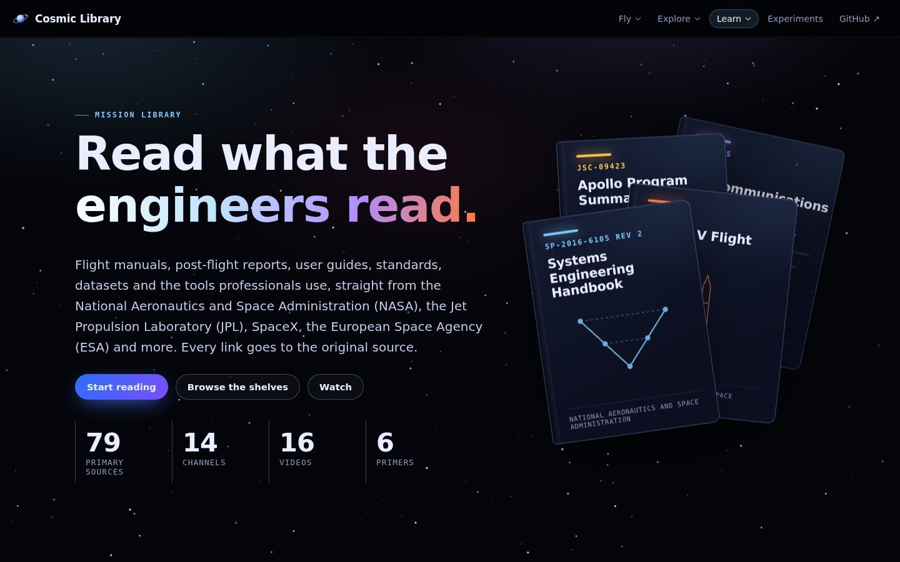</a>

**[▶ Open it](https://normansrule.github.io/cosmic-library/library.html)** · Flight manuals, mission reports, datasets and tools, filterable by who published them and how hard they are.

**Try this first**

1. Follow "A reading path from launch pad to deep space".
2. Press / and search, or filter by publisher, kind and level.
3. Switch between Cards and Bookshelf view.

 

| | Do this | To |
|---|---|---|
| **Mouse** | Click | Filters, documents, bookshelf spines |
| **Touch** | Tap | Filters, documents, bookshelf spines |
| **Keyboard** | <kbd>/</kbd> | Search |
|  | <kbd>Esc</kbd> | Leave the search box, close an open spine |

- **Calculated in your browser.** A curated catalogue stored with the site; each entry links to the original publisher. *Offline:* The catalogue works offline; the documents themselves open on their publishers' sites.
- **If it's slow:** This page is light.
- **On a phone:** yes.
- **Next:** [Equations](#equations) · [Timeline](#timeline) · [Space Academy](#space-academy)

 

### Use a telescope

<a href="https://normansrule.github.io/cosmic-library/telescopes.html">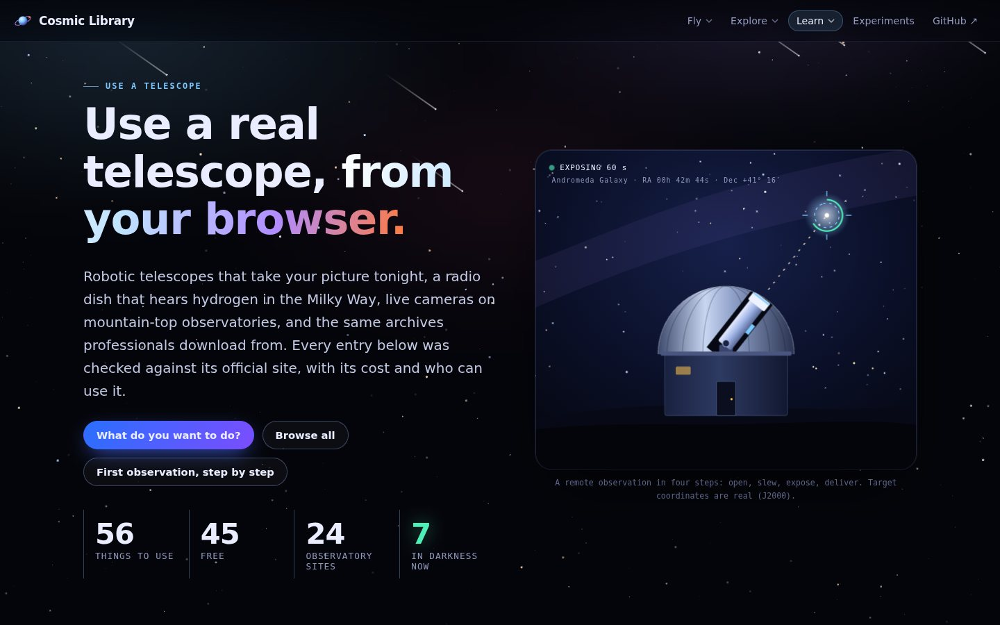</a>

**[▶ Open it](https://normansrule.github.io/cosmic-library/telescopes.html)** · Free robotic telescopes you can book, live observatory feeds and simulators, sorted by what you want to do.

**Try this first**

1. Pick a goal under "What do you want to do?"; the directory rearranges itself.
2. Check the map to see where it is dark right now.
3. Follow one of the "Three first observations, step by step" guides.

 

| | Do this | To |
|---|---|---|
| **Mouse** | Click | Goals, filters, map pins and cards |
|  | Drag | Move the map's time slider |
| **Touch** | Tap | Goals, filters, map pins and cards |
|  | One-finger drag | Move the map's time slider |
| **Keyboard** | <kbd>/</kbd> | Search the directory |
|  | <kbd>←</kbd> <kbd>→</kbd> | Switch between the step-by-step guides (when focused) |

- **Calculated in your browser.** A curated directory stored with the site; day and night on the map is calculated in your browser. *Offline:* The directory works offline; the telescopes and feeds need the internet.
- **If it's slow:** This page is light.
- **On a phone:** yes.
- **Next:** [Telescope simulator](#telescope-simulator) · [Sky surveys](#sky-surveys) · [Night sky](#night-sky)

 

### Telescope simulator

<a href="https://normansrule.github.io/cosmic-library/eyepiece.html">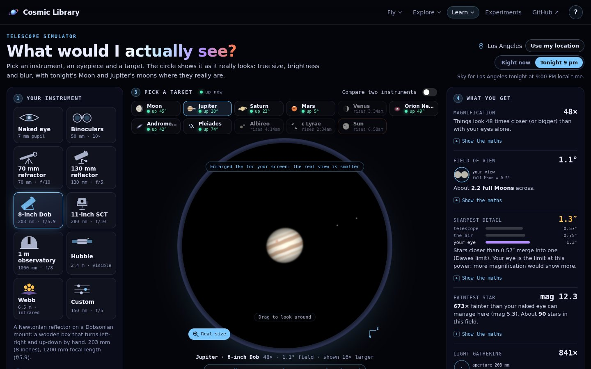</a>

**[▶ Open it](https://normansrule.github.io/cosmic-library/eyepiece.html)** · See what binoculars, a telescope or a camera would really show you of the Moon, planets and deep-sky objects from your sky tonight.

**Try this first**

1. Pick an instrument in step 1, or set your own aperture and focal length.
2. Pick an eyepiece in step 2; tick the 2× Barlow lens to double the power.
3. Pick a target that is up now in step 3 and look at "What you get".
4. In step 5, set the air steadiness, light pollution (Bortle class) and minutes in the dark.
5. Tick "Compare two instruments" and try "70 mm vs 8-inch".

 

| | Do this | To |
|---|---|---|
| **Mouse** | Click | Choose instrument, eyepiece, target and sky |
|  | Drag | Move around a target bigger than the field of view |
|  | Double-click | Re-centre the view |
| **Touch** | Tap | Choose instrument, eyepiece, target and sky |
|  | One-finger drag | Move around a target bigger than the field of view |
| **Keyboard** | <kbd>←</kbd> <kbd>→</kbd> | Step through the instruments, eyepieces or targets (when that row has focus) |
|  | <kbd>Tab</kbd> | Move between the steps and controls |

- **Calculated in your browser.** Tonight's sky is calculated in your browser; the view is modelled from the optics (aperture, focal length, eyepiece), the steadiness of the air, light pollution and how dark-adapted your eyes are. *Offline:* Works offline. "Use my location" asks your browser once and keeps the answer on the page only.
- **If it's slow:** This page draws on a light 2D canvas and only redraws the view when you change something. Close other tabs if it stutters.
- **On a phone:** yes. The steps stack into one column.
- **Next:** [Use a telescope](#use-a-telescope) · [Night sky](#night-sky) · [Sky surveys](#sky-surveys)

 

---



## Build

Hands-on experiments you can make.

### Experiments

<a href="https://normansrule.github.io/cosmic-library/experiments.html">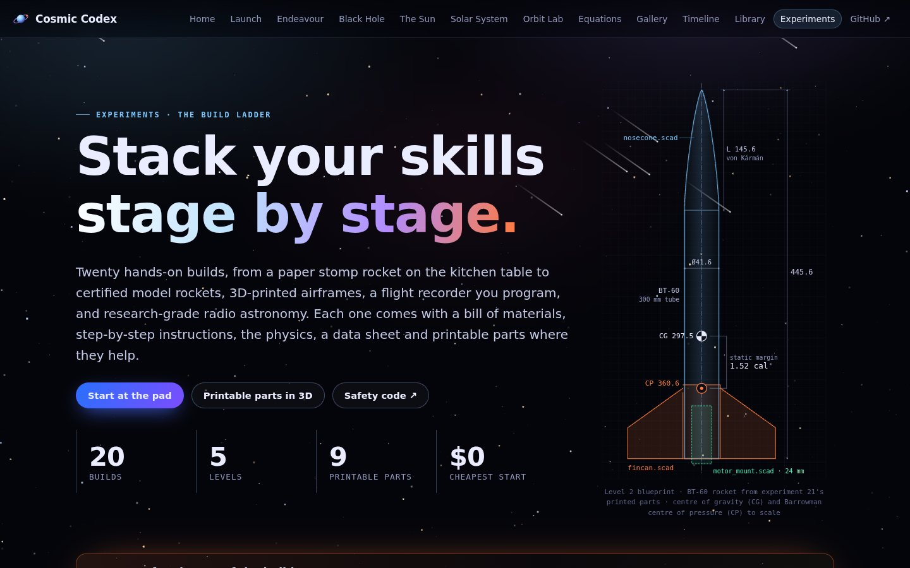</a>

**[▶ Open it](https://normansrule.github.io/cosmic-library/experiments.html)** · 20 hands-on builds in five levels, from a $0 kitchen-table experiment to a custom circuit board, with 3D parts you can inspect.

**Try this first**

1. Pick a level (0–4) or set a budget to filter the builds.
2. Open a build for its parts list, steps and safety notes.
3. In "Inspect every STL before you print it", drag to orbit a part and press Exploded view.

 

| | Do this | To |
|---|---|---|
| **Mouse** | Click | Filters and builds |
|  | Drag | Orbit a 3D part |
|  | Scroll wheel | Zoom a 3D part |
| **Touch** | Tap | Filters and builds |
|  | One-finger drag | Orbit a 3D part |
|  | Pinch | Zoom a 3D part |
| **Keyboard** | <kbd>Tab</kbd> | Move to a point on the map |
|  | <kbd>Enter</kbd> | Jump to that build's card |

- **Calculated in your browser.** Builds, parts and 3D files are stored with the site. *Offline:* Works offline; shop links need the internet.
- **If it's slow:** Turn off Auto-rotate on the 3D viewer.
- **On a phone:** yes.
- **Next:** [Rocket builder](#rocket-builder) · [Space Academy](#space-academy) · [Documents](#documents)

 

---

Found a mistake? [Report a wrong fact](https://github.com/Normansrule/cosmic-library/issues/new?template=factual-error.md) or [report a problem](https://github.com/Normansrule/cosmic-library/issues/new). Questions: [FAQ](FAQ.md).
