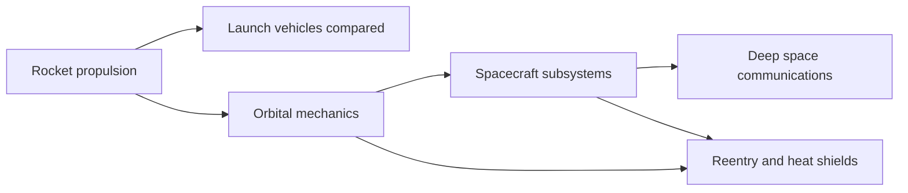

# Engineering primers

Six short, self-contained guides to the engineering behind spaceflight. Each one explains the core ideas, gives the key equations (rendered with GitHub's `$$` math), draws the concepts with Mermaid diagrams, works at least one real example and ends with the [Mission Library](../REFERENCES.md) entries to read next.

| Primer | What you will learn | Key equations |
|---|---|---|
| [Rocket propulsion](rocket-propulsion.md) | Thrust, specific impulse, nozzles, engine cycles, staging | Thrust equation, Tsiolkovsky rocket equation, ideal exhaust velocity |
| [Orbital mechanics](orbital-mechanics.md) | Kepler's laws, orbital elements, Hohmann transfers, plane changes, Oberth effect | Vis-viva, Kepler's third law, Hohmann Δv |
| [Spacecraft subsystems](spacecraft-subsystems.md) | Power, thermal, attitude control, communications, command and data handling, structures, propulsion | Solar array power, radiative equilibrium, gravity-gradient torque, margin of safety |
| [Launch vehicles compared](launch-vehicles-compared.md) | Eleven rockets from Saturn V to New Glenn: height, diameter, thrust, payload, first flight, reuse | Payload fraction |
| [Reentry and heat shields](reentry-and-heat-shields.md) | Why capsules are blunt, heating and deceleration, ablators versus tiles | Sutton–Graves heating, Allen–Eggers deceleration, ballistic coefficient |
| [Deep space communications](deep-space-communications.md) | The Deep Space Network, decibels, antennas and a worked Mars link budget | Friis equation, antenna gain, $E_b/N_0$ |

## Suggested order

1. **Rocket propulsion**, then **Launch vehicles compared**, to understand getting off the ground.
2. **Orbital mechanics** to understand where you are going.
3. **Spacecraft subsystems**, then **Deep space communications**, to understand what you send.
4. **Reentry and heat shields** to understand coming home.

## Conventions

- Acronyms are written out in full at first use in each primer, with the acronym in parentheses.
- Units are SI unless stated. Numbers quoted for real vehicles are cited in the primer or in [REFERENCES.md](../REFERENCES.md).
- Videos that pair well with each topic are listed in [VIDEOS.md](../VIDEOS.md).
- Interactive companions on the website: the [Launch](../../site/launch.html) simulator and the [Orbit Lab](../../site/orbits.html).

Found an error? Please open an issue with a source; accuracy matters more than anything else here.
