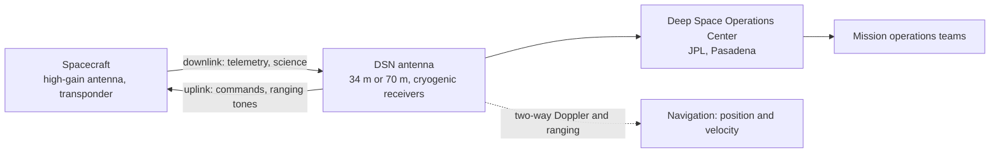

# Deep space communications

> **In one sentence:** talking to a spacecraft billions of kilometres away means catching a signal weaker than a billionth of a billionth of a watt, and the link budget is how engineers prove it can be done before launch.

This primer covers the Deep Space Network (DSN), frequency bands, decibels, antenna gain, free-space path loss and a complete worked link budget from Mars.

---

## 1. The Deep Space Network

NASA's DSN, managed by the Jet Propulsion Laboratory (JPL), is three antenna complexes spaced roughly 120° apart in longitude so that any spacecraft far from Earth is always in view of at least one:

| Complex | Location |
|---|---|
| Goldstone Deep Space Communications Complex | Mojave Desert, California, USA |
| Madrid Deep Space Communications Complex | Robledo de Chavela, near Madrid, Spain |
| Canberra Deep Space Communications Complex | Tidbinbilla, near Canberra, Australia |

Each complex has a 70 m antenna and several 34 m beam-waveguide antennas that can be arrayed together. You can watch which antenna is talking to which spacecraft right now on *DSN Now*.

## 2. Frequency bands

| Band | Approx. downlink frequency | Notes |
|---|---|---|
| S band | 2.3 GHz | older missions, emergency links, near-Earth |
| X band | 8.4 GHz | workhorse of deep space since the 1970s |
| Ka band | 32 GHz | higher data rates; more sensitive to rain and pointing |
| Optical | ~1,550 nm (near infrared) | Deep Space Optical Communications (DSOC) demonstration on Psyche |

Higher frequency means shorter wavelength, so the same dish size gives a narrower, stronger beam, which is why missions keep moving up in frequency.

## 3. Decibels in 60 seconds

Link budgets add and subtract **decibels (dB)** instead of multiplying ratios:

$$
x_{dB} = 10 \log_{10} x, \qquad 3\ \text{dB} \approx \times 2, \quad 10\ \text{dB} = \times 10, \quad 20\ \text{dB} = \times 100
$$

Power relative to 1 watt is written dBW (so 100 W = +20 dBW), and antenna gain relative to an ideal isotropic antenna is dBi.

## 4. The link equation

The **Friis transmission equation** gives received power:

$$
P_r = P_t\, G_t\, G_r \left(\frac{\lambda}{4\pi d}\right)^2 L
$$

or in decibels:

$$
P_r = P_t + G_t + G_r - L_{fs} - L_{other}, \qquad L_{fs} = 20\log_{10}\!\left(\frac{4\pi d}{\lambda}\right)
$$

A parabolic dish of diameter $D$ and aperture efficiency $\eta$ (typically 0.5–0.7) has gain

$$
G = \eta \left(\frac{\pi D}{\lambda}\right)^2
$$

What matters for digital data is the ratio of energy per bit to noise spectral density:

$$
\frac{E_b}{N_0} = \frac{P_r}{k\, T_{sys}\, R}
$$

with Boltzmann's constant $k = 1.380649 \times 10^{-23}$ J/K, system noise temperature $T_{sys}$ and data rate $R$. Modern error-correcting codes (turbo and low-density parity-check codes) need only about 1–2.5 dB of $E_b/N_0$; engineers then add **link margin** (commonly 3 dB) for everything they have not modelled.

## 5. Worked example: X band from Mars

An orbiter at Mars when Mars is 1.5 astronomical units (AU) from Earth, $d = 2.24 \times 10^{11}$ m (one-way light time 12.5 minutes).

| Parameter | Value | dB |
|---|---|---|
| Transmit power $P_t$ | 100 W | +20.0 dBW |
| Frequency, wavelength | 8.42 GHz, λ = 3.56 cm | |
| Spacecraft antenna gain $G_t$ | 3 m dish, η = 0.55 | +45.9 dBi |
| DSN antenna gain $G_r$ | 34 m dish, η = 0.60 | +67.3 dBi |
| Free-space path loss $L_{fs}$ | $4\pi d/\lambda = 7.9 \times 10^{13}$ | −278.0 dB |
| Pointing, polarisation, atmosphere | assumed | −3.0 dB |
| **Received power $P_r$** | $1.7 \times 10^{-15}$ W | **−147.8 dBW** |
| Noise density $N_0 = kT_{sys}$ | $T_{sys}$ = 30 K | −213.8 dBW/Hz |
| **$P_r/N_0$** | | **66.0 dB-Hz** |
| Required $E_b/N_0$ (coded) | | −2.5 dB |
| Link margin | | −3.0 dB |
| **Supportable data rate $R$** | ≈ 1.1 million bits per second | 60.5 dB-bit/s |

The received power is about **two femtowatts**, yet it carries a megabit per second. Every term is a design lever: double the spacecraft dish diameter for +6 dB, array four 34 m antennas for about +6 dB, move to Ka band for roughly +11.6 dB of antenna gain on each end (partly given back to weather and pointing losses). When Mars is on the far side of the Sun (about 2.5 AU) the path loss grows by about 4.4 dB and data rates drop accordingly.

## 6. Distance is the enemy

Path loss grows with $d^2$, so every doubling of distance costs 6 dB, a factor of four in data rate. Voyager 1, now more than 160 AU away and approaching one light-day from Earth, transmits with about 23 W through a 3.7 m dish and is received at only about 160 bits per second on the 70 m antennas. The link still closes because of the DSN's enormous apertures and receivers cooled to a few kelvin.

## 7. Navigation comes free

The same radio link measures where the spacecraft is:

- **Doppler:** the frequency shift of a coherent two-way signal gives line-of-sight velocity to fractions of a millimetre per second.
- **Ranging:** timing a code bounced through the spacecraft gives distance to metres.
- **Delta-differential one-way ranging (ΔDOR):** two DSN complexes observe the spacecraft and a nearby quasar to measure its angular position to nanoradians.

---

## Read next in the Mission Library

| Level | Resource |
|---|---|
| Beginner | JPL [Basics of Space Flight](https://science.nasa.gov/learn/basics-of-space-flight/), telecommunications and DSN chapters |
| Beginner | JPL video [*How Do We Communicate With Faraway Spacecraft?*](https://www.jpl.nasa.gov/edu/resources/video/how-do-we-communicate-with-faraway-spacecraft/) |
| Expert | [DSN Telecommunications Link Design Handbook (810-005)](https://deepspace.jpl.nasa.gov/dsndocs/810-005/): the real antenna gains and noise temperatures |
| Expert | [DESCANSO monograph series](https://descanso.jpl.nasa.gov/monograph/mono.html), especially *Deep Space Communications* and *Large Antennas of the Deep Space Network* |

See also: [Spacecraft subsystems](spacecraft-subsystems.md) · [Orbital mechanics](orbital-mechanics.md) · [all references](../REFERENCES.md)
