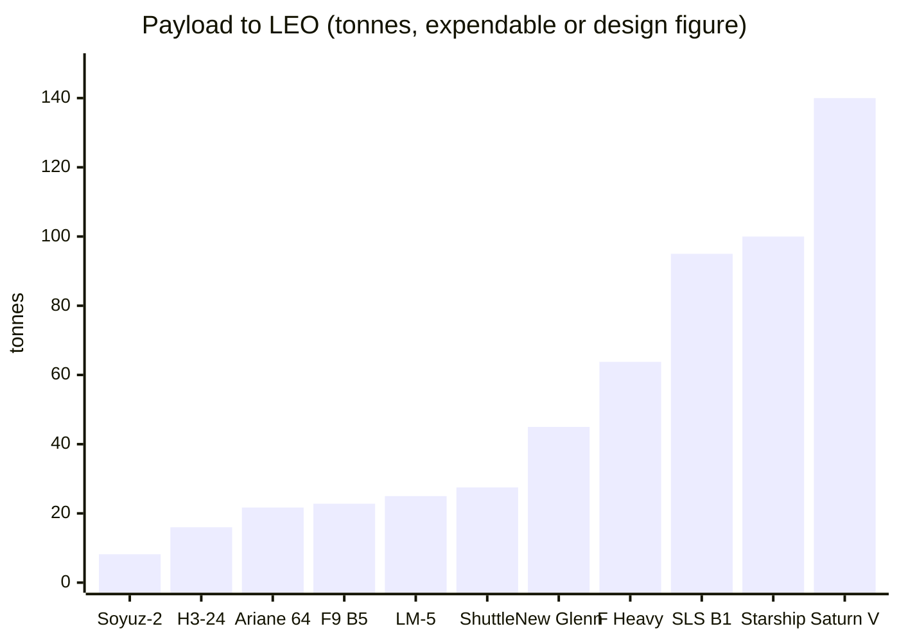
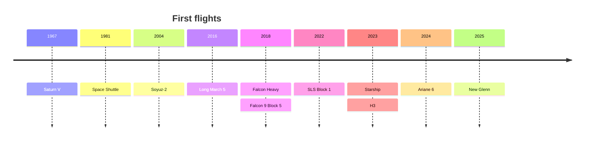

# Launch vehicles compared

> **In one sentence:** eleven rockets from 1967 to today, side by side, so you can see how size, thrust, payload and reusability trade against each other.

All figures are for the configuration named, as published in the sources cited under the table. Payload to low Earth orbit (LEO) depends strongly on the target altitude, inclination and whether boosters are recovered, so treat it as a comparison of *classes*, not a precise ranking.

---

## The table

| Vehicle | Height | Diameter | Liftoff thrust | Payload to LEO | First flight | Reusability |
|---|---|---|---|---|---|---|
| **Saturn V** | 111 m | 10 m | 33,000 kN ¹ | 140,000 kg ² | 9 Nov 1967 | Expendable |
| **Space Shuttle** | 56 m | 8.7 m (external tank) | ≈ 30,000 kN ³ | 27,500 kg | 12 Apr 1981 | Partial: orbiter and boosters reused, tank expended |
| **Falcon 9 Block 5** | 70 m | 3.7 m | ≈ 7,600 kN | 22,800 kg expendable ⁴ | 11 May 2018 | First stage and fairing halves reused |
| **Falcon Heavy** | 70 m | 12.2 m (width) | 22,820 kN | 63,800 kg expendable | 6 Feb 2018 | Side boosters (and optionally core) reused |
| **Space Launch System (SLS) Block 1** | 98 m | 8.4 m (core) | 39,100 kN | 95,000 kg | 16 Nov 2022 | Expendable |
| **Starship (Block 3)** ⁵ | 124.4 m | 9 m | ≈ 80,800 kN (8,240 tf) | ~100,000 kg (design) | 20 Apr 2023 (first integrated flight) | Designed for full reuse; booster catches demonstrated |
| **Ariane 6 (Ariane 64)** | 63 m | 5.4 m | 19,120 kN | 21,650 kg | A62: 9 Jul 2024; A64: 12 Feb 2026 | Expendable |
| **H3 (H3-24)** | 57–63 m | 5.27 m | 4,413 kN from the 3 LE-9 core engines, plus up to 4 SRB-3 boosters | 16,000 kg (to ISS orbit) | 7 Mar 2023 (failed); first success 17 Feb 2024 | Expendable |
| **Long March 5** ⁶ | ≈ 57 m | 5 m (core) | ≈ 10,600 kN | ≈ 25,000 kg | 3 Nov 2016 | Expendable |
| **Soyuz-2 (2.1b)** ⁶ | ≈ 46 m | 2.95 m (core) | ≈ 4,100 kN | ≈ 8,200 kg | 8 Nov 2004 | Expendable |
| **New Glenn (7×2)** | 98 m | 7 m | 19,928 kN (max) | 45,000 kg | 16 Jan 2025 | First stage reusable (first landing Nov 2025) |

**Notes**

1. Saturn V liftoff thrust is quoted between about 33,000 and 35,100 kN depending on source and flight; five F-1 engines at sea level.
2. The 140 t LEO figure includes the S-IVB stage and remaining propellant in parking orbit; the payload useful for translunar injection was about 48 t.
3. Two solid rocket boosters plus three RS-25 main engines at sea level; sources differ slightly on the total.
4. SpaceX quotes about 17.5 t to LEO when the booster is recovered on a drone ship.
5. Starship figures change quickly between blocks; Block 1 was 121.3 m tall with about 7,500 tf of thrust. Check SpaceX's page for the current values.
6. Long March 5 and Soyuz-2 values are widely published figures that were not re-checked against a primary source for this edition; please verify before citing (see *Sources* below).

## What the numbers say

- **Payload fraction is small for everyone.** Divide payload by liftoff mass and every vehicle lands in roughly the 1–5 % range (the Shuttle is lowest because its roughly 80-tonne orbiter is not counted as payload). The rocket equation (see [Rocket propulsion](rocket-propulsion.md)) is universal.
- **Reuse costs payload.** Falcon 9 gives up about a quarter of its expendable payload to land its booster; the economics still win because the booster is the most expensive part.
- **Hydrogen upper stages** (Shuttle, SLS, Ariane 6, H3, Saturn V's upper stages) buy high specific impulse at the cost of huge, light tanks; **methane** (Starship, New Glenn) is the new compromise between hydrogen's performance and kerosene's density.
- **Solid boosters** (Shuttle, SLS, Ariane 6, H3) add enormous liftoff thrust cheaply but cannot be throttled or shut down.

## Sources

| Vehicle | Source |
|---|---|
| Saturn V | [Wikipedia: Saturn V](https://en.wikipedia.org/wiki/Saturn_V); [Saturn V Flight Manual SA-503](https://www.nasa.gov/wp-content/uploads/static/history/afj/ap08fj/pdf/sa503-flightmanual.pdf) |
| Space Shuttle | [Wikipedia: Space Shuttle](https://en.wikipedia.org/wiki/Space_Shuttle); [Space Shuttle News Reference Manual](https://science.ksc.nasa.gov/shuttle/technology/sts-newsref/) |
| Falcon 9 Block 5 | [SpaceX Falcon Payload User's Guide](https://www.spacex.com/assets/media/falcon-users-guide-2025-05-09.pdf) |
| Falcon Heavy | [Wikipedia: Falcon Heavy](https://en.wikipedia.org/wiki/Falcon_Heavy) |
| SLS Block 1 | [Wikipedia: Space Launch System](https://en.wikipedia.org/wiki/Space_Launch_System); [NASA SLS Reference Guide](https://www.nasa.gov/humans-in-space/space-launch-system/reference-guide/) |
| Starship | [Wikipedia: SpaceX Starship](https://en.wikipedia.org/wiki/SpaceX_Starship); [SpaceX Starship page](https://www.spacex.com/vehicles/starship) |
| Ariane 6 | [Wikipedia: Ariane 6](https://en.wikipedia.org/wiki/Ariane_6); [Ariane 6 User's Manual](https://www.ariane.group/app/uploads/sites/4/2024/10/Mua-6_Issue-2_Revision-0_March-2021.pdf) |
| H3 | [Wikipedia: H3 (rocket)](https://en.wikipedia.org/wiki/H3_(rocket)); [JAXA H3 page](https://global.jaxa.jp/projects/rockets/h3/) |
| Long March 5 | Widely published values; verify against a primary source before citing |
| Soyuz-2 | Widely published values; verify against a primary source before citing |
| New Glenn | [Wikipedia: New Glenn](https://en.wikipedia.org/wiki/New_Glenn); [Blue Origin New Glenn page](https://www.blueorigin.com/new-glenn) |

Values were read on 26 September 2026. Rockets evolve; if a number here is out of date, please open an issue with a source.

See also: [Rocket propulsion](rocket-propulsion.md) · [Orbital mechanics](orbital-mechanics.md) · [all references](../REFERENCES.md)
