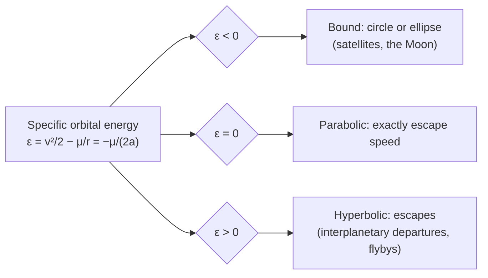
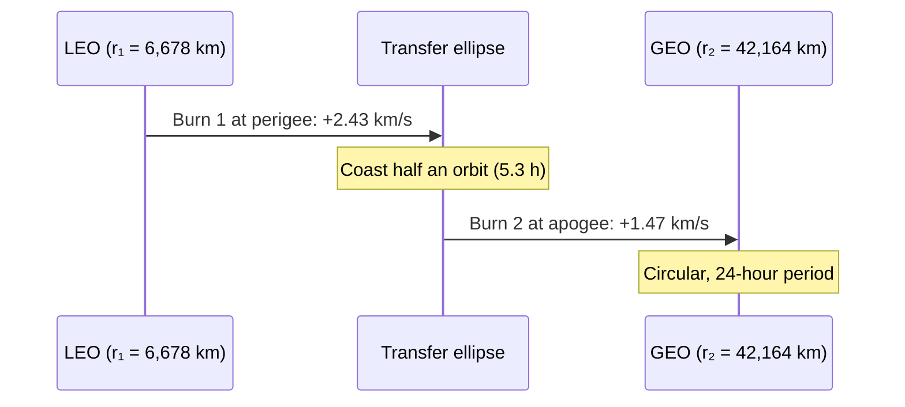

# Orbital mechanics

> **In one sentence:** an orbit is falling around a planet fast enough that the ground curves away beneath you, and nearly every maneuver is a trade between speed now and altitude later.

This primer covers the two-body problem, Kepler's laws, the vis-viva equation, circular and escape speed, Hohmann transfers, plane changes and the Oberth effect, with a worked low Earth orbit (LEO) to geostationary orbit (GEO) example. Units: km, s, km/s.

---

## 1. The two-body problem

For a small spacecraft around a much larger body, Newton's law of gravitation reduces to

$$
\ddot{\mathbf r} = -\frac{\mu}{r^3}\,\mathbf r, \qquad \mu = G M
$$

For Earth, the **standard gravitational parameter** is $\mu_\oplus = 398{,}600.4418\ \text{km}^3/\text{s}^2$ (known far more precisely than $G$ or $M$ separately). Solutions are **conic sections**: circles, ellipses, parabolas and hyperbolas, with the central body at one focus.

## 2. Kepler's three laws

1. Orbits are ellipses with the central body at one focus.
2. A line from the body to the satellite sweeps equal areas in equal times, so satellites move fastest at **periapsis** (closest point) and slowest at **apoapsis** (farthest point).
3. The square of the period is proportional to the cube of the semi-major axis $a$:

$$
T = 2\pi \sqrt{\frac{a^3}{\mu}}
$$

## 3. Describing an orbit: the six classical elements

| Element | Symbol | What it sets |
|---|---|---|
| Semi-major axis | $a$ | size (and so energy and period) |
| Eccentricity | $e$ | shape: 0 circle, 0–1 ellipse, 1 parabola, >1 hyperbola |
| Inclination | $i$ | tilt of the orbit plane relative to the equator |
| Right ascension of the ascending node (RAAN) | $\Omega$ | where the orbit crosses the equator going north |
| Argument of periapsis | $\omega$ | where in the plane the periapsis sits |
| True anomaly | $\nu$ | where the satellite is right now |

The periapsis and apoapsis radii are $r_p = a(1-e)$ and $r_a = a(1+e)$.

## 4. The vis-viva equation

Conservation of energy gives the single most useful equation in astrodynamics:

$$
v^2 = \mu\left(\frac{2}{r} - \frac{1}{a}\right)
$$

Two special cases fall out immediately:

$$
v_{circular} = \sqrt{\frac{\mu}{r}}, \qquad v_{escape} = \sqrt{\frac{2\mu}{r}} = \sqrt{2}\, v_{circular}
$$

At 300 km altitude ($r = 6{,}678$ km), circular speed is **7.73 km/s**, the period is **90.5 minutes** and escape speed is **10.93 km/s**.

## 5. Hohmann transfer

The most propellant-efficient two-impulse transfer between coplanar circular orbits is an ellipse tangent to both: burn prograde at periapsis to raise apoapsis, coast half an orbit, burn prograde again to circularise.

$$
a_t = \frac{r_1 + r_2}{2}, \qquad
\Delta v_1 = \sqrt{\mu\left(\frac{2}{r_1} - \frac{1}{a_t}\right)} - \sqrt{\frac{\mu}{r_1}}, \qquad
\Delta v_2 = \sqrt{\frac{\mu}{r_2}} - \sqrt{\mu\left(\frac{2}{r_2} - \frac{1}{a_t}\right)}
$$

$$
t_{transfer} = \pi\sqrt{\frac{a_t^3}{\mu}}
$$

**Worked example (LEO to GEO, equatorial).**

| Quantity | Value |
|---|---|
| $v$ in 300 km LEO | 7.726 km/s |
| $v$ at transfer perigee | 10.152 km/s → $\Delta v_1 = 2.426$ km/s |
| $v$ at transfer apogee | 1.608 km/s |
| $v$ in GEO | 3.075 km/s → $\Delta v_2 = 1.467$ km/s |
| **Total** | **3.89 km/s**, transfer time 5.28 h |

## 6. Plane changes are expensive

Rotating the velocity vector by an angle $\Delta i$ without changing its magnitude costs

$$
\Delta v_{plane} = 2 v \sin\frac{\Delta i}{2}
$$

A 10° plane change in LEO costs 1.35 km/s, more than a sixth of orbital speed. Two tricks help:

- **Do it where you are slow.** Plane changes are cheapest at apoapsis.
- **Combine it with another burn.** Combining the 28.5° plane change from Cape Canaveral's latitude with the GEO circularisation burn costs $\sqrt{v_a^2 + v_2^2 - 2 v_a v_2 \cos\Delta i} = 1.83$ km/s, only 0.36 km/s more than the in-plane burn. That is why launch sites near the equator (Kourou at 5° N) are prized for GEO missions.

## 7. The Oberth effect

A burn of fixed $\Delta v$ changes specific energy by

$$
\Delta\varepsilon = v\,\Delta v + \tfrac{1}{2}\Delta v^2
$$

so **the same burn adds more energy when you are already moving fast**. Burning deep in a gravity well at periapsis (as interplanetary departures from LEO do) is far more effective than burning after climbing out. The explainer channels in [VIDEOS.md](../VIDEOS.md) return to it often.

## 8. Beyond two bodies

- **Patched conics:** break an interplanetary trajectory into two-body segments inside each body's **sphere of influence**, $r_{SOI} \approx a\,(m/M)^{2/5}$.
- **Lambert's problem:** given two positions and a time of flight, find the connecting orbit. It powers every "porkchop plot" of launch windows.
- **Perturbations:** Earth's oblateness ($J_2$) makes orbit planes precess, which sun-synchronous orbits exploit; drag, solar radiation pressure and third bodies do the rest.

Try all of this interactively in the [Orbit Lab](../../site/orbits.html).

---

## Read next in the Mission Library

| Level | Resource |
|---|---|
| Beginner | JPL [Basics of Space Flight](https://science.nasa.gov/learn/basics-of-space-flight/), chapters on orbits and trajectories |
| Intermediate | Curtis, [*Orbital Mechanics for Engineering Students*](https://shop.elsevier.com/books/orbital-mechanics-for-engineering-students/curtis/978-0-08-102133-0) |
| Intermediate | MIT OpenCourseWare [16.07 Dynamics](https://ocw.mit.edu/courses/16-07-dynamics-fall-2009/) |
| Expert | MIT OpenCourseWare [16.346 Astrodynamics](https://ocw.mit.edu/courses/16-346-astrodynamics-fall-2008/) |
| Tools | [JPL Horizons](https://ssd.jpl.nasa.gov/horizons/), [poliastro](https://github.com/poliastro/poliastro), [GMAT](https://opensource.gsfc.nasa.gov/projects/GMAT/index.php) |

See also: [Rocket propulsion](rocket-propulsion.md) · [Deep space communications](deep-space-communications.md) · [all references](../REFERENCES.md)
