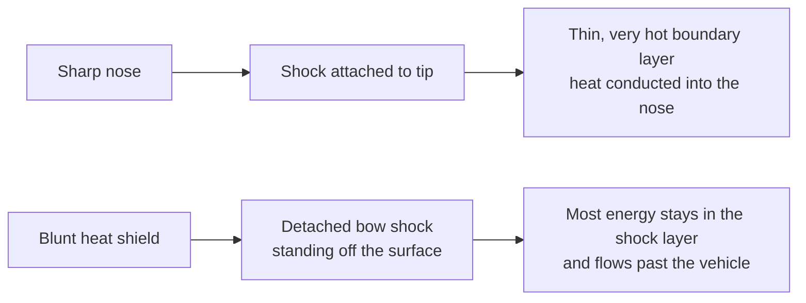
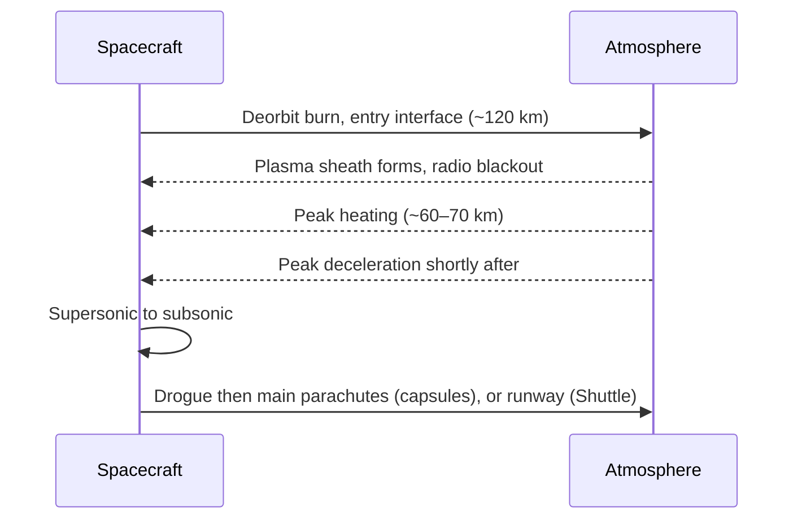

# Reentry and heat shields

> **In one sentence:** coming home means throwing away almost all of your orbital energy as heat in a few minutes, and the art is making sure the air, not the spacecraft, absorbs it.

This primer covers why reentry is hot, why capsules are blunt, how heat flux and deceleration scale, and the two families of heat shield: ablative and reusable.

---

## 1. The energy problem

A spacecraft in low Earth orbit (LEO) moves at about 7.8 km/s. Its kinetic energy per kilogram is

$$
\frac{E}{m} = \frac{v^2}{2} \approx \frac{(7{,}800)^2}{2} \approx 30\ \text{MJ/kg}
$$

roughly seven times the chemical energy in a kilogram of TNT. A capsule returning from the Moon at about 11 km/s carries **about 60 MJ/kg**. Apollo 10 set the crewed speed record, just over 11 km/s, on its return in 1969.

Nearly all of that energy goes into the air through a **bow shock** standing in front of the vehicle. Only a small fraction reaches the vehicle itself, but a small fraction of an enormous number is still enough to melt any metal.

## 2. Why capsules are blunt

In the 1950s H. Julian Allen and Alfred Eggers at NACA Ames showed that a **blunt body** pushes the shock wave away from its surface. The hot shock layer then carries most of the heat around the vehicle instead of into it. Sharp noses, by contrast, keep the shock attached and concentrate heating at the tip.

That is why Mercury, Gemini, Apollo, Soyuz, Dragon, Starliner and Orion all come home **heat-shield first**, flying backwards relative to launch.

## 3. How hot? Stagnation-point heating

A widely used engineering estimate for convective heat flux at the stagnation point is the **Sutton–Graves relation**:

$$
\dot q_s = k \sqrt{\frac{\rho}{r_n}}\; v^3
$$

- $\rho$ is atmospheric density, $r_n$ the nose radius, $v$ the velocity.
- For Earth's atmosphere, $k \approx 1.74 \times 10^{-4}$ in SI units, giving $\dot q_s$ in W/m².

Two lessons are hiding in it: heating rises with the **cube of speed** (lunar returns are brutal) and falls with a **larger nose radius** (another reason to be blunt). At lunar-return speeds, **radiative heating** from the glowing shock layer also becomes significant.

## 4. How hard? Deceleration

For a purely ballistic entry at flight-path angle $\gamma$ into an exponential atmosphere with scale height $H$ (about 7–8 km for Earth), Allen and Eggers derived the peak deceleration:

$$
a_{max} = \frac{v_{entry}^2 \sin\gamma}{2\, e\, H}
$$

Notice that peak deceleration does **not** depend on the vehicle's mass or shape, only on entry speed and angle. A steep entry is short and violent; a shallow entry is long and gentle but risks skipping back out. Capsules reduce the loads further by generating a little **lift** (flying with the centre of mass offset so the capsule trims at an angle), which lets them steer and stretch the deceleration. The **ballistic coefficient**

$$
\beta = \frac{m}{C_D\, A}
$$

sets *where* in the atmosphere the deceleration happens: low-$\beta$ vehicles slow down higher up, in thinner air, with lower heating rates.

## 5. Heat shields: two strategies

### Ablators: sacrifice material

An **ablative** shield chars, pyrolyses and erodes. Gas released inside the material blows into the boundary layer and blocks heat (**blowing**), while the char layer radiates heat away. The shield is consumed but the structure behind it stays cool.

| Material | Flown on |
|---|---|
| Avcoat (epoxy novolac in a fibreglass honeycomb) | Apollo command module; Orion |
| PICA (phenolic-impregnated carbon ablator) and derivatives | Stardust sample return; Dragon (PICA-X) |
| SLA-561V (super-lightweight ablator) | Mars landers including Mars Pathfinder and the Mars Exploration Rovers |

### Reusable thermal protection: survive and radiate

The Space Shuttle used a mosaic of materials matched to local heating:

- **Silica tiles** (such as LI-900), rated to about 1,260 °C, over most of the belly. They are about 90 % empty space and conduct heat so poorly that a tile glowing on one face can be held by its edges.
- **Reinforced carbon-carbon (RCC)** on the nose cap and wing leading edges, the hottest areas, up to about 1,650 °C.
- **Felt and blanket insulation** on cooler upper surfaces.

Columbia was lost in 2003 because foam debris at launch breached an RCC panel on the left wing's leading edge; hot gas entered the wing on reentry. The [Columbia Accident Investigation Board report](https://sma.nasa.gov/SignificantIncidents/assets/columbia-accident-investigation-board-report-volume-1.pdf) is essential reading.

Starship uses thousands of hexagonal ceramic tiles on its windward side, aiming for rapid reuse without refurbishment.

## 6. Communications blackout

The shock layer is hot enough to ionise air into plasma, which reflects and absorbs radio waves. Early capsules lost contact for several minutes. The Shuttle and modern vehicles often maintain contact by relaying *upward* through Tracking and Data Relay Satellites (TDRS), through the thinner plasma wake behind the vehicle.

## 7. Other worlds

- **Mars:** the atmosphere is about 1 % as dense as Earth's, too thin to slow a heavy lander fully but thick enough to heat it. Hence the "seven minutes of terror": heat shield, supersonic parachute, then rockets or a sky crane (see [VIDEOS.md](../VIDEOS.md)).
- **Venus and the giant planets:** very high entry speeds; the Galileo probe's heat shield entering Jupiter was the most demanding ever flown.

---

## Read next in the Mission Library

| Level | Resource |
|---|---|
| Beginner | [Mars 2020 Perseverance Landing Press Kit](https://www.jpl.nasa.gov/news/press_kits/mars_2020/landing/) |
| Intermediate | [Space Shuttle News Reference Manual](https://science.ksc.nasa.gov/shuttle/technology/sts-newsref/) thermal protection chapter |
| Intermediate | [Apollo 11 Mission Report](https://www.nasa.gov/wp-content/uploads/static/apollo50th/pdf/A11_MissionReport.pdf) entry section |
| Expert | [Columbia Accident Investigation Board (CAIB) Report](https://sma.nasa.gov/SignificantIncidents/assets/columbia-accident-investigation-board-report-volume-1.pdf) |
| Expert | [NASA Technical Reports Server (NTRS)](https://ntrs.nasa.gov/): search "Allen Eggers blunt body" for the original 1958 report |

See also: [Spacecraft subsystems](spacecraft-subsystems.md) · [Orbital mechanics](orbital-mechanics.md) · [all references](../REFERENCES.md)
