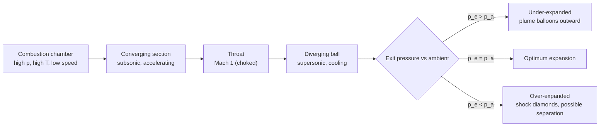
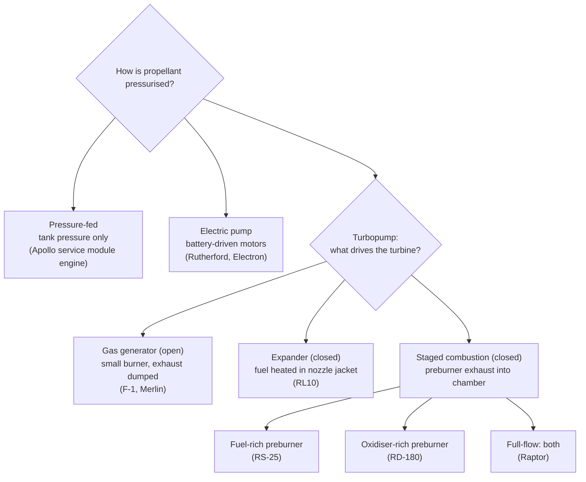

# Rocket propulsion

> **In one sentence:** a rocket throws mass backwards as fast as it can, and everything else (engine cycles, nozzles, staging) is about throwing more of it, faster, with less hardware left over.

This primer covers the thrust equation, specific impulse, the rocket equation, nozzle expansion, engine cycles and staging. Symbols are defined where they first appear; units are SI.

---

## 1. Thrust

Newton's third law applied to a control volume around an engine gives the **thrust equation**:

$$
F = \dot m\, v_e + (p_e - p_a)\,A_e
$$

| Symbol | Meaning |
|---|---|
| $\dot m$ | propellant mass flow rate (kg/s) |
| $v_e$ | exhaust velocity at the nozzle exit plane (m/s) |
| $p_e$, $p_a$ | exhaust pressure at the exit, ambient pressure (Pa) |
| $A_e$ | nozzle exit area (m²) |

The first term is **momentum thrust**; the second is **pressure thrust**. It is convenient to fold both into one **effective exhaust velocity** $c$:

$$
F = \dot m\, c, \qquad c = v_e + \frac{(p_e - p_a) A_e}{\dot m}
$$

Because $p_a$ falls as the rocket climbs, the same engine produces more thrust in vacuum than at sea level.

## 2. Specific impulse

**Specific impulse** ($I_{sp}$) is thrust per unit *weight* flow of propellant, measured in seconds. It is the single most useful figure of merit for an engine:

$$
I_{sp} = \frac{F}{\dot m\, g_0} = \frac{c}{g_0}, \qquad g_0 = 9.80665\ \text{m/s}^2
$$

Higher $I_{sp}$ means each kilogram of propellant delivers more momentum. Typical *vacuum* values:

| Propellant family | Typical vacuum $I_{sp}$ | Examples |
|---|---|---|
| Solid (ammonium perchlorate composite) | ~260–290 s | Space Shuttle boosters, Ariane 6 P120C |
| Storable hypergolic (nitrogen tetroxide, NTO / monomethylhydrazine, MMH) | ~310–330 s | Apollo service module engine, Draco thrusters |
| Kerosene (Rocket Propellant-1, RP-1) / liquid oxygen (LOX) | ~330–350 s | Rocketdyne F-1, Merlin, RD-180 |
| Methane / LOX | ~360–380 s | Raptor, BE-4 |
| Liquid hydrogen (LH2) / LOX | ~440–465 s | RS-25, RL10, Vulcain, J-2 |
| Electric (Hall effect, gridded ion) | ~1,500–4,000 s | Starlink, Dawn, BepiColombo |

Electric thrusters have enormous $I_{sp}$ but tiny thrust (millinewtons to newtons), so they are used for long, gentle burns in space, never for launch.

## 3. The rocket equation

Integrating $F = \dot m c$ for a rocket with no external forces gives Konstantin Tsiolkovsky's **ideal rocket equation**:

$$
\Delta v = c \ln\!\left(\frac{m_0}{m_f}\right) = I_{sp}\, g_0 \ln\!\left(\frac{m_0}{m_f}\right)
$$

where $m_0$ is the initial (wet) mass and $m_f$ the final (dry) mass. The ratio $m_0/m_f$ is the **mass ratio**.

**Worked example.** An engine with $c = 3{,}000$ m/s on a vehicle with a mass ratio of 10 (90 % of liftoff mass is propellant) gives

$$
\Delta v = 3000 \ln 10 \approx 6{,}910\ \text{m/s}.
$$

Reaching low Earth orbit (LEO) needs roughly 7.8 km/s of orbital speed plus about 1.5–2 km/s lost to gravity and drag, so **about 9.3–10 km/s in total**. A single stage with ordinary propellants cannot carry useful payload there, which is why almost every orbital rocket stages.

The logarithm is the tyranny of the rocket equation: doubling $\Delta v$ requires *squaring* the mass ratio.

## 4. Nozzles: turning heat into velocity

A converging-diverging (de Laval) nozzle accelerates hot gas to sonic speed at the throat and supersonic speed beyond it. For an ideal gas expanding isentropically from chamber pressure $p_c$ and temperature $T_c$:

$$
v_e = \sqrt{\frac{2\gamma}{\gamma - 1}\,\frac{R_u T_c}{\mathcal{M}}\left[1 - \left(\frac{p_e}{p_c}\right)^{(\gamma-1)/\gamma}\right]}
$$

- $\gamma$ is the ratio of specific heats, $R_u = 8.314$ J/(mol·K) the universal gas constant, and $\mathcal{M}$ the exhaust's mean molar mass.
- **Hot, light exhaust is fast exhaust**: $v_e \propto \sqrt{T_c/\mathcal{M}}$. That is why hydrogen (water vapour and excess H₂, low $\mathcal{M}$) beats kerosene (CO₂ and CO, high $\mathcal{M}$).
- A larger **expansion ratio** $\varepsilon = A_e / A_t$ lowers $p_e$ and raises $v_e$, but only up to a point: at sea level an over-expanded nozzle ($p_e < p_a$) loses thrust and can suffer flow separation. That is why vacuum engines (Merlin Vacuum, RL10, Raptor Vacuum) have much larger bells than their sea-level siblings.

Engineers often split performance into two factors: the **characteristic velocity** $c^*$ (how good the combustion is) and the **thrust coefficient** $C_F$ (how good the nozzle is), with $F = C_F\, p_c A_t$ and $c = C_F\, c^*$.

## 5. Engine cycles: how propellant gets into the chamber

Liquid engines must push propellant into a chamber at pressures of tens to hundreds of bar. The **cycle** is how the pumps are powered.

- **Open cycles** (gas generator) throw away a few percent of propellant through the turbine exhaust: simpler, slightly lower $I_{sp}$.
- **Closed cycles** (staged combustion, expander) send everything through the main chamber: higher $I_{sp}$ and chamber pressure, harder turbomachinery.
- Everyday Astronaut's *Rocket engine cycles* video (see [VIDEOS.md](../VIDEOS.md)) animates each one beautifully.

## 6. Staging

With $n$ stages, the total ideal velocity change is the sum of each stage's rocket equation:

$$
\Delta v_{total} = \sum_{i=1}^{n} c_i \ln\!\left(\frac{m_{0,i}}{m_{f,i}}\right)
$$

where each stage's "initial mass" includes every stage above it and the payload. Discarding empty tanks and engines means the upper stages never have to accelerate dead weight. Two useful ratios:

$$
\text{structural coefficient } \epsilon = \frac{m_{structure}}{m_{structure} + m_{propellant}}, \qquad
\text{payload ratio } \lambda = \frac{m_{payload}}{m_{0}}
$$

Typical orbital rockets deliver only 2–4 % of liftoff mass to LEO. Reusable boosters trade some of that for recovery propellant, landing legs and grid fins.

## 7. Thrust-to-weight and gravity loss

A rocket must lift itself off the pad, so its liftoff **thrust-to-weight ratio** $F / (m_0 g_0)$ must exceed 1 (typically 1.2–1.5). Every second spent climbing vertically costs $g$ metres per second of $\Delta v$ (**gravity loss**):

$$
\Delta v_{gravity} = \int_0^{t_b} g \sin\gamma \, dt
$$

where $\gamma$ is the flight-path angle above the horizon. The gravity turn, pitching over early so thrust increasingly adds horizontal speed, is how trajectories minimise this loss. The [Launch simulator](../../site/launch.html) lets you feel the trade.

---

## Read next in the Mission Library

| Level | Resource |
|---|---|
| Beginner | NASA Glenn [Beginner's Guide to Rockets](https://www.grc.nasa.gov/www/k-12/rocket/) |
| Intermediate | MIT OpenCourseWare [16.50 Introduction to Propulsion Systems](https://ocw.mit.edu/courses/16-50-introduction-to-propulsion-systems-spring-2012/) |
| Intermediate | Sutton & Biblarz, [*Rocket Propulsion Elements*](https://www.wiley.com/en-us/Rocket+Propulsion+Elements,+9th+Edition-p-9781118753651) |
| Expert | NASA Glenn [Chemical Equilibrium with Applications (CEA)](https://www.nasa.gov/glenn/research/chemical-equilibrium-with-applications) to compute $I_{sp}$ for any propellant pair |
| Expert | [Saturn V Flight Manual SA-503](https://www.nasa.gov/wp-content/uploads/static/history/afj/ap08fj/pdf/sa503-flightmanual.pdf) for the F-1 and J-2 in their operational context |

See also: [Orbital mechanics](orbital-mechanics.md) · [Launch vehicles compared](launch-vehicles-compared.md) · [all references](../REFERENCES.md)
