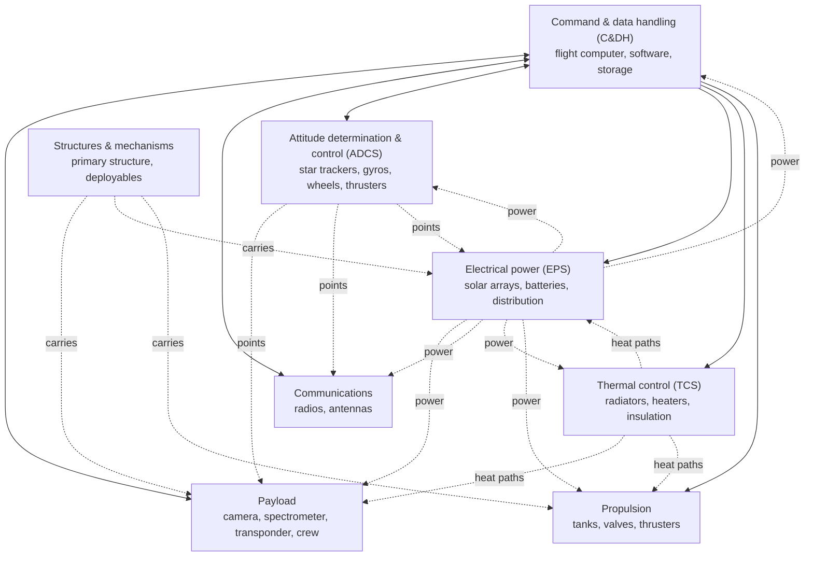

# Spacecraft subsystems

> **In one sentence:** a spacecraft is a payload (the reason for the mission) carried by a *bus* of seven cooperating subsystems that keep it powered, at the right temperature, pointed, talking, thinking, in one piece and on course.

Each section below gives the job, the key equation or rule, and a typical design trade. The systems view (how they interact) comes first because no subsystem can be designed alone.

---

## The bus at a glance

A few coupling examples that make this a *systems* problem:

- Pointing solar arrays at the Sun (power) may point the radiator at the Sun too (thermal).
- A bigger high-gain antenna (communications) needs finer pointing (attitude control) and adds mass and inertia (structures, propulsion).
- Every watt the electronics consume becomes a watt of heat the thermal system must reject.

## 1. Electrical power subsystem (EPS)

**Job:** generate, store, condition and distribute electrical power.

Solar array output at distance $d$ (in astronomical units, AU) from the Sun:

$$
P = \eta\, S_0\, A\, \cos\theta \,\frac{1}{d^2}, \qquad S_0 \approx 1361\ \text{W/m}^2
$$

where $\eta$ is cell efficiency (about 28–32 % for modern triple-junction cells), $A$ the array area and $\theta$ the angle between the Sun and the array normal. Arrays also degrade with radiation, typically a few percent per year.

Batteries (usually lithium-ion today) carry the load through eclipse. In LEO a spacecraft sees about 15 eclipses per day, so batteries are sized with a limited **depth of discharge** (DoD) to survive tens of thousands of cycles:

$$
C_{battery} = \frac{P_{eclipse}\, t_{eclipse}}{\text{DoD}\cdot \eta_{discharge}}
$$

Beyond Jupiter sunlight is too weak for practical arrays on most missions, which is why Voyager, Cassini, Curiosity and Perseverance use **radioisotope thermoelectric generators** (RTGs). Juno is a famous exception with very large arrays.

## 2. Thermal control subsystem (TCS)

**Job:** keep every component inside its allowable temperature range, hot and cold cases.

In space, heat leaves only by radiation. A surface in equilibrium balances absorbed and emitted power:

$$
\alpha\, S_0\, A_{projected} + Q_{internal} = \varepsilon\, \sigma\, A_{radiating}\, T^4
$$

with absorptivity $\alpha$, emissivity $\varepsilon$ and the Stefan–Boltzmann constant $\sigma = 5.670 \times 10^{-8}$ W/(m²·K⁴). For an isothermal sphere at 1 AU with $\alpha = \varepsilon$ and no internal power, $T = (S_0/4\sigma)^{1/4} \approx 278$ K (5 °C), comfortably near room temperature, which is why Earth-orbit thermal design is feasible at all.

Tools of the trade, from passive to active:

| Passive | Active |
|---|---|
| Multi-layer insulation (MLI) blankets | Electric heaters with thermostats |
| Surface coatings (white paint, optical solar reflectors) with chosen $\alpha/\varepsilon$ | Pumped fluid loops (International Space Station, Mars rovers) |
| Heat pipes and conductive paths | Louvres, cryocoolers |

## 3. Attitude determination and control subsystem (ADCS)

**Job:** know which way the spacecraft points (determination) and make it point where it should (control).

| Sensors | Actuators |
|---|---|
| Star trackers (arcsecond accuracy) | Reaction wheels and control moment gyroscopes |
| Gyroscopes (inertial measurement units) | Thrusters |
| Sun sensors, Earth horizon sensors | Magnetorquers (LEO only) |
| Magnetometers | Gravity-gradient booms, spin |

Environmental torques build up momentum in the wheels, which must be "dumped" periodically with thrusters or magnetorquers. The gravity-gradient torque, for example, is

$$
T_{gg} = \frac{3\mu}{2R^3}\,\lvert I_z - I_y \rvert \sin 2\theta
$$

for a spacecraft at orbital radius $R$ with principal moments of inertia $I_y$, $I_z$ and an angle $\theta$ from local vertical. Spin about the *intermediate* axis is unstable (see Veritasium's rotating-bodies video in [VIDEOS.md](../VIDEOS.md)). Explorer 1 taught the corollary in 1958: once energy dissipates (it had flexible whip antennas), only spin about the axis of *maximum* inertia is stable, and its spin about the minimum axis decayed into a tumble.

## 4. Communications

**Job:** receive commands (uplink), return telemetry and science data (downlink), and support navigation through ranging and Doppler.

The key tool is the **link budget**, covered in depth in [Deep space communications](deep-space-communications.md). The headline trade: higher frequency (X band to Ka band) and bigger antennas give more data rate but demand tighter pointing and suffer more from rain on the ground.

## 5. Command and data handling (C&DH)

**Job:** the brain. Execute stored and real-time commands, run control loops, format telemetry, store data and protect the spacecraft.

- **Radiation:** high-energy particles cause single-event upsets (bit flips) and latch-ups. Designs use radiation-hardened processors, error-correcting memory and watchdog timers.
- **Fault detection, isolation and recovery (FDIR):** when something goes wrong far from Earth, the spacecraft must put itself in a safe, power-positive, Sun-pointed **safe mode** and wait for help.
- **Flight software frameworks:** NASA's [core Flight System (cFS)](https://github.com/nasa/cfs) and JPL's [F Prime](https://fprime.jpl.nasa.gov/) are open source.

## 6. Structures and mechanisms

**Job:** survive launch, then hold everything in alignment for years.

The launch is usually the worst load case: quasi-static accelerations of several $g$, random vibration, acoustic noise and pyrotechnic shock. Launch vehicle user guides specify these environments and a minimum **fundamental frequency** so the spacecraft does not resonate with the rocket. Stress margins are expressed as

$$
MS = \frac{\text{allowable stress}}{FS \times \text{applied stress}} - 1 \;\ge\; 0
$$

where $FS$ is a factor of safety (commonly 1.25 on yield and 1.4 on ultimate for flight hardware verified by test). Mechanisms (hinges, deployers, release devices) are a classic single-point-failure risk and are tested exhaustively.

## 7. Propulsion

**Job:** change the orbit (insertion, station-keeping, avoidance, deorbit) and sometimes attitude.

| Type | Typical $I_{sp}$ | Use |
|---|---|---|
| Cold gas (nitrogen) | ~60–70 s | fine attitude control, CubeSats |
| Monopropellant hydrazine | ~220–235 s | station-keeping, attitude |
| Bipropellant (NTO/MMH) | ~300–325 s | orbit insertion, large maneuvers |
| Electric (Hall, ion) | ~1,500–4,000 s | orbit raising, deep-space cruise |

The **Δv budget** lists every maneuver over the mission and, via the rocket equation (see [Rocket propulsion](rocket-propulsion.md)), sets the propellant mass.

---

## Budgets tie it all together

Systems engineers track *budgets* with margins that shrink as design matures: mass, power, Δv, pointing error, data volume, link margin and cost. A typical early-design rule is to carry 20–30 % mass margin at concept stage, falling toward a few percent near launch. The [NASA Systems Engineering Handbook](https://www.nasa.gov/reference/systems-engineering-handbook) describes how margins and technical performance measures are managed through the life cycle.

## Read next in the Mission Library

| Level | Resource |
|---|---|
| Beginner | [CubeSat 101](https://www.nasa.gov/wp-content/uploads/2017/03/nasa_csli_cubesat_101_508.pdf) |
| Intermediate | [State-of-the-Art of Small Spacecraft Technology](https://www.nasa.gov/smallsat-institute/sst-soa) |
| Intermediate | JPL [Basics of Space Flight](https://science.nasa.gov/learn/basics-of-space-flight/), spacecraft chapters |
| Expert | MIT OpenCourseWare [16.851 Satellite Engineering](https://ocw.mit.edu/courses/16-851-satellite-engineering-fall-2003/) |
| Expert | [*Space Mission Engineering: The New SMAD*](https://search.worldcat.org/title/Space-mission-engineering-:-the-new-SMAD/oclc/747731146) |

See also: [Deep space communications](deep-space-communications.md) · [Reentry and heat shields](reentry-and-heat-shields.md) · [all references](../REFERENCES.md)
