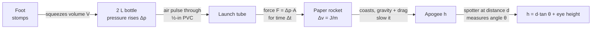

# 00 · Stomp rocket

**Level 0 · the pad** — a paper rocket launched by a puff of air from a 2-litre bottle you stomp on.
The fastest way to feel what *impulse* means, and your first measurement of a rocket's apogee.

| Cost | Time | Difficulty | Ages |
|---|---|---|---|
| **$3–8** (≈ free with a recycled bottle) | **1 hour** | ●○○○○ | 6+ with an adult |

> [!WARNING]
> Eye protection for everyone. Launch outdoors, aimed straight up or away from people. Nobody stands in
> front of the launch tube, and nobody picks up a rocket from the tube while someone else is near the
> bottle. See [../SAFETY.md](../SAFETY.md).

## What you'll learn

- **Impulse** — force × time — is what sets a rocket's speed: $\Delta v = J/m$.
- How a pressure difference becomes a force: $F = \Delta p \cdot A$.
- Why a rocket needs its **centre of gravity (CG) ahead of its centre of pressure (CP)** to fly
  straight (preview of Level 2).
- How to measure a height you cannot reach, with an angle and trigonometry.
- How to run a fair experiment: change one thing at a time, repeat, average.

## Bill of Materials

| Qty | Item | Notes | Approx. cost (USD) |
|---|---|---|---|
| 1 | 2-litre carbonated-drink bottle, empty, cap removed | the "air pump" | $0 (recycled) |
| 1.2 m | ½-inch Schedule 40 PVC pipe | outer diameter 21.3 mm (0.840 in) | $2–3 |
| 1 | ½-inch PVC 90° elbow (or 45° for angled shots) | push-fit, no glue needed | $0.50 |
| 1 roll | duct tape | seals bottle ↔ pipe | $0 – 4 |
| 2 sheets | printer paper (US Letter / A4) | rocket body | $0 |
| 1 sheet | card stock or cereal-box card | fins and nose | $0 |
| 1 | printed [`fin-template.svg`](fin-template.svg) | print at **100 %** (check the 50 mm bar) | $0 |
| — | clear tape, scissors, glue stick, ruler, pencil | | $0 |
| 1 | cotton ball or small lump of modelling clay | nose weight | $0 |
| — | phone with an inclinometer / clinometer app, tape measure | measuring height | $0 |
| — | safety glasses (one per person) | ANSI Z87.1 / EN 166 | $0 – 3 each |

## Build it

### The launcher

1. **Cut the pipe** into one **80 cm** piece (the hose) and one **35 cm** piece (the launch tube). A
   PVC cutter or hacksaw works; sand the ends so they don't tear paper.
2. **Push the 80 cm piece into the bottle's mouth** (≈ 3 cm deep). A 2 L bottle's mouth is very close to
   ½-inch PVC; wrap 2–3 turns of duct tape around the pipe first if it is loose, then tape the joint
   airtight on the outside.
3. **Fit the elbow** on the other end and push the **35 cm launch tube** into it, pointing up.
4. Tape the elbow and launch tube to a brick, a paving stone or a bucket of sand so it stays upright
   (vertical, or angled away from people). The bottle lies on the ground at the far end.
5. **Test**: stomp on the bottle and feel the puff at the top of the launch tube. Re-inflate the bottle
   by blowing into the launch tube (or pull the bottle back into shape).

### The rocket

6. **Roll the body**: roll half a sheet of paper (long side along the pipe) snugly — not tight — around
   the launch tube, tape the seam along its full length, and slide it off. It must slide on and off
   freely.
7. **Seal the top**: fold the top 2 cm flat, fold it over once more, and tape it airtight. A leak here
   halves your height.
8. **Cut out the parts** from [`fin-template.svg`](fin-template.svg): three fins (plus a spare), the
   fin wrap guide and the nose-cone sector.
9. **Mark fin positions**: wrap the guide around the open (bottom) end of the tube, tape it, and mark
   the tube at the three red lines. Remove the guide.
10. **Attach fins**: fold each glue tab 90°, glue/tape it on a mark with the fin's trailing edge level
    with the bottom of the tube. Sight down the tube — fins should be straight, not twisted.
11. **Nose**: curl the sector into a cone, glue the tab, push a cotton ball into the tip, and tape the
    cone over the sealed top.
12. **Name it and weigh it** (kitchen scale, to the gram) — record it in the data sheet.

### Launch

13. Everyone puts on safety glasses and stands **behind** the bottle, at least 3 m from the launch tube.
14. Slide the rocket all the way down the launch tube. Count down **5-4-3-2-1**, then stomp hard with one
    foot, flat on the bottle.
15. The spotter stands a known distance $d$ (e.g. 20 m) from the launcher and measures the angle $\theta$
    to the highest point with the inclinometer app.

## Diagram

The printable parts: [`fin-template.svg`](fin-template.svg) (US Letter, also fits A4).

## The science

**Pressure makes force.** Air inside the tube is pushed up by the pressure difference $\Delta p$ between
the bottle and the outside air, acting on the tube's inner cross-section $A$:

$$
F = \Delta p \, A, \qquad A = \pi r^2 = \pi \,(0.0110\ \text{m})^2 \approx 3.8\times10^{-4}\ \text{m}^2
$$

**Impulse makes speed.** A stomp lasts a few hundredths of a second. The total push is the
**impulse** $J$, and Newton's second law says it changes the rocket's momentum:

$$
J = \int F\,dt \approx \bar F\,\Delta t, \qquad \Delta v = \frac{J}{m}
$$

*Worked example.* A good stomp gives an average $\Delta p \approx 15\ \text{kPa}$ for
$\Delta t \approx 0.04\ \text{s}$:
$J = 15\,000 \times 3.8\times10^{-4} \times 0.04 \approx 0.23\ \text{N·s}$. For a 10 g rocket,
$\Delta v \approx 23\ \text{m/s}$.

**Energy sets the ideal height.** Without air resistance, all the kinetic energy becomes height:

$$
\tfrac12 m v^2 = m g h \quad\Rightarrow\quad h_\text{ideal} = \frac{v^2}{2g} = \frac{23^2}{2 \times 9.81} \approx 27\ \text{m}
$$

**Drag steals some of it.** Air resistance grows with the square of speed,
$F_D = \tfrac12 \rho v^2 C_D A_\text{front}$, so real flights reach roughly 50–80 % of $h_\text{ideal}$.
Light rockets suffer most: drag is the same for a heavy and a light rocket of the same shape, but the
light one has less momentum to fight it — that is why a *little* nose weight often flies higher.

**Stability.** Fins move the **centre of pressure** (where the air's sideways push acts) toward the tail.
If the **centre of gravity** is ahead of it, any wobble makes the air push the tail back into line, like a
weathervane. No fins, or a heavy tail, and the rocket tumbles. You will calculate this properly in
[20-first-model-rocket](../20-first-model-rocket/).

**Measuring height.** From distance $d$, the angle $\theta$ to the top of the flight gives

$$
h = d \tan\theta + h_\text{eye}
$$

(20 m away and 45° means $h = 20 + 1.5 = 21.5$ m). It assumes the rocket went straight up; two spotters
on different sides, averaged, cancel most of the wind drift.

## Record & analyse your data

Use [`data-sheet.csv`](data-sheet.csv) (opens in any spreadsheet). One row per launch.

| Column | How to fill it |
|---|---|
| `rocket_mass_g` | kitchen scale |
| `distance_to_observer_m`, `sight_angle_deg`, `observer_eye_height_m` | spotter's tape measure and inclinometer |
| `max_height_m` | spreadsheet formula `=H2*TAN(RADIANS(I2))+J2` |
| `flight_time_s` | stopwatch, launch to landing |

Analysis ideas (spreadsheet or Python):

1. Launch the same rocket **five times** — the spread (standard deviation, `=STDEV(K2:K6)`) is your
   measurement uncertainty. Differences between designs smaller than this are not real.
2. Plot height vs. rocket mass (add 1 g of clay at a time). You should find a best mass: too light
   and drag wins, too heavy and the impulse can't accelerate it.
3. Check energy: from `flight_time_s`, a drag-free flight obeys $h = g t^2 / 8$. How much lower is your
   measured height?

## Troubleshooting

| Problem | Likely cause | Fix |
|---|---|---|
| Rocket barely lifts | air leaks at the nose or bottle joint | re-tape the folded top; tape the bottle ↔ pipe joint all round |
| Rocket sticks on the tube | body rolled too tight or tape inside the seam | re-roll around the pipe with a sheet of paper as a spacer |
| Tumbles or spirals | fins twisted, tail-heavy, or a fin came loose | re-glue fins straight; add clay/cotton in the nose |
| Bottle won't re-inflate | the crushed plastic creased | blow into the launch tube; replace the bottle when creased |
| Height readings jump around | spotter too close (angle near 90°) | stand farther away (angles of 30–60° are most accurate) |

## Going further

- Compare **3 vs 4 fins**, and big vs small fins (the template has a spare to modify).
- Try a **45° elbow** and measure range instead of height; find the angle for maximum range and compare
  with the no-drag prediction of 45°.
- Replace your foot with a **dropped weight** (a bag of rice from a fixed height) for repeatable
  launches — now it's a real experiment.
- Next rung: [10-water-bottle-rocket](../10-water-bottle-rocket/) keeps the bottle but stores far more
  energy.

## References

- NASA Glenn Research Center, *Beginner's Guide to Rockets* — <https://www.grc.nasa.gov/www/k-12/rocket/>
- NASA, *Rockets Educator Guide* (includes paper and pneumatic rockets) —
  <https://www.nasa.gov/stem-content/rockets-educator-guide/>
- Physics Classroom, *Momentum and Its Conservation* — <https://www.physicsclassroom.com/class/momentum>
