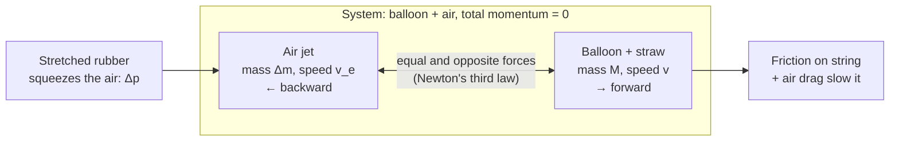

# 01 · Balloon rocket — Newton's third law on a string

**Level 0 · the pad** — a balloon taped to a drinking straw races along a string. It is the cleanest
demonstration there is that a rocket pushes on its own exhaust, not on the air or the ground.

| Cost | Time | Difficulty | Ages |
|---|---|---|---|
| **$2–5** | **1 hour** | ●○○○○ | 5+ |

> [!NOTE]
> Safe indoors. Keep the track at chest height or lower so the straw can't hit anyone's eyes; people
> with latex allergies should use latex-free balloons.

## What you'll learn

- **Newton's third law**: the balloon pushes air backward, the air pushes the balloon forward, equally.
- **Conservation of momentum**: total momentum of balloon + exhaust stays zero.
- Thrust from a pressure difference: $F \approx 2\,\Delta p\,A_\text{nozzle}$.
- How to measure speed from a phone video, and how to **plot speed against balloon volume** to test a
  hypothesis.

## Bill of Materials

| Qty | Item | Notes | Approx. cost (USD) |
|---|---|---|---|
| 5 m | smooth string or fishing line | the smoother, the less friction | $1 |
| 2 | drinking straws (paper or plastic), 5 cm pieces | slide on the string | $0 |
| 5+ | round party balloons, same brand/size (≈ 30 cm / 12 in) | a long "modelling" balloon also works | $1–3 |
| 1 | hand balloon pump (optional) | lets you set the volume by counting strokes | $2 |
| — | masking tape, tape measure, marker, phone with slow-motion video | | $0 |
| 1 | soft measuring tape or a strip of paper + ruler | balloon circumference | $0 |

## Build it

1. **String the track**: tie one end of the string to a chair back or door handle, thread two 5 cm
   straw pieces onto it, and tie the other end 4–5 m away. Pull it taut and level.
2. **Mark distances**: put tape flags on the string (or on the floor under it) every 0.5 m from the
   start line.
3. **Inflate a balloon** and pinch (don't tie) the neck. Measure its circumference around the fattest
   part with the soft tape. *Better*: inflate with a hand pump and count strokes — the same number of
   strokes gives the same volume every time.
4. **Tape the balloon** under the two straws with two strips of masking tape, neck pointing back
   along the string, balloon axis parallel to the string.
5. **Film it**: prop the phone 2 m to the side of the track, in slow-motion (120 or 240 frames per
   second), with the tape flags in view.
6. Slide the balloon back to the start line, let go of the neck, and record.
7. Repeat **three times per volume**, then change the volume (e.g. 10, 15, 20, 25, 30 pump strokes).

## Diagram

## The science

**Third law.** The stretched rubber squeezes the air inside to a pressure $\Delta p$ above the room
(typically 2–5 kPa for a party balloon). Air rushes out of the neck; to accelerate that air backward the
balloon must push on it, so the air pushes the balloon forward with an equal force.

**How big is the thrust?** Bernoulli's equation gives the exhaust speed of an incompressible jet, and
thrust is mass flow × exhaust speed:

$$
v_e = \sqrt{\frac{2\,\Delta p}{\rho_\text{air}}}, \qquad
\dot m = \rho_\text{air} A v_e, \qquad
F = \dot m\, v_e = 2\,\Delta p\, A
$$

*Worked example*: $\Delta p = 3\ \text{kPa}$, neck diameter 8 mm ($A = 5.0\times10^{-5}\ \text{m}^2$):
$v_e = \sqrt{2 \cdot 3000 / 1.2} \approx 71\ \text{m/s}$ and $F = 2 \cdot 3000 \cdot 5.0\times10^{-5} = 0.30\ \text{N}$ —
about the weight of 30 g.

**Momentum conservation.** With no friction, the momentum the balloon gains equals the momentum carried
away by the air:

$$
M v = m_\text{air}\, v_e \quad\Rightarrow\quad v \approx \frac{\rho_\text{air} V\, v_e}{M}
$$

so the ideal final speed grows **linearly** with the volume $V$ of air stored. A 5-litre balloon holds
$1.2\ \text{kg/m}^3 \times 0.005\ \text{m}^3 = 6\ \text{g}$ of air, so a 5 g balloon rig could in principle reach
$6 \times 71 / 5 \approx 85\ \text{m/s}$! Real balloons reach a few m/s because friction on the string and air
drag ($F_D = \tfrac12 \rho v^2 C_D A$ on a big, blunt balloon) eat most of it. Your graph will show how
far reality sits below the ideal line.

**Volume from circumference.** Treating the balloon as a sphere of circumference $C$:

$$
r = \frac{C}{2\pi}, \qquad V = \frac43 \pi r^3 = \frac{C^3}{6\pi^2}
$$

(a 70 cm circumference gives $V = 0.70^3/(6\pi^2) = 5.8\ \text{L}$). Balloons are pear-shaped, so this is an
estimate; counting pump strokes is more repeatable.

**The strange balloon pressure curve.** A rubber balloon's pressure is highest when it is small, drops
as it inflates, then rises again near bursting (the reason the first breath is the hardest). So thrust is
not constant: it *increases* toward the end of the run as the balloon shrinks.

## Record & analyse your data

Fill in [`data-sheet.csv`](data-sheet.csv):

| Column | How |
|---|---|
| `circumference_cm` | soft tape around the fattest part (or `pump_strokes` in `notes`) |
| `volume_estimate_L` | `=(C/100)^3/(6*PI()^2)*1000` with C in cm |
| `time_s` | from the video: frames between leaving the start and passing the last flag, ÷ frame rate |
| `average_speed_mps` | `=track_length_m / time_s` |

Then:

1. **Plot average speed (y) against volume (x)**. Does it rise in a straight line (the momentum
   prediction), curve over (drag growing as $v^2$), or level off?
2. Put three repeats as error bars (min–max). Are two volumes really different?
3. From the frame count over the first metre, estimate the **acceleration** $a = 2d/t^2$ and so the
   average thrust $F = (M + m_\text{air})\,a$. Compare with $2\,\Delta p\,A$.

## Troubleshooting

| Problem | Likely cause | Fix |
|---|---|---|
| Balloon twists around the string | tape not in line, neck pointing sideways | use two straws spaced 10 cm apart, tape the balloon's axis parallel |
| Stops halfway | string sags, friction | pull the string tighter; use fishing line; lubricate the straw with a little talc |
| Results scatter wildly | different volumes each time | use a pump and count strokes |
| Can't read time from video | frame rate too low | use slow-motion; use a ruler taped to the wall as a scale |

## Going further

- **Two-stage rocket**: tape two balloons in series, the rear one's neck clipped by a clothes-peg
  pinched by the front balloon — the classic NASA staging activity.
- Add a **nozzle**: a 2 cm piece of straw in the balloon's neck. Does the narrower exit change speed?
- Tilt the string at 30° and measure the balloon's climb: now you are fighting gravity like a real
  launch vehicle.
- Next: [02-film-canister-rocket](../02-film-canister-rocket/) swaps rubber pressure for chemistry.

## References

- NASA Glenn Research Center, *Newton's Third Law of Motion* — <https://www.grc.nasa.gov/www/k-12/rocket/newton3r.html>
- NASA Glenn Research Center, *Rocket Thrust Equation* — <https://www.grc.nasa.gov/www/k-12/rocket/rktthsum.html>
- D. R. Merritt & F. Weinhaus, "The pressure curve for a rubber balloon", *American Journal of Physics*
  46, 976 (1978) — the rise-fall-rise pressure curve.
