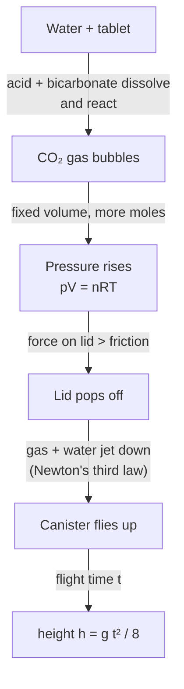

# 02 · Film-canister rocket

**Level 0 · the pad** — water and a fizzing tablet in a snap-lid canister build up carbon-dioxide
pressure until the lid blows off and the canister leaps several metres. Chemistry becomes propulsion.

| Cost | Time | Difficulty | Ages |
|---|---|---|---|
| **$4–9** | **1 hour** | ●○○○○ | 8+ with an adult |

> [!WARNING]
> **Outdoors, eye protection on, never lean over a loaded canister.** Use only soft plastic canisters
> whose lid snaps *inside* the rim (film-canister style) — **never** screw-top bottles, glass or metal
> containers, which can burst instead of popping. If a canister has not popped after 60 seconds, treat
> it like a rocket misfire: stay back, wait another 2 minutes, then knock it over with a long stick
> pointing away from people. Effervescent tablets are medicines or supplements: an adult hands them out,
> and nobody eats the leftovers. See [../SAFETY.md](../SAFETY.md).

## What you'll learn

- How a **chemical reaction** makes a gas, and how much gas (stoichiometry and the ideal gas law).
- Why pressure builds in a closed volume, and why the lid "lets go" at a threshold.
- **Reaction rates**: warm water fizzes faster (roughly ×2 per 10 °C).
- Measuring height from flight time alone: $h = g t^2/8$.

## Bill of Materials

| Qty | Item | Notes | Approx. cost (USD) |
|---|---|---|---|
| 4–6 | empty 35 mm film canisters with inside-snap lids (Fujifilm-style, translucent white) | sold empty online as "film canisters"; photo labs often give them away | $3–6 |
| 1 tube | effervescent tablets (antacid or vitamin C "fizz" tablets) | cut into halves / quarters with a knife | $2–4 |
| — | water (cold and warm), a teaspoon or 10 mL syringe, a thermometer | | $0 |
| 1 | stopwatch (phone) | flight timing | $0 |
| — | card, tape, paper (optional nose and fins) | turns the canister into a "rocket" | $0 |
| 1 per person | safety glasses | | $0–3 |

## Build it

1. **(Optional) dress it as a rocket**: tape a paper tube around the canister with the **lid end
   down** and the closed end up, add a paper cone on top and three card fins. The lid must stick out
   below the paper so it can pop freely.
2. Go outside to a hard, flat surface (a paving slab or board). Everyone wears glasses.
3. **Measure 10 mL of water** into the canister (a third to half full).
4. **Add half a tablet**, snap the lid on **firmly**, turn the canister lid-down on the ground, and step
   back at least 2 m. Start the stopwatch.
5. Wait for the pop (usually 5–20 s). Stop the stopwatch at the pop (`time_to_pop_s`), and have a second
   person time **launch to landing** (`flight_time_s`).
6. Rinse, dry the lid rim, and repeat. Change **one** thing at a time: water volume (5, 10, 15, 20 mL),
   water temperature (cold tap, room, warm tap ≈ 40 °C — never boiling), tablet fraction (¼, ½, 1).

## Diagram

## The science

**The reaction.** Effervescent tablets contain sodium bicarbonate (baking soda) and citric acid. Dry,
they do nothing; in water they dissolve and react:

$$
3\,\text{NaHCO}_3 + \text{C}_6\text{H}_8\text{O}_7 \;\longrightarrow\; \text{Na}_3\text{C}_6\text{H}_5\text{O}_7 + 3\,\text{H}_2\text{O} + 3\,\text{CO}_2\uparrow
$$

**How much gas?** A typical antacid tablet has about 1.9 g of sodium bicarbonate (22.8 mmol) and 1.0 g of
citric acid (5.2 mmol). The acid runs out first, giving $3 \times 5.2 = 15.6$ mmol of CO₂. At room
temperature one mole of gas fills 24.1 L, so

$$
V_{\text{CO}_2} = n\,\frac{RT}{p} = 0.0156 \times 24.1\ \text{L} \approx 0.38\ \text{L}
$$

— more than ten times the canister's volume. Half a tablet is still plenty; the lid pops long before the
reaction finishes.

**Pressure in a closed box.** With the air space $V$ fixed, every extra mole raises the pressure:

$$
p = \frac{nRT}{V}
$$

The lid is held by friction. When $p_\text{gauge}\,A_\text{lid}$ beats that friction, it lets go —
suddenly, which is why you get a pop instead of a slow leak. Less water leaves more air space, so it
takes longer to reach the threshold; too little water and the tablet can't dissolve fast.

**Reaction rate and temperature.** Chemical reactions speed up with temperature. A common rule of thumb
from the Arrhenius equation, $k = A\,e^{-E_a/RT}$, is that the rate roughly **doubles for every 10 °C**.
Test it: compare `time_to_pop_s` at 20 °C and 40 °C.

**Height from flight time.** Up and down take the same time without drag, so the time to the top is
$t/2$ and

$$
h = \tfrac12\, g \left(\tfrac{t}{2}\right)^2 = \frac{g\,t^2}{8}
$$

A 1.6 s flight means $h = 9.81 \times 1.6^2 / 8 \approx 3.1$ m.

**Why water helps.** When the lid pops, the canister throws out gas **and water**. Water is 800 times
denser than air, so the same push expels far more momentum — the reason water rockets
([10](../10-water-bottle-rocket/)) beat air-only rockets.

## Record & analyse your data

Fill in [`data-sheet.csv`](data-sheet.csv). `height_from_time_m` = `=9.81*G2^2/8` (flight time in G).

1. **Temperature**: plot `1/time_to_pop_s` (a proxy for reaction rate) against water temperature. Does it
   double every 10 °C?
2. **Water volume**: plot height against water volume. Where is the best height? Explain the optimum in
   terms of air space and reaction mass.
3. Film in slow motion next to a tape measure to check `height_from_time_m` against the video.

## Troubleshooting

| Problem | Likely cause | Fix |
|---|---|---|
| Lid pops off before you can set it down | too much tablet, warm water | quarter tablet, cold water; put the tablet in the lid first, then snap and invert |
| Never pops | lid leaks (wet rim) or lid is an outside-fit type | dry the rim; use proper inside-snap canisters; follow the misfire procedure above |
| Flies sideways | uneven ground | use a flat board; add fins |
| Heights vary a lot | tablet pieces uneven | weigh tablet pieces on a kitchen scale |

## Going further

- Crush the tablet into powder first: more surface area — faster pop?
- Try a canister with a longer paper body and nose: does streamlining help at these low speeds?
- Estimate the pop pressure: measure the force needed to pull the lid off with a luggage scale and
  divide by the lid area.
- Next: [03-pinhole-solar-projector-and-sunspots](../03-pinhole-solar-projector-and-sunspots/).

## References

- NASA, *Pop! Rocket Launcher* / *Pop Can Hero Engine* activities in the *Rockets Educator Guide* —
  <https://www.nasa.gov/stem-content/rockets-educator-guide/>
- Royal Society of Chemistry, *Film canister rockets* (class practical) —
  <https://edu.rsc.org/> (search "film canister rockets")
- LibreTexts Chemistry, *The Arrhenius Law* — <https://chem.libretexts.org/>
