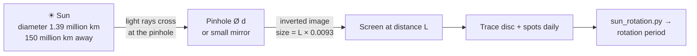

# 03 · Pinhole solar projector and sunspots

**Level 0 · the pad** — project an image of the Sun through a pinhole (and then a tiny mirror) and, on
active days, watch sunspots march across it. Over a week your drawings measure how fast the Sun spins.

| Cost | Time | Difficulty | Ages |
|---|---|---|---|
| **$0–5** | **1 hour** to build, then 5 minutes a day | ●○○○○ | 6+ with an adult |

> [!CAUTION]
> **Never look at the Sun** — not directly, not through the pinhole, not through binoculars, a camera,
> a phone zoom or sunglasses. You look only at the **projected image, with your back to the Sun**.
> Retinal damage is painless and permanent. With the mirror projector, never let the reflected beam
> cross anyone's eyes or a road, and cover the mirror when not in use. See [../SAFETY.md](../SAFETY.md) §5.

## What you'll learn

- How a **pinhole forms an image**, and why a longer projector gives a bigger (but dimmer) Sun.
- The Sun's **angular size** (0.53°) and how to use it to measure distances.
- The trade-off between sharpness and brightness: diffraction vs. geometric blur.
- What sunspots are, and how to measure the **Sun's rotation period** from your own drawings.

## Bill of Materials

| Qty | Item | Notes | Approx. cost (USD) |
|---|---|---|---|
| 1 | long cardboard box or tube (≥ 1 m is best; a 2 m poster tube or two boxes taped end-to-end) | the "camera" body | $0 |
| 1 | piece of aluminium foil (5 × 5 cm) | pinhole | $0 |
| 1 | pin or needle; a 1 mm drill bit for comparison | | $0 |
| 2 | sheets of white paper | screen and drawings | $0 |
| — | tape, scissors, ruler, pencil | | $0 |
| 1 | small flat mirror (make-up or craft mirror) + card with a 6–10 mm hole | **mirror projector** for sunspots | $0–3 |
| 1 | blu-tack / modelling clay | holds the mirror | $0–2 |
| — | a room whose far wall is 5–15 m from a sunny window | the mirror projector's "screen" | $0 |

## Build it

### A. Pinhole projector (the whole Sun, any day)

1. Cut a 2 × 2 cm window in the centre of one end of the box. Tape foil over it, smooth and flat.
2. Pierce **one clean hole** in the foil with the pin. For a 1–2 m box the ideal hole is 1–1.5 mm
   across (see *The science*) — try a pin first, then enlarge it with a slightly thicker needle.
3. Tape white paper inside the other end (the screen). Cut a viewing hole in the side of the box
   near the screen, big enough to look in.
4. Stand **with your back to the Sun**, and aim the pinhole end at the Sun by watching the box's shadow
   shrink to its smallest. Look through the side hole: a small, sharp, round Sun sits on the screen.
5. Measure the image diameter and the pinhole-to-screen distance $L$. Record them.

### B. Mirror projector (big enough for sunspots)

6. Cover the mirror with card that has a **6–10 mm round hole** — this small mirror *is* your pinhole,
   but it throws the image 5–15 m, making it huge.
7. On a sunny windowsill, fix the mirror with blu-tack so it reflects the Sun onto the **far wall of a
   darkened room** (close the curtains around the window, leaving only the mirror in sunlight).
8. Tape white paper on the wall where the image lands. At 10 m the disc is ≈ 9 cm across.
9. **Trace the disc** with a pencil, then draw every dark spot you see. Mark the direction the image
   drifts over one minute (the Earth is turning): that drift direction is **west** on the Sun.
10. Repeat at the same time each clear day for a week. Label each spot group with a letter.

## Diagram



## The science

**Image size.** Rays from opposite edges of the Sun cross at the pinhole, so the image subtends the same
angle as the Sun itself, $\theta_\odot = 0.533^\circ = 9.3\ \text{mrad}$:

$$
D_\text{image} = L\,\theta_\odot \approx \frac{L}{108}
$$

A 1 m projector gives a 9 mm Sun; 10 m gives 93 mm. Run it backwards: knowing the Sun is
$1.39\times10^6$ km across and measuring $D_\text{image}/L$, you get its distance
$d_\odot = 1.39\times10^6\ \text{km} / (D_\text{image}/L) \approx 1.5\times10^8$ km — one astronomical unit (AU).

**Sharpness: the best pinhole.** A big hole blurs the image by its own size ($d$); a tiny hole blurs it by
diffraction ($\approx 2.44\,\lambda L / d$). The two balance at Lord Rayleigh's optimum

$$
d_\text{opt} \approx 1.9\,\sqrt{L\,\lambda}
$$

For $L = 1$ m and green light ($\lambda = 550$ nm), $d_\text{opt} \approx 1.4$ mm. The number of
"resolution elements" across the Sun's image is then only about $D_\text{image}/d \approx 7$ — which is why
a 1 m box shows a clean disc but not spots.

**Why the mirror works.** An 8 mm mirror 10 m from the wall blurs by about 8 mm on a 93 mm disc, i.e.
≈ 3′ (arc-minutes) on the Sun. Big sunspot groups span 1–3′, so the largest become visible. Longer throws
help: at 15 m the disc is 14 cm.

**What a sunspot is.** A region where the Sun's magnetic field, concentrated into tubes thousands of km
wide, blocks convection. Less heat reaches the surface there, so the spot is ≈ 3,800 K instead of
5,800 K and looks dark by contrast. Spot numbers follow the ~11-year solar cycle; Solar Cycle 25 peaked
around 2024–2025, so spots are still frequent in 2026.

**Rotation from drawings.** The Sun is a ball, so a spot moving at a steady rate in longitude $\lambda$
appears to speed up near the centre and slow down near the limb. On your tracing, measure the spot's
distance $x$ from the centre along the drift direction and $y$ across it, with disc radius $R$:

$$
\phi = \arcsin\frac{y}{R}, \qquad \lambda = \arcsin\frac{x}{R\cos\phi}
$$

Fit $\lambda(t) = \lambda_0 + \omega t$. The **synodic** period (as seen from the moving Earth) is
$P_\text{syn} = 360^\circ/\omega$; correcting for Earth's orbit gives the **sidereal** period:

$$
\frac{1}{P_\text{sid}} = \frac{1}{P_\text{syn}} + \frac{1}{365.256\ \text{d}}
$$

Expect ≈ 27 days synodic and ≈ 25 days sidereal near the equator; spots at higher latitude rotate
more slowly (the Sun is not solid — **differential rotation**).

## Record & analyse your data

Record every tracing in [`data-sheet.csv`](data-sheet.csv): date and time in **UTC**, spot letter,
$x$ and $y$ in mm from the disc centre (x positive toward the limb the spots drift to), and the disc
diameter. Then:

```bash
python3 sun_rotation.py data-sheet.csv
python3 sun_rotation.py --example        # illustrative data, to see the output format
```

Example output (from the illustrative file):

```
spot A: 6 sightings over 6.0 d, latitude ≈ +12°, ω = 13.34°/day → synodic 27.0 d, sidereal 25.1 d
spot B: 7 sightings over 7.0 d, latitude ≈ -24°, ω = 13.02°/day → synodic 27.6 d, sidereal 25.7 d
```

Compare your drawings with the professional images from NASA's Solar Dynamics Observatory (SDO)
Helioseismic and Magnetic Imager (HMI) for the same dates: <https://sdo.gsfc.nasa.gov/data/>.

## Troubleshooting

| Problem | Likely cause | Fix |
|---|---|---|
| Image is a fuzzy blob | hole too big, or two holes | new foil, one clean pin-prick |
| Image too dim | hole too small or room too bright | enlarge slightly; shade the screen end |
| Mirror image is a bright square | mirror not masked | card mask with a round 6–10 mm hole |
| No spots visible | Sun is quiet today, or image too small | check SDO for spots; move the screen farther; use a 6 mm mask |
| Image drifts off the paper | Earth's rotation (≈ 1 Sun diameter every 2 minutes) | trace quickly; re-aim the mirror between tracings |

## Going further

- Photograph the projected image with a phone on a tripod (the image, not the Sun!) and measure spot
  positions in pixels instead of millimetres.
- During a **partial solar eclipse** the pinhole images turn into crescents — even gaps between leaves
  make hundreds of them.
- Count the spots and groups and compute your own **relative sunspot number** $R = k(10g + s)$; compare it
  with the official series from the Sunspot Index and Long-term Solar Observations (SILSO):
  <https://www.sidc.be/SILSO/>.
- See the Cosmic Codex [Sun page](https://normansrule.github.io/cosmic-codex/sun.html) for what lies beneath the spots.

## References

- NASA Science, *How to make a pinhole projector to view the Sun* — <https://science.nasa.gov/eclipses/safety/>
- American Astronomical Society, *Solar Eclipse Safety* (pinhole and mirror projection) — <https://eclipse.aas.org/eye-safety>
- Lord Rayleigh, "On Pin-hole Photography", *Philosophical Magazine* 31, 87 (1891).
- NASA Solar Dynamics Observatory — <https://sdo.gsfc.nasa.gov/>
