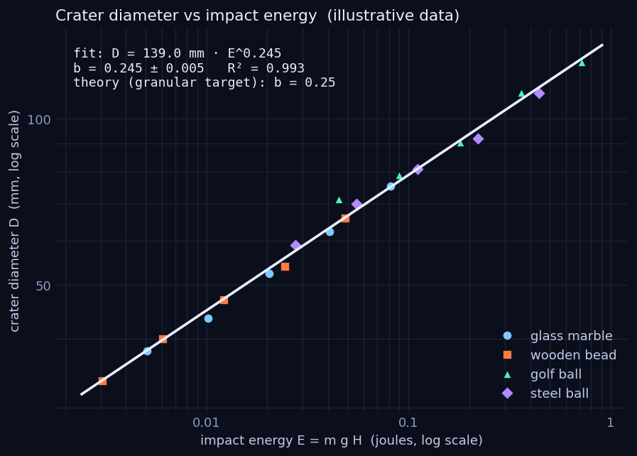
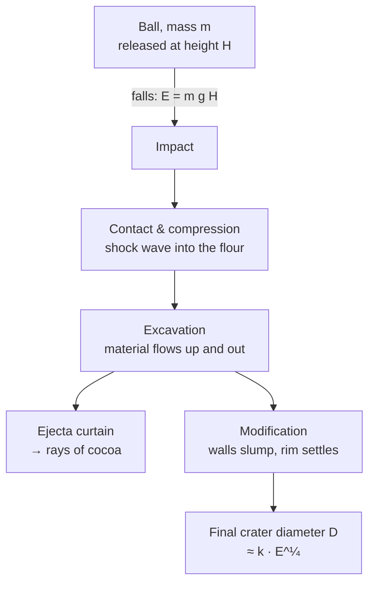

# 04 · Impact craters in flour

**Level 0 · the pad** — drop marbles and balls into a tray of flour dusted with cocoa and make craters,
rims and ejecta rays like the Moon's. Then turn a tray of measurements into a **scaling law** with a
log–log fit.

| Cost | Time | Difficulty | Ages |
|---|---|---|---|
| **$3–8** | **1–2 hours** | ●●○○○ | 7+ |

> [!NOTE]
> Flour dust is combustible: no candles, gas stoves or sparks nearby, and don't blow flour into the air.
> Do it on a floor you can sweep, or outdoors on a still day. Drop balls only from a stable chair, never
> while standing on it one-footed; keep faces away from the tray.



## What you'll learn

- **Kinetic energy** $E = mgh$ and how it is spent excavating, heating and throwing out material.
- **Scaling laws**: why crater size grows much more slowly than impact energy ($D \propto E^{1/4}$).
- **Log–log plots**: how taking logarithms turns a power law into a straight line whose slope is the
  exponent.
- How planetary scientists read a planet's history from its craters (rays, rims, central peaks).

## Bill of Materials

| Qty | Item | Notes | Approx. cost (USD) |
|---|---|---|---|
| 1 | deep baking tray or plastic storage box, ≥ 30 × 40 cm, ≥ 6 cm deep | | $0 |
| 2 kg | plain flour | target material, ≥ 5 cm deep | $2–3 |
| 1 small tub | cocoa powder (or powdered drink mix, paprika, coloured sand) | top layer shows ejecta | $2–3 |
| 1 | tea strainer / sieve | even dusting | $0 |
| 4 | balls of different mass: glass marble, wooden bead, golf ball, ball bearing | weigh each | $0 |
| 1 | kitchen scale (grams) | | $0 |
| 1 | tape measure + ruler or calipers | drop height, crater size | $0 |
| 1 | newspaper or drop cloth | | $0 |

## Build it

1. **Fill the tray** with ≥ 5 cm of flour. Tap the tray on the floor a few times, then level the top
   with a ruler — every drop needs the same surface.
2. **Dust the top** evenly with a thin layer of cocoa through the sieve.
3. **Weigh each ball** and measure its diameter. Enter them in [`data-sheet.csv`](data-sheet.csv).
4. **Tape a tape measure** vertically to a chair back or door frame beside the tray.
5. **Drop, don't throw**: hold the ball with its *bottom* at the chosen height above the flour surface
   and let go. Use the heights **10, 20, 40, 80, 160 cm** (each doubles the energy).
6. **Measure**: rim-to-rim diameter in two perpendicular directions (`crater_d1_mm`, `crater_d2_mm`),
   and the length of the longest ejecta ray. Photograph each crater from above next to a ruler.
7. Lift the ball out gently, smooth the flour, re-dust with cocoa. Space craters at least two crater
   diameters apart, or re-level the whole tray.
8. Repeat for every ball and height (20 drops for 4 balls × 5 heights).

## Diagram



## The science

**Energy in.** A ball of mass $m$ dropped from height $H$ arrives with

$$
E = m g H, \qquad v = \sqrt{2 g H}
$$

A 46 g golf ball from 1.6 m carries $0.046 \times 9.81 \times 1.6 = 0.72$ J at 5.6 m/s. A real asteroid
hits at 15–25 km/s, so per kilogram it carries about **10 million times** more energy — but the
geometry of the crater it makes is remarkably similar.

**Why a power law?** The crater is the hole where the impact energy was enough to lift flour out
against gravity. Lifting a volume $\sim D^3$ of material of density $\rho$ through a height $\sim D$ costs
energy $\sim \rho g D^4$. If a fixed fraction of the impact energy does that work,

$$
\rho g D^4 \propto E \quad\Rightarrow\quad D \propto E^{1/4}
$$

Laboratory experiments with balls dropped into sand confirm this quarter-power law (Uehara et al.,
*Physical Review Letters* 90, 194301, 2003):

$$
D = 0.90\left(\frac{\rho_b}{\mu^2\rho_g}\right)^{1/4} D_b^{3/4}\, H^{1/4}
$$

where $\rho_b$, $D_b$ are the ball's density and diameter, $\rho_g$ the target's bulk density and $\mu$ its
friction coefficient. Since $E \propto \rho_b D_b^3 H$, this is exactly $D \propto E^{1/4}$. **Doubling the
energy makes the crater only $2^{1/4} = 1.19$ times wider.**

**Log–log fit.** Take $\log_{10}$ of $D = k E^b$:

$$
\log D = \log k + b\,\log E
$$

A straight line on log–log axes; its slope is the exponent $b$. Fitting by least squares gives $b$ and
its uncertainty.

**Real craters.** Meteor Crater in Arizona is 1.2 km across, made about 50,000 years ago by an iron
asteroid roughly 50 m wide. On the Moon, fresh craters like Tycho have bright **rays** of ejecta — the
same pattern your cocoa makes. Craters larger than ~15 km on the Moon (a few km on Earth) collapse
into **complex craters** with central peaks, which flour can't reproduce because it has no strength.

## Record & analyse your data

Fill in [`data-sheet.csv`](data-sheet.csv), then fit your power law:

```bash
python3 fit_craters.py data-sheet.csv        # → data-sheet_fit.png + printed exponent
python3 fit_craters.py --example             # illustrative data → images/crater_fit.png
```

Example output (from the **illustrative** data file — replace it with yours):

```
20 craters:  D = 138.96 mm × (E / 1 J)^0.245   (b = 0.245 ± 0.005, R² = 0.993)
granular-target theory predicts b ≈ 0.25; energy doubling → crater grows by 2^b = 1.185×
```

No Python? In a spreadsheet, add columns `=LOG10(E)` and `=LOG10(D)` and use `=SLOPE(logD, logE)`.

Questions to answer:

1. Is your exponent $b$ within two standard errors of 0.25?
2. Do all balls lie on **one** line when plotted against energy, or does each ball have its own line?
   (If separate, density or size matters beyond energy — why?)
3. How does the longest ray length scale with $E$?

## Troubleshooting

| Problem | Likely cause | Fix |
|---|---|---|
| Craters have no clear rim | flour packed too hard or too loose | sift the flour, tap the tray the same number of times each refill |
| Ball hits the tray bottom | flour too shallow | ≥ 5 cm for marbles, ≥ 8 cm for golf balls from 1.6 m |
| Diameters scatter a lot | surface not re-levelled; thrown not dropped | re-level and re-dust every drop; release from a still hand |
| Slope far from 0.25 | too narrow a range of energies | span at least a factor of 16 in energy (10 → 160 cm) |

## Going further

- **Oblique impacts**: roll a marble down a ramp into the flour at 15°, 30°, 45°, 60°. Craters stay round
  until very low angles — why do almost all real craters look circular?
- Try **wet sand** (it has strength) and compare the exponent.
- Measure crater **depth** with a toothpick and ruler; is depth/diameter constant?
- Count craters on a lunar photo from the [Cosmic Library gallery](https://normansrule.github.io/cosmic-library/gallery.html) and compare
  old highlands with young maria (crater counting dates planetary surfaces).

## References

- H. J. Melosh, *Impact Cratering: A Geologic Process*, Oxford University Press (1989).
- J. S. Uehara, M. A. Ambroso, R. P. Ojha & D. J. Durian, "Low-Speed Impact Craters in Loose Granular
  Media", *Physical Review Letters* 90, 194301 (2003).
- Lunar and Planetary Institute, *Exploring the Moon — Impact Craters* activity —
  <https://www.lpi.usra.edu/education/>
- NASA Science, *Craters* — <https://science.nasa.gov/moon/>
