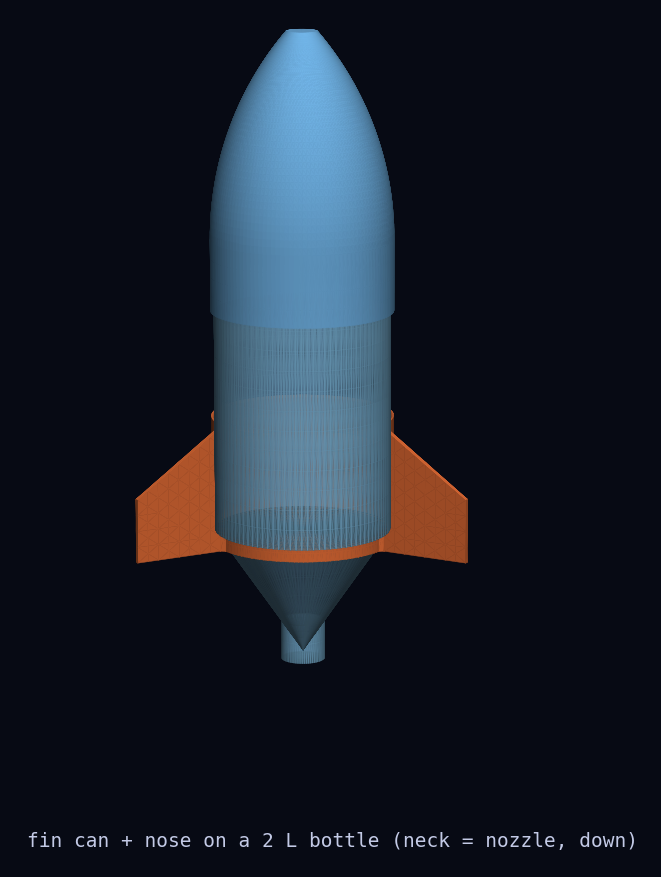
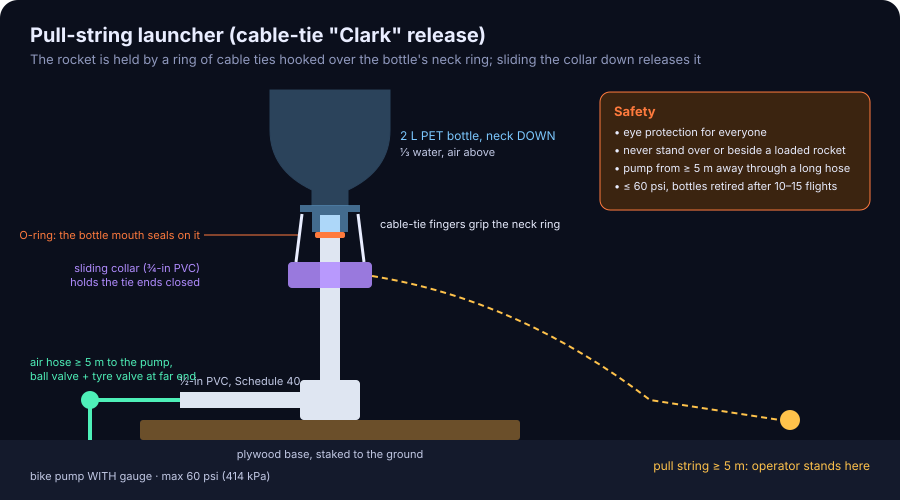
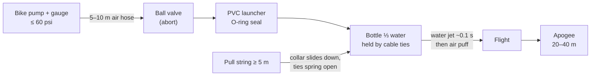
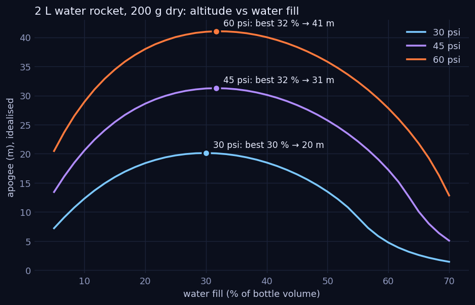

# 10 · Water bottle rocket with 3D-printed nose cone and fin can

**Level 1 · stage 1** — a 2-litre soda bottle, a third full of water, pressurised with a bicycle pump and
released by a pull-string from 5 m away. You build the launcher from PVC, print a nose cone and fin can
in OpenSCAD for a standard 2 L bottle, and use a simulator to find the water fill that flies highest.

| Cost | Time | Difficulty | Ages |
|---|---|---|---|
| **$25–45** (launcher $20–35, rocket ≈ $3 of filament) | **4–6 hours** + printing | ●●○○○ | 10+ with an adult |

> [!CAUTION]
> **Pressure limit for this project: 60 psi (414 kPa gauge).** Carbonated-drink PET bottles only; retire
> them after 10–15 flights or at the first crease. Eye protection for everyone, nobody near the rocket
> while it is pressurised, pump through a long hose, release with a ≥ 5 m pull string. PVC is not rated
> for compressed air by its manufacturers — keep it short, Schedule 40, below 60 psi, and wrap it with
> tape. Read [../SAFETY.md](../SAFETY.md) §4 before building.



## What you'll learn

- **Thrust** from a water jet: $F = 2\,A\,(p - p_a)$, and why water beats air as reaction mass.
- **Adiabatic expansion** of the compressed air, $pV^\gamma = \text{const}$, and the **optimum water fill**
  (≈ ⅓ of the bottle).
- Rocket **stability**: nose ballast and fins, checked with a swing test.
- **Parametric CAD** in OpenSCAD, exporting STL, and printing on a Bambu Lab printer.
- Measuring apogee two ways (inclinometer triangulation and slow-motion video) and comparing with a
  physics simulation.

## Bill of Materials

### Launcher (cable-tie "Clark" pull-string release)

| Qty | Item | Notes | Approx. cost (USD) |
|---|---|---|---|
| 1.5 m | ½-inch Schedule 40 PVC pipe | launch tube + feed pipe | $3 |
| 1 | ½-inch PVC tee | | $1 |
| 2 | ½-inch PVC end caps | one drilled for the air fitting | $1 |
| 1 | ½-inch slip × ¼-inch NPT female PVC adapter + ¼-inch NPT hose barb | air inlet | $3 |
| 5–10 m | air hose rated ≥ 150 psi (¼-inch ID rubber or polyurethane) + 2 hose clamps | lets you pump from 5 m away | $8–12 |
| 1 | tyre valve (Schrader), push-in type TR413 in a ¼-inch NPT fitting, or a ¼-inch NPT Schrader adapter | pump connects here, at the far end of the hose | $3 |
| 1 | ¼-inch NPT ball valve (optional but recommended) | dump pressure to abort | $5 |
| 1 | O-ring that fits snugly on ½-inch PVC (≈ 21 mm inner diameter, 3 mm section) | seals against the bottle mouth | $1 |
| 8 | heavy cable ties, ≥ 200 mm × 4.8 mm | the release "fingers" | $2 |
| 1 | stainless hose clamp, 25–40 mm | holds the ties to the launch tube | $2 |
| 5 cm | ¾-inch PVC pipe | the sliding release collar | $1 |
| 6 m | strong cord (paracord) | pull string | $3 |
| 1 | bicycle floor pump **with a pressure gauge** | | $0 (own) – 25 |
| 1 | plywood board ≈ 40 × 25 cm + 2 tent pegs, PVC primer/cement, PTFE thread tape | base, joints | $5 |

### Rocket

| Qty | Item | Notes | Approx. cost (USD) |
|---|---|---|---|
| 1 | 2 L carbonated-drink bottle, label removed | **carbonated** bottles only | $0 |
| 1 | printed nose cone — [`stl/nose_2L.stl`](stl/nose_2L.stl) | PETG, ≈ 100 g filament | $2 |
| 1 | printed fin can — [`stl/fincan_2L.stl`](stl/fincan_2L.stl) | PETG, ≈ 95 g filament | $2 |
| 30–60 g | modelling clay | nose ballast | $1 |
| 1 | 3 cm foam disc (pool noodle slice or craft foam) | soft landing tip | $0 |
| — | vinyl electrical tape, string for the swing test | | $1 |
| — | safety glasses for everyone, ear plugs above 45 psi | | — |

## Build it

### A. Print the parts

1. Measure your bottle: wrap a paper strip round the widest part, mark the overlap, measure the length
   and divide by π. Typical 2 L bottles are ≈ 110 mm.
2. If yours differs by more than 0.5 mm, open [`cad/water_rocket.scad`](cad/water_rocket.scad) in
   OpenSCAD, set `bottle_d` in the **Customizer**, then **Render (F6) → Export as STL**. Or from a
   terminal:
   ```bash
   openscad -o nose.stl   -D 'part="nose"'   -D bottle_d=108.5 cad/water_rocket.scad
   openscad -o fincan.stl -D 'part="fincan"' -D bottle_d=108.5 cad/water_rocket.scad
   ```
3. Slice in **Bambu Studio** with the *Generic PETG* profile (≈ 250 °C nozzle, 70 °C textured PEI plate;
   use glue stick as a release layer on smooth PEI), 0.2 mm layers, 3–4 walls, 15 % gyroid infill.
   - **Nose**: tip up, no supports (≈ 175 mm tall, 4–5 h).
   - **Fin can**: lip down, no supports. Needs a 256 mm bed (X1, P1, A1). On an A1 mini, re-export with
     `-D span=40`.
4. Test-fit both on the bottle: the fin can slides down from the base end until its inner lip sits on the
   shoulder; the nose skirt slips over the base. Snug, not forced.

### B. Build the launcher

5. **Launch tube**: cut 30 cm of ½-inch PVC. Slide the O-ring on and seat it 3 cm below the top; wrap
   electrical tape just below it as a stop. The bottle mouth will press down on this O-ring.
6. **Release fingers**: place the 8 cable ties around the tube, heads down, tails pointing up past the
   O-ring by ≈ 4 cm, and clamp them to the tube with the hose clamp 8 cm below the O-ring. Bend each tail
   slightly inward so the tips will hook over the bottle's **neck ring** (the plastic flange below the
   threads).
7. Slide the **¾-inch collar** over the ties from below. Pushed up, it squeezes the tips together over
   the neck ring; pulled down, it lets them spring open. Tie the pull string to the collar.
8. **Feed**: tee at the bottom of the launch tube; one side capped, the other a 40 cm pipe ending in the
   **NPT adapter + hose barb**. Clamp the air hose on. At the **far** end of the hose fit the ball valve
   and the Schrader valve (PTFE tape on every thread). Prime and cement the PVC joints and **let them cure
   24 hours** before pressurising.
9. Screw the launcher to the plywood, peg the board to the ground, launch tube vertical or tilted up to
   15° away from people.
10. **Leak and proof test with water, not air**: fill the launcher and a bottle to the brim with water so
    only a small air bubble remains (water barely compresses, so a failure only splashes instead of
    bursting), pump to 60 psi, check every joint for drips, then release with the pull string.

### C. Assemble and trim the rocket

11. Slide the fin can on and tape its top edge to the bottle with one wrap of electrical tape. Tape the
    nose on with two strips (it must not fly off).
12. Press 30 g of clay into the tip of the nose from inside; glue the foam disc onto the flat tip.
13. **Swing test** with water in: fill the bottle to ⅓, screw on its cap, tie a string round the bottle at
    its balance point (the CG), and swing it in a circle around you. If it flies nose-first and steady,
    it's stable; if it wobbles or goes tail-first, add 10 g of clay and repeat.

### D. Fly

14. Everyone in glasses; spectators 10 m back, upwind. Fill with ⅓ water (660 mL), lower the rocket
    onto the launch tube, push the collar up to lock the fingers.
15. Walk back to the pump end of the hose (≥ 5 m). Pump to 30 psi for the first flight; 45 psi, then 60 psi
    maximum later.
16. Countdown, then pull the string. **Abort** = open the ball valve and wait for the hiss to stop.

## Diagram





## The science

**Water phase thrust.** Pressure $p$ in the bottle pushes water through the neck (area $A$) at the
Bernoulli speed, and thrust is mass flow times exit speed:

$$
v_e = \sqrt{\frac{2\,(p - p_a)}{\rho_w}}, \qquad F = \dot m\, v_e = \rho_w A v_e^2 = 2A\,(p - p_a)
$$

At 45 psi (310 kPa gauge) and a 21.5 mm neck ($A = 3.6\times10^{-4}\ \text{m}^2$): $v_e = 24.9$ m/s and
$F \approx 225$ N — about 115 times the weight of the 200 g rocket, for about a tenth of a second.

**The air cools as it expands.** The air cushion expands too fast to exchange heat (adiabatic), so

$$
p\,V_\text{air}^{\gamma} = p_0\,V_{\text{air},0}^{\gamma}, \qquad \gamma = 1.4
$$

(absolute pressures). As water leaves, $V_\text{air}$ grows and $p$ drops steeply.

**Why ⅓ water is best.** Too little water: little reaction mass, most energy leaves as a feeble air puff.
Too much: little air to push it, and you carry heavy water that never gets thrown. The simulator
[`water_rocket_sim.py`](water_rocket_sim.py) integrates the water phase, a compressible-air blow-down
phase and a drag-limited coast:



```bash
python3 water_rocket_sim.py                 # the sweep above
python3 water_rocket_sim.py --psi 45 --fill 0.33 --mass 0.20
# 45.0 psi, 33 % water: impulse 14.0 N·s, thrust ends at 130 ms, apogee 31.2 m at 2.42 s (idealised)
```

The optimum sits near **30–33 %** at every pressure. Real flights reach roughly 60–80 % of the
idealised altitude (the model ignores the launch-tube boost, off-vertical flight and bottle stretch).

**Rocket equation link.** The total impulse ($\approx 14$ N·s at 45 psi) is in the range of a model rocket
**C** motor (5–10 N·s) to a **D** (10–20 N·s) — but delivered in 0.1 s instead of 1.5 s, which is why water
rockets accelerate at over 100 *g* and slow down quickly from drag.

**Stability.** The fins move the centre of pressure aft; the clay moves the centre of gravity forward.
Water sits at the bottom (aft) during flight, pulling the CG back — which is why you swing-test **with
water**. Aim for the CG at least one bottle diameter ahead of the CP.

## Record & analyse your data

Use [`data-sheet.csv`](data-sheet.csv). Measure apogee by **triangulation** (spotter at a known distance
$d$ with an inclinometer: $h = d\tan\theta + h_\text{eye}$, see [00](../00-stomp-rocket/)) or from the
**flight time** to apogee in slow-motion video ($h \approx g t_\text{up}^2/2$ as an upper bound).

1. Fix the water at 660 mL and fly at 30, 45 and 60 psi. Plot apogee vs pressure alongside the
   simulator's prediction. What fraction of the ideal do you achieve?
2. Fix 45 psi and fly 400, 660, 900 mL. Is the best fill near ⅓?
3. Track each bottle's `bottle_age_flights`; retire at 10–15.

## Troubleshooting

| Problem | Likely cause | Fix |
|---|---|---|
| Leaks at the mouth while pumping | O-ring not compressed | move the tape stop up so the ties pull the mouth harder onto the O-ring |
| Releases early | tie tips barely over the neck ring | bend tips further inward; push the collar higher |
| Won't release | collar too tight / string angle | smooth the collar ends; pull the string straight down along the tube first |
| Rocket corkscrews | fins not straight or fin can crooked | re-seat and tape square; check print for warp |
| Loops or tumbles | CG too far aft | add nose clay in 10 g steps; swing-test with water |
| Nose pops off | taped too lightly | two strips of tape across the joint, 90° apart |

## Going further

- **Parachute recovery**: a nose that separates at apogee (spring-loaded flap, or a "Tomy timer"
  mechanism) — see the Water Rocket Achievement World Record Association (WRA2) for designs.
- Replace the fin-can fin count and `span` in the SCAD file and measure the effect on stability.
- Fly the altimeter from [22](../22-barometric-altimeter-payload/) inside the nose (it fits a 110 mm
  bottle easily) and compare with the simulator.
- Next rung: [11-diy-spectroscope](../11-diy-spectroscope/), or jump to certified motors in
  [20-first-model-rocket](../20-first-model-rocket/).

## References

- NASA Glenn Research Center, *Water Rocket* pages and simulator (thrust, stability, safety) —
  <https://www.grc.nasa.gov/WWW/k-12/rocket/BottleRocket/educator.htm>
- NASA, *Rockets Educator Guide* — <https://www.nasa.gov/stem-content/rockets-educator-guide/>
- Scouting America, *Water Bottle Rockets* safety moment —
  <https://www.scouting.org/health-and-safety/safety-moments/water-bottle-rockets/>
- C. J. Gommes, "A more thorough analysis of water rockets: Moist adiabats, transient flows, and
  inertial forces in a soda bottle", *American Journal of Physics* 78, 236 (2010).
