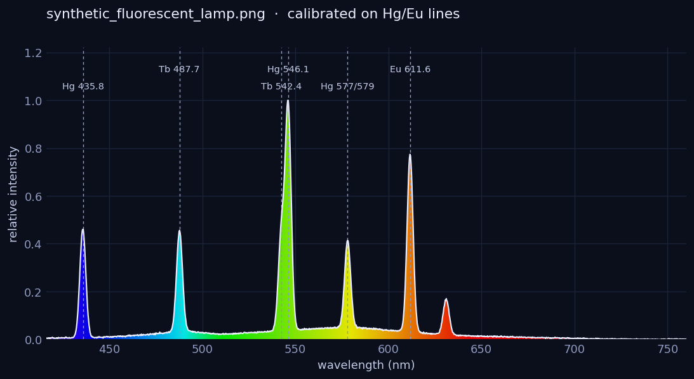
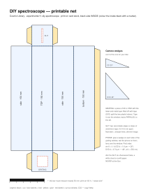
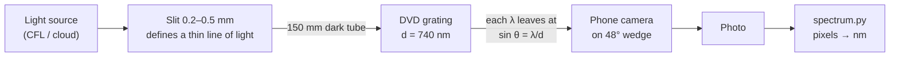

# 11 · DIY spectroscope

**Level 1 · stage 1** — a card tube, a slit and a piece of an old DVD split light into a rainbow sharp
enough to see the **mercury lines** inside a fluorescent lamp and the dark **Fraunhofer lines** in
sunlight. A Python script turns a phone photo of the rainbow into a calibrated spectrum.

| Cost | Time | Difficulty | Ages |
|---|---|---|---|
| **$0–10** | **2 hours** | ●●○○○ | 10+ |

> [!CAUTION]
> Point the slit at a **fluorescent tube, a white cloud, blue sky or sunlit white paper — never at the
> Sun**. Use a craft knife on a cutting mat and cut away from your fingers; an adult handles razor
> blades. See [../SAFETY.md](../SAFETY.md) §5.



*Above: the analysis script's output for a synthetic fluorescent-lamp photo used in its self-test.*

## What you'll learn

- **Diffraction**: a grating sends each wavelength to a different angle, $d\sin\theta = m\lambda$.
- **Emission lines**: hot or excited atoms emit only specific wavelengths — a fingerprint.
- **Absorption (Fraunhofer) lines**: cooler gas in the Sun's atmosphere removes specific wavelengths —
  how we know what the Sun and stars are made of.
- **Calibration**: turning pixel positions into nanometres with known reference lines, and estimating
  your error.

## Bill of Materials

| Qty | Item | Notes | Approx. cost (USD) |
|---|---|---|---|
| 1 | old **DVD** (best) or CD | DVD tracks: 740 nm apart (1,350 lines/mm); CD: 1,600 nm (625 lines/mm) | $0 |
| 1 | printed [`spectroscope-template.svg`](spectroscope-template.svg) on card stock | print at **100 %** | $0 |
| 2 | razor blades, or strips of aluminium foil tape | slit jaws | $0–3 |
| 1 | black marker or black paint | colour the inside black | $0 |
| — | glue stick, clear tape, craft knife, cutting mat, ruler | | $0 |
| 1 | smartphone (camera) | photographs the spectrum | $0 |
| 1 | compact fluorescent lamp (CFL) or fluorescent tube | calibration source (contains mercury lines) | $0–5 |
| 1 | computer with Python 3 + `pip install numpy pillow matplotlib` | analysis | $0 |

## Build it

1. **Prepare the grating.** DVD: flex it until the two polycarbonate halves start to separate at the
   edge, pry them apart with a fingernail; the clear half with no dye is your transmission grating.
   CD: stick packing tape on the label side and rip it off — the label and metal layer come away,
   leaving clear plastic. Cut a 2 × 2 cm piece from the **outer edge** (straightest tracks), and mark
   which way the tracks run (they are circular arcs; near the edge they are almost straight lines).
2. **Print and cut** the template. Colour the inner side black (it will be the inside of the tube).
3. **Cut the windows**: the thin slit window (2 × 20 mm) on the SLIT cap and the 15 × 15 mm window on the
   GRATING cap.
4. **Make the slit**: tape two razor-blade edges (or two pieces of foil tape) over the slit window,
   edges parallel and **0.2–0.5 mm apart** — about the thickness of two sheets of paper. Use a sheet of
   paper as a spacer while you tape, then pull it out.
5. **Fold and glue** the tube along the blue dashed lines, glue flap inside. Fold the end caps and glue
   their flaps.
6. **Mount the grating** over the GRATING window, with the tracks **parallel to the slit**. The rainbow
   then spreads sideways, perpendicular to the slit.
7. **Cut the two camera wedges** for your disc (20° CD, 48° DVD) from thick card and glue them on either
   side of the grating window. Rest the phone on them with the lens over the window.
8. **Test**: point the slit at a fluorescent light. On the phone screen you should see a rainbow crossed
   by bright coloured lines (violet, blue, green, yellow-orange, red). Lock focus and exposure (tap and
   hold), turn off HDR, and take a photo.
9. Take a second photo pointing at **a bright white cloud or sunlit white paper** (not the Sun) for
   Fraunhofer lines — lower the exposure so the rainbow isn't saturated.

## Diagram





## The science

**The grating equation.** Light passing through many equally spaced slits (the DVD's tracks, spacing
$d$) interferes constructively only where the path difference between neighbours is a whole number of
wavelengths:

$$
d\,\sin\theta = m\,\lambda, \qquad m = 0, \pm1, \pm2, \dots
$$

For a DVD ($d = 0.74\ \mu\text{m}$) and green light ($\lambda = 546\ \text{nm}$), first order ($m = 1$):
$\theta = \arcsin(0.546/0.74) = 47.6^\circ$ — hence the 48° wedge. Blue (436 nm) goes to 36.1°, red (612 nm)
to 55.8°, so the visible spectrum fans out over ~20°. A CD ($d = 1.6\ \mu\text{m}$) spreads it over only 7°
(15.8°–22.5°), so a DVD gives about three times the resolution.

**Resolving power.** A grating can separate two wavelengths $\lambda$ and $\lambda + \Delta\lambda$ when

$$
R = \frac{\lambda}{\Delta\lambda} = m\,N
$$

where $N$ is the number of illuminated lines. In practice your slit width, not $N$, limits you to about
2–5 nm — enough to see the yellow sodium **D** line (589 nm) but not split its two components (0.6 nm
apart).

**Emission lines.** Electrons in an atom can only have certain energies. A jump between two levels emits a
photon of exactly

$$
\lambda = \frac{h c}{E_2 - E_1}
$$

A fluorescent lamp contains mercury vapour: its strong visible lines are at **404.7, 435.8, 546.1 and
577/579 nm**. The white glow comes from phosphors on the glass; modern "tri-phosphor" lamps add sharp lines
from terbium (**487.7, 542.4 nm**) and europium (**611.6 nm**). (Values: NIST Atomic Spectra Database.)

**Fraunhofer lines.** The Sun's surface glows like a hot solid (a continuous spectrum), but the cooler gas
above it absorbs its own fingerprint wavelengths, leaving dark lines. Joseph von Fraunhofer labelled them in
1814:

| Line | λ (nm) | Absorbed by |
|---|---|---|
| A | 759.4 | O₂ in **Earth's** atmosphere |
| B | 686.7 | O₂ in Earth's atmosphere |
| C | 656.3 | hydrogen (Hα) |
| D₁, D₂ | 589.6, 589.0 | sodium |
| E | 527.0 | iron |
| b | 517.3 | magnesium |
| F | 486.1 | hydrogen (Hβ) |
| G | 430.8 | iron and CH |
| H, K | 396.8, 393.4 | ionised calcium |

With a phone and a DVD you can usually see **D, b, F** and **C**, and often the atmospheric **B** band.

**Calibration.** The camera maps angle to pixel almost linearly over a small range, so a straight line
$\lambda = a\,x + b$ through two or more known lines calibrates the whole photo. `spectrum.py` finds the three
strongest lines of a fluorescent lamp and recognises them **by colour** (blue = 435.8 nm, green = 546.1 nm,
red = 611.6 nm), so it works whichever way round the rainbow lies.

## Record & analyse your data

```bash
pip install numpy pillow matplotlib           # scipy optional
python3 spectrum.py cfl.jpg --cfl              # → cfl_spectrum.csv + cfl_spectrum.png
python3 spectrum.py sky.jpg --cal 412:435.8,803:546.1 --sun   # use pixel positions from the CFL photo
python3 spectrum.py --selftest                 # synthetic photo: checks the whole pipeline
```

Self-test output (a synthetic lamp photo with known lines):

```
  line  435.83 nm → recovered at  435.76 nm
  line  546.07 nm → recovered at  546.04 nm
  line  611.60 nm → recovered at  611.59 nm
  line  487.70 nm → recovered at  487.78 nm
  dispersion error 0.04 %
SELFTEST PASSED
```

For sky photos taken **without moving the phone on its wedge**, reuse the pixel positions of the lamp lines
(printed in the CFL run's CSV) with `--cal`. Log each identified line in
[`data-sheet.csv`](data-sheet.csv) with measured and reference wavelengths; the `error_nm` column tells
you your instrument's accuracy. Expect ±2–5 nm.

## Troubleshooting

| Problem | Likely cause | Fix |
|---|---|---|
| Rainbow but no lines | slit too wide | narrow the slit to ~0.2 mm |
| Very dim | slit too narrow, or pointing at a dim source | widen slightly; use a closer lamp |
| Lines tilted or curved | grating tracks not parallel to slit | rotate the grating piece |
| Several overlapping rainbows | light leaks or reflections | blacken the inside, tape over seams |
| Script finds wrong peaks | image saturated (white peaks) | lower exposure; use `--rows` to pick the band; or calibrate with `--cal` |
| Can't see Fraunhofer lines | overexposed or slit too wide | point at a bright cloud, lower exposure, narrow slit |

## Going further

- Look at **LED bulbs, street lights (sodium or LED), a candle flame, a TV screen** — which are line
  sources and which continuous?
- Compare **clear sky vs. cloud**: the sky's spectrum is bluer (Rayleigh scattering $\propto \lambda^{-4}$).
- Measure the Hα line in sunlight and compare with the **Doppler-shifted** hydrogen line in radio at
  [43-hydrogen-line-radio-telescope](../43-hydrogen-line-radio-telescope/).
- Build the Public Lab papercraft spectrometer and compare resolution.

## References

- NIST Atomic Spectra Database (line wavelengths) — <https://physics.nist.gov/PhysRefData/ASD/lines_form.html>
- Public Lab, *Spectrometry* — <https://publiclab.org/wiki/spectrometry>
- NASA Space Place, *Make a Spectroscope* — <https://spaceplace.nasa.gov/>
- J. Fraunhofer (1817), "Bestimmung des Brechungs- und Farbenzerstreuungs-Vermögens verschiedener
  Glasarten" — the original map of solar lines (English summaries in any astronomy history text).
