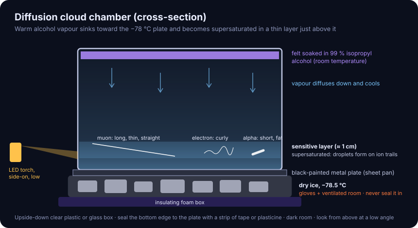
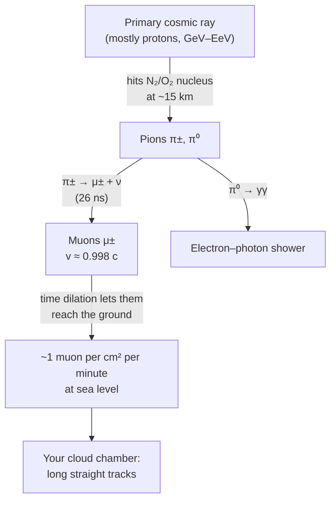

# 12 · Cloud chamber — see cosmic-ray muons

**Level 1 · stage 1** — a plastic box, a strip of felt soaked in isopropyl alcohol and a slab of dry
ice make a layer of supersaturated vapour. Charged particles crossing it leave trails of droplets you can
see with a torch: **muons** born 15 km up when cosmic rays hit the atmosphere, electrons, and alpha
particles from radon in the air.

| Cost | Time | Difficulty | Ages |
|---|---|---|---|
| **$20–40** (mostly dry ice and alcohol) | **2 hours** (tracks appear after 10–15 min) | ●●○○○ | 10+ with an adult |

> [!CAUTION]
> **Dry ice is −78.5 °C**: insulated gloves and tongs, never bare skin, never in a sealed container
> (it can burst), and only in a **well-ventilated room** — it turns into CO₂ gas, which pools near the
> floor. **99 % isopropyl alcohol is highly flammable**: no flames, sparks or heaters; use an LED torch.
> Adults handle both. See [../SAFETY.md](../SAFETY.md) §6.

## What you'll learn

- What **cosmic rays** are and how they make showers of secondary particles, including muons.
- **Special relativity in your kitchen**: muons live 2.2 µs, which is not long enough to reach the ground
  — unless time dilation is real.
- **Supersaturation and nucleation**: why ions trigger droplets.
- **Counting statistics**: why $N \pm \sqrt N$.

## Bill of Materials

| Qty | Item | Notes | Approx. cost (USD) |
|---|---|---|---|
| 1 | clear plastic storage box or small fish tank, ≈ 30 × 20 × 20 cm | turned upside down, it's the chamber | $0–10 |
| 1 | flat metal plate a bit larger than the box opening (baking sheet, cake tin lid) | must be **metal** for good cold transfer | $0–5 |
| 1 | matte black paint, black vinyl, or black electrical tape | covers the plate, gives contrast | $0–4 |
| 1 strip | felt, 3 cm wide, long enough to go round the inside of the box bottom | alcohol reservoir | $1 |
| 250 mL | **99 %** isopropyl alcohol (IPA) | 70 % rubbing alcohol will **not** work | $6–10 |
| 2–3 kg | dry ice, pellets or slab | many grocery stores; buy it on the day, keep it in a cool box with the lid **resting**, not latched | $8–20 |
| 1 | polystyrene foam box or cooler lid | insulation under the dry ice | $0 |
| 1 | bright LED torch (flashlight) with a narrow beam | side lighting | $0–10 |
| — | insulated gloves, tongs, safety glasses, tape or plasticine | | $0 |

## Build it

1. **Blacken the plate**: paint it matte black (let it dry fully) or cover it with black vinyl/tape.
2. **Felt**: glue or tape the felt strip around the inside of the box's **bottom** (which becomes the top
   when inverted). Hot glue and tape both work.
3. **Soak the felt** with alcohol until it is saturated but not dripping (≈ 30–50 mL). Pour a few mL on
   the black plate too. Cap the alcohol bottle and move it away.
4. **Dry-ice bed**: put gloves on. Spread the dry ice evenly in the foam box so its top is flat.
5. **Assemble**: lay the black plate on the dry ice, place the upturned box on the plate (felt at the
   top), and seal the box's rim to the plate with a strip of tape or plasticine — air leaks bring warm,
   dry air in.
6. **Wait 10–15 minutes** in a darkened, ventilated room while the plate cools and vapour builds up. You
   will first see a fine "rain" of droplets falling near the plate.
7. **Light it** from one side, low, just above the plate, with the torch beam grazing the surface. Look
   from above or at a slight angle against the black background.
8. **Watch**: thin white lines appear and fade in a second or two. Count and classify them for 1-minute
   intervals (below). Top up alcohol every 20–30 minutes.

## Diagram

## The science

**How the chamber works.** Alcohol evaporates from the warm felt at the top and diffuses down toward the
−78 °C plate. Just above the plate the vapour is cooled below its dew point but has nothing to condense
on — it is **supersaturated**. A fast charged particle knocks electrons off air molecules along its path;
those ions are nucleation sites, and droplets form on them within milliseconds, drawing the track. (The
Kelvin equation says a small droplet needs a large supersaturation to survive; ions lower that barrier.)

**What the tracks look like.**

| Track | Particle | Why |
|---|---|---|
| long, thin, straight, crossing the whole layer | **muon** (or fast electron) | minimum-ionising, very penetrating |
| short (1–3 cm), thick, bright | **alpha particle** (He nucleus) from radon-222 and its daughters in room air | heavy, slow, ionises densely, stops quickly |
| thin, wiggly, curly | low-energy **electron** (beta decay, Compton scattering) | light, scatters off every atom |
| a "V" or a kink | a decay or a hard scatter | rare — photograph it! |

**The muon puzzle and time dilation.** Muons are made at about $h = 15$ km and travel at
$v \approx 0.998\,c$. Their mean lifetime at rest is $\tau = 2.197\ \mu\text{s}$, so without relativity they
would travel on average only

$$
c\,\tau \approx 3\times10^8 \times 2.197\times10^{-6} \approx 660\ \text{m}
$$

The trip takes $t = h/v \approx 50\ \mu\text{s} \approx 23\,\tau$, and the fraction surviving would be
$e^{-23} \approx 10^{-10}$ — essentially none. But a clock moving at $v$ runs slow by the Lorentz factor

$$
\gamma = \frac{1}{\sqrt{1 - v^2/c^2}} \approx 16 \quad (v = 0.998\,c)
$$

so in the muon's frame the trip lasts only $t/\gamma \approx 3.1\ \mu\text{s} \approx 1.4\,\tau$ and about
$e^{-1.4} \approx 25\,\%$ survive. The muons you see are direct evidence of special relativity (this was
measured precisely by Rossi & Hall in 1941 and by Frisch & Smith in 1963).

**How many should you see?** At sea level about **1 muon per cm² per minute** crosses a horizontal surface
(Particle Data Group). A 20 × 30 cm plate therefore has ~600 muons per minute passing through it —
but most arrive near-vertically and only light up the thin (≈ 1 cm) sensitive layer as a short dot or
stub. The long, horizontal-looking tracks are the minority arriving at shallow angles: expect a
**few to a few dozen clear straight tracks per minute**.

**Counting statistics.** Random, independent events follow a Poisson distribution, whose standard
deviation is $\sqrt{N}$. If you count $N = 49$ straight tracks in 5 minutes, report $49 \pm 7$, i.e.
$9.8 \pm 1.4$ per minute.

## Record & analyse your data

Use [`data-sheet.csv`](data-sheet.csv): one row per minute, tallying each track type. Then:

1. Compute the rate and its $\sqrt N$ uncertainty for each type.
2. Compare the first 10 minutes with later ones — does the rate change as the sensitive layer settles?
3. Put a thick book or a steel pan above the chamber for 10 minutes. Muons pass straight through;
   alphas never reach the chamber from outside anyway. Is the change in muon rate bigger than
   $2\sqrt N$?
4. Film the chamber (phone on a tripod, 60 fps) and count frame by frame for a more careful tally.

## Troubleshooting

| Problem | Likely cause | Fix |
|---|---|---|
| No tracks after 20 min | alcohol not 99 %, plate not cold enough, or air leaking in | 99 % IPA only; metal plate flat on the dry ice; seal the rim |
| Thick fog, no tracks | too much alcohol on the plate | wait; wipe the plate; use less |
| Only "rain" falling | layer still forming | wait a few more minutes; top up the felt |
| Tracks hard to see | lighting from above | light from the side, low and grazing; darken the room |
| Condensation on the outside | humid room | wipe; point a fan (not a heater) gently at the outside walls |

## Going further

- **Radon hunt**: run the chamber in a closed basement room, then again after airing the room for an
  hour. Radon-222 (from the ground) and its daughters make the short, fat alpha tracks — does their rate
  drop with ventilation?
- Put two small **neodymium magnets** under the plate: electrons curve; muons barely do (why?).
- Compare rates at **different altitudes** on a trip (the muon flux rises with altitude).
- See the Cosmic Library [equations page](https://normansrule.github.io/cosmic-library/equations.html) for
  relativity and the [hydrogen-line telescope](../43-hydrogen-line-radio-telescope/) for another way to
  "see" the invisible.

## References

- CERN, *How to build your own particle detector* (cloud chamber guide) —
  <https://home.cern/> (search "cloud chamber")
- Particle Data Group, *Review of Particle Physics*, "Cosmic Rays" chapter — <https://pdg.lbl.gov/>
- D. H. Frisch & J. H. Smith, "Measurement of the Relativistic Time Dilation Using μ-Mesons",
  *American Journal of Physics* 31, 342 (1963).
- Symmetry Magazine (Fermilab/SLAC), *How to build your own cloud chamber* — <https://www.symmetrymagazine.org/>
