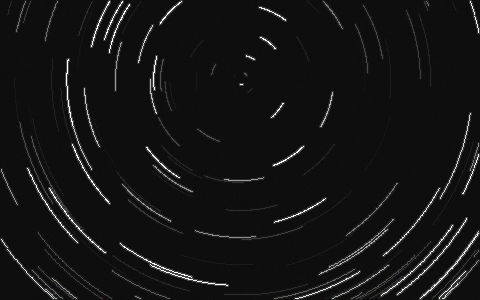
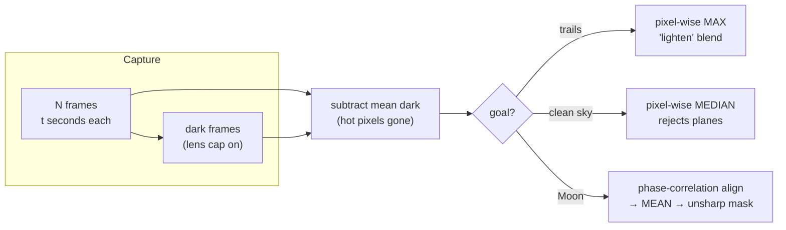

# 13 · Moon and star-trail photography

**Level 1 · stage 1** — photograph the Moon's craters and the sky wheeling around the celestial pole
with a phone or a camera on a tripod, then stack the frames with Python to beat noise and to draw star
trails whose arcs **measure the rotation of the Earth**.

| Cost | Time | Difficulty | Ages |
|---|---|---|---|
| **$0–40** (a phone tripod + clamp; free if you have a camera and tripod) | **one evening** | ●●○○○ | 8+ |

> [!NOTE]
> Night work: bring a red torch, warm clothes, and a buddy; never trespass or stand on roads; tell
> someone where you are. **Daytime rule**: never point a camera at the Sun (it can also damage the sensor).



*Above: `stack.py --selftest` stacks 90 synthetic 60-second frames (1.5 hours → 22.6° arcs about the pole).*

## What you'll learn

- The **exposure triangle** (aperture, shutter speed, ISO) and why the Moon needs fast shutters while
  stars need long ones.
- How fast the sky turns: **15.04° per hour** (360° per sidereal day of 23 h 56 m 4 s).
- The **500 rule / NPF rule** for sharp stars without tracking.
- **Stacking**: why averaging $N$ frames cuts random noise by $\sqrt N$, and how "lighten" (maximum)
  blending draws trails.

## Bill of Materials

| Qty | Item | Notes | Approx. cost (USD) |
|---|---|---|---|
| 1 | smartphone with manual/"pro" or night mode, **or** any camera with manual exposure | | $0 |
| 1 | tripod (or phone tripod + clamp) | sturdy beats tall | $0–25 |
| 1 | remote release: Bluetooth shutter, 2 s self-timer, or intervalometer app | no touching during exposure | $0–15 |
| 1 | intervalometer / time-lapse app (phones), or built-in interval timer (most cameras) | shoots hundreds of frames | $0 |
| — | spare battery / power bank (cold drains batteries) | | $0 |
| 1 | red torch (or red cellophane on a white one) | keeps night vision | $0 |
| — | computer with Python 3 + `pip install numpy pillow` | stacking | $0 |

## Build it (the shooting plan)

### A. The Moon (easiest; any night it's up)

1. Tripod, longest lens (phone: 2×/3×/5× telephoto; camera: 200–600 mm). Turn **off** flash and night mode.
2. Tap on the Moon and **lock focus**, then pull the exposure slider down until the craters show
   detail. Camera: start from the **"Looney 11" rule** — aperture f/11, shutter $1/\text{ISO}$ s (ISO 100 →
   1/100 s), then adjust.
3. Shoot **30–100 frames** in burst or interval mode. The best nights are a few days either side of
   first or last quarter: craters near the **terminator** (the day/night line) throw long shadows.

### B. Star trails

4. Find a dark spot, away from street lights, with the **pole star** in view (Polaris, for northern
   observers; south: the region around the Southern Cross's long axis extended).
5. Frame Polaris about a third of the way into the frame with an interesting foreground.
6. Focus at **infinity**: camera — manual focus on a bright star using live-view zoom; phone — pro mode
   focus slider to the mountain icon, or night mode and lock focus.
7. Settings (camera): widest lens, aperture f/2.8–f/4, **ISO 800–1600**, **20–30 s** exposures,
   RAW + JPEG, noise reduction **off** (it doubles the time and leaves gaps).
   Phone: pro mode, 10–30 s, ISO 800, or an app's "light trails" mode.
8. Start the intervalometer: continuous back-to-back frames for **30–120 minutes** (the longer, the
   longer the arcs). Note the start time.
9. At the end, shoot **10 dark frames** with the lens cap on (same settings) — they record the sensor's
   hot pixels so the script can subtract them.

### C. Stack

10. Copy the frames to folders `trails/`, `darks/`, `moon/`, then:
    ```bash
    python3 stack.py trails "trails/*.jpg" --dark "darks/*.jpg" -o startrails.jpg
    python3 stack.py trails "trails/*.jpg" --fade 0.97 -o comet.jpg        # fading "comet" trails
    python3 stack.py median "trails/*.jpg" -o clean_sky.png                # removes planes/satellites
    python3 stack.py moon   "moon/*.jpg" --sharpen 1.2 -o moon_stack.png   # align + average + sharpen
    python3 stack.py --selftest
    ```

## Diagram



## The science

**Earth's rotation.** Relative to the stars the Earth turns once per **sidereal day**, 23 h 56 m 4 s, so
the sky turns at

$$
\omega = \frac{360^\circ}{86\,164\ \text{s}} = 15.04^\circ\ \text{per hour} = 15.04''\ \text{per second}
$$

around the celestial poles. In a stacked image each star traces an arc of angle $\omega\,\Delta t$ about the
pole: a 60-minute stack draws 15° arcs. **Measure it**: in your stacked image, draw lines from the pole to
both ends of one bright trail and measure the angle (a protractor on screen, or any image editor). Divide by
the total time span — you have measured the length of the sidereal day.

**How long before stars smear?** A star moves across the sensor at a speed proportional to focal length.
The popular **500 rule** for a full-frame camera:

$$
t_\text{max} \approx \frac{500}{f \times \text{crop factor}}\ \text{s}
$$

(24 mm full-frame → 21 s; phone main camera with a 26 mm equivalent → 19 s). The stricter **NPF rule**
(Frédéric Michaud, Société Astronomique de France) includes pixel pitch $p$ (µm) and aperture $N$:
$t \approx (35N + 30p)/f$. Near the pole, stars move slower by $\cos\delta$ (declination $\delta$), so you can
expose longer.

**The Moon's brightness.** The sunlit Moon is a rock in full daylight, so it needs daylight exposures: the
"sunny 16" rule (f/16, 1/ISO) adjusted by one stop for its dark grey surface gives **"Looney 11"**: f/11 at
1/ISO s. Its image on the sensor is $s = f\,\theta$ with $\theta = 0.52^\circ = 9.1$ mrad: 300 mm of focal
length makes a 2.7 mm Moon.

**Why stacking works.** Each pixel = signal $S$ + random noise of standard deviation $\sigma$. Averaging
$N$ frames keeps $S$ but the random parts partly cancel:

$$
\sigma_\text{stack} = \frac{\sigma}{\sqrt N} \quad\Rightarrow\quad \text{SNR}_\text{stack} = \sqrt N\ \text{SNR}_1
$$

16 frames → 4× better signal-to-noise ratio (SNR); 100 frames → 10×. The self-test shows it: aligned
Moon frames with noise 0.060 stack to 0.016 (3.8×, against an ideal 4×). **Median** stacking is almost
as good and throws away outliers such as aircraft lights. **Maximum** ("lighten") stacking keeps the
brightest value each pixel ever saw — so every star paints its whole path.

**Alignment.** The Moon drifts between frames (Earth's rotation, a nudged tripod). `stack.py` finds the
shift between two frames by **phase correlation**: in the Fourier domain a translation is a pure phase
ramp, so the inverse transform of the normalised cross-power spectrum
$R = \dfrac{F_1 F_2^*}{|F_1 F_2^*|}$ is a sharp spike at the shift.

## Record & analyse your data

Log every session in [`data-sheet.csv`](data-sheet.csv) (settings, frames, sky quality on the Bortle
scale 1–9). For star trails, fill `trail_arc_deg_measured` and compute
`trail_arc_deg_expected = 15.041 × hours`. Your ratio tells you how well you measured the sidereal day.

## Troubleshooting

| Problem | Likely cause | Fix |
|---|---|---|
| Stars are blobs | focus not at infinity | focus on a bright star with live-view zoom; tape the focus ring |
| Trails have gaps | camera noise reduction on / interval too long | turn off long-exposure noise reduction; interval = exposure + 1 s |
| Sky is orange | light pollution | darker site, lower ISO, shoot toward the darkest part of the sky |
| Moon is a white disc | overexposed / night mode on | turn night mode off; drag exposure down; faster shutter |
| Moon stack is blurry | frames with bad seeing included | keep only the sharpest 30–50 % before stacking |
| `stack.py` runs out of memory | median of hundreds of large frames | use `trails` or `mean` (streaming), or resize frames first |

## Going further

- Build the [32-barn-door-star-tracker](../32-barn-door-star-tracker/) to cancel Earth's rotation and
  photograph the Milky Way and nebulae.
- Photograph the Moon every night for a month and assemble a **libration** animation (it "nods").
- Photograph **Jupiter's moons** night after night (phone through binoculars) and time their orbits.
- Try [44-exoplanet-transit-photometry](../44-exoplanet-transit-photometry/) — the same stacking and
  calibration, taken to 1-millimagnitude precision.

## References

- NASA Science, *Moon Photography Tips* / Moon phases — <https://science.nasa.gov/moon/>
- Sky & Telescope, *How to Photograph Star Trails* — <https://skyandtelescope.org/>
- C. D. Kuglin & D. C. Hines, "The phase correlation image alignment method", *Proc. IEEE Conf.
  Cybernetics and Society* (1975).
- International Dark-Sky Association (DarkSky International), *Light pollution map & Bortle scale* —
  <https://darksky.org/>
