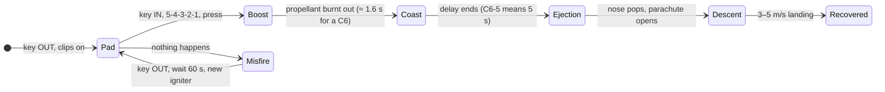
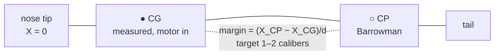

# 20 · Your first model rocket

**Level 2 · stage 2** — build a classic balsa-and-cardboard kit, fly it on **certified, commercially
made A, B and C motors** from an electrical launch system, and prove it is stable *before* it flies:
first with the Barrowman equations, then with a swing test.

| Cost | Time | Difficulty | Ages |
|---|---|---|---|
| **$50–100** (kit $15–25, launch set $35–50, motors $12–20 per pack of 3) | **4–6 hours** over 2 days (glue drying) + a launch day | ●●○○○ | 10+ with an adult; motor purchase age limits vary by state |

> [!CAUTION]
> Follow the **NAR Model Rocket Safety Code** (<https://www.nar.org/ModelRocketSafetyCode>) — summarised
> in [../SAFETY.md](../SAFETY.md) §2. Only certified commercial motors, used exactly as the manufacturer
> says; an electrical launch system with a safety interlock; 15 ft (4.6 m) minimum distance; a field at
> least 200 ft (61 m) across for B motors and 400 ft (122 m) for C; wind under 20 mph; never at clouds,
> aircraft or people. **Do not open, modify or "improve" motors, and do not make igniters.**

## What you'll learn

- How a model rocket flies: **boost → coast → ejection → recovery**, and what "C6-5" means.
- **Newton's second law with changing mass**, and a first taste of the rocket equation.
- **Stability**: centre of gravity (CG) vs. centre of pressure (CP), the **Barrowman method**, and the
  **swing test**.
- Craftsmanship: sanding and aligning balsa fins, glue fillets, a shock-cord mount, parachute packing.
- A safe launch procedure and a pre-flight checklist — habits every rocketeer keeps for life.

## Bill of Materials

| Qty | Item | Notes | Approx. cost (USD) |
|---|---|---|---|
| 1 | **Skill Level 1 kit with balsa fins**, e.g. Estes *Big Bertha* (BT-60 body, 18 mm motors, 18 in parachute) | builds real skills; its tube size matches experiments [21](../21-3d-printed-model-rocket/) and [22](../22-barometric-altimeter-payload/). The *Alpha III* (BT-50, one-piece fin can) is a quicker alternative. | $15–25 |
| 1 | **Launch set**: pad with 1/8-inch rod + blast deflector, and an electrical controller with a removable safety key (e.g. Estes Porta-Pad E + Electron Beam) | or a starter set that includes rocket + pad + controller | $35–50 |
| 1 pack | **certified** motors recommended by the kit — for Big Bertha: **B4-2, B4-4, B6-2, B6-4, C6-5** (Estes' list); start with **B6-4** | each pack includes igniters and plugs | $12–20 |
| 1 pack | flame-resistant recovery wadding | protects the parachute from the ejection gases | $4 |
| 1 | carpenter's wood glue (PVA) | fins, engine mount | $4 |
| 1 | sandpaper 220 & 400 grit, sanding block, hobby knife, ruler, pencil | | $5 |
| 4 | AA batteries (for the controller) | | $4 |
| — | optional: sanding sealer / filler primer + spray paint | a smooth finish flies higher | $10 |
| — | kitchen scale (grams), string, tape measure, inclinometer app | stability and altitude | $0 |

**Tools you do not need:** anything to make, mix, alter or re-load motors. Motors come finished.

## Build it

*Your kit's printed instructions are the authority for its parts; the steps below explain the why.*

### A. Motor mount

1. **Engine hook and block**: mark the motor tube as the kit shows, cut the small slit, insert the
   metal engine hook, and glue the engine block (a thick cardboard ring) inside the forward end. This
   block takes the motor's thrust and transmits it to the rocket.
2. **Centering rings**: slide them onto the motor tube at the marked positions, notch over the hook, glue
   with a fillet on both sides. Let it dry fully before step 3.
3. **Install the mount** in the body tube with glue spread inside the tube ahead of it, so the rings
   are glued as they slide in. The hook must stick out of the aft end.

### B. Fins

4. **Sand the balsa sheet** smooth while the fins are still in it, then cut or pop them out.
5. **Round the leading edge and the tip**, and taper the trailing edge slightly. Sharp square edges add
   drag; round leading edges help keep the airflow attached.
6. **Mark fin lines**: use the kit's fin-marking guide (or the wrap guide idea from
   [00](../00-stomp-rocket/)) to draw lines along the body, and extend them along a door frame edge so
   they're parallel to the axis.
7. **Glue each fin** with a thin coat on the root, let it tack for a minute, re-coat, press on the line.
   Check from behind that each fin is perpendicular to the body and straight along the axis. A
   crooked fin makes the rocket spin or corkscrew.
8. When dry, run a **fillet** of glue along each fin–body joint with your finger. Fillets double joint
   strength and reduce drag.
9. **Launch lug**: glue it along the body between two fins, straight and parallel to the axis.

### C. Recovery system

10. **Shock-cord mount**: glue the cord into the paper "tri-fold" mount and glue that inside the front
    of the body tube, a little way down so it doesn't stop the nose cone seating.
11. **Parachute**: attach the shroud lines with the kit's tape discs (or eyelets), tie the lines to
    the nose cone's loop, and the shock cord to the nose cone too.
12. **Finish** (optional): sanding sealer on the fins, primer, paint, decals. Weigh the finished
    rocket and write it down.

### D. Is it stable? (before any flight)

13. **Calculate** the CP with the Barrowman equations below (or `barrowman.py`, or OpenRocket).
14. **Find the CG** with a motor installed (an empty rocket balances in the wrong place): balance the
    loaded rocket on a finger or a ruler edge, mark the CG, measure its distance from the nose tip.
15. **Check the margin** $(X_\text{CP} - X_\text{CG})/d$ is **1–2 calibers**. Less than 1? Add modelling clay
    inside the nose cone and re-measure.
16. **Swing test**: tie a string round the rocket at the CG (tape it so it can't slip), and swing it in a
    circle around you at arm's length (outside, away from people). A stable rocket points
    **nose-forward** into the airflow and stays there. If it wobbles or flies tail-first, add nose weight.

### E. Launch day

17. **Pre-flight**: 3–4 squares of recovery wadding into the body, then the folded parachute (fold it,
    wrap the lines loosely), shock cord, then seat the nose cone — snug but not tight.
18. **Motor**: slide a new certified motor into the mount until it clicks under the engine hook.
    **Install the igniter and plug that come with it exactly as the motor manufacturer's instructions
    show**, then keep the rocket pointed away from people.
19. **Pad**: remove the safety key from the controller *first*. Slide the rocket onto the rod, clip the
    micro-clips to the igniter leads (not touching each other or the rod), step back **15 ft** or more.
20. **Launch**: check the sky (no aircraft, no low clouds) and the field (no people downrange), insert the
    safety key, the controller's continuity light should glow, count down **5-4-3-2-1**, press.
    **Remove the safety key immediately after launch.**
21. **Misfire?** Remove the key, wait **60 seconds**, then follow [../SAFETY.md](../SAFETY.md) §3.
22. **Recover** only from safe places — never from power lines or tall trees.

## Diagram





## The science

**Reading the motor.** In **C6-5**: **C** = total impulse 5.01–10.0 N·s (each letter doubles), **6** =
average thrust in newtons, **5** = seconds of delay between burnout and the ejection charge. Burn time
≈ impulse ÷ average thrust ≈ 10/6 ≈ 1.6 s. Real thrust curves (peaky at the start) are published for
every certified motor at <https://www.thrustcurve.org/>.

**Boost.** Net force = thrust − weight − drag, and the mass drops as propellant burns:

$$
m(t)\,\frac{dv}{dt} = T(t) - m(t)\,g - \tfrac12 \rho v^2 C_D A
$$

Ignoring drag and gravity, integrating gives the **Tsiolkovsky rocket equation**,
$\Delta v = v_e \ln(m_0/m_f)$ — the same law that governs orbital launchers.

**Coast and delay.** After burnout the rocket coasts upward, slowing at more than $g$ because of drag.
Time to apogee without drag would be $v_\text{burnout}/g$; the delay number is chosen so that ejection
happens near apogee, when the rocket is slowest and the parachute is under least stress. Heavier rockets
need **shorter** delays.

**Stability: CG ahead of CP.** If the rocket yaws by a small angle $\alpha$, each part produces a sideways
lift $N_i = \tfrac12\rho v^2 A_\text{ref}\,C_{N\alpha,i}\,\alpha$ acting at position $X_i$. The total acts at the
**centre of pressure**

$$
X_\text{CP} = \frac{\sum_i C_{N\alpha,i}\,X_i}{\sum_i C_{N\alpha,i}}
$$

If $X_\text{CP}$ is behind the CG, that force swings the nose back into the wind — a restoring torque.
**Barrowman's equations** (NARAM-8, 1966) give each term for subsonic flight:

*Nose cone* (any shape, slender-body theory): $C_{N\alpha} = 2$, at $X_N = L_N - V_N/A_\text{base}$
— for a cone $X_N = 0.666\,L_N$, for a tangent ogive $0.466\,L_N$.

*Fins* ($N$ fins, root chord $C_R$, tip chord $C_T$, semi-span $S$, sweep $X_R$, body radius $R$ at the fins,
reference diameter $d$, root leading edge at $X_B$):

$$
C_{N\alpha,F} = \left(1 + \frac{R}{S+R}\right)\frac{4N\,(S/d)^2}{1 + \sqrt{1 + \left(\dfrac{2 L_F}{C_R + C_T}\right)^2}},
\qquad L_F = \sqrt{S^2 + \left(X_R + \frac{C_T - C_R}{2}\right)^2}
$$

$$
X_F = X_B + \frac{X_R\,(C_R + 2C_T)}{3\,(C_R + C_T)} + \frac16\left[(C_R + C_T) - \frac{C_R\,C_T}{C_R + C_T}\right]
$$

The **static margin** in **calibers** (body diameters):

$$
\text{SM} = \frac{X_\text{CP} - X_\text{CG}}{d}, \qquad 1 \le \text{SM} \le 2 \ \text{is the sweet spot}
$$

Below 1: risk of unstable flight — add nose weight. Above ~2.5: very stable but it **weathercocks**
(turns into the wind) and loses altitude on windy days.

**Worked example** — run [`barrowman.py`](barrowman.py):

```
BT-50 sport rocket (printed ogive nose + 3-fin can, 250 mm tube)  (d = 24.8 mm, length = 336.8 mm)
   nose (ogive)           CN_alpha =  2.000   X =    40.2 mm
   3 fins                 CN_alpha = 16.056   X =   307.6 mm
   TOTAL                  CN_alpha = 18.056   X_cp =   278.0 mm from the tip
   mass budget 66 g → CG ≈ 248.0 mm from the tip (estimate — measure yours!)
   CG = 248.0 mm  →  static margin = 1.21 calibers: stable (1–2 calibers is the sweet spot)
```

```bash
python3 barrowman.py --cg 262            # your measured CG, mm from the tip
python3 barrowman.py --json my.json      # describe your own rocket (same keys as the examples)
```

Barrowman ignores the body tube's own lift, which pulls the real CP slightly forward at high angles of
attack but is small at the few-degree angles of normal flight; OpenRocket includes it. **The swing test is
the final word** — it measures your actual rocket.

## Record & analyse your data

Fill in [`data-sheet.csv`](data-sheet.csv) for every flight: motor, lift-off mass, CG, CP, margin,
swing-test result, wind, apogee estimate (inclinometer triangulation from [00](../00-stomp-rocket/), or
the altimeter from [22](../22-barometric-altimeter-payload/)), and whether ejection was early, on time or
late (was the rocket still climbing, at the top, or already arcing over?).

1. Compare apogee on B6-4 vs C6-5. Does roughly twice the impulse give twice the height? Why not?
2. Simulate your rocket in **OpenRocket** (free, <https://openrocket.info/>) and compare its predicted
   apogee and optimum delay with what you saw.
3. Note how the ejection timing matches the delay — this is how you choose delays for heavier rockets.

## Troubleshooting

| Problem | Likely cause | Fix |
|---|---|---|
| Continuity light doesn't glow | clips dirty or touching, igniter not seated, flat batteries | clean clips with sandpaper; re-check the igniter; new batteries |
| Rocket sticks on the rod | lug crooked or glue inside it | clean the lug; lightly wipe the rod with dry graphite / wax |
| Spirals or loops on boost | crooked fins, or CG too far aft | swing-test; add nose weight; re-glue fins straight |
| Parachute melted or stuck | too little wadding, chute packed tight | 3–4 sheets of wadding, loose chute, dust with talc |
| Ejection while still climbing / after arc-over | delay too short / too long for the rocket's mass | pick the next delay the kit recommends |
| Motor kicked out at ejection | engine hook not latched | seat the motor until the hook clicks over it |
| Fin broke on landing | no fillet, or landing on hard ground | glue fillets; bigger parachute for heavy rockets |

## Going further

- Re-build the fins from the kit pattern in **OpenSCAD** as a fin can — that's exactly
  [21-3d-printed-model-rocket](../21-3d-printed-model-rocket/).
- Add a payload bay and fly the altimeter of [22](../22-barometric-altimeter-payload/).
- Join a **NAR section** and fly at club launches (bigger fields, a range safety officer, and people
  who have made every mistake already). The path to high power starts at
  [40-high-power-rocketry-certification](../40-high-power-rocketry-certification/).
- Simulate in depth: [41-openrocket-deep-dive](../41-openrocket-deep-dive/).

## References

- National Association of Rocketry, *Model Rocket Safety Code* — <https://www.nar.org/ModelRocketSafetyCode>
- J. S. Barrowman & J. A. Barrowman, "The Theoretical Prediction of the Center of Pressure", NARAM-8
  R&D report (1966); and J. S. Barrowman, "The Practical Calculation of the Aerodynamic Characteristics
  of Slender Finned Vehicles", M.S. thesis, Catholic University of America (1967).
- Estes Industries, *Big Bertha* kit page (specs, recommended motors) — <https://estesrockets.com/products/big-bertha>
- G. Harry Stine & Bill Stine, *Handbook of Model Rocketry*, 7th ed., Wiley (2004).
- ThrustCurve.org — certified motor data — <https://www.thrustcurve.org/>
- OpenRocket — <https://openrocket.info/>
- NASA Glenn Research Center, *Rocket Stability* — <https://www.grc.nasa.gov/www/k-12/rocket/rktstab.html>
