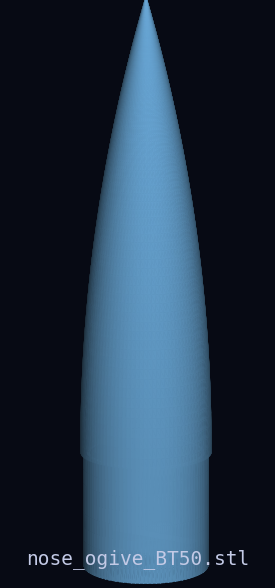
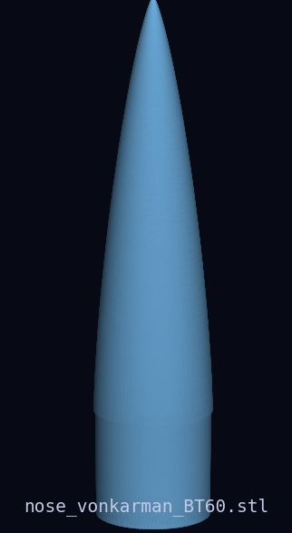
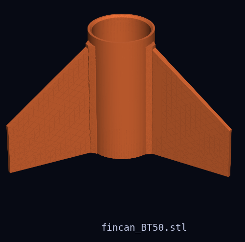
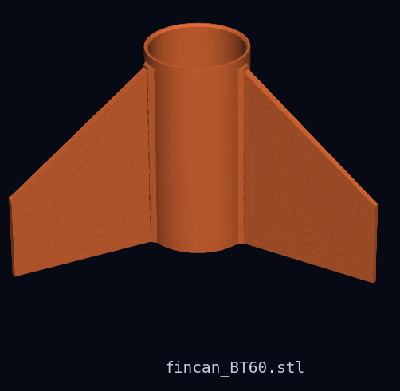
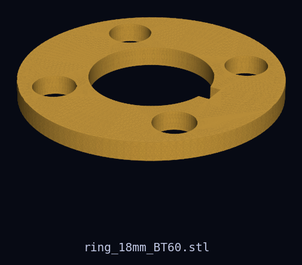
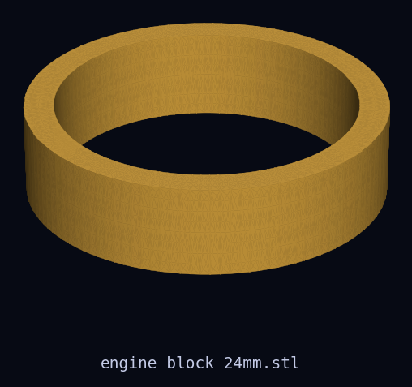
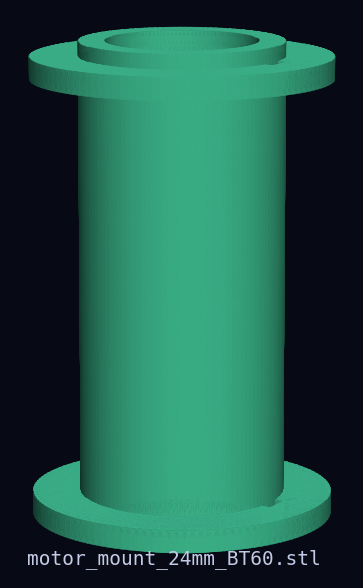
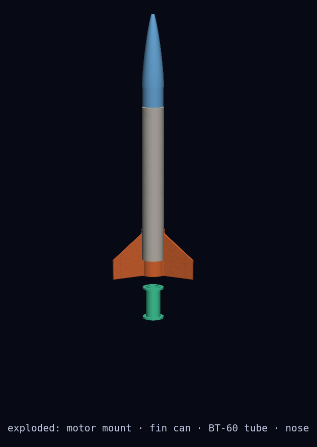
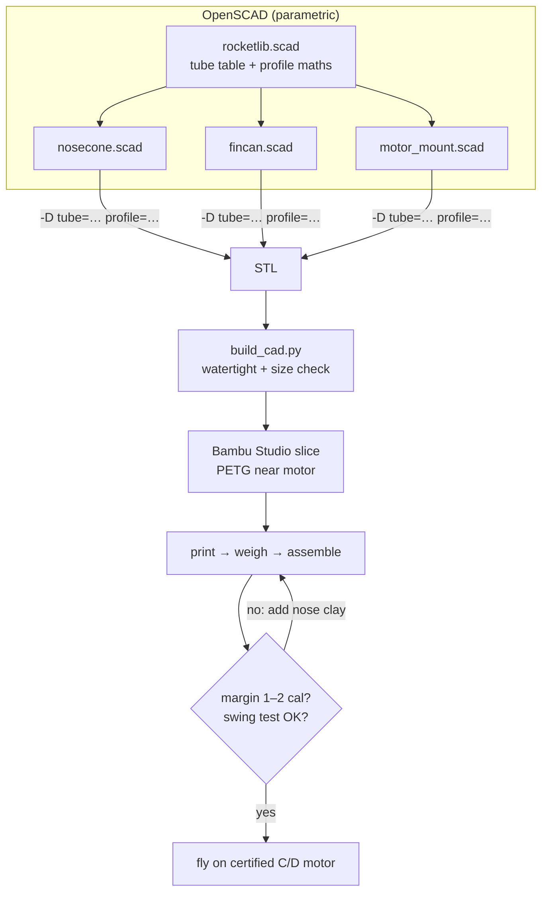

# 21 · 3D-printed model rocket (parametric OpenSCAD)

**Level 2 · stage 2** — design your own rocket instead of building a kit. Parametric OpenSCAD files
generate **nose cones** (conical, tangent ogive, von Kármán, LV-Haack, parabolic, elliptical, power
series) for any standard body tube, **slide-on fin cans** for BT-50 and BT-60, and **18 mm / 24 mm motor
mounts, centering rings and engine blocks** — all printable without supports on a Bambu Lab printer.
The rocket flies on certified commercial motors, exactly like [20](../20-first-model-rocket/).

| Cost | Time | Difficulty | Ages |
|---|---|---|---|
| **$30–80** (tube + parachute + motors; ≈ $3 of filament) | **6–10 hours** incl. printing | ●●●○○ | 12+ with an adult |

> [!CAUTION]
> A printed rocket is still a **Class 1 model rocket**: NAR Model Rocket Safety Code, certified motors
> only, lightweight **non-metal** nose/body/fins, ≤ 1,500 g at lift-off ([../SAFETY.md](../SAFETY.md)
> §2). Printed parts are heavier than balsa and often make a rocket **tail-heavy**: always check the
> stability margin and swing-test before flying. Print anything that touches the motor in **PETG or
> ASA**, never PLA (PLA softens at ≈ 60 °C).


## What you'll learn

- The **mathematics of nose-cone profiles** and why rocket designers pick one over another.
- **Parametric design** in OpenSCAD: one file, many rockets, driven by a table of real tube sizes.
- **Design for additive manufacturing**: print orientation, overhangs, bridging, wall thickness,
  tolerances for slip fits.
- How printed mass shifts the **CG** and how to fix stability with the Barrowman method.

## Files

| File | What it makes | Key parameters |
|---|---|---|
| [`cad/rocketlib.scad`](cad/rocketlib.scad) | shared tube table (BT-5 … BT-80), motor sizes, nose-profile maths | — |
| [`cad/nosecone.scad`](cad/nosecone.scad) | hollow nose cone with shoulder and printed shock-cord bar | `tube`, `profile`, `fineness`, `wall`, `shoulder_cal`, `fit` |
| [`cad/fincan.scad`](cad/fincan.scad) | slide-on fin can: tapered fins, root fillets, launch lug | `tube`, `fins`, `root`, `tip`, `span`, `sweep`, `lug_rod` |
| [`cad/motor_mount.scad`](cad/motor_mount.scad) | centering ring / engine block / one-piece motor mount | `part`, `motor` (13/18/24), `tube` |

Ready-made STLs in [`stl/`](stl/) (all verified watertight, binary, millimetres):

| STL | Size (mm) | Preview |
|---|---|---|
| `nose_ogive_BT50.stl` · `nose_vonkarman_BT50.stl` · `nose_conical_BT50.stl` · `nose_lvhaack_BT50.stl` · `nose_elliptical_BT50.stl` | Ø 24.8 × 109 (elliptical 72) |  |
| `nose_vonkarman_BT60.stl` · `nose_ogive_BT60.stl` | Ø 41.6 × 183 |  |
| `fincan_BT50.stl` (3 fins) | 81 × 94 × 56 |  |
| `fincan_BT60.stl` (3 fins) · `fincan_BT60_4fin.stl` | 135 × 155 × 89 · 178 × 178 × 89 |  |
| `ring_18mm_BT50.stl` · `ring_18mm_BT60.stl` · `ring_24mm_BT60.stl` | Ø 23.8 / 40.2 × 3 |  |
| `engine_block_18mm.stl` · `engine_block_24mm.stl` | Ø 17.8 / 23.9 × 6 |  |
| `motor_mount_24mm_BT60.stl` · `motor_mount_18mm_BT60.stl` | Ø 40.2 × 66 |  |

Rebuild everything (and re-verify) with `python3 ../tools/build_cad.py`.

## Bill of Materials

| Qty | Item | Notes | Approx. cost (USD) |
|---|---|---|---|
| 1 | body tube **BT-60** (41.6 mm OD) × 300–450 mm, or **BT-50** (24.8 mm OD) | Estes / generic kraft tube | $4–8 |
| 1 | motor tube **BT-50** (for 24 mm motors) or **BT-20** (18 mm), 70 mm, + engine hook | or print `motor_mount` | $3 |
| 1 | parachute 12–18 in (30–45 cm) + 1 m elastic shock cord + 30 cm Kevlar leader | Kevlar survives ejection heat | $8 |
| 1 | 1/8-inch launch lug (printed on the fin can) | | $0 |
| ~250 g | **PETG** filament (fin can, motor mount); PLA or PETG for the nose | | $5 |
| 1 | 5- or 30-minute epoxy, sandpaper 220/400 | fin can ↔ tube, rings ↔ tube | $6 |
| 10–20 g | modelling clay | nose ballast | $1 |
| 1 pack | certified motors: **C6-3/C6-5** (18 mm) or **D12-3/D12-5** (24 mm) | choose by simulation | $15–25 |
| — | recovery wadding, launch system from [20](../20-first-model-rocket/) | | — |

## Build it

### A. Measure and customise

1. **Measure your tube** with calipers: outer and inner diameter, in two places. The table in
   `rocketlib.scad` holds nominal sizes (BT-50 24.8 / 24.1 mm, BT-60 41.6 / 40.5 mm); if yours differ by
   more than 0.2 mm, use `tube = "custom"` with your numbers.
2. **Print a fit test first** (10 minutes): the centering ring for your tube. It should slide into the
   tube with light friction. Too tight → increase `fit_out`; too loose → decrease it. Use the same
   correction for `fit` in the nose and fin can.
3. **Open a `.scad` file** in OpenSCAD, show the **Customizer** (Window ▸ Customizer), choose the tube,
   profile and fin sizes, **F6** to render, **File ▸ Export ▸ STL**. Or from a terminal:
   ```bash
   cd cad
   openscad -o nose.stl   -D 'tube="BT-60"' -D 'profile="vonkarman"' -D fineness=3.5 nosecone.scad
   openscad -o fincan.stl -D 'tube="BT-60"' -D fins=3 -D span=55 fincan.scad
   openscad -o mount.stl  -D 'part="mount"' -D motor=24 -D 'tube="BT-60"' motor_mount.scad
   ```

### B. Print (Bambu Lab X1 / P1 / A1. On an A1 mini, 180 mm tall: set `fineness=3.3` for BT-60 noses and use the 3-fin can)

| Part | Orientation | Filament / preset | Layer | Walls | Infill | Notes |
|---|---|---|---|---|---|---|
| Nose cone | **tip up** | PLA or PETG, *Generic PLA* ≈ 220 °C / 55 °C or *Generic PETG* ≈ 250 °C / 70 °C | 0.12–0.16 mm (smooth curve) | 3 | 10–15 % | no supports; the shock-cord bar bridges; slow the outer wall for a better surface |
| Fin can | **aft end down** (fin trailing edges on the plate) | **PETG** | 0.2 mm | 4 | 25–40 % gyroid | no supports; 5 mm brim if fins lift |
| Motor mount / rings | flat | **PETG or ASA** | 0.2 mm | 4 | 40 % | never PLA near the motor |
| Engine block | flat | PETG / ASA | 0.2 mm | 100 % | — | takes the motor's thrust |

Textured PEI plate for PETG (or glue stick on smooth PEI as a release layer). Let PETG parts cool on the
plate. Weigh every part and write it in [`data-sheet.csv`](data-sheet.csv).

### C. Assemble

4. **Motor mount** (paper tube version): glue the engine block inside the forward end of the motor
   tube, fit the hook as in [20](../20-first-model-rocket/), glue the two printed centering rings with the
   notch over the hook, then epoxy the mount into the aft end of the body tube. (Printed one-piece mount:
   epoxy it straight in; retain the motor with a snug masking-tape friction wrap.)
5. **Shock cord**: tie the Kevlar leader around the aft centering ring (or epoxy a tri-fold mount ahead
   of the motor mount), then the elastic cord to the leader.
6. **Fin can**: scuff the tube's aft 90 mm and the inside of the fin can with 220 grit, epoxy, slide it
   on flush with the aft end, sight down the body to align the fins, and let it cure standing upright.
7. **Nose cone**: sand the shoulder if it's tight. Tie the shock cord and parachute to the printed
   cross-bar inside the shoulder.
8. **Stability**: install a motor, find the CG, compute the CP (below). Press clay into the nose tip
   until the margin is 1–2 calibers, then **swing-test** (see [20](../20-first-model-rocket/) step 16).

### D. Fly

9. Pick the motor and delay with [`../20-first-model-rocket/barrowman.py`](../20-first-model-rocket/barrowman.py)
   for stability and **OpenRocket** for altitude and delay (import the dimensions from the SCAD
   parameters). Follow the launch procedure in [20](../20-first-model-rocket/).



## Diagram



## The science

**Nose-cone profiles.** With base radius $R$, length $L$ and $x$ measured from the tip, the profiles in
`rocketlib.scad` are (G. A. Crowell, *The Descriptive Geometry of Nose Cones*, 1996):

| Shape | Radius $y(x)$ |
|---|---|
| Conical | $y = R\,x/L$ |
| Tangent ogive | $\rho = \dfrac{R^2 + L^2}{2R}, \quad y = \sqrt{\rho^2 - (L - x)^2} + R - \rho$ |
| Elliptical | $y = R\sqrt{1 - (1 - x/L)^2}$ |
| Parabolic ($0 \le K \le 1$) | $y = R\,\dfrac{2(x/L) - K(x/L)^2}{2 - K}$ |
| Power series | $y = R\,(x/L)^n$ |
| Haack series | $\theta = \arccos\!\left(1 - \dfrac{2x}{L}\right), \quad y = \dfrac{R}{\sqrt\pi}\sqrt{\theta - \dfrac{\sin 2\theta}{2} + C\sin^3\theta}$ |

The Haack series comes from minimising wave drag with slender-body theory: $C = 0$ is the **von Kármán**
(LD-Haack) ogive, minimum drag for a given length and base diameter; $C = 1/3$ is the **LV-Haack**, minimum
drag for a given length and volume.

**Does the shape matter for a model rocket?** Wave drag only exists near and above the speed of sound. At
model-rocket speeds (Mach 0.1–0.4) drag is dominated by **skin friction** and **base drag**, and rounded
shapes (elliptical, ogive, von Kármán) all beat a sharp cone slightly because the flow stays attached
without a pressure spike at the shoulder. Pick by looks, weight and fineness ratio: longer noses have more
skin area. Measure it: fly the same rocket with two noses on the same motor and compare apogees.

**Where the nose's lift acts.** For any nose, slender-body theory gives $C_{N\alpha} = 2$ acting at

$$
X_N = L - \frac{V_\text{nose}}{A_\text{base}}
$$

(conical: $\tfrac23 L$; tangent ogive: $0.466\,L$; von Kármán ≈ $0.50\,L$). `barrowman.py` integrates this
numerically for every profile.

**Printed mass moves the CG aft.** The printed fin can (≈ 40 g in PETG for BT-60) sits at the tail
beside the motor. `barrowman.py`'s BT-60 example shows the effect: without ballast the CG lands near
323 mm and the margin is only ≈ 0.9 calibers — **unstable**. 15 g of clay in the nose tip moves the CG to
297 mm and the margin to 1.5 calibers:

```
Cosmic Library BT-60 (printed von Kármán nose + 3-fin can, 300 mm tube)  (d = 41.6 mm, length = 445.6 mm)
   nose (vonkarman)       CN_alpha =  2.000   X =    72.8 mm
   3 fins                 CN_alpha = 15.700   X =   397.3 mm
   TOTAL                  CN_alpha = 17.700   X_cp =   360.6 mm from the tip
   mass budget 171 g → CG ≈ 297.5 mm from the tip (estimate — measure yours!)
   CG = 297.5 mm  →  static margin = 1.52 calibers: stable (1–2 calibers is the sweet spot)
```

**Slip fits.** FDM parts come out slightly oversize on the outside and undersize on holes (the nozzle
squashes plastic outward). The files use radial clearances (`fit` = 0.15–0.2 mm) that work on a
calibrated Bambu printer with a 0.4 mm nozzle; the fit-test ring in step 2 tells you your printer's
correction.

**Wall thickness.** `wall = 1.2 mm` is three 0.4 mm extrusion lines. It is measured horizontally, so on
steep parts of the nose the true wall is $1.2\cos\phi$ where $\phi$ is the local surface angle — which is
why the last 8 mm of the tip are printed solid (`solid_tip`).

## Record & analyse your data

In [`data-sheet.csv`](data-sheet.csv) record each part's material, settings, print time, **mass** and
fit. For flights, use the flight columns of [20's data sheet](../20-first-model-rocket/data-sheet.csv).

1. **Predicted vs actual mass**: OpenSCAD's volume × density × infill is a poor predictor for thin
   shells; compare with the scale and learn your printer's factor.
2. **Nose-shape shoot-out**: same rocket, same motor lot, two nose shapes, three flights each. Is the
   apogee difference larger than the flight-to-flight scatter?
3. Log the altimeter from [22](../22-barometric-altimeter-payload/) for real numbers.

## Troubleshooting

| Problem | Likely cause | Fix |
|---|---|---|
| Nose shoulder too tight / loose | tube differs from nominal | adjust `fit` by ±0.05 mm, or sand; tape wrap if loose |
| Fin can won't slide on | elephant's foot on the first layers | enable elephant-foot compensation, or sand the bore's bottom edge |
| Fins warp or lift | PETG cooling/adhesion | 5 mm brim, glue stick, slower first layer, draft shield |
| Stringy nose surface | PETG retraction | dry the filament; enable "wipe"; lower temperature 5 °C |
| Nose tip blob | tiny layers, not enough cooling | "slow down for layer cooling" on; print two noses at once |
| Margin under 1 caliber | printed tail too heavy | more nose clay; lighter infill in the fin can; longer body tube |
| Mount softened after flight | PLA used | reprint in PETG/ASA; use a paper motor tube |

## Going further

- Add a **payload section**: print a coupler (tube ID shoulder on both ends) and fly the altimeter
  sled from [22](../22-barometric-altimeter-payload/).
- Print fins with an **airfoil** cross-section (hull of three thin slabs instead of two in `fin()`).
- Design a **boat-tail** transition and add it to `barrowman.py` (the transition term is already there).
- Model the rocket in OpenRocket and compare its CP with Barrowman's — then take it further in
  [41-openrocket-deep-dive](../41-openrocket-deep-dive/).
- Ready for more? Electronics that fly: [30-flight-computer-pcb](../30-flight-computer-pcb/).

## References

- G. A. Crowell Sr., *The Descriptive Geometry of Nose Cones* (1996) — the standard reference for the
  profile equations.
- J. S. Barrowman, *The Practical Calculation of the Aerodynamic Characteristics of Slender Finned
  Vehicles* (1967).
- OpenSCAD User Manual — <https://openscad.org/documentation.html>
- Bambu Lab Wiki, *Filament guide* (PLA / PETG / ASA settings) — <https://wiki.bambulab.com/>
- OpenRocket technical documentation — <https://openrocket.info/>
- National Association of Rocketry, *Model Rocket Safety Code* — <https://www.nar.org/ModelRocketSafetyCode>
