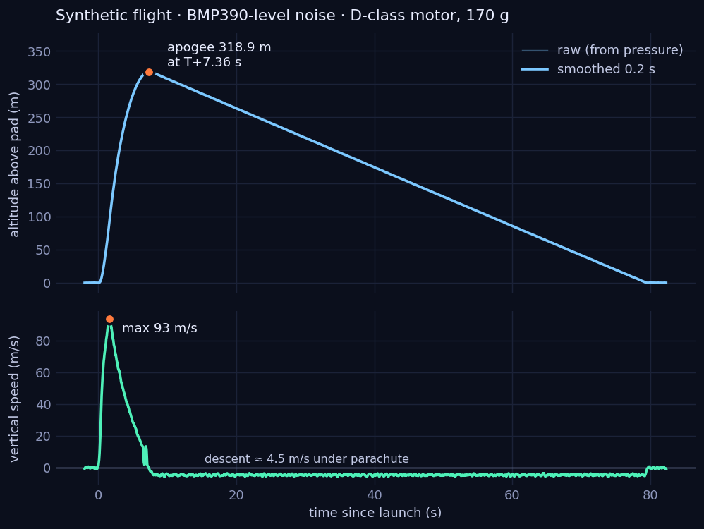
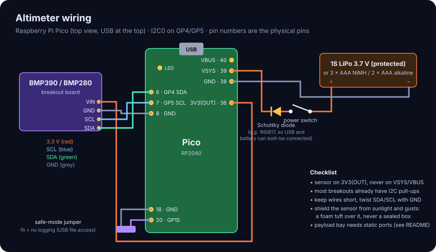
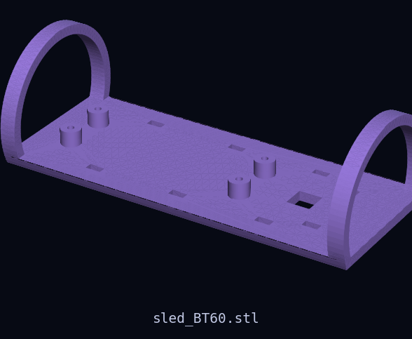
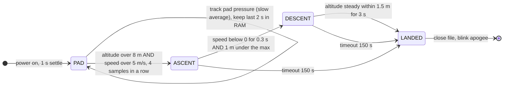

# 22 · Barometric altimeter payload (Raspberry Pi Pico + BMP390)

**Level 2 · stage 2** — a $25 flight recorder: a Raspberry Pi Pico and a Bosch BMP390 (or BMP280)
pressure sensor on a 3D-printed sled inside a BT-60 payload bay. MicroPython firmware detects **launch,
apogee and landing**, logs 50 samples per second to a CSV file in flash, and blinks the apogee in metres
when you pick the rocket up. A Python script plots the flight.

| Cost | Time | Difficulty | Ages |
|---|---|---|---|
| **$25–60** (Pico $4–6, BMP390 breakout $10–12, battery + switch $5–10, payload tube $5–10) | **6–8 hours** | ●●●○○ | 12+ with an adult |

> [!CAUTION]
> The altimeter is **only a passenger**: it records, it never controls anything. Do not connect it to
> any igniter, ejection charge or pyrotechnic device — that is out of scope for Cosmic Library. Follow the
> NAR code ([../SAFETY.md](../SAFETY.md)): the payload counts toward the 1,500 g limit, and the rocket
> must be re-checked for stability with the payload installed. Use a protected LiPo cell or AAA cells
> (§7).



*Above: a synthetic flight (physics simulation + sensor noise) run through the real firmware logic and
plotted by `tools/plot_flight.py`. Your flights produce the same plot.*

## What you'll learn

- **The barometric formula**: how air pressure falls with height, and how to turn pascals into metres.
- **Embedded programming** in MicroPython: I2C, fixed-rate sampling, ring buffers, writing flash safely.
- **State machines and filtering**: an alpha–beta filter estimates speed from noisy altitude; a
  PAD → ASCENT → DESCENT → LANDED state machine detects events robustly.
- **Testing without flying**: the same `flightlogic.py` runs on the Pico and in desktop unit tests
  against 40 synthetic flights.
- Reading a flight: burnout, coast, ejection, descent rate — and comparing with a simulation.

## Bill of Materials

| Qty | Item | Notes | Approx. cost (USD) |
|---|---|---|---|
| 1 | Raspberry Pi **Pico** or Pico W (RP2040), or Pico 2 | headers optional (solder wires directly to save mass) | $4–7 |
| 1 | **BMP390** breakout (e.g. Adafruit 4816) — or a BMP280 breakout | BMP390: ±0.25 m relative accuracy; BMP280: ≈ ±1 m | $4–12 |
| 1 | 1S 3.7 V LiPo **with protection circuit**, 150–400 mAh — or a 2 × AAA holder | powers VSYS (1.8–5.5 V) | $4–8 |
| 1 | slide switch + 1N5817 Schottky diode | power switch; diode lets USB and battery coexist | $1 |
| 1 | 2-pin jumper (or a "remove before flight" pin + header) | safe-mode on GP15 | $0.5 |
| — | 26–28 AWG silicone wire, heat-shrink, solder | | $2 |
| 4 | M2 × 5 mm self-tapping screws | Pico to sled | $1 |
| 1 | printed sled — [`stl/sled_BT60.stl`](stl/sled_BT60.stl) | PETG or PLA | $0.5 |
| 1 | BT-60 payload section: ≈ 120 mm of BT-60 tube + a printed or balsa **coupler** + bulkhead | holds the sled; nose cone on top | $5–10 |
| 1 | pin vise or 1.5–2 mm drill | static port holes | $0 |
| — | foam (a small piece of open-cell foam) | shields the sensor from gusts and light | $0 |
| — | computer with Thonny (or `mpremote`) and Python 3 + numpy + matplotlib | | $0 |

## Build it

### A. Wire it



1. **Sensor (I2C0)**: VIN → **3V3(OUT)** (pin 36), GND → GND (pin 38 or 8), SDA → **GP4** (pin 6), SCL →
   **GP5** (pin 7). Most breakouts include pull-up resistors and a regulator; never feed the sensor from
   VSYS/VBUS.
2. **Battery**: battery + → switch → diode anode; diode cathode (the striped end) → **VSYS** (pin 39);
   battery − → GND (pin 38). The Pico's datasheet recommends this diode so the battery and USB can be
   connected at the same time.
3. **Safe-mode jumper**: GP15 (pin 20) and GND (pin 18) on a 2-pin header. Jumper fitted = logger stays
   idle (use it on the bench to copy files).
4. Keep wires short; twist SDA/SCL with a ground wire; heat-shrink every joint.

### B. Flash the firmware

5. Install **MicroPython** on the Pico: hold BOOTSEL, plug in USB, drag the `.uf2` for your board from
   <https://micropython.org/download/> onto the RPI-RP2 drive.
6. In **Thonny** (Tools ▸ Options ▸ Interpreter ▸ MicroPython (Raspberry Pi Pico)), open and **save to the
   Pico** these three files from [`firmware/`](firmware/): `bmp.py`, `flightlogic.py`, `main.py`. Or:
   ```bash
   pip install mpremote
   mpremote cp firmware/bmp.py firmware/flightlogic.py firmware/main.py :
   ```
7. **Bench test**: with the jumper *off*, press the Pico's reset (or unplug/replug). The LED blinks 3×,
   then a heartbeat every second = armed. In Thonny's shell you'll see `sensor: BMP390 free flash: … kB`.
   Blow gently across the sensor: nothing should trigger (launch needs +8 m *and* +5 m/s).
8. **Elevator/stairs test**: carry it up two floors quickly — you'll get a small "flight" logged if you
   lower the launch threshold in `FlightDetector(launch_alt=…)` temporarily. Restore the defaults before
   flying.

### C. Print and fit the sled

9. Print [`stl/sled_BT60.stl`](stl/sled_BT60.stl) **deck down**, no supports (PETG/PLA, 3 walls, 20 %).
   Re-generate for other tubes with `openscad -o sled.stl -D tube_id=55.2 cad/sled.scad` (BT-70).
10. Screw the Pico onto the standoffs (USB toward the end you can reach), zip-tie the battery under the
    deck and the sensor on the pad aft of the Pico, with a scrap of open-cell foam loosely over the sensor
    (stops gusts and sunlight; never seal it airtight).



### D. Payload bay and static ports

11. The bay must be **sealed from the motor/ejection section** (a bulkhead on the coupler) — ejection gas
    in the bay causes huge pressure spikes and heat — but **open to outside air** through small **static
    ports** so it reads the ambient pressure.
12. Drill **3–4 holes evenly around** the bay, at least 3 body diameters behind the nose-cone shoulder
    (away from the turbulent flow there). A widely used sizing rule (from PerfectFlite's altimeter
    manuals) for one hole is $d \approx D^2 L / 400$ in inches (bay diameter $D$, length $L$); split the area
    over several holes. For a 1.6 × 4.7 inch BT-60 bay that is ≈ 0.03 inch — tiny, so **three 1.5 mm
    (1/16 in) holes** are plenty.
13. Weigh the complete rocket with payload and a motor, **re-check stability** with
    [`barrowman.py`](../20-first-model-rocket/barrowman.py) and a swing test. The payload is in the nose
    end, which usually *improves* stability.

### E. Fly and read out

14. At the pad: switch on, wait for the heartbeat (≈ 2 s), close the bay. The logger tracks slow
    weather drift while it waits; it is fine to sit for an hour.
15. After landing, the LED blinks the apogee in metres digit by digit (a pause between digits; 10 blinks
    = 0). Write it down.
16. Back home: fit the jumper, connect USB, copy `flight_001.csv` (and `flights.txt`) off the Pico with
    Thonny (View ▸ Files) or `mpremote cp :flight_001.csv .`
17. Plot it:
    ```bash
    python3 tools/plot_flight.py flight_001.csv
    ```

## Diagram



## The science

**Pressure falls with height.** In a static atmosphere each layer supports the weight of the air above:
$dp = -\rho g\,dh$. With the ideal gas law $\rho = pM/(RT)$ and a temperature that falls linearly,
$T = T_0 - Lh$ (the International Standard Atmosphere troposphere: $T_0 = 288.15$ K,
$L = 0.0065$ K/m), integration gives the **barometric formula**:

$$
p = p_0\left(1 - \frac{L h}{T_0}\right)^{\frac{g M}{R L}}
\quad\Longleftrightarrow\quad
h = \frac{T_0}{L}\left[1 - \left(\frac{p}{p_0}\right)^{\frac{R L}{g M}}\right]
$$

with $\dfrac{RL}{gM} = \dfrac{8.31446 \times 0.0065}{9.80665 \times 0.0289644} = 0.190263$, so
$h \approx 44\,330\ \text{m}\,\left[1 - (p/p_0)^{0.1903}\right]$. Near the ground **1 hPa ≈ 8.3 m**, so the
BMP390's ±3 Pa relative accuracy is ±0.25 m. Using the **pad** pressure as $p_0$ gives height above the pad
directly — no need to know the weather.

**Temperature matters a little.** $T_0$ appears as a scale factor: a 15 °C warmer day stretches
all heights by $15/288 \approx 5\,\%$. For precise work, replace $T_0$ with the measured pad temperature
(the sensor gives it) — a good exercise.

**Alpha–beta filter.** Differentiating noisy altitude to get speed amplifies noise. The firmware keeps a
predicted altitude $\hat x$ and speed $\hat v$; each sample $z$ corrects them by fixed fractions of the
prediction error $r$:

$$
\hat x^- = \hat x + \hat v\,\Delta t, \qquad r = z - \hat x^-, \qquad
\hat x \leftarrow \hat x^- + \alpha r, \qquad \hat v \leftarrow \hat v + \frac{\beta}{\Delta t} r
$$

with $\alpha = 0.35$, $\beta = 0.06$. It is the steady-state form of a Kalman filter for a constant-velocity
model.

**Event detection that survives real flights.**

- *Launch* needs height **and** speed for 4 samples (a door slam or gust gives a brief pressure
  blip, not both). The launch time is back-dated with $t = 2h/v$ (constant acceleration).
- *Apogee* needs 0.3 s of continuous descent **and** a 1 m drop. The ejection charge's brief pressure
  spike inside the airframe looks like a sudden 5 m drop for 80 ms; requiring 0.3 s rides it out.
- *Apogee is the maximum*, not the detection moment: the logger reports when the filtered altitude
  peaked.

**Tested on 40 synthetic flights.** [`tools/synth_flight.py`](tools/synth_flight.py) integrates
$m\,\dot v = T(t) - mg - \tfrac12\rho v|v|C_D A$ with a D-class thrust curve, ejection, a parachute,
ISA pressure, 1.5–6 Pa of noise, sample-time jitter and an ejection spike, then feeds the samples to the
**real** `flightlogic.py`. The unit tests also check the BMP280 driver against the worked example in
Bosch's datasheet and the BMP390 driver's register parsing:

```text
$ python3 tools/test_flightlogic.py
test_blink_digits (__main__.TestAltitude.test_blink_digits) ... ok
test_isa_table (__main__.TestAltitude.test_isa_table) ... ok
test_zero (__main__.TestAltitude.test_zero) ... ok
test_datasheet_example (__main__.TestBMP280.test_datasheet_example) ... ok
test_register_parsing_matches_datasheet_formula (__main__.TestBMP390...) ... ok
test_many_synthetic_flights (__main__.TestFlights.test_many_synthetic_flights) ...
  worst of 40 flights: launch time error 0.09 s, apogee error 0.52 m / 0.32 s
ok
test_no_false_launch_on_pad (__main__.TestFlights.test_no_false_launch_on_pad) ... ok
Ran 7 tests — OK
```

**Why the barometer lies during boost.** Fast airflow over the static ports lowers the pressure inside
slightly (and near Mach 1 far more), so barometric speed and height lag or jump during boost. That's why
apogee (slowest point) is the barometer's best moment, and why flight computers add an accelerometer —
see [30-flight-computer-pcb](../30-flight-computer-pcb/).

## Record & analyse your data

```bash
python3 tools/plot_flight.py flight_001.csv                # → flight_001.png + summary
python3 tools/synth_flight.py --noise 5                     # make a synthetic BMP280-like flight
python3 tools/test_flightlogic.py                           # run the unit tests
```

`flight_NNN.csv` columns: `t_s` (seconds from launch; negative = pad history), `pressure_pa`, `temp_c`,
`alt_m` (raw), `alt_filt_m`, `vel_mps`, `state`. `plot_flight.py` recomputes altitude from raw pressure,
so you can change the reference or formula later. Record each flight's summary in
[`data-sheet.csv`](data-sheet.csv) next to the **OpenRocket** prediction:

1. How close is OpenRocket's apogee? Adjust its drag coefficient until it matches — you've measured your
   rocket's $C_D$.
2. Was ejection before, at or after apogee? Choose the delay for next time.
3. Is the descent rate what your parachute should give, $v = \sqrt{2mg/(\rho C_D A)}$?

## Troubleshooting

| Problem | Likely cause | Fix |
|---|---|---|
| `no BMP280/BMP390 found` | wiring, or SDA/SCL swapped | check GP4 = SDA, GP5 = SCL; run `I2C(0, sda=Pin(4), scl=Pin(5)).scan()` in the shell |
| No heartbeat, LED blinks slowly every 2 s | safe-mode jumper fitted | remove it for flight |
| Rapid 10-blink bursts | flash nearly full | delete old `flight_*.csv` files |
| Flight logged on the drive to the field | a very fast lift or a big pressure change | switch on only at the pad |
| Huge spikes at ejection | bay not sealed from the ejection gas | add a bulkhead; seal the coupler |
| Altitude noisy / sawtooth | sunlight or wind on the sensor | foam over the sensor; static ports behind the shoulder, not at it |
| Apogee reported too early | long, violent spike at ejection | raise `apogee_confirm` to 0.5 s |
| File empty after flight | battery disconnected on landing | secure the battery; the file is flushed every second, so check for a partial file |

## Going further

- Add an **accelerometer** (e.g. an LSM6DSO32 on the same I2C bus) and fuse it with the barometer —
  the core of [30-flight-computer-pcb](../30-flight-computer-pcb/).
- Radio the altitude down live with LoRa: [31-lora-telemetry-ground-station](../31-lora-telemetry-ground-station/).
- Use the measured pad temperature in the altitude formula and see how much the apogee changes.
- Fly it in the water rocket of [10](../10-water-bottle-rocket/) and compare with the simulator.
- Validate a full simulation against your logs: [41-openrocket-deep-dive](../41-openrocket-deep-dive/).

## References

- Bosch Sensortec, *BMP390 datasheet* (BST-BMP390-DS002) and *BMP280 datasheet* (BST-BMP280-DS001) —
  <https://www.bosch-sensortec.com/>
- Raspberry Pi Ltd, *Raspberry Pi Pico datasheet* (pinout, VSYS diode, mechanical drawing) —
  <https://datasheets.raspberrypi.com/pico/pico-datasheet.pdf>
- MicroPython documentation for the RP2040 — <https://docs.micropython.org/en/latest/rp2/quickref.html>
- U.S. Standard Atmosphere, 1976 (NOAA/NASA/USAF) — the ISA constants used here.
- PerfectFlite, *StratoLogger CF user manual* (static port sizing) — <https://www.perfectflite.com/>
- OpenRocket — <https://openrocket.info/>
