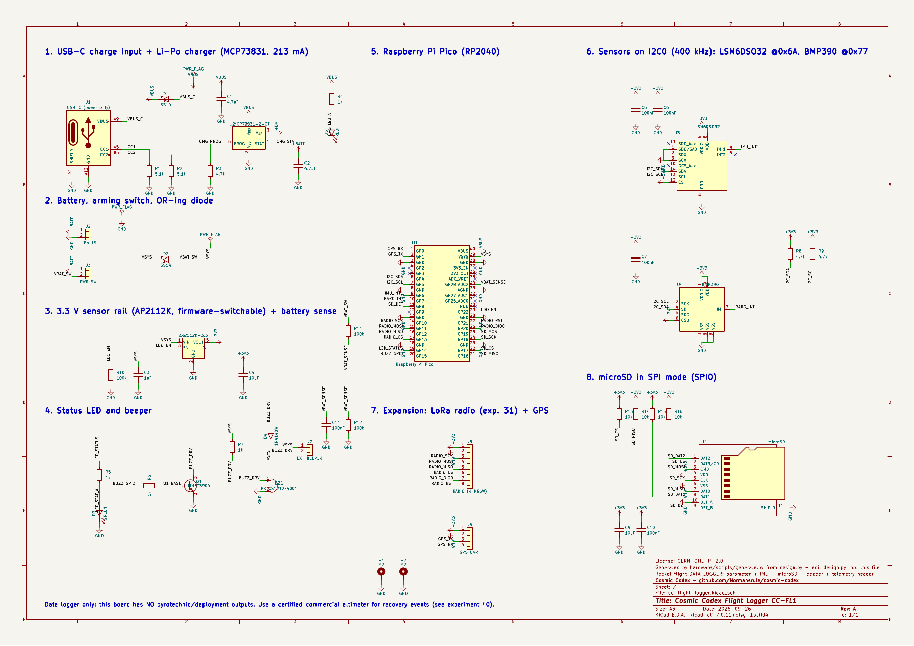
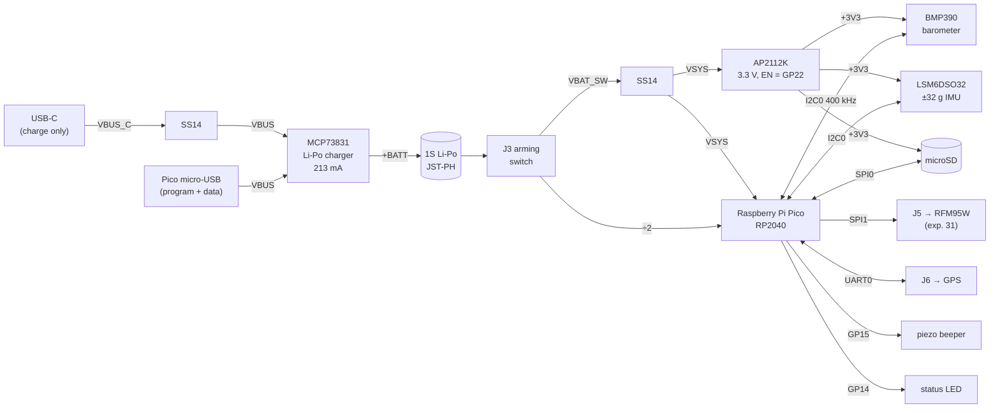
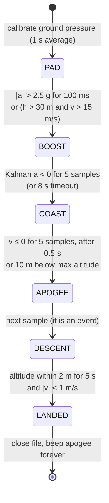
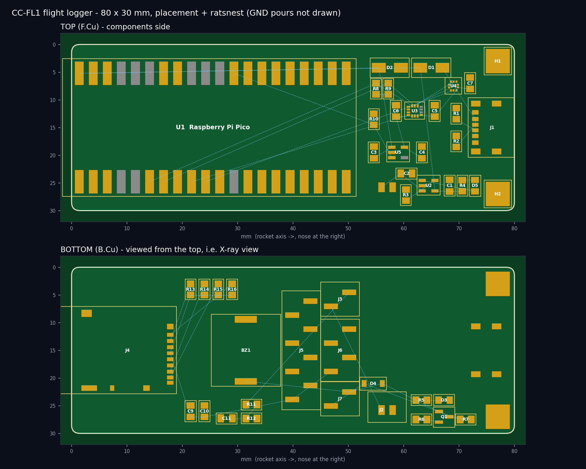
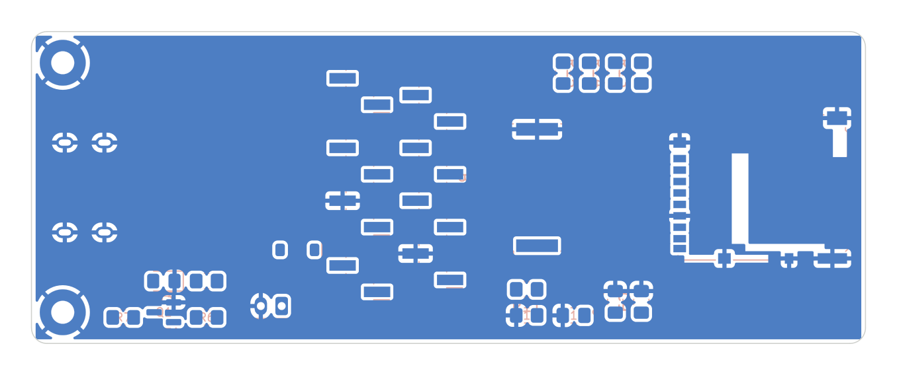
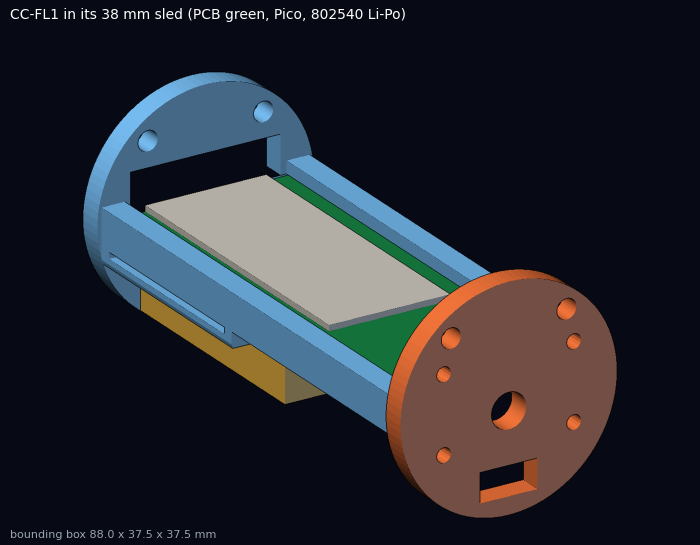

# 30 · Flight-computer PCB — a hand-solderable rocket data logger in KiCad

**Level 3 · stage 3** — design, build and test **CC-FL1**, an 80 × 30 mm printed circuit board that
rides inside a 38 mm airframe and records a rocket flight at 100 samples per second: a Bosch BMP390
barometer, an ST LSM6DSO32 ±32 g inertial measurement unit (IMU), a microSD card, a Li-Po charger,
a beeper and a header for the LoRa radio of [experiment 31](../31-lora-telemetry-ground-station/).
The brain is a **Raspberry Pi Pico** soldered flat by its castellated edge, so there is no
0.4 mm-pitch microcontroller to solder. You get a complete KiCad project generated from one Python
file, firmware with a Kalman filter and a flight state machine, a host-side test harness that
"flies" the real firmware through synthetic flights, and a 3D-printed sled.

It is the natural next step after [experiment 22](../22-barometric-altimeter-payload/) (Pico + BMP390
on a breadboard, MicroPython): same idea, now as a real board, in C++, with sensor fusion.

| Cost | Time | Difficulty | Ages |
|---|---|---|---|
| **$45–110** (boards $5–25, parts $30–45, optional sensor assembly $15–30, Li-Po + card $12) | **20–35 h** (routing 3–5 h, assembly 3 h, firmware + tests 6 h, flight day) | ●●●●○ | 15+; flights at a club launch |

> [!CAUTION]
> **This is a data logger, not a recovery controller.** The board has no outputs that fire anything,
> and none should be added. If a flight needs electronic recovery deployment, that is done by a
> **certified commercial altimeter**, and flying such rockets requires high-power certification and
> mentorship ([experiment 40](../40-high-power-rocketry-certification/)). Fly only
> **commercially certified motors**, at a club launch under a Range Safety Officer, following the NAR or
> Tripoli safety code ([../SAFETY.md](../SAFETY.md)). Li-Po cells: charge on a non-flammable surface,
> never puncture or short them, and store them at ~3.8 V.



## What you'll learn

- **Schematic capture and PCB layout in KiCad**, from a design described as *data* (`design.py`) —
  symbols, footprints, nets, net classes, design-rule checks (DRC), and why placement decides routing.
- **Power design** for a battery gadget: USB-C sink detection, a linear Li-Po charger,
  diode OR-ing, a low-dropout (LDO) regulator, dropout and thermal budgets.
- **Sensor physics**: why a barometer measures altitude, what an accelerometer *really* measures
  (specific force, not acceleration), and how the two are fused with a **Kalman filter**.
- **Real-time firmware** on a dual-core RP2040: a 100 Hz control loop on core 0, a lock-free queue to
  a microSD writer on core 1, a flight **state machine**, and a non-blocking beeper.
- **Testing without flying**: a physics-based synthetic flight generator and a C++ host harness that
  runs the exact firmware logic against ground truth — the way aerospace flight software is tested.
- **Manufacturing**: generating gerbers, choosing assembly options at JLCPCB/PCBWay, reflowing
  land-grid-array (LGA) sensors.

## What is in this folder

```text
30-flight-computer-pcb/
├── hardware/
│   ├── kicad/                  KiCad project (cc-flight-logger.kicad_pro/.kicad_sch/.kicad_pcb)
│   │   ├── cosmic_codex.kicad_sym   project symbols: Pico, BMP390, LSM6DSO32
│   │   └── cosmic_codex.pretty/     project footprints: Pico (hand-solder), BMP390 LGA-10
│   ├── scripts/
│   │   ├── design.py           ← the single source of truth: parts, pins → nets, placement
│   │   ├── make_library.py     writes the project symbols/footprints
│   │   ├── generate.py         writes schematic, board (via KiCad's pcbnew) and BOM.csv
│   │   ├── check.py            asks KiCad for the netlist + DRC and verifies them against design.py
│   │   ├── plot_board.py       placement + ratsnest picture
│   │   └── export_fab.sh       gerbers / drill / pick-and-place / BOM (after routing, KiCad 8+)
│   ├── BOM.csv                 bill of materials with manufacturer + LCSC/DigiKey numbers
│   ├── cc-flight-logger-schematic.pdf
│   ├── ROUTING.md              the routing exercise, step by step
│   └── ORDERING.md             JLCPCB / PCBWay ordering and assembly guide
├── firmware/
│   ├── flight_logger/          Arduino-Pico sketch: flight_logger.ino, flight_core.{h,cpp}, config.h,
│   │                           nmea.h, telemetry_packet.h
│   └── test/                   host test harness (make), mock Arduino headers
├── cad/avionics_sled.scad      OpenSCAD sled for a 38 mm tube  → stl/avionics_sled.stl, stl/nose_bulkhead.stl
├── tools/synth_flight.py       synthetic flight + sensor generator
├── tools/plot_flight.py        plot any flight log
├── data/                       a synthetic flight (sensor input, truth, and the replayed log)
└── images/
```

## System overview



## Bill of Materials

Full list with footprints and distributor numbers: [`hardware/BOM.csv`](hardware/BOM.csv) (generated
from `design.py`). Prices are typical single-quantity US prices in 2026 — check on the day.

| Ref | Qty | Part | Manufacturer part number (MPN) | LCSC | Approx. |
|---|---|---|---|---|---|
| U1 | 1 | Raspberry Pi Pico (Pico W also fits) | SC0915 | — (buy from an approved reseller) | $4 |
| U3 | 1 | 6-axis IMU, ±32 g, LGA-14L 2.5 × 3 mm | ST LSM6DSO32TR | search MPN | $4–6 |
| U4 | 1 | Barometer, LGA-10 2 × 2 mm | Bosch BMP390 | search MPN | $3–5 |
| U2 | 1 | Li-Po charger 4.20 V, SOT-23-5 | Microchip MCP73831T-2ACI/OT | C424093 | $0.70 |
| U5 | 1 | 3.3 V 600 mA LDO, SOT-23-5 | Diodes Inc AP2112K-3.3TRG1 | C51118 | $0.30 |
| J1 | 1 | USB-C receptacle, 6-pin power-only | GCT USB4125-GF-A | search MPN | $0.80 |
| J4 | 1 | microSD socket, push-push, card detect | Hirose DM3AT-SF-PEJM5 | search MPN | $1.50 |
| J2 | 1 | JST-PH 2-pin vertical header | JST B2B-PH-K-S(LF)(SN) | search MPN | $0.20 |
| J3, J7 / J6 / J5 | 2 / 1 / 1 | 2.54 mm SMD pin headers 1×2 / 1×4 / 1×8 | generic | — | $1 |
| BZ1 | 1 | piezo sounder 4 kHz, 12 × 12 mm SMD | Murata PKLCS1212E4001-R1 | search MPN | $1.50 |
| Q1 | 1 | NPN transistor, SOT-23 | MMBT3904 | C20526 | $0.05 |
| D1, D2 | 2 | Schottky 40 V 1 A, SMA | SS14 | C2480 | $0.10 |
| D4 | 1 | switching diode, SOD-123 | 1N4148W | C81598 | $0.05 |
| D3 / D5 | 1 / 1 | LED 0805 green / red | KT-0805G / KT-0805R | C2297 / C84256 | $0.10 |
| R1–R16 | 16 | 0805 resistors 1 %: 5.1k ×2, 4.7k ×3, 1k ×4, 100k ×3, 10k ×4 | UNI-ROYAL 0805W8F… | C27834 · C17673 · C17513 · C17407 · C17414 | $0.50 |
| C1–C11 | 10 | 0805 MLCC: 4.7 µF ×2, 10 µF ×2, 1 µF ×1, 100 nF ×5 | Samsung CL21… | C1779 · C15850 · C28323 · C49678 | $0.50 |
| — | 1 | 1S Li-Po 3.7 V ≈ 400 mAh, 8 × 25 × 40 mm ("802540"), with protection circuit, JST-PH lead | — | — | $6–10 |
| — | 1 | microSD card 4–32 GB, "industrial"/high-endurance preferred | — | — | $6–10 |
| — | 2 | M2 × 6 mm screws; 2 × M3 or #4-40 threaded rod for the av-bay | — | — | $2 |
| — | ~15 g | PETG or ASA filament for the sled | — | — | $0.50 |

**Tools**: temperature-controlled soldering iron with a fine chisel tip, flux, 0.5 mm solder wire,
tweezers, a multimeter, a loupe; for the sensors either a small hot plate + solder paste + stencil, a
hot-air station, or the fab's assembly service ([ORDERING.md](hardware/ORDERING.md)).

## The science

### 1. Altitude from pressure

In a hydrostatic atmosphere pressure falls with height as $dp = -\rho g\,dh$. With the International
Standard Atmosphere (ISA) troposphere — temperature $T = T_0 - L h$, $T_0 = 288.15$ K,
$L = 0.0065$ K/m — this integrates to the **pressure altitude**

$$
h(p) = \frac{T_0}{L}\left[1-\left(\frac{p}{p_0}\right)^{\frac{R L}{g M}}\right]
      = 44\,330.8\ \text{m}\left[1-\left(\frac{p}{101\,325\ \text{Pa}}\right)^{0.190263}\right].
$$

The logger reports **altitude above the pad**, $h_{AGL} = h(p) - h(p_{pad})$. Subtracting two pressure
altitudes matters: plugging the pad pressure straight into the formula instead of 101 325 Pa silently
assumes the pad is at sea-level temperature and over-reads by 1.4 % at a 600 m site and 3.5 % at
1500 m. The host test harness caught exactly that bug during development (see `flight_core.cpp`).

Sensitivity: $\left|dh/dp\right| = 1/(\rho g) \approx 0.083$ m/Pa near sea level, so the BMP390's
≈ 3 Pa relative accuracy is ≈ 0.25 m — the datasheet's figure.

### 2. What an accelerometer measures

An accelerometer measures **specific force** $\vec f = \vec a - \vec g$ (acceleration minus gravity), in
units of $g$. Standing on the pad it reads $+1\,g$ along the nose axis even though nothing accelerates;
in free fall at apogee it reads $\approx 0$. So the vertical acceleration of a rocket flying nose-up is

$$ a = (f_{axial} - 1)\,g_0 . $$

After apogee the rocket hangs at an arbitrary angle under its parachute, so the firmware switches to the
magnitude $|\vec f|$, which is ≈ 1 g at a steady descent rate whatever the attitude.

### 3. Fusing the two: a 3-state Kalman filter

State $\mathbf{x} = [h,\ v,\ a]^T$, constant-acceleration model driven by random *jerk*:

$$
\mathbf{x}_{k+1} = F\,\mathbf{x}_k + \mathbf{w},\qquad
F = \begin{bmatrix}1 & \Delta t & \tfrac12\Delta t^2\\ 0 & 1 & \Delta t\\ 0&0&1\end{bmatrix},\qquad
Q = \sigma_j^2\begin{bmatrix}\tfrac{\Delta t^5}{20} & \tfrac{\Delta t^4}{8} & \tfrac{\Delta t^3}{6}\\
\tfrac{\Delta t^4}{8} & \tfrac{\Delta t^3}{3} & \tfrac{\Delta t^2}{2}\\ \tfrac{\Delta t^3}{6} & \tfrac{\Delta t^2}{2} & \Delta t\end{bmatrix}
$$

Predict: $\hat{\mathbf x}^- = F\hat{\mathbf x}$, $P^- = FPF^T + Q$. Each measurement $z$ of one state
component $i$ (barometer → $h$, accelerometer → $a$) is then applied as a scalar update:

$$
K = \frac{P^-_{:,i}}{P^-_{ii} + r},\qquad \hat{\mathbf x} = \hat{\mathbf x}^- + K\,(z - \hat x^-_i),\qquad
P = P^- - K\,P^-_{i,:}
$$

$r$ is the measurement variance: $\sigma_b^2 = (0.6\text{ m})^2$ for the barometer and
$\sigma_a^2 = (0.8\text{ m/s}^2)^2$ for the accelerometer. The ratio of $Q$ to $r$ decides how much the
filter trusts the model versus the sensors. Near Mach 1 the shock waves around the airframe corrupt
static pressure, so above 150 m/s the barometer's $\sigma_b$ is multiplied by 30 (**"Mach lockout"**) and
the filter coasts on the accelerometer.

Velocity is never measured directly — it is *inferred* from the two sensors, and apogee is simply the
moment the inferred velocity crosses zero.

### 4. The state machine



Every threshold has a reason: 100 ms of high acceleration rejects a knock on the launch rail (the test
harness injects one); the backup barometric launch detection saves the flight if the IMU fails; the
0.5 s coast lockout rejects transonic pressure glitches; the landed window tolerates wind rocking the
rocket on the ground. On the pad the ground reference follows slow weather drift with a 30 s time
constant, and the last 1 s of pad data is kept in RAM and written at liftoff, so the log starts
*before* first motion.

### 5. Power budget

| Load | Current |
|---|---|
| Pico at 125 MHz, both cores busy | ≈ 25 mA |
| LSM6DSO32 at 416 Hz high-performance | ≈ 0.6 mA |
| BMP390 at 100 Hz, ×4 oversampling | ≈ 0.7 mA |
| microSD writing (average; peaks ~100 mA) | ≈ 20–40 mA |
| LEDs, divider, beeper average | ≈ 3 mA |
| **Total** | **≈ 50–70 mA** |

A 400 mAh cell gives $t \approx 0.8 \times 400/60 \approx 5$ h — plenty for a long day on the pad.
The charger's current is set by one resistor: $I_{REG} = 1000\text{ V}/R_{PROG} = 1000/4700 = 213$ mA
(≈ 0.5 C for this cell). The charger is linear, so it dissipates
$P = (V_{DD}-V_{BAT})\,I \approx (4.65-3.7)(0.213) = 0.20$ W; at ≈ 230 °C/W for SOT-23-5 that is a
46 °C rise — warm, safe. The LDO's dropout is ≈ 25 mV at 60 mA, but the OR-ing Schottky D2 drops
≈ 0.3 V, so the sensor rail stays at 3.3 V while $V_{BAT} \gtrsim 3.65$ V (most of a Li-Po's
capacity). Below that it sags gently; the sensors run down to 1.7 V, microSD cards to 2.7 V.

The USB-C port uses two **5.1 kΩ pull-down resistors** ($R_d$) on CC1/CC2: that is how a USB-C *sink*
tells a charger "I am a device, please turn on 5 V". Without them a C-to-C cable delivers nothing.

### 6. Why 4.7 kΩ I2C pull-ups?

At 400 kHz Fast-mode the bus rise time must be under 300 ns: $t_r \approx 0.847\,R_pC_b$. With
$C_b \approx 50$ pF (two sensors, short tracks), $R_p = 4.7$ kΩ gives ≈ 200 ns. ✔

## Build it — step by step

### A. Generate and inspect the design (30 min)

1. Install **KiCad 8** (or 9) and Python 3.9+. On Linux `sudo apt install kicad` also provides the
   `pcbnew` Python module the generator uses; on Windows/macOS run the scripts with KiCad's bundled
   Python ("KiCad Command Prompt").
2. Regenerate everything and verify it:
   ```bash
   cd hardware/scripts
   python3 make_library.py    # project symbols + footprints
   python3 generate.py        # schematic, board, BOM.csv
   python3 check.py           # KiCad netlist == design.py, DRC summary
   python3 plot_board.py      # images/pcb-placement.png
   ```
   `check.py` exports the netlist *with KiCad itself* and verifies all 166 connected pins against
   `design.py`, then runs KiCad's DRC: expect **0 errors other than "unconnected items"** (routing is
   your job) and some cosmetic silkscreen warnings.
3. Open `hardware/kicad/cc-flight-logger.kicad_pro`. Read the schematic block by block (the numbers
   match the headings in the drawing). Open the PCB editor and the 3D viewer.

### B. Route the board (3–5 h)

Follow **[hardware/ROUTING.md](hardware/ROUTING.md)**. The placement is done for you:



| KiCad render, top (F.Cu + silk) | Bottom (mirrored) |
|---|---|
|  |  |

### C. Order (1 week of waiting)

Run `hardware/scripts/export_fab.sh` and follow **[hardware/ORDERING.md](hardware/ORDERING.md)** —
JLCPCB or PCBWay, 1.6 mm, ENIG, with or without assembly of the two LGA sensors.

### D. Assemble (3 h) — in this order, testing as you go

1. **Sensors first** (they need reflow): U3, U4 by hot plate/hot air, or arrive fab-assembled.
2. **Power section**: J1, R1, R2, D1, U2, R3, R4, D5, C1, C2. Plug in USB-C *without* a battery:
   the red LED may flicker (no battery = charger hunting) — that is normal. Measure 4.6–5.0 V on the
   VBUS side of C1.
3. **Battery path**: J2, J3 (fit a jumper), D2, U5, C3, C4, R10. Connect the Li-Po; **check polarity
   first**. With EN held low by R10 the +3V3 rail should read 0 V — the firmware switches it on.
4. **Everything else** on the bottom: J4 microSD, R13–R16, C9, C10, BZ1, Q1, R5–R7, D3, D4, headers.
5. **The Pico last**, flat on its pads (tack two opposite corners, check alignment, then drag-solder).
6. Clean off flux with isopropyl alcohol; inspect every joint with the loupe.

### E. Firmware (1 h)

1. Arduino IDE 2 → *File → Preferences → Additional boards manager URLs*:
   `https://github.com/earlephilhower/arduino-pico/releases/download/global/package_rp2040_index.json`.
   Install **"Raspberry Pi Pico/RP2040/RP2350"** by Earle Philhower in the Boards Manager.
2. Library Manager: **Adafruit BMP3XX Library**, **Adafruit LSM6DS** (and **LoRa** by Sandeep Mistry
   if you enable telemetry).
3. Open `firmware/flight_logger/flight_logger.ino`, board *Raspberry Pi Pico*, hold **BOOTSEL** while
   plugging the Pico's micro-USB, *Upload*.
4. Serial Monitor at 115200: `CC-FL1 ready. ground 101234.5 Pa, logging to LOG000.CSV`, and the beeper
   gives a double chirp every 3 s. Error beeps: **2 long = barometer, 3 = IMU, 4 = microSD**.

### F. Bench tests (1 h)

1. **Host tests first** (no hardware needed):
   ```bash
   cd firmware/test && make
   ```
   This compiles `flight_core.cpp` with `-Wall -Wextra -Werror`, runs unit tests (ISA altitude, beep
   encoder, Kalman convergence, NMEA parser, telemetry CRC), generates four synthetic flights
   (nominal; rail knock + deployment shock; 3× sensor noise; 1500 m launch site), replays each through
   `FlightComputer`, and checks the detected events against the simulator's truth:
   ```text
   truth:    launch 5.00  burnout 6.90  apogee 20.41 s @ 1135.5 m  landed 87.83
   detected: launch 5.01  burnout 6.90  apogee 20.43 s @ 1135.4 m  landed 92.73
   PASS
   ...
   ALL TESTS PASSED (0 failures)
   sketch compiles against the mock Arduino API (with and without telemetry)
   ```
2. **Pad (orientation) test**: stand the board nose-up for 10 s, then pull the card and look at
   `ax_g/ay_g/az_g`. The axis reading ≈ +1.00 g must be the one set in `config.h`
   (`AXIAL_AXIS`, `AXIAL_SIGN`); fix the config if not. A mis-set axis is the #1 cause of "it never
   detected launch".
3. **Altitude-in-a-jar test**: put the powered logger in a jar with a hand vacuum pump (a brake-bleeder
   pump is ideal) and pull ~50 hPa: the log's `baro_alt_m` should climb ~400 m. Release slowly.
4. **Endurance**: leave it logging on the pad for 2 h on battery; check `vbat_v` and that the file is
   intact.

### G. Fly it (a club launch)

1. Print the sled (`stl/avionics_sled.stl` standing on the tail bulkhead, `stl/nose_bulkhead.stl`
   flat; PETG, 4 walls, no supports). Slide the board into the rails from the tail, fix it with two M2
   screws, strap the Li-Po under the shelf.
2. Drill **static pressure ports** in the av-bay tube, well aft of the nose-cone shoulder and clear of
   the fins. A widely used rule of thumb (from altimeter makers such as PerfectFlite) is one 1/4-inch
   hole per 100 in³ (1.64 L) of bay volume; this 38 mm bay is only ≈ 115 cm³ (7 in³), so use **three
   ≈ 1 mm holes spaced 120° apart** (three holes average out wind blowing across the tube). The nose
   bulkhead's small holes let the whole bay breathe.
3. Arm (fit the J3 switch) at the pad, listen for the double chirp, walk away. After recovery, listen
   to the apogee beeps before switching off.
4. Plot:
   ```bash
   python3 tools/plot_flight.py LOG000.CSV            # add --feet if your club reports feet
   ```




## Testing & data analysis

`plot_flight.py` prints a summary — apogee, time to apogee, maximum velocity and acceleration, and
the median descent rate in the upper half of the descent and in the last 100 m. Things to do with
real data:

- **Compare with the simulation** you ran before flight (experiment 41): apogee error, burn time,
  maximum velocity. A 5–10 % difference is normal; a larger one usually means the drag coefficient
  or the mass in the simulation was wrong.
- **Estimate the drag coefficient** from the coast phase: after burnout, $m\,a = -m g - \tfrac12 \rho v^2 C_D A$,
  so $C_D = -2m(a + g)/(\rho v^2 A)$ with $a$ and $v$ from the Kalman columns.
- **Verify the descent rates** against your parachute sizing: $v_t = \sqrt{2mg/(\rho C_D A)}$.
- **Check the thrust curve**: during boost, $F = m(a+g) + D$. Integrate it over the burn and compare
  the impulse with the certified motor's published data.
- **Noise**: on the pad, the standard deviation of `baro_alt_m` should be ≈ 0.2–0.5 m and of
  `kf_alt_m` several times smaller.

## Troubleshooting

| Symptom | Likely cause | Fix |
|---|---|---|
| 2 long beeps | BMP390 not answering at 0x77 | reflow U4; check +3V3 and GP22 (EN) high; I2C pull-ups present |
| 3 long beeps | LSM6DSO32 not at 0x6A | reflow U3; SA0 must be tied to GND |
| 4 long beeps | no card / not FAT32 / SPI wiring | format FAT32 (≤ 32 GB), reseat, check SD_CS pull-up |
| Launch never detected | wrong `AXIAL_AXIS`/`AXIAL_SIGN`, or the rocket accelerates < 2.5 g | pad test; lower `launch_acc_g` only if your motor/rocket really is that gentle |
| Apogee detected far too early | pressure ports near a shoulder or too large; sunlight on the BMP390 | move/resize ports; foam over the sensor |
| Altitude spikes at apogee | deployment pressure pulse in a sealed bay | vent holes in the bulkhead; the filter will ride through short spikes |
| USB-C charger gives nothing | R1/R2 missing (C-to-C cable) | fit the 5.1 kΩ CC pull-downs |
| Red LED flickers without battery | normal MCP73831 behaviour with no cell | — |
| `dropped` > 0 in the serial summary | slow card | use a high-endurance card, increase `RING_RECORDS` |

## Going further

- **Route it with a 4-layer stack-up** (signal / GND / power / signal) and compare the DRC effort.
- **Non-blocking barometer**: put the BMP390 in normal mode and read its data registers instead of
  forced-mode conversions — frees ≈ 5 ms per loop for other work.
- **Attitude estimation**: integrate the gyroscope into a quaternion and project acceleration onto the
  vertical (tilted flights read low with the axial-only model).
- **Telemetry**: fit an RFM95W to J5, set `TELEMETRY_ENABLED 1`, and build the ground station in
  [experiment 31](../31-lora-telemetry-ground-station/).
- **Compare with commercial altimeters** flown side by side in the same bay (and the same static
  ports) — the best validation you can do.
- Re-implement `flight_core` in Rust with `embassy-rp`, keeping the same host tests as the specification.

## Known limitations

- **The board is placed but not routed.** Routing is the tutorial exercise ([ROUTING.md](hardware/ROUTING.md)).
- The files are written in KiCad 7 format so the generator could validate them with KiCad's own tools
  in CI; KiCad 8/9 open and upgrade them.
- The BMP390 footprint is authored for this project (KiCad's library has none); verify it against the
  Bosch land-pattern drawing before ordering.
- The sketch was compiled against *mock* Arduino headers on the host, not against the real
  arduino-pico core and libraries; expect to fix small API differences the first time you build it.

## References

- Raspberry Pi Ltd, *Raspberry Pi Pico Datasheet* (pin-out, §4.5 powering with an external supply) — <https://datasheets.raspberrypi.com/pico/pico-datasheet.pdf>
- Bosch Sensortec, *BMP390 Datasheet* BST-BMP390-DS002 — <https://www.bosch-sensortec.com/media/boschsensortec/downloads/datasheets/bst-bmp390-ds002.pdf>
- STMicroelectronics, *LSM6DSO32 Datasheet* — <https://www.st.com/resource/en/datasheet/lsm6dso32.pdf>
- Microchip, *MCP73831/2 Datasheet* (DS20001984) — charge current and thermal regulation
- NOAA/NASA/USAF, *U.S. Standard Atmosphere, 1976* — the ISA constants used above
- R. E. Kalman (1960), "A New Approach to Linear Filtering and Prediction Problems"; and
  Y. Bar-Shalom et al., *Estimation with Applications to Tracking and Navigation* (white-jerk model)
- Earle Philhower, *arduino-pico* documentation (multicore `setup1()`/`loop1()`, SPI/Wire pin setting)
- NAR High Power Safety Code and Tripoli Safety Code (see [../SAFETY.md](../SAFETY.md))
