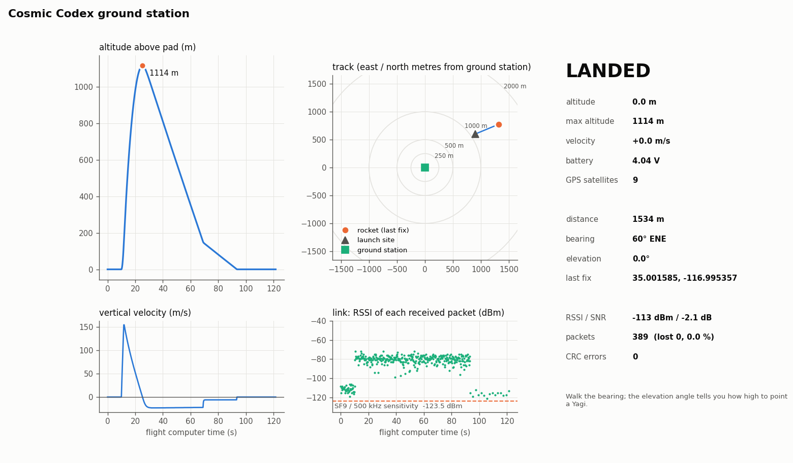
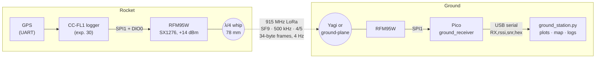
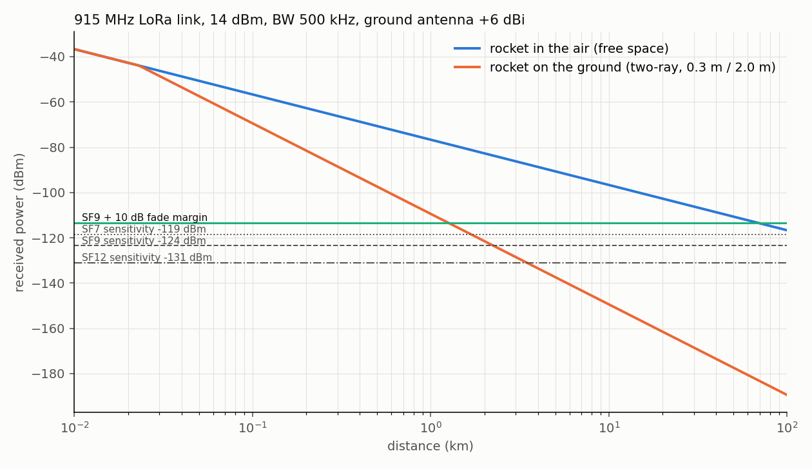

# 31 · LoRa telemetry and a ground station — watching the flight live

**Level 3 · stage 3** — add a 915 MHz long-range (LoRa) radio downlink to the
[CC-FL1 flight logger](../30-flight-computer-pcb/) and build the ground station that receives it: a
Raspberry Pi Pico + Semtech SX1276 (HopeRF RFM95W) receiver on USB, and a Python application that
shows altitude, velocity, link quality and a map with the rocket's bearing and distance while it flies.
Along the way you do a real **link budget**, compute **time on air** exactly as Semtech specifies it,
and learn which FCC rules let you transmit at all.

| Cost | Time | Difficulty | Ages |
|---|---|---|---|
| **$40–120** (2 × Pico + 2 × RFM95W ≈ $45, antennas $10–60, cables) | **8–12 h** + a field day | ●●●○○ | 14+ |

> [!IMPORTANT]
> **Radio rules are law, not suggestions.** The default settings here are chosen to fit the US
> unlicensed rules for the 902–928 MHz band (47 CFR §15.247, digital modulation). If you enable a
> callsign you are operating as an **amateur radio station** under Part 97 and must hold a licence and
> follow its rules. Outside the US the band and rules differ (Europe uses 863–870 MHz with duty-cycle
> limits) — change the frequency before you transmit. Details below.



## What you'll learn

- How **LoRa chirp spread spectrum** trades data rate for range: spreading factor, bandwidth, coding rate.
- A complete **link budget** — transmitter power, antenna gains, free-space and two-ray path loss,
  receiver noise floor, sensitivity and fade margin — and why a rocket that is easy to hear at 5 km
  in the air can be impossible to hear at 1.5 km once it lies in the grass.
- **Time on air** from the Semtech formula, and what it means for packet rate.
- Designing a **binary packet format** with a checksum (CRC-16) shared by C firmware and Python.
- The **FCC Part 15 / Part 97** rules for the 33 cm band, and why they shape the radio settings.
- Writing a **live data app** in Python (serial thread → queue → matplotlib animation) that is tested
  end to end with a simulated flight.

## What is in this folder

```text
31-lora-telemetry-ground-station/
├── firmware/
│   ├── common/                telemetry_packet.h (frame v1 + CRC), radio_config.h  ← canonical copies
│   ├── ground_receiver/       Pico + RFM95W → prints RX,<rssi>,<snr>,<hex> lines on USB
│   ├── range_test_tx/         1 Hz beacon for walking range tests
│   └── Makefile               `make check`: header copies identical + sketches compile (mock API)
├── ground_station/
│   ├── ground_station.py      the app: --port / --simulate / --replay, live plots + map, CSV/GeoJSON/KML export
│   ├── telemetry.py           packet codec (Python twin of telemetry_packet.h)
│   ├── linkbudget.py          link budget + time-on-air calculator, chart
│   ├── sim.py                 simulated flight + GPS + radio link model
│   └── test_ground_station.py tests (codec vs C header, CRC, link maths, full simulated flight)
├── data/                      a simulated session exported as CSV, GeoJSON and KML (open in Google Earth)
└── images/
```

## System



## Bill of Materials

| Qty | Part | Part number | Notes | Approx. |
|---|---|---|---|---|
| 2 | Raspberry Pi Pico (or use the CC-FL1 as the transmitter) | SC0915 | one for the receiver, one for the range-test beacon | $4 each |
| 2 | RFM95W 900 MHz LoRa breakout (SX1276, 3.3 V regulator, level shifting) | Adafruit 3072 | or bare HopeRF RFM95W-915S2 modules (~$8) soldered to perfboard | $20 each |
| 2 | u.FL→SMA pigtail + 915 MHz antenna, or 78 mm of solid wire | — | the wire whip works; a real antenna is better on the ground side | $0–15 |
| 1 | ground antenna: 5–8 dBi 900 MHz Yagi (vertical polarisation) or a ¼-wave ground-plane on a mast | e.g. any 902–928 MHz Yagi with SMA/N | raises range more than any other change | $20–60 |
| 1 | 1–2 m low-loss coax (RG-58 or better) + adapters | — | short! 0.5 dB/m at 915 MHz in RG-58 | $10 |
| 1 | GPS module for the rocket (3.3 V UART, NMEA GGA) | u-blox M8/M10 based | set it to an *airborne* dynamic model | $15–30 |
| — | USB cable, laptop with Python 3.9+ | — | `pip install numpy matplotlib pyserial` | — |

Wiring (receiver and beacon, same as CC-FL1's header J5):

| RFM95W breakout | Pico pin |
|---|---|
| VIN | 3V3(OUT) (pin 36) |
| GND | GND |
| SCK / MOSI / MISO / CS | GP10 / GP11 / GP12 / GP13 (SPI1) |
| G0 (DIO0) | GP20 |
| RST | GP21 |

## The science

### 1. LoRa in one paragraph

LoRa sends each symbol as a **chirp** — a tone sweeping across the bandwidth $BW$. A symbol carries
$SF$ bits (spreading factor 7–12) and lasts $T_{sym} = 2^{SF}/BW$. Doubling the symbol length
(SF + 1) halves the bit rate but lets the receiver integrate twice as much energy, gaining ≈ 2.5 dB of
sensitivity: LoRa can decode signals **below the noise floor** (SNR down to −20 dB at SF12). The raw
bit rate is

$$ R_b = SF\cdot\frac{BW}{2^{SF}}\cdot\frac{4}{4+CR} = 9\cdot\frac{500\,000}{512}\cdot\frac45 \approx 7.0\ \text{kbit/s}\quad(\text{SF9, 500 kHz, 4/5}). $$

### 2. Time on air (Semtech AN1200.13)

$$
n_{payload} = 8 + \max\!\left(\left\lceil\frac{8PL - 4SF + 28 + 16\,CRC - 20\,IH}{4\,(SF - 2DE)}\right\rceil (CR+4),\ 0\right),\qquad
T = (n_{preamble} + 4.25)\,T_{sym} + n_{payload}\,T_{sym}
$$

For our 34-byte frame ($PL = 34$, CRC on, explicit header, $DE = 0$, 8-symbol preamble):
$\lceil 280/36 \rceil \cdot 5 + 8 = 48$ payload symbols, so $T = 60.25 \times 1.024\text{ ms} = 61.7$ ms.
At 4 frames per second the transmitter is on 25 % of the time. The same frame at SF11 / 125 kHz takes
987 ms — one frame per second at most, which is why rocket telemetry uses wide bandwidths.

### 3. The rules that pick the settings (United States)

| Option | Rule | What it requires | Fit for us? |
|---|---|---|---|
| **Digital modulation (DTS)** | 47 CFR §15.247(a)(2), (b)(3), (e) | 6 dB bandwidth **≥ 500 kHz**; ≤ 1 W conducted; power spectral density ≤ 8 dBm in any 3 kHz; antenna gain above 6 dBi reduces the allowed power | ✔ **default**: LoRa at BW = 500 kHz on one fixed channel |
| Frequency hopping | §15.247(a)(1) | 125 kHz channels need **≥ 50 hop frequencies**, ≤ 0.4 s on any one in 20 s (up to 1 W) | ✗ both ends must hop in sync — LoRaWAN does this, a simple link does not |
| Low-power field-strength limit | §15.249 | ≤ 50 mV/m at 3 m (≈ 0.75 mW EIRP) | ✗ too weak for kilometres |
| **Amateur radio** | Part 97, 33 cm band 902–928 MHz | a licence (Technician or higher); identify with your callsign at least every 10 min (§97.119); no messages encoded to obscure their meaning (§97.113); amateurs are *secondary* in this band — do not interfere | ✔ set `CALLSIGN` — firmware sends a plain-text "DE callsign" frame every 9 min |

Our DTS check: $PSD = P - 10\log_{10}(BW/3\text{ kHz}) = 14 - 22.2 = -8.2$ dBm per 3 kHz, far under the
8 dBm limit. Unlicensed devices must also accept any interference they receive (§15.5). A device you
build yourself for your own use (up to five units, not marketed) does not need an FCC equipment
authorisation under §15.23, **but it must still meet the technical limits above**. Check the current
text at [ecfr.gov](https://www.ecfr.gov/current/title-47/chapter-I/subchapter-A/part-15/subpart-C/subject-group-ECFR2f2e5828339709e/section-15.247)
before you rely on this summary.

### 4. Link budget

$$ P_{rx} = P_{tx} + G_{tx} - L_{tx} - L_{path} + G_{rx} - L_{rx} $$

Sensitivity is the noise floor plus the SNR the demodulator needs:

$$ S = \underbrace{-174\ \text{dBm/Hz} + 10\log_{10} BW + NF}_{\text{noise floor} = -111\ \text{dBm at 500 kHz, NF 6 dB}} + SNR_{min}(SF) = -123.5\ \text{dBm (SF9)} $$

Free-space path loss (Friis), $d$ in metres, $f$ in hertz:

$$ L_{fs} = 20\log_{10} d + 20\log_{10} f - 147.55\ \text{dB} \quad(111.7\text{ dB at 10 km, 915 MHz}) $$

`python3 ground_station/linkbudget.py` with the defaults (14 dBm, −3 dBi whip inside the airframe, 6 dBi Yagi, 2 dB of cables, 10 dB fade margin):

```text
EIRP                                                    +10.5 dBm
Receiver sensitivity                                    -123.5 dBm  (SNR_min -12.5 dB)
Maximum allowed path loss                               128.5 dB
Line-of-sight range (free space)                        69.4 km
Range with rocket on the ground (h = 0.3 m / 2.0 m)     1.26 km
Power spectral density (15.247(e) limit 8 dBm / 3 kHz)  -8.2 dBm / 3 kHz
```



**The ground changes everything.** Once the rocket lies in the grass, the direct wave and the wave
reflected off the ground nearly cancel. Beyond the breakpoint $d_b = 4h_1h_2/\lambda$ (7 m for antennas
0.3 m and 2 m high) the loss follows the **plane-earth** model

$$ L_{2ray} = 40\log_{10} d - 20\log_{10}(h_1h_2) , $$

growing 12 dB per doubling of distance instead of 6. The same 128.5 dB budget now reaches only
**≈ 1.3 km**. Practical consequences: record the last GPS fix received *before* landing, raise the
ground antenna on a mast (doubling $h_2$ buys 6 dB), and walk towards the last known position.

Two more effects worth knowing:
- **Fresnel zone**: line of sight is not enough — the first Fresnel zone,
  $r_1 = 17.3\sqrt{d_1 d_2/(f\,d)}$ m ($d$ in km, $f$ in GHz), is ≈ 20 m in radius half-way along a
  5 km path. Terrain or trucks inside it cost decibels.
- **Polarisation**: a vertical whip on a rocket going up matches a vertically-polarised Yagi; the same
  rocket hanging sideways under its parachute can be 10–20 dB down. The fade margin is for that.
- **Doppler** is negligible: $\Delta f = f\,v/c = 915\text{ MHz}\times 150/3\times10^8 \approx 460$ Hz,
  a thousandth of the bandwidth.

### 5. Antenna length

A quarter-wave monopole is $\lambda/4 = c/(4f) = 81.9$ mm at 915 MHz; the end effect of a real wire
shortens it by ≈ 5 %, so cut **78 mm**. Mount it along the rocket's axis, away from carbon fibre and
metal (carbon fibre airframes block RF — use a fibreglass or cardboard section over the antenna).

### 6. Packet format (34 bytes, little-endian)

| Offset | Size | Field | Unit |
|---|---|---|---|
| 0 | 2 | magic `CC` | — |
| 2 | 1 | version | 1 |
| 3 | 1 | state | 0 PAD · 1 BOOST · 2 COAST · 3 APOGEE · 4 DESCENT · 5 LANDED |
| 4 | 2 | seq | packet counter — gaps = lost packets |
| 6 | 4 | t_ms | ms since power-up |
| 10 | 4 | alt_dm | Kalman altitude above pad, decimetres |
| 14 | 2 | vel_dms | vertical velocity, decimetres/s |
| 16 | 2 | acc_cg | acceleration magnitude, centi-g |
| 18 / 22 | 4 / 4 | lat_e7 / lon_e7 | degrees × 10⁷ (0 = no fix) |
| 26 | 2 | max_alt_m | highest altitude so far, m |
| 28 | 2 | vbat_mv | battery, mV |
| 30 | 1 | sats | GPS satellites |
| 31 | 1 | flags | bit0 GPS fix · bit1 SD logging · bit2 barometer OK · bit3 IMU OK |
| 32 | 2 | crc16 | CRC-16/CCITT-FALSE over bytes 0–31 (check value `29B1` for "123456789") |

Fixed-point integers instead of floats keep the frame small and make the byte layout identical on
every CPU. The SX1276 also appends its own CRC; ours additionally protects against a *different*
LoRa transmitter on the same settings being mistaken for our rocket. Coordinates are sent in the clear
— required anyway under Part 97, and nothing about a rocket's position is secret.

## Build it — step by step

1. **Try the app with no hardware:**
   ```bash
   cd ground_station
   pip install numpy matplotlib pyserial
   python3 ground_station.py --simulate --speed 3
   python3 test_ground_station.py          # 8 tests: codec, CRC, link maths, full flight
   ```
2. **Wire the receiver**: Pico + RFM95W breakout per the table above; screw or solder on the antenna
   **before** powering (transmitting into no antenna can damage the power amplifier; receiving is safe).
3. **Flash** `firmware/ground_receiver/ground_receiver.ino` (Arduino IDE 2 + arduino-pico core +
   "LoRa" library by Sandeep Mistry). Serial Monitor shows
   `# CC ground receiver ready: 915.000 MHz SF9 BW500 kHz`. Close the monitor before starting the app.
4. **Build a beacon**: a second Pico + RFM95W with `firmware/range_test_tx/`, or the CC-FL1 with an
   RFM95W on J5 and `TELEMETRY_ENABLED 1` in `config.h`.
5. **Run the station**: `python3 ground_station.py --port /dev/ttyACM0` (Windows: `--port COM5`,
   macOS: `/dev/cu.usbmodem…`). Every line is also saved to `session_<date>.log`; `--replay` plays it back.
6. **Range test** (below), then **fly** at a club launch: set up the station 100–300 m from the pad with
   the Yagi on a 2 m mast, start the app before the rocket is armed, and keep it running until you
   have the rocket in your hand.
7. **After the flight**: `--replay session_….log --headless --out flight1` writes `flight1.png/.csv`
   and a `.kml` track to open in Google Earth.

## Testing & data analysis

- `python3 ground_station/test_ground_station.py` — checks the Python struct against the offset table
  in the C header, the CRC check value, the link-budget formulas against hand calculations, the parser's
  rejection of garbage, packet-loss counting from sequence gaps, and a full simulated flight.
- `make -C firmware check` — the three copies of `telemetry_packet.h` are identical and both sketches
  compile against the mock Arduino API.
- **Measure your own path-loss exponent.** Walk the beacon away in steps (50, 100, 200, 400, 800 m…),
  note the median RSSI at each, and fit the log-distance model
  $P_{rx}(d) = P_{rx}(d_0) - 10\,n\log_{10}(d/d_0)$:
  ```python
  import numpy as np
  d = np.array([50, 100, 200, 400, 800]); rssi = np.array([-72, -80, -89, -99, -110])  # your data
  n = -np.polyfit(np.log10(d), rssi, 1)[0] / 10
  print(f"path-loss exponent n = {n:.2f}")   # 2 = free space, ~4 = two-ray / ground level
  ```
  Repeat with the beacon held high and lying on the ground — you will see $n$ move from ≈ 2 towards ≈ 4.
- Compare the **telemetry altitude** with the CC-FL1's microSD log after the flight: they come from the
  same filter, so any difference is a lost or corrupted packet.

## Troubleshooting

| Symptom | Likely cause | Fix |
|---|---|---|
| `SX1276 not found` | wiring, or RST/CS swapped | check GP13 = CS, GP21 = RST; 3.3 V on VIN |
| Nothing received | settings differ between the two ends | SF, bandwidth, coding rate, frequency and sync word must all match (`radio_config.h` = `config.h`) |
| Works on the bench, dies at 100 m | no antenna / wrong length / antenna inside carbon fibre | 78 mm whip; RF-transparent section |
| `BAD,…` lines | another LoRa network nearby, or a different frame version | the CRC is doing its job; change channel if it is constant |
| App says "could not open port" | Serial Monitor still open | close it; one program per port |
| Rocket lost after landing | two-ray loss | note the last fix, raise the antenna, walk the bearing |
| Occasional gaps during boost | GPS dropouts / attitude nulls | normal; check `loss_pct` over the whole flight |

## Going further

- **Frequency hopping** across 50+ channels (§15.247(a)(1)) with a shared hop sequence, so you can use
  125 kHz channels and SF10 for more range.
- **Adaptive rate**: SF7 during boost (fast updates), SF10 after landing (range).
- A **directional tracking antenna** on a pan/tilt head driven by the bearing and elevation the app
  computes.
- Add **forward error correction** across packets (e.g. send every GPS fix twice, interleaved).
- Swap the matplotlib dashboard for a web page (WebSerial) so a phone can be the ground station.

## References

- Semtech, *SX1276/77/78/79 Datasheet* (sensitivity tables, registers) and *AN1200.13 LoRa Modem Designer's Guide* (time-on-air formula)
- 47 CFR §15.247, §15.249, §15.23, §15.5 — <https://www.ecfr.gov/current/title-47/chapter-I/subchapter-A/part-15>
- 47 CFR Part 97 (§97.113, §97.119, §97.303) — <https://www.ecfr.gov/current/title-47/chapter-I/subchapter-D/part-97>
- NodakMesh, "FCC Part 15.247: The 500 kHz Minimum and LoRa Mesh" — <https://nodakmesh.org/blog/fcc-15-247-500khz-lora>
- T. S. Rappaport, *Wireless Communications: Principles and Practice* — two-ray and log-distance path-loss models
- Sandeep Mistry, *arduino-LoRa* library — <https://github.com/sandeepmistry/arduino-LoRa>
