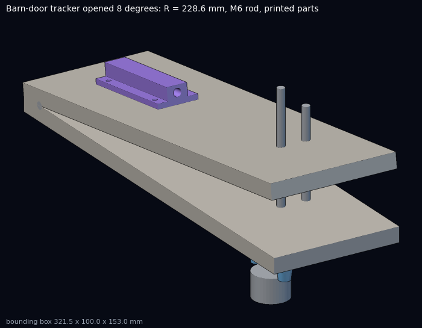
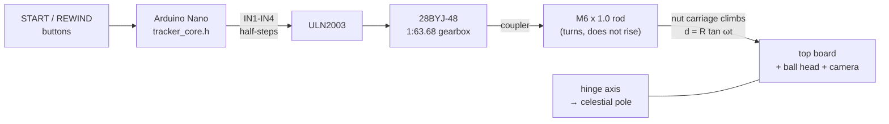
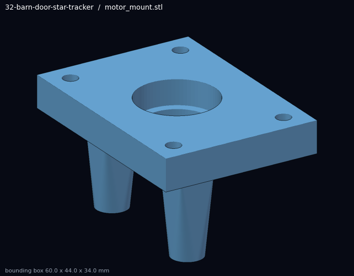
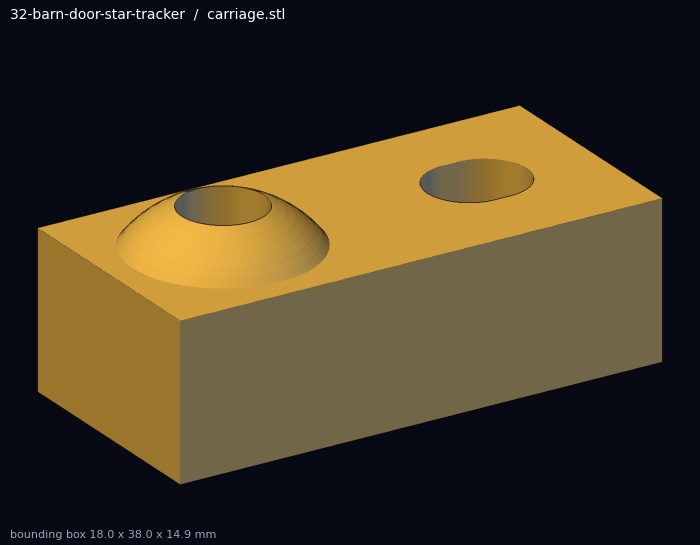
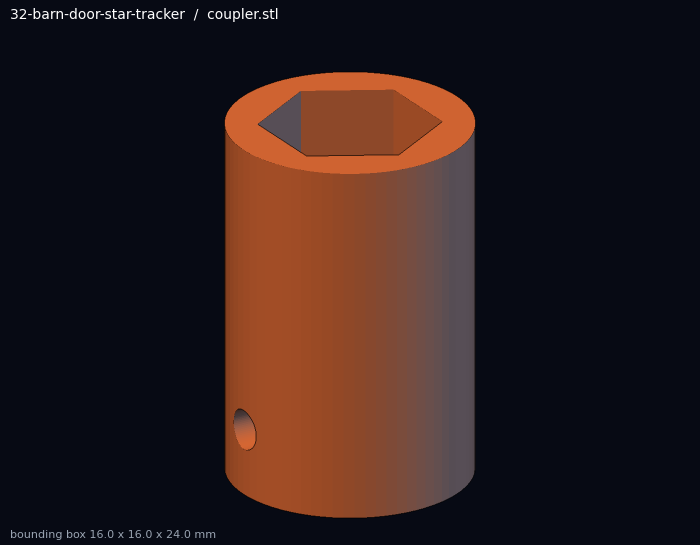
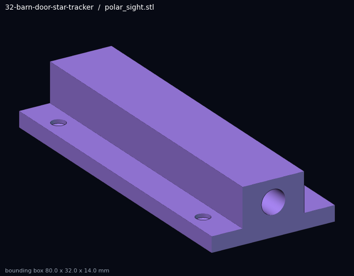
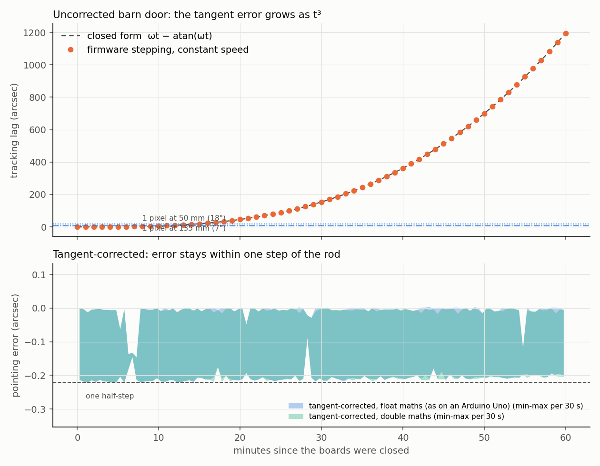

# 32 · Barn-door star tracker with tangent correction

**Level 3 · stage 3** — two boards, a hinge, a threaded rod and a $3 stepper motor cancel the
rotation of the Earth so a camera on a tripod can take **minutes-long exposures of the Milky Way
without star trails**. You 3D-print the drive parts, derive the tangent error that ruins simple
barn doors, write firmware that removes it, and prove the result with a C++ simulation of the exact
stepping code.

| Cost | Time | Difficulty | Ages |
|---|---|---|---|
| **$35–70** (motor + driver $4, Arduino Nano $5–20, rod/nuts/bearing $8, plywood + hinge $10–20; tripod ball head extra) | **6–10 h** + a clear night | ●●●○○ | 12+ with an adult for the saw |

> [!NOTE]
> This is an astrophotography build — no rockets, no radio. The usual workshop care applies: eye
> protection when cutting and drilling, and a red torch at night so you keep your dark adaptation.



## What you'll learn

- **Sidereal time**: why the sky turns once every 23 h 56 min 4.09 s and not every 24 h.
- **Polar alignment**: pointing a rotation axis at the celestial pole, and what happens when you miss.
- **The tangent error** of a straight-rod barn door, derived and quantified: $e(t) = \omega t - \arctan(\omega t) \approx (\omega t)^3/3$.
- **Open-loop stepper control** with a non-linear rate profile, on an 8-bit microcontroller with
  32-bit floats — and how to show the floats are good enough.
- **Plate scale**: turning angular errors into pixels for your lens and sensor.
- Parametric **OpenSCAD** parts, printed on a Bambu Lab printer.

## How it works



The rod stands **perpendicular to the base board** at distance $R$ from the hinge. The motor turns
the rod in place (a 608 bearing under the base board carries the load); an M6 nut trapped in the
printed **carriage** climbs the rod, and the carriage's dome pushes the top board open. A guide rod
stops the carriage from spinning. The rod passes through a slot in the top board.

## Bill of Materials

| Qty | Part | Notes | Approx. |
|---|---|---|---|
| 2 | plywood (or MDF) board 300 × 100 × 12 mm | base and top board | $5 |
| 1 | piano hinge ≥ 100 mm, or 2 good butt hinges | **no play**: any wobble shows up as trailing | $5 |
| 1 | M6 × 1.0 threaded rod, 150 mm, steel | the drive screw — straightest you can find | $2 |
| 5 | M6 nuts + 2 M6 washers | 1 in the coupler, 1 in the carriage, 2 jam nuts on the bearing, 1 spare | $1 |
| 1 | 608ZZ ball bearing (8 × 22 × 7 mm) + 30 mm of 8 mm OD / 6 mm ID tube or a printed sleeve | thrust bearing under the base | $1 |
| 1 | 6 mm steel/aluminium rod, 100 mm (or a second M6 rod) | anti-rotation guide | $1 |
| 1 | 28BYJ-48 5 V stepper + ULN2003 driver board | the common kit | $3–4 |
| 1 | Arduino Nano (or Uno, or a Pico) + USB cable | | $5–20 |
| 2 | momentary push buttons; 1 micro-switch (optional end stop) | | $2 |
| 1 | USB power bank, 5 V ≥ 1 A | a winter night drains it faster | $0–15 |
| 1 | 1/4-20 (or 3/8-16) T-nut in the base, and a ball head for the camera on the top board | the base goes on your tripod head | $0–25 |
| 2 | springs or strong rubber bands between the boards | keep the top board pressed on the carriage at any tilt | $1 |
| — | wood screws (4 × 16 mm), M4 × 10 screws for the motor, M3 × 8 set screw, glue | | $2 |
| ~ 70 g | PETG filament | printed parts below | $1.50 |

**Printed parts** (source [`cad/barn_door_parts.scad`](cad/barn_door_parts.scad), STLs in [`stl/`](stl/)):

| Part | File | Size (mm) | Print |
|---|---|---|---|
| Motor + bearing bracket | [`motor_mount.stl`](stl/motor_mount.stl) | 60 × 44 × 34 | top face down |
| Shaft coupler (5 mm D → M6) | [`coupler.stl`](stl/coupler.stl) | Ø16 × 24 | upright |
| Nut carriage with dome | [`carriage.stl`](stl/carriage.stl) | 18 × 38 × 14.9 | flat |
| Contact plate (with rod slot) | [`contact_plate.stl`](stl/contact_plate.stl) | 76 × 30 × 3 | flat, smooth side up |
| Polar sighting-tube clip | [`polar_sight.stl`](stl/polar_sight.stl) | 80 × 32 × 14 | flat |

| | |
|---|---|
|  |  |
|  |  |

## The science

### 1. The sidereal rate

The Earth spins once relative to the *stars* in one **sidereal day**, $T_{sid} = 86\,164.0905$ s
(23 h 56 min 4.09 s) — about 4 minutes shorter than the solar day, because in one day the Earth also
moves ≈ 1° along its orbit. The sky therefore turns at

$$ \omega = \frac{2\pi}{T_{sid}} = 7.2921\times10^{-5}\ \text{rad/s} = 15.04\ \text{arcsec per second}. $$

Without tracking, a star at declination $\delta$ trails by $15.04\cos\delta$ arcsec each second. The
familiar "500 rule" (maximum exposure ≈ 500 s / focal length in mm) is this number in disguise.

### 2. The tangent error

A barn door with a straight rod perpendicular to the base opens to an angle

$$ \tan\theta = \frac{d}{R} $$

when the rod has pushed the board a distance $d$. The simplest drive moves $d$ at a constant speed
$d = R\,\omega t$, so $\theta = \arctan(\omega t)$ — slightly *less* than the $\omega t$ the sky
has turned. The lag is

$$ e(t) = \omega t - \arctan(\omega t) = \frac{(\omega t)^3}{3} - \frac{(\omega t)^5}{5} + \dots $$

The cube is why simple barn doors are fine for five minutes and hopeless after twenty. The cure is
to drive the rod along $d(t) = R\tan(\omega t)$ instead, i.e. step the motor to

$$ n(t) = \frac{S\,R}{L}\tan(\omega t) $$

where $S$ is steps per rod turn and $L$ the thread lead. The step *rate*
$\dot n = (S R \omega / L)\sec^2(\omega t)$ starts at 67.9 half-steps/s and has risen 7.2 % after an hour.

**Choosing R.** With an M6 × 1.0 rod, $R = L/(\omega \cdot 60\text{ s}) = 228.6$ mm makes the rod turn
at exactly 1 rpm at the start — a classic choice that also lets you build an un-motorised version
turned by hand once per minute. (For a 1/4-20 rod, $L = 1.27$ mm, the same rule gives 290.3 mm.)

**Steps per turn.** The 28BYJ-48's gearbox is not 64:1 but
$\frac{32}{9}\cdot\frac{22}{11}\cdot\frac{26}{9}\cdot\frac{31}{10} = 63.684$:1, so in half-step mode
$S = 64 \times 63.684 = 4075.8$ half-steps per turn. Using the rounded 4096 would make the tracker
run 0.5 % fast: 4.5 arcmin of drift in an hour — about 15 pixels at 50 mm.

### 3. Is it good enough? Plate scale

A pixel of size $p$ behind a lens of focal length $f$ covers $206\,265\,p/f$ arcsec. For a typical
4.3 µm pixel: 37″ at 24 mm, 18″ at 50 mm, 6.6″ at 135 mm. One half-step of the rod turns the board by

$$ \Delta\theta = \arctan\!\left(\frac{L}{S R}\right) = 0.22'' $$

— far below a pixel, so step quantisation is invisible. The tangent error, however, is not:

```text
$ python3 tools/check_tangent.py
one half-step of the rod = 0.221 arcsec of board rotation
corrected drive, worst error over 60 min: float 0.221"  double 0.221"
uncorrected drive: -1194.8" after 60 min, analytic -1194.8" (max deviation 0.221")
step rate: 67.94 half-steps/s at the start, 72.85 after 60 min (+7.2 %; rod speed 1.000 rpm at the start)

uncorrected drive exceeds one pixel (4.3 um pixels) after:
    24 mm lens ( 37.0"/px):  18.6 min
    50 mm lens ( 17.7"/px):  14.6 min
   135 mm lens (  6.6"/px):  10.5 min
PASS
```



The simulation compiles the firmware's own `tracker_core.h` on your computer, runs the exact stepping
rule for 60 minutes at 100 µs resolution — once with 32-bit floats as on an Arduino Uno, once with
64-bit doubles — and compares against the closed-form error. Corrected, the error never exceeds one
half-step; uncorrected, it matches $\omega t - \arctan\omega t$ to within that step.

> Note what "exceeds one pixel after 14.6 min" means: it is the *accumulated* drift since the boards
> were closed, so a *sequence* of 60 s sub-exposures slowly slides across the frame (and each late
> sub-exposure smears more). With the correction, framing holds for the full hour of travel.

### 4. Polar alignment error

If the hinge axis misses the pole by an angle $\varepsilon$, stars drift in declination by up to

$$ \Delta\delta \approx \varepsilon\,\omega t , $$

i.e. $1^\circ$ of misalignment gives ≈ 16″ per minute. That is usually the limit of a barn door, not
the drive. Polaris is about 0.6–0.7° from the north celestial pole; aim the sighting tube a little
towards the "pointer" direction (use a polar-scope app for the current offset). In the Southern
Hemisphere use the faint σ Octantis or star-hop from the Southern Cross.

## Build it — step by step

1. **Cut the boards** (300 × 100 mm). Mark the hinge line on one short edge of the base board and a
   point **R = 228.6 mm** from the *hinge pin axis* (not the board edge!) along the centre line.
   Drill a 10 mm hole there for the rod, and a 6 mm hole 20 mm to the side (parallel to the hinge)
   for the guide rod. Drill/route a matching **8 × 50 mm slot** in the top board.
2. **Fit the hinge** so the pin axis is exactly along the boards' joint and the boards close flat.
   Any play here shows up directly as star trailing.
3. **Print** the five parts (PETG, 4 walls, 40 % infill; `python3 experiments/tools/build_advanced_cad.py --only 32`
   regenerates and checks the STLs).
4. **Drive train**: press the 608 bearing into the motor mount; screw the mount under the base board
   centred on the rod hole; bolt the 28BYJ-48 to the pillars; slide the coupler on the D-shaft and
   tighten the M3 set screw on the flat. Thread the rod through the base board and bearing, lock two
   **jam nuts + washer on top of the bearing's inner race** (this carries the board's weight), and
   screw the rod into the coupler's captive nut. The rod must turn freely and not wobble.
5. **Carriage**: press an M6 nut into the carriage, thread it onto the rod, and push the guide rod
   through the carriage slot into its hole in the base board. Screw the contact plate under the top
   board, centred on the slot. Add the springs so the top board always rests on the dome.
6. **Mount**: fit the T-nut in the base board (for the tripod head) and the ball head on the top board,
   near the hinge (less load on the rod). Screw the polar-sight clip on the top board with its tube
   parallel to the hinge; check parallelism by sighting a distant object with the boards closed and
   opened — it must not move in the tube.
7. **Electronics**: ULN2003 IN1–IN4 to D8–D11, buttons from D2/D3 to GND, optional end-stop on D4, the
   driver board's 5 V from the Nano's 5 V pin (the 28BYJ-48 draws ~ 240 mA with two coils on — use a
   power bank that can supply 1 A).
8. **Measure R** with calipers from the hinge-pin centre to the rod centre and put the value in
   `GEOM` in `barn_door_tracker.ino`. Every 1 mm of error in R is a 0.44 % rate error. Flash the sketch.
9. **Bench test**: press START, time 10 minutes with a stopwatch and measure the carriage rise with
   calipers: expected $d = R\tan(\omega \cdot 600\,s) = 10.0$ mm. Reverse `DIRECTION` if it goes down.
10. **Night**: level the tripod, tilt the tracker so the hinge points at the pole (the tilt equals your
    latitude), fine-align on Polaris through the sight tube. Orientation: face the pole with the
    **hinge on the west side**, so the **eastern edge rises** — the camera then turns east → west with
    the stars. Frame, focus on a bright star, press START and expose.

## Testing & data analysis

- `make -C firmware/test` — runs the simulation check above and syntax-checks the sketch against mock
  Arduino headers.
- **Star-trail test**: shoot the same field for 30 s, 60 s, 120 s, 240 s with the tracker off, then on.
  Measure trail length in pixels (e.g. with Siril or by zooming in); compare with
  $\ell = 15.04\,t\cos\delta / \text{scale}$ untracked and ≈ 0 tracked.
- **Uncorrected vs corrected**: hold START while powering up to run the constant-speed drive. Take a
  60 s frame every 5 minutes for 40 minutes in each mode and plot how far one star drifts across the
  frame — you should see the $t^3$ curve of the chart above in your own data.
- **Periodic error**: a bent rod or an off-centre coupler causes a wobble once per rod turn (60 s).
  Take many short exposures of a star near the celestial equator and plot its position against time.

## Troubleshooting

| Symptom | Likely cause | Fix |
|---|---|---|
| Stars trail east-west | wrong rate or direction; R measured to the board edge | re-measure R to the hinge **pin**; check `DIRECTION` |
| Stars trail north-south, growing with time | polar alignment | re-align; check the sight tube is parallel to the hinge |
| Stars wobble with a 1-minute period | bent rod, coupler off-centre, loose bearing | straighter rod; re-print the coupler; tighten the jam nuts |
| Motor hums but does not turn | coil order | IN1–IN4 to D8–D11 in order; try the other half-step direction |
| Motor gets hot | coils powered while idle | the sketch de-energises when idle/paused — check it is not stuck in TRACKING |
| Board jumps at the start | slack in nut/carriage | pre-load with the springs; run 30 s before opening the shutter |

## Going further

- **Double-arm (isosceles) drive** or a **curved rod** — mechanical alternatives to the tangent correction.
- Replace the 28BYJ-48 with a NEMA 17 + A4988/TMC2209 at 16 microsteps: smoother steps, more torque
  for a heavier camera (change `steps_per_rev` to $200 \times 16$).
- **Closed loop**: a cheap guide camera and PHD2-style feedback through an ST-4 input.
- **Declination drift alignment** in software: measure drift, compute the polar error, correct.
- Pair it with [experiment 13](../13-moon-and-star-trail-photography/) (trails on purpose!) and use it
  as the mount for [experiment 44](../44-exoplanet-transit-photometry/) with a short lens on a bright target.

## References

- The barn-door ("Haig" or "Scotch") mount was described by George Haig in *Sky & Telescope* in 1975;
  overview and variants (types 1–4, double-arm, curved rod): <https://en.wikipedia.org/wiki/Barn_door_tracker>
- U.S. Naval Observatory / IERS — length of the sidereal day (86 164.0905 s).
- Gearbox ratio of the 28BYJ-48 (63.68395:1) — widely measured and documented by the maker community.
