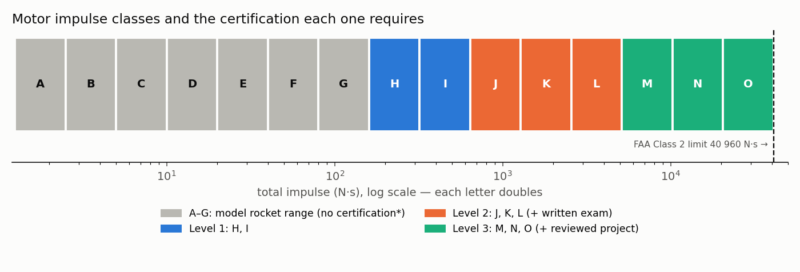
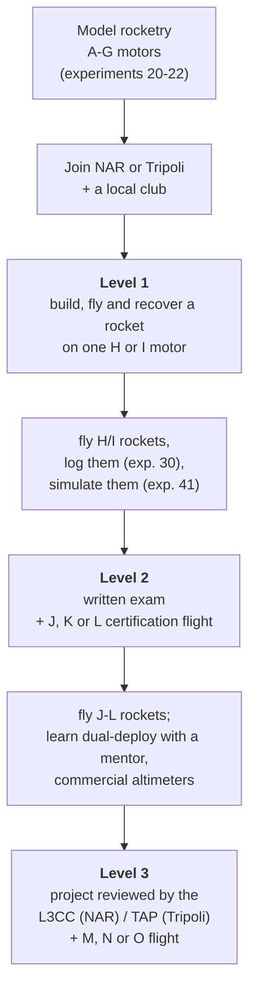

# 40 · High-power rocketry certification — the Level 1 → Level 2 → Level 3 path

**Level 4 · upper stage** — high-power rocketry (HPR) is where hobby rockets use H-class motors and
up, fly thousands of metres, and carry real payloads like the [flight computer](../30-flight-computer-pcb/)
and [telemetry](../31-lora-telemetry-ground-station/) you built. In the United States you may only buy
and fly those motors after you are **certified** by one of the two national organisations, the
**National Association of Rocketry (NAR)** or the **Tripoli Rocketry Association (TRA)**. This page is
a researched, cited guide to that path: what each level allows, what the certification flight involves,
the rules of the air (FAA), insurance, clubs, and what it costs.

| Cost | Time | Difficulty | Ages |
|---|---|---|---|
| **Level 1 ≈ $150–350**, Level 2 ≈ $300–700, Level 3 ≈ $1,000–3,000+ (kits, motors, membership, launch fees) | L1: a build month + one launch day; L2: a season; L3: typically a year or more | ●●●●● | **18+** to certify (junior/mentoring programmes below) |

> [!CAUTION]
> **Commercially certified motors only — always.** This repository never gives instructions for making
> propellant, motors, igniters or ejection charges, and neither should anyone you learn from outside a
> formally supervised research programme. Everything below happens **at a sanctioned club launch**,
> with a Range Safety Officer (RSO), under the club's FAA waiver, following the NAR High Power Safety
> Code or the Tripoli Safety Code. Recovery electronics are **certified commercial altimeters**, and
> their use at Level 2–3 is learned hands-on from mentors — this page describes them at the concept
> level only. Rules change: always read the current documents linked at the bottom.



## What you'll learn

- How rocket motors are **classified** (letter = total impulse, number = average thrust) and why each
  letter doubles the one before.
- What **Level 1, 2 and 3** permit, and exactly what happens on a certification flight.
- The **regulatory stack**: FAA 14 CFR Part 101 Subpart C, NFPA 1127, the organisations' safety codes,
  state and local rules — and who is responsible for which part (usually the club, not you).
- How **insurance** works for sanctioned launches.
- How to use the tools you built — OpenRocket simulation ([exp. 41](../41-openrocket-deep-dive/)), the
  CC-FL1 logger, telemetry — to make your certification flight boring, which is the goal.

## 1. Motor classes in one table

A motor's code, e.g. **H128-M**, gives: the impulse class (**H**: 160.01–320 N·s), the average
thrust in newtons (**128**), and the ejection delay / variant after the dash (set by the manufacturer
for that certified motor). Each letter doubles the maximum total impulse:

$$ I_{max}(\text{letter}_k) = 2.5 \times 2^{k}\ \text{N·s},\qquad k = 0 \text{ for A}. $$

| Class | Total impulse (N·s) | Certification | FAA class (14 CFR 101.22) |
|---|---|---|---|
| A–G | 1.26 – 160 | none for typical model rockets\* | Class 1 model rocket if ≤ 125 g propellant, ≤ 1 500 g, no substantial metal |
| **H, I** | 160.01 – 640 | **Level 1** | Class 2 high-power (≤ 40 960 N·s combined) |
| **J, K, L** | 640.01 – 5 120 | **Level 2** | Class 2 |
| **M, N, O** | 5 120.01 – 40 960 | **Level 3** | Class 2 |
| P and above / > 40 960 combined | — | research programmes | Class 3 advanced high-power |

\*Some G motors with high average thrust, and rockets heavier than 1 500 g, are treated as high-power
even below 160 N·s — check the NAR/Tripoli definitions. Sources: [Wikipedia: High-power rocketry](https://en.wikipedia.org/wiki/High-power_rocketry),
[eCFR 14 CFR 101.22](https://www.ecfr.gov/current/title-14/chapter-I/subchapter-F/part-101/subpart-C/section-101.22).

`tools/motor_class.py` classifies any impulse or RASP `.eng` file and gives a rough thrust-to-weight
and rail-exit check:

```text
$ python3 tools/motor_class.py 285 --mass 1.7 --rail 1.8 --avg-thrust 150
class H  (160-320 N*s; this motor is 78 % of the way through the class)
certification needed to fly it: Level 1 (NAR or Tripoli)
FAA 14 CFR 101.22: Class 2 high-power rocket (flown under a club's FAA waiver/authorization; ATC notified)
average thrust-to-weight 9.0 : 1
rail-exit speed about 16.8 m/s (55 ft/s) - clubs commonly want at least 15 m/s (~50 ft/s); check with a real simulation (experiment 41)
```

## 2. The path



### Level 1 — H and I motors

- **Who**: adult members (NAR adult members; Tripoli: students and senior members **18 and older**).
- **What you do**: build a rocket yourself (a commercial kit is normal and recommended), fly it on a
  **single** commercially certified **H or I** motor at a sanctioned launch, and recover it in a
  condition that could fly again. Tripoli specifies: total impulse 160.01–640.00 N·s, no clusters or
  staging, parachute recovery, the **centre of pressure marked on the outside** of the airframe, and a
  failure if the rocket lands faster than **35 ft/s (≈ 10.7 m/s)**, if parts separate unattached,
  deployment fails, or the motor malfunctions ([tripoli.org/Level1](https://www.tripoli.org/Level1)).
- **Who witnesses**: NAR — a qualified NAR certification team member at the launch (ask the section in
  advance); Tripoli — a Prefect, a TAP member or a board member.
- **Exam**: Tripoli none for L1; NAR requires a short written test or safety-code review
  (check the current form — requirements have changed over the years).
- **After**: you may buy and fly H and I motors (Tripoli: up to 640 N·s total installed impulse).

**What the certification flight involves, step by step** (typical launch day):

1. Arrive early, check in, pay the launch fee, show your membership card.
2. Buy (or bring) your certified motor — the vendor will ask to see that you are attempting certification.
3. Assemble the motor exactly per the manufacturer's instructions (reloadable motors) or use a single-use
   motor. Ask an experienced flyer to watch you do it the first time.
4. **Pre-flight inspection** with your certifying member: stability (CG ahead of CP — margin ≈ 1–2
   calibres; bring your OpenRocket file), recovery harness and chute, motor retention, the paperwork.
5. **RSO check-in**, then the pad: rail/rod, igniter installed at the pad as the RSO directs, walk back.
6. The launch control officer counts down; the certifying member watches the whole flight: stable
   boost, deployment, safe descent.
7. **Recover everything** and bring it back *as recovered* for the post-flight inspection.
8. Sign the form; the certifier submits it (NAR or TRA HQ). Your card arrives by post/e-mail.

### Level 2 — J, K and L motors

- **Prerequisite**: a valid Level 1.
- **Written exam**: a multiple-choice test on safety codes, regulations, motor handling, stability and
  recovery. Both NAR and Tripoli publish the question pool; study it (the pass mark and number of
  questions are on the current forms).
- **Flight**: as Level 1 but on a J, K or L motor (640.01–5 120 N·s), built by you, witnessed.
- **After**: J–L motors. Many Level 2 flyers now learn **dual deployment** (a small drogue at apogee,
  the main parachute low) using **certified commercial altimeters**. That is learned with a mentor at
  your club; the CC-FL1 logger can ride along as an independent data recorder, never as the deployment
  controller.

### Level 3 — M, N and O motors

- **Prerequisite**: Level 2 plus, for NAR, a log of **at least three Level 2 flights** before starting
  the Level 3 process ([NAR L3 requirements](https://narocket.clubexpress.com/content.aspx?page_id=22&club_id=114127&module_id=673325)).
- **Oversight**: the project is reviewed **before** and **during** construction — NAR's
  **Level 3 Certification Committee (L3CC)**, Tripoli's **Technical Advisory Panel (TAP)** members, who
  alone can approve Tripoli Level 3 projects and witness the flight.
- **Documentation**: a design package (drawings, stability and simulation, recovery and electronics
  design, construction photos) and, for Tripoli, demonstrated **electronic recovery proficiency**.
- **Flight**: one M, N or O motor (5 120.01–40 960 N·s), usually with redundant commercial altimeters.
- **After**: M–O motors. Beyond this lies FAA Class 3 and research programmes such as the Tripoli Research
  or NAR/TRA-sanctioned research launches.

### Younger flyers

Tripoli's **Mentoring Program** covers members aged **12–17**, flying under a mentor's supervision
([tripoli.org/Certification](https://www.tripoli.org/Certification)); ask NAR about its current junior
programme.
Model rocketry up to G (experiments 20–22) needs no certification at all.

## 3. The rules of the air and the ground

| Layer | Document | Who handles it |
|---|---|---|
| Federal airspace | **14 CFR Part 101 Subpart C** (amateur rockets) | the **club** holds the FAA *Certificate of Waiver or Authorization* for its field and notifies ATC |
| National fire code | **NFPA 1127** (high-power rocketry), NFPA 1122 (model rocketry) | adopted by most states; the safety codes are built on them |
| Organisation | NAR High Power Safety Code / Tripoli Safety Code | you, every flight; the RSO enforces it |
| State and local | e.g. state fire marshal rules, fire-season bans, landowner permission | the club; ask before you drive out (California, for example, has State Fire Marshal requirements for rocketry) |
| Motor purchase / storage | manufacturer's instructions, organisation rules, federal and state law | you: certified motors only, stored as instructed |

What Part 101 Subpart C says for Class 2 and 3 rockets (§101.25, [eCFR](https://www.ecfr.gov/current/title-14/chapter-I/subchapter-F/part-101/subpart-C)):
no launches into cloud cover above **five-tenths**, visibility under **five miles**, or between sunset and
sunrise without authorisation; stay **5 nautical miles (9.26 km)** from airport boundaries and out of
controlled airspace unless authorised; keep a safety distance of **one-quarter of the maximum expected
altitude or 457 m (1 500 ft), whichever is greater** from people and property not associated with the
launch; an adult (18+) must supervise. ATC must be notified **no less than 24 hours and no more than three
days** before the launch (§101.27), and a waiver request for Class 2 needs to reach the FAA **at least
45 days** before the operation (§101.29). Clubs do all of this for their launches — which is the biggest
single reason to fly with a club.

Legal footnote: in 2009 a US federal appeals court ruled that ammonium-perchlorate composite propellant
(APCP) is not an "explosive" for the purposes of federal explosives permits (*Tripoli Rocketry Ass'n v.
ATF*). That changed paperwork for buying motors; it did not change any safety rule, and other energetic
materials used in hobby rocketry are still regulated — your club and certification organisation know the
current state of the rules.

## 4. Insurance

- **Tripoli**: "Tripoli-sanctioned launches are insured for up to **$3,000,000** with primary insurance
  coverage" ([tripoli.org/insurance](https://www.tripoli.org/insurance), [membership](https://www.tripoli.org/membership)).
- **NAR**: membership includes liability insurance for members flying in accordance with the NAR safety
  codes at sanctioned activities; see [nar.org/insurance](https://www.nar.org/Insurance) for the current limits and
  the landowner (site-owner) coverage clubs use to secure launch fields.
- Insurance covers flying **within the safety code**. Flying outside it (wrong motor, no waiver, no RSO)
  is exactly the case it does not cover.

## 5. Clubs and launches

Find a club through the organisations' section/prefecture finders (NAR "sections", Tripoli
"prefectures"). High-power flying needs a large field with an FAA waiver — dry lake beds, farmland
after harvest, desert sites. Examples in California: **Rocketry Organization of California (ROC)** at
Lucerne Dry Lake ([rocstock.org](https://rocstock.org/certification/) — its certification page is a good
example of what a club expects), **Friends of Amateur Rocketry (FAR)** in the Mojave (research and
university flying), and the large national and regional events (for example LDRS, NSL, Airfest,
Black Rock launches). Go to a launch as a spectator first and volunteer — every certified flyer started
by asking questions at the flight line.

## 6. Costs (typical, 2026)

| Item | Level 1 | Level 2 | Level 3 |
|---|---|---|---|
| National membership (NAR or TRA), per year | ≈ $50–90 | same | same |
| Club dues + launch fees | $20–60 | $20–60 | $20–100 |
| Kit (38 mm L1 / 54 mm L2 / 75–98 mm L3) | $60–150 | $120–300 | $400–1,500 |
| Motor for the certification flight | $40–90 (single-use H/I) | $80–250 (J/K) | $250–800+ (M) |
| Reloadable casing (optional, reused) | $50–130 | $100–250 | $300–700 |
| Recovery (chute, harness, blanket) | $30–80 | $60–150 | $150–400 |
| Commercial altimeter(s) | — (optional) | $60–150 | $150–400 (redundant) |
| Tools, paint, epoxy, travel | $30–100 | $50–150 | $100–500 |

Prices vary by vendor and year; treat these as order-of-magnitude planning numbers.

## 7. How to make the certification flight boring (the goal)

1. **Pick a proven kit** designed for your motor diameter (38 mm is the classic Level 1 choice — and
   matches the [CC-FL1 sled](../30-flight-computer-pcb/)). Build it exactly per the instructions, with
   good epoxy fillets.
2. **Simulate it** in OpenRocket ([exp. 41](../41-openrocket-deep-dive/)): stability margin 1–2 calibres
   *with the motor installed*, rail-exit speed ≥ 15 m/s, apogee inside the field's waiver, descent
   rate comfortably under 35 ft/s (≈ 10.7 m/s — e.g. aim for 6–7 m/s), a delay the motor offers that is
   within ≈ 1–2 s of the simulated optimum.
3. **Mark the CG and CP** on the airframe (required by Tripoli for Level 1).
4. **Swing-test and fly it first on a smaller motor** if the design allows (a G), to check recovery.
5. **Fly the logger** as a passenger: the post-flight plot is great evidence for your Level 2 and 3
   paperwork later, and it teaches you your rocket's real drag.
6. **Weather**: low wind (< 20 mph is a typical RSO limit; less is better for a first flight), no low clouds.

## Testing & data analysis

- `python3 tools/motor_class.py <impulse or .eng>` — classify motors; `python3 tools/motor_class.py --selftest`
  checks every letter-class boundary from A to O.
- After a certification flight, compare **predicted vs measured** apogee (logger), rail-exit speed and
  descent rate; a good simulation is within ~10 %.

## Troubleshooting (common reasons certification flights fail)

| Failure | Prevention |
|---|---|
| Unstable boost (corkscrew) | stability ≥ 1 calibre with the motor in; nose weight if needed; straight fins |
| Chute did not deploy / zippered airframe | correct motor delay from simulation; long shock cord mounted properly; Nomex/blanket protector; practice the fold |
| Landed too fast (> 35 ft/s) | size the chute for 6–7 m/s: $A = 2mg/(\rho C_D v^2)$ |
| Parts landed separately | everything tethered to the harness |
| Motor malfunction | certified motor, assembled exactly per instructions, not modified, stored correctly |
| Paperwork missing | print the form, bring your membership card, get the signature before you leave |

## Going further

- Level 2 with the CC-FL1 and LoRa telemetry flying, and a comparison with a commercial altimeter.
- Collegiate programmes: university rocketry teams, the NASA Student Launch, and other intercollegiate
  rocketry competitions — excellent for Level 2–3 mentorship.
- Read the NFPA 1127 and Part 101 text yourself; they are short and the reasons behind each rule are
  instructive.

## References

- National Association of Rocketry — High Power Certification: <https://www.nar.org/HPRCertification>;
  Level 3 requirements: <https://narocket.clubexpress.com/content.aspx?page_id=22&club_id=114127&module_id=673325>;
  Level 3 Certification Committee: <https://www.nar.org/content.aspx?page_id=22&club_id=114127&module_id=673328>
- Tripoli Rocketry Association — Certification: <https://www.tripoli.org/Certification>; Level 1:
  <https://www.tripoli.org/Level1>; Level 3: <https://www.tripoli.org/Level3>; TAP: <https://www.tripoli.org/TAP>;
  Insurance: <https://www.tripoli.org/insurance>; Membership: <https://www.tripoli.org/membership>
- 14 CFR Part 101 Subpart C — <https://www.ecfr.gov/current/title-14/chapter-I/subchapter-F/part-101/subpart-C>
- NFPA 1127, *Code for High Power Rocketry* — <https://www.nfpa.org>
- Wikipedia, "High-power rocketry" (overview, impulse classes) — <https://en.wikipedia.org/wiki/High-power_rocketry>
- Rocketry Organization of California, certification page — <https://rocstock.org/certification/>
