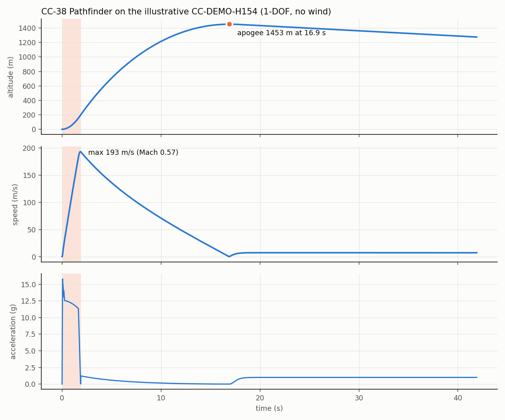
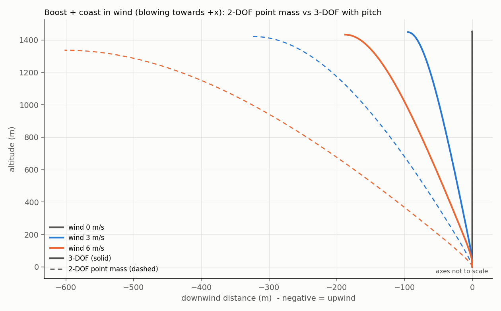
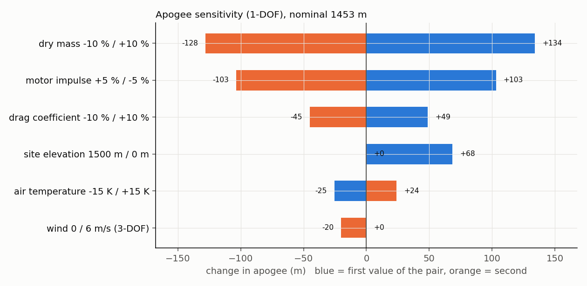
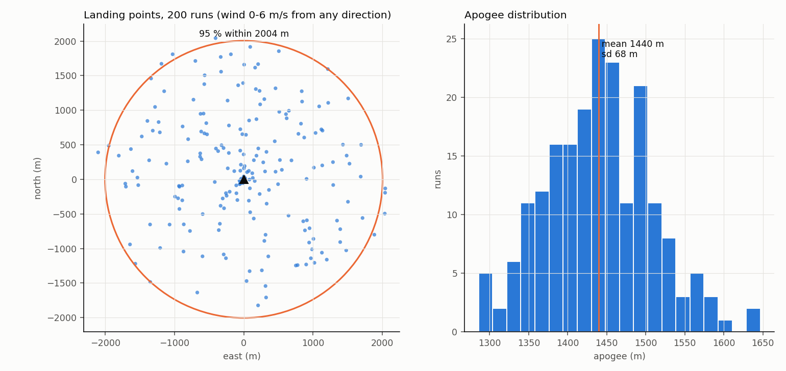
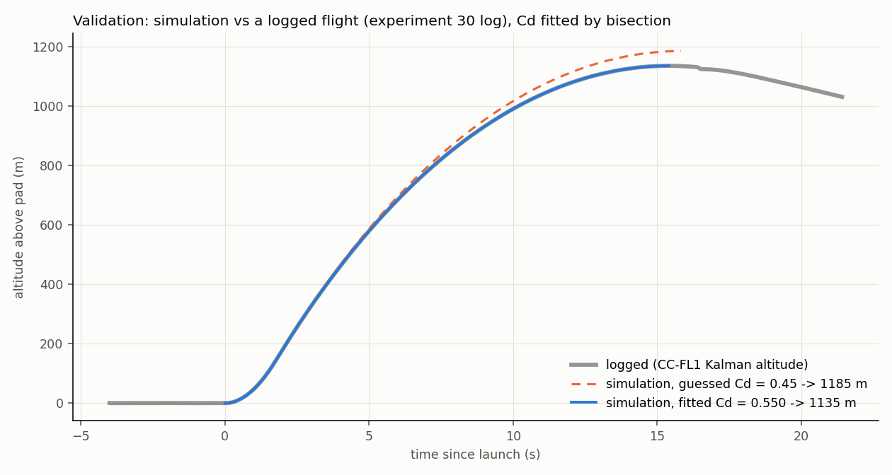

# 41 · OpenRocket deep dive — and a Python simulator to check it

**Level 4 · upper stage** — [OpenRocket](https://openrocket.info/) is the free, open-source rocket
simulator most hobby and university flyers use to design rockets, choose motors and predict flights.
Here you learn to drive it properly — stability, motor selection, simulation settings, sensitivity
studies — and then you build **your own simulator in Python** (1-DOF, 2-DOF and a planar 3-DOF with
pitch dynamics), check it against closed-form physics, cross-check it against OpenRocket, and
**calibrate it against a logged flight** from the [CC-FL1 logger](../30-flight-computer-pcb/).

| Cost | Time | Difficulty | Ages |
|---|---|---|---|
| **$0** (OpenRocket and Python are free) | **8–15 h** | ●●●●○ | 14+ |

> [!NOTE]
> **About the motor file in this folder.** [`motors/CC-DEMO-H154.eng`](motors/CC-DEMO-H154.eng) is an
> **illustrative thrust curve invented for teaching** the RASP file format and for testing code. It is
> **not a real motor** and must never be used to plan a real flight. For real flights use the certified
> motor's data from [thrustcurve.org](https://www.thrustcurve.org/) (OpenRocket ships with that database)
> and fly only commercially certified motors ([experiment 40](../40-high-power-rocketry-certification/)).



## What you'll learn

- Building a rocket in OpenRocket from components and **real masses**, reading the **CG/CP** and the
  stability margin, and why the margin changes as the motor burns.
- Choosing a motor and ejection delay, setting launch conditions (wind, site, rail), and reading the
  plots and warnings.
- The **RASP `.eng` thrust-curve format** — and how to import a curve.
- The physics inside a flight simulator: **ISA atmosphere, thrust and mass flow, drag vs Mach, Runge–Kutta
  integration, Barrowman's equations**, weathercocking and **pitch dynamics**.
- **Verification** (does the code solve the equations right? — closed-form tests) versus **validation**
  (are they the right equations? — comparison with a real flight log).
- **Sensitivity and Monte Carlo** analysis: which uncertainties matter, and how far away the rocket lands.

## Folder

```text
41-openrocket-deep-dive/
├── motors/CC-DEMO-H154.eng        illustrative thrust curve (NOT a real motor)
├── sim/
│   ├── rocketsim.py               ISA, Motor (.eng), Rocket, 1-DOF and 2-DOF point-mass simulators
│   ├── sim3dof.py                 planar 3-DOF (x, z, pitch) with Barrowman restoring + damping moments
│   ├── barrowman.py               centre of pressure (nose, transitions, fins, interference)
│   ├── example_rocket.py          the CC-38 Pathfinder: geometry, masses, stability report
│   ├── run_example.py             all studies -> images/
│   └── test_rocketsim.py          8 tests against closed-form physics
├── openrocket/compare_openrocket.py   overlay an OpenRocket CSV export on the Python models
└── images/
```

## Part A — OpenRocket, step by step

1. **Install** OpenRocket (23.09 or newer) from <https://openrocket.info/downloads.html>; the installers
   bundle Java. Set *Preferences → Units → Metric (SI)* for this exercise.
2. **Build the CC-38 Pathfinder** (*File → New*), matching `sim/example_rocket.py`:

   | Component | OpenRocket part | Dimensions | Mass override |
   |---|---|---|---|
   | Nose cone | Nose cone, **tangent ogive** | length 200 mm, base Ø 41.6 mm, shoulder 40 mm | 120 g |
   | Body | Body tube | length 950 mm, OD 41.6 mm | 360 g |
   | Av-bay | Mass component inside the body | at 400 mm from the nose tip | 260 g |
   | Recovery | Parachute, **24 in (61 cm), Cd 1.5**, deploy at apogee | at 620 mm | 160 g |
   | Motor mount | Inner tube 38 mm, length 250 mm, flush with the aft end + 2 centering rings | | 80 g |
   | Fins | Trapezoidal fin set, **3 fins**: root 90 mm, tip 35 mm, height (span) 32 mm, sweep 50 mm, 1.6 mm | at the aft end | 70 g total |
   | Finish | Mass component | at 800 mm | 60 g |

   (Use *Override mass* only when you know the real mass — weigh your parts on a kitchen scale.)
3. **Stability**: the side view shows the **CG** (blue-white circle) and **CP** (red dot) and the margin in
   calibres. Our Barrowman calculation gives **2.2 calibres at lift-off, 3.1 at burnout**
   (`python3 sim/example_rocket.py`). OpenRocket's value will be somewhat different — it adds body lift
   and more detailed fin/body effects. Aim for **1–2 calibres** (or 10–15 % of the length for long, thin
   rockets) *with the motor installed*; more is "over-stable" and weathercocks into the wind.
4. **Motor**: *Motors & Configuration → Select motor*. Use the built-in thrustcurve.org database for
   real motors. To see how an imported curve works, add this folder's `motors/` directory under
   *Preferences → General → User-defined thrust curves*, restart, and search for "CC-DEMO".
5. **Launch conditions** (*Simulations → Edit → Launch conditions*): site altitude and latitude, average
   wind and turbulence, **rail length** (a 6 ft / 1.8 m rail is common for 38 mm rockets), rail angle.
6. **Run**, then read the warnings (*"too low velocity off the rod"*, *"large angle of attack"*,
   *"recovery at high speed"*). Target **≥ 15 m/s (≈ 50 ft/s) off the rail**.
7. **Plot and export**: *Plot / Export → Export data* as CSV (comments on, comma separator) and run
   `python3 openrocket/compare_openrocket.py export.csv` to overlay it on the Python models.
8. **Delay**: OpenRocket reports the "optimum delay" (apogee time − burnout). Pick the closest delay the
   *manufacturer* offers for the certified motor; never modify motors.
9. **Sensitivity in OpenRocket**: duplicate the simulation and change one thing at a time (wind 0/5/10 m/s,
   mass ±10 %, Cd override ±10 % under *Override → Cd*). Or use *Tools → Optimize rocket* to let it
   search, e.g., for the fin size that gives 1.5 calibres.

## Part B — the RASP `.eng` format

```text
; comments start with a semicolon
CC-DEMO-H154 38 250 0 0.140 0.290 CCX-ILLUSTRATIVE
   0.020   92.00
   0.050  230.00
   ...
   1.900    0.00
;
```

Header fields ([thrustcurve.org/info/raspformat.html](https://www.thrustcurve.org/info/raspformat.html)):
**name, diameter (mm), length (mm), delays** (dash-separated; `0` none, `P` plugged),
**propellant mass (kg), total loaded mass (kg), manufacturer**. Then `time thrust` pairs in seconds and
newtons; the point (0, 0) is implicit and the **last point must have zero thrust**. Total impulse is the
area under the curve, $I = \int F\,dt$ — the trapezoid sum of our file is **292.6 N·s** (H class), average
thrust $I/t_b = 154$ N, hence the name "H154". Our simulator reduces the motor mass in proportion to the
impulse delivered so far: $m(t) = m_{total} - m_{prop}\,I(t)/I_{total}$.

## Part C — the physics in `sim/`

**Atmosphere (ISA)**: $T = 288.15 - 0.0065h$ K, $p = 101\,325\,(T/288.15)^{5.2559}$ Pa, $\rho = p/(RT)$,
speed of sound $a = \sqrt{\gamma R T}$ (isothermal above 11 km).

**1-DOF** (vertical): $m(t)\,\dot v = F(t) - \tfrac12\rho v|v| C_D(M) A - m g$, $\dot h = v$. After apogee the
parachute adds $C_D A_{chute}$, giving the terminal rate $v_t = \sqrt{2mg/(\rho\,C_DA)}$.

**Drag vs Mach**: a constant subsonic $C_{D0}$ rising to $1.8\,C_{D0}$ at $M = 1.05$ and easing to
$1.4\,C_{D0}$ at $M = 2$ — a teaching model of the transonic drag rise (OpenRocket computes $C_D$ from
the components instead).

**2-DOF point mass**: $x$ and $z$, wind with a 1/7 power-law profile $w(z) = w_{10}(z/10)^{1/7}$. The body
axis is assumed to point along the *air-relative* velocity at every instant ("instant weathercocking").

**3-DOF (x, z, pitch)**: the body axis $\theta$ is a state. The fins' normal force
$F_N = qAC_{N\alpha}\sin\alpha$ acts at the CP, a distance $\ell = X_{CP} - X_{CG}$ behind the CG, giving a
restoring moment; aerodynamic and jet damping resist the rotation (Barrowman's dynamic-stability terms):

$$ I\ddot\theta = -qAC_{N\alpha}\,\ell\,\sin\alpha - \left(C_{2A} + C_{2R}\right)\dot\theta,\quad
C_{2A} = \tfrac12\rho V A\sum_i C_{N\alpha,i}(X_i - X_{CG})^2,\quad C_{2R} = \dot m\,(X_{noz} - X_{CG})^2 $$

**Barrowman CP** (`barrowman.py`): nose $C_{N\alpha} = 2$ at $0.466L$ (ogive); fins
$C_{N\alpha} = K_{fb}\,\dfrac{4N(s/d)^2}{1 + \sqrt{1 + (2L_f/(C_r + C_t))^2}}$ with $K_{fb} = 1 + R/(s+R)$;
$X_{CP} = \sum C_{N\alpha,i}X_i / \sum C_{N\alpha,i}$.

All models are integrated with classical **4th-order Runge–Kutta**: 2 ms steps during boost, 5–10 ms in
coast, 50–250 ms under the parachute.

## Part D — verification, results and validation

```bash
cd sim
python3 test_rocketsim.py     # 8/8: .eng impulse, rocket equation, drag-coast closed form, Barrowman,
                              #      models agree without wind, weathercocking order, descent rate, CSV parser
python3 run_example.py        # all studies below (~4 min; --quick for fewer Monte Carlo runs)
```

**Verification** — the simulators reproduce closed-form results: the burnout velocity of a constant-thrust
motor with no drag matches the **rocket equation** $v_b = v_e\ln(m_0/m_1) - g t_b$ to 0.2 %; a drag-only coast
in constant density matches the exact $\Delta h = \dfrac{m}{2k}\ln\!\left(1 + \dfrac{k v_0^2}{mg}\right)$,
$k = \tfrac12\rho C_DA$, to 5 cm; 1-, 2- and 3-DOF agree to 0.2 % with a vertical rail and no wind.

**Results for the CC-38 Pathfinder on the illustrative motor:**

```text
CG at lift-off 690.9 mm -> stability margin 2.23 calibres   (3.12 at burnout)
1-DOF: apogee 1453 m at 16.9 s, max 193 m/s (Mach 0.57), 15.8 g, rail exit 22.3 m/s, optimal delay 15.0 s

wind  2-DOF apogee / x_apogee   3-DOF apogee / x_apogee / landing x
   0     1453 m /      0 m       1453 m /      0 m /      0 m
   3     1422 m /   -324 m       1448 m /    -95 m /   1004 m
   6     1337 m /   -602 m       1433 m /   -188 m /   1989 m
```



Both models turn **into** the wind (weathercocking) — but the point-mass model, which lets the rocket
swing onto the relative wind instantly, exaggerates it three-fold. With pitch dynamics the rocket's
inertia and damping delay the turn; that is why OpenRocket (a 6-DOF simulator) and this 3-DOF model agree
far better with real flights. Under a single parachute opened at apogee, the rocket then drifts 1–2 km
downwind: that is the problem dual deployment (small drogue high, main low — done with certified commercial
altimeters at Level 2 and above) exists to solve.

**Sensitivity** — change one input at a time:



Mass and motor impulse dominate. A ±3 % impulse tolerance on a real certified motor is already worth
±60 m; your drag estimate matters about half as much as your kitchen scale.

**Monte Carlo** — 200 flights with random Cd (σ 7 %), mass (σ 20 g), impulse (σ 3 %), rail angle (σ 1°),
and wind 0–6 m/s from any direction:



`apogee 1440 ± 68 m; 95 % of landings within ≈ 2.0 km of the pad` — compare that radius with your
launch field before choosing a motor.

**Validation against a logged flight** — `run_example.py` loads the flight log produced by
[experiment 30](../30-flight-computer-pcb/) (`data/synthetic_flight_log.csv`, replayed through the real
flight-computer code), and bisects the drag coefficient until the simulated apogee matches the logged one:



```text
validation: logged apogee 1135.4 m; Cd guess 0.45 gives 1185 m; fitted Cd = 0.550
```

The fitted $C_D$ recovers the 0.55 that generated that flight — two independent codes agreeing. With a
**real** flight log, this is how you calibrate OpenRocket for your rocket: override its $C_D$ (or surface
finish) until apogee matches, then trust its predictions for the *next* motor.

## Testing & data analysis checklist

- [ ] `test_rocketsim.py` passes.
- [ ] OpenRocket vs Python apogee within ~5–10 % (differences: $C_D$ model, body lift, wind model, 6-DOF).
- [ ] After a real flight: fit $C_D$ from the log, re-simulate, record the before/after prediction error.
- [ ] Rail-exit speed ≥ 15 m/s, stability 1–2 calibres with motor, descent < 35 ft/s (10.7 m/s) for
      certification flights (experiment 40), landing radius inside the field.

## Troubleshooting

| Symptom | Cause | Fix |
|---|---|---|
| OpenRocket apogee 20 % higher than the flight | surface finish too smooth, launch lugs/rail buttons missing, mass underestimated | weigh the real rocket; set finish to "regular paint"; add rail buttons |
| "Too low velocity off the rod" | heavy rocket, slow motor, short rail | longer rail, higher-thrust motor of the same class |
| Custom .eng not listed | wrong directory, header typo, curve not ending in 0 | check the header's 7 fields; restart OpenRocket |
| Python and OpenRocket differ only in wind | 2-DOF point mass | use `sim3dof.py` |
| Stability jumps in OpenRocket as you add parts | mass components placed at the wrong position | positions are relative to the *parent* component |

## Going further

- Add **body lift** and the **Mach dependence of $C_{N\alpha}$** to `barrowman.py` and compare with OpenRocket's CP.
- Replace the fixed-step RK4 with an adaptive **RK45** (`scipy.integrate.solve_ivp`) and events for apogee.
- Write an OpenRocket **simulation extension** (Java) or script it from Python with `orhelper` to run your
  Monte Carlo inside OpenRocket's 6-DOF model.
- Use real atmospheric soundings (wind profiles from a weather model) for the landing prediction, as in
  [experiment 42](../42-near-space-balloon-cubesat/).

## References

- OpenRocket — <https://openrocket.info/>; S. Niskanen, *Development of an Open Source model rocket
  simulation software* (M.Sc. thesis, Helsinki University of Technology, 2009) — the technical documentation
  of OpenRocket's aerodynamics and 6-DOF model
- J. S. Barrowman, *The Practical Calculation of the Aerodynamic Characteristics of Slender Finned
  Vehicles* (M.Sc. thesis, Catholic University of America, 1967) and Barrowman & Barrowman, "The
  Theoretical Prediction of the Center of Pressure" (NARAM-8, 1966)
- ThrustCurve.org, RASP format — <https://www.thrustcurve.org/info/raspformat.html>
- NOAA/NASA/USAF, *U.S. Standard Atmosphere, 1976*
