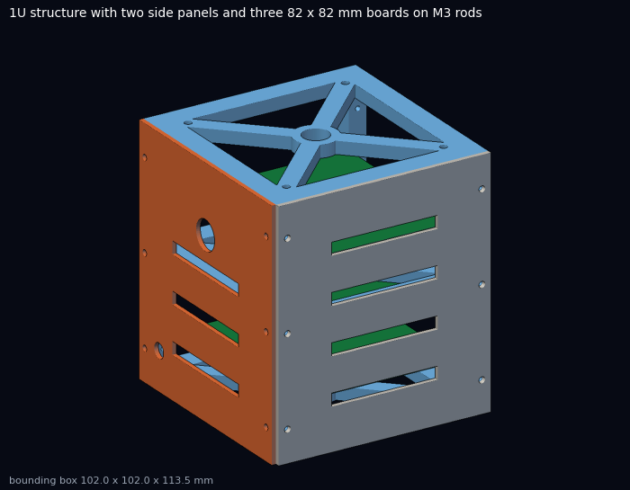
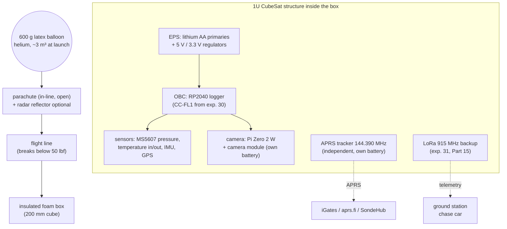
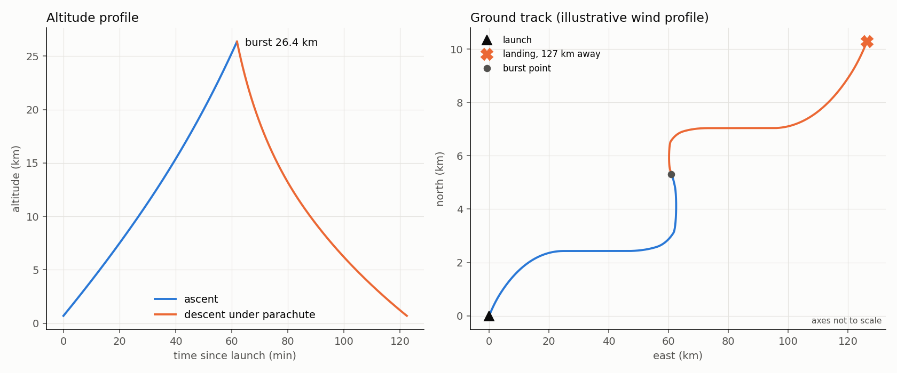

# 42 · Near-space CubeSat — a 1U satellite that flies on a weather balloon

**Level 4 · upper stage** — build a payload in the **1U CubeSat** format (10 × 10 × 11.35 cm) with the
same subsystems as a real small satellite — power, communications, sensors, a camera, a flight
computer — and fly it to **25–35 km** on a latex weather balloon, above 99 % of the atmosphere, where
the sky is black at noon. The balloon is the realistic path: launching a real CubeSat needs a launch
provider, a frequency coordination and a space licence, while a balloon flight needs a field, helium,
a radio licence for tracking and respect for **FAA 14 CFR Part 101 Subpart D**.

| Cost | Time | Difficulty | Ages |
|---|---|---|---|
| **$350–800** (600 g balloon $80–120, helium $80–200, parachute $40–80, APRS tracker $50–150, camera/computer $40–120, foam box, printing) | **30–60 h** over 1–3 months + a launch day and recovery | ●●●●● | 14+ with a licensed adult team |

> [!IMPORTANT]
> Rules first. Read the Part 101 section below and run `tools/balloon.py` before you buy anything: the
> payload's **mass and shape** decide whether your balloon is *exempt* from most of Subpart D. APRS tracking
> needs an **amateur radio licence** (Technician or higher in the US). Launch only in legal conditions, away
> from airports and populated areas, with a landing prediction you have checked, and a team to recover the
> payload wherever it lands. Never recover from power lines, highways or private land without permission.



## What you'll learn

- **Spacecraft systems engineering** at CubeSat scale: mass, power, link and thermal **budgets**, and
  how requirements flow into a design.
- The **atmosphere to 35 km**: pressure, temperature, density; why sensors and batteries fail up there.
- **Balloon physics**: buoyancy, free lift, ascent rate, burst altitude, parachute descent.
- **Radio tracking**: APRS on 144.390 MHz, link budgets from the stratosphere, the SondeHub network.
- **Aviation regulations**: FAA Part 101, and how to design a payload that stays inside the exemption.
- **Landing prediction** from a wind profile — and why the jet stream moves your landing site by 100 km.

## Folder

```text
42-near-space-balloon-cubesat/
├── cad/cubesat_1u.scad        1U frame (100 x 100 x 113.5 mm, 8.5 mm rails), side panels (plain / camera)
├── stl/                       cubesat_1u_frame.stl, cubesat_panel.stl, cubesat_panel_cam.stl
├── tools/balloon.py           Part 101 exemption check, ascent/burst/descent model, landing prediction, KML
├── tools/test_balloon.py      tests (ISA layers, Part 101 rules, burst condition, descent rate)
├── data/flight-prediction.kml the example prediction (open in Google Earth)
└── images/
```

## Mission architecture



**Independent tracking is non-negotiable:** the tracker has its own battery and its own GPS, so a crashed
flight computer cannot lose the payload.

## Bill of Materials

| Subsystem | Item | Notes | Approx. |
|---|---|---|---|
| Structure | printed 1U frame + 4 panels (PETG/ASA, ~180 g filament) | this folder | $5 |
| | 4 × M3 threaded rod 110 mm, nuts, nylon spacers; 82 × 82 mm protoboards with a 14 mm centre hole | boards stack on the rods; the flight line passes through the centre | $10 |
| Thermal | expanded-polystyrene (EPS) box ≈ 200 mm cube, 25–30 mm walls, or a foam cooler; hand warmers optional | outside air reaches **−50 to −60 °C** at the tropopause | $10–20 |
| Power | 8–12 × Energizer Ultimate Lithium AA (primary, rated to −40 °C) | Li-ion/Li-Po lose most of their capacity (and can be damaged) when cold | $15–25 |
| Flight computer | CC-FL1 (exp. 30) or a Pico + microSD | log at 1 Hz, not 100 Hz | $10–40 |
| Pressure | **MS5607** or MS5611 module (10–1200 mbar) | the BMP390 stops at 300 hPa (≈ 9 km) | $10 |
| Temperature | 2 × DS18B20 (inside/outside on a lead) | | $5 |
| GPS | u-blox M8/M10 module set to **airborne** dynamic model | default modes can stop reporting above ~12–18 km | $15–30 |
| Camera | Raspberry Pi Zero 2 W + camera module + 32 GB card, own battery | time-lapse every 5–10 s | $40–80 |
| Tracking (primary) | APRS tracker, 144.390 MHz, e.g. a commercial balloon APRS tracker or an open-source design | **needs your callsign** | $50–150 |
| Tracking (backup) | LoRa 915 MHz (exp. 31) or a commercial GPS pet/asset tracker for the last kilometre | | $20–60 |
| Flight train | 600 g latex sounding balloon, 1.2 m parachute, 5 m + 5 m of 30 lb test line, swivel, zip ties, launch gloves | line must break **below 50 lbf** to stay exempt | $150–250 |
| Gas | helium ≈ 3.1 m³ (110 ft³) for the example flight, regulator + fill hose + scale for neck lift | balloon-grade helium | $80–200 |

## The science and the budgets

### 1. The atmosphere you are flying through

| Altitude | Pressure | Temperature (ISA) | Density |
|---|---|---|---|
| 0 km | 1013 hPa | 15 °C | 1.225 kg/m³ |
| 11 km (tropopause) | 226 hPa | −56.5 °C | 0.364 kg/m³ |
| 20 km | 55 hPa | −56.5 °C | 0.088 kg/m³ |
| 30 km | 11.7 hPa | −46.5 °C | 0.018 kg/m³ |

(From `balloon.isa()`, the ISA/US Standard Atmosphere 1976 layers.) At 30 km there is 1.2 % of sea-level
air: convective cooling almost stops, so the Sun heats sunlit parts while shaded parts radiate to a black
sky. Electronics that ran happily on the bench can freeze on the way up — and overheat at float.

### 2. Balloon physics

Helium provides lift equal to the weight of displaced air minus its own weight. Filling so that the lift
exceeds the total weight by the **free lift** $m_f$ (measured as "neck lift" on a scale), the launch volume is

$$ V_0 = \frac{m_{payload} + m_{balloon} + m_f}{\rho_{air,0} - \rho_{He,0}}. $$

Rising, the balloon stays in pressure and temperature equilibrium with the air, so the gas density falls
with the air density and the volume grows as $V(h) = V_0\,\rho_{air,0}/\rho_{air}(h)$. It **bursts** when the
diameter reaches the manufacturer's burst diameter $D_b$:

$$ \rho_{air}(h_{burst}) = \rho_{air,0}\,\frac{V_0}{\tfrac{\pi}{6}D_b^3}. $$

The ascent rate balances free lift against drag, $v = \sqrt{2 g m_f / (\rho\,C_D\,\pi r^2)}$ with $C_D \approx 0.3$
— roughly constant at ≈ 5 m/s because $\rho$ falls while $r^2$ grows. Under the parachute the descent rate is
$v = \sqrt{2mg/(\rho C_D A)}$: 20+ m/s just after burst, 3–5 m/s at landing.

```text
$ python3 tools/balloon.py
FAA 14 CFR 101.1(a)(4) check:
  package 1: 1200 g = 2.65 lb, smallest face 62.0 in^2, 0.68 oz/in^2
  -> EXEMPT from Subpart D (101.7 still applies)
helium needed ~3.10 m^3 (at 15 C, 1 atm); launch volume 3.14 m^3
ascent rate at launch 5.4 m/s; burst at 26.4 km after 62 min
landing speed 3.6 m/s; total flight 122 min
predicted landing 35.0925, -115.6127  (126.8 km from launch)
```



The example uses an **illustrative** autumn wind profile with a 38 m/s jet stream near 11 km: the payload
lands 127 km downwind. Real predictions use forecast winds — the **SondeHub/Tawhiri predictor** runs on
NOAA GFS forecasts; run it daily in the week before launch and use `--winds sounding.csv` to compare
with an actual radiosonde profile.

### 3. FAA 14 CFR Part 101 — stay exempt by design

Part 101 Subpart D applies to an unmanned free balloon that ([eCFR 101.1(a)(4)](https://www.ecfr.gov/current/title-14/chapter-I/subchapter-F/part-101/subpart-A/section-101.1)):

1. carries a payload package **heavier than 4 lb** *and* with a weight/size ratio **above 3 oz/in²** on any
   surface (total weight in ounces ÷ area of its **smallest** surface in in²); or
2. carries a payload package **heavier than 6 lb**; or
3. carries a payload of two or more packages **totalling more than 12 lb**; or
4. uses a rope or other suspension device that needs an impact force of **more than 50 lb** to separate the
   suspended payload from the balloon.

If none applies, the balloon is exempt from Subpart D — but **§101.7 always applies**: no operation that
creates a hazard to persons or property, and nothing dropped that creates a hazard. A non-exempt balloon
must, among other things, carry **two independent payload cut-down systems**, a **radar-reflective device**
(200–2 700 MHz), lights at night, avoid more than five-tenths cloud cover, notify the nearest FAA ATC
facility **6–24 hours before launch**, and report its position at least **every two hours**
(§§ 101.33–101.39, [eCFR Subpart D](https://www.ecfr.gov/current/title-14/chapter-I/subchapter-F/part-101/subpart-D)).

**Why the foam box matters:** a bare 1U CubeSat at 2.0 kg is 4.4 lb on a 10 × 6 cm face — 7.6 oz/in² —
*not* exempt. The same 2.0 kg inside a 200 mm foam cube has 62 in² faces: 1.1 oz/in², exempt (still under 6 lb).

```text
$ python3 tools/balloon.py --check-only --package 2.0:100x100x60
  -> NOT exempt: package 1: 4.41 lb > 4 lb AND 7.59 oz/in^2 > 3 on its smallest face
```

Many teams also call the local FAA Flight Service / ATC facility before an exempt launch as a courtesy;
check the current FAA guidance for your area.

### 4. Radio: APRS and the stratospheric link budget

**APRS** (Automatic Packet Reporting System) sends short AX.25 packets at 1200 baud on **144.390 MHz** in North
America; any iGate that hears the balloon forwards its position to the internet (aprs.fi, SondeHub). Rules:
you must be a licensed amateur, the packets carry your callsign (use an SSID such as **-11**, conventionally
"balloon"), no encryption, and at altitude use **no digipeater path** (or `WIDE2-1` at most) — a transmitter at
30 km is heard by hundreds of stations already. The link is easy: from 30 km the radio horizon is

$$ d \approx \sqrt{2 R_E h} = \sqrt{2 \times 6371\text{ km} \times 30\text{ km}} \approx 620\text{ km}, $$

and 100 mW at 144 MHz over 300 km has a free-space loss of $20\log_{10}(3\times10^5) + 20\log_{10}(1.44\times10^8) - 147.55 = 125$ dB —
received at ≈ −105 dBm, far above a typical 1200-baud receiver's sensitivity. The hard part is the **last
kilometre**: on the ground, the two-ray loss of [experiment 31](../31-lora-telemetry-ground-station/) applies,
so note the last positions heard during descent and drive there.

### 5. Budgets — the systems-engineering part

**Mass** (target ≤ 1 200 g under the parachute):

| Item | Mass |
|---|---|
| 1U printed frame + panels + rods | 230 g |
| Foam box | 150 g |
| Batteries (10 × lithium AA) | 150 g |
| Flight computer + sensors + GPS | 60 g |
| Camera + its battery | 110 g |
| APRS tracker + antenna | 60 g |
| Parachute + line + swivel + reflector | 220 g |
| Margin | 220 g |
| **Total** | **1 200 g** |

**Power** (2.5 h flight + 2 h on the ground + 3 h recovery margin ≈ 8 h):

| Load | Average | Energy (8 h) |
|---|---|---|
| Flight computer + sensors + GPS | 60 mA at 3.3 V | 1.6 Wh |
| Camera (Pi Zero 2 W, time-lapse) | 250 mA at 5 V | 10 Wh |
| APRS tracker (own supply) | 30 mA average | on its own battery |
| **Main pack** | | **≈ 12 Wh → 6 × lithium AA (≈ 4.5 Wh each at low current; derate for cold and high current)** |

**Thermal**: expect −55 °C outside; keep the inside above −20 °C with the box, the electronics' own heat,
and black tape on the sunny side. Log inside and outside temperatures — the data is one of the best
parts of the flight.

## Build and fly — step by step

1. **Requirements** (write them down): max altitude, what to measure, how often, mass ≤ 1.2 kg, independent
   tracking, exempt under Part 101, recover within 4 h.
2. **Print** the frame (upright, no supports) and panels; tap the rail holes with M2.5 screws.
3. **Electronics stack** on the M3 rods: battery board at the bottom, flight computer, sensor board on
   top; camera behind the camera panel's window; route the external temperature sensor and antennas
   through the gland.
4. **Freezer test**: run everything for 4 h in a −20 °C freezer (inside its foam box); then 1 h with dry
   ice nearby (never seal dry ice in a closed box — CO₂ gas pressure; ventilate the room).
5. **Vacuum/pressure test** the pressure sensor with a vacuum chamber if you can; check the GPS airborne
   mode is saved to flash.
6. **Predict daily** for the week before (SondeHub predictor + `balloon.py`); choose a launch time whose
   landing is in open country, far from airports, restricted areas, water and cities.
7. **Launch day**: weigh the payload train; fill the balloon to the neck lift from `balloon.py`
   (payload + free lift, e.g. 2.5 kg); tie off; attach parachute and payload; start all trackers and the
   camera; check the tracker is heard on aprs.fi; launch downwind, letting the line pay out to avoid
   a jerk.
8. **Chase**: follow on aprs.fi/SondeHub, update the prediction after burst, get the last descent
   positions, recover with permission.
9. **Analyse**: plot altitude, pressure, temperatures and ascent rate; compare burst altitude and landing
   with the prediction; publish your data and photos.

## Testing & data analysis

- `python3 tools/test_balloon.py` — ISA layer pressures, Part 101 rules (six cases), the burst condition and
  the descent-rate formula.
- **Ascent rate vs altitude** from the GPS log: is it constant? (It usually increases slightly.) Fit $C_D$.
- **Burst diameter** back-calculated from the burst altitude: $D_b = (6V_0\rho_0/(\pi\rho_b))^{1/3}$ — compare
  with the datasheet.
- **Temperature profile**: find the tropopause (where the lapse rate stops) and compare with the ISA table.
- **Pressure altitude vs GPS altitude**: how far apart are they at 25 km, and why? (Real atmosphere ≠ ISA.)

## Troubleshooting

| Symptom | Cause | Fix |
|---|---|---|
| GPS stops at ~18 km | module not in airborne mode | configure the dynamic model and save it to flash |
| Pressure reads constant above 9 km | BMP280/BMP390 range ends at 300 hPa | use MS5607/MS5611 |
| Tracker silent after 20 min | battery cold (Li-ion) | lithium AA primaries; insulation; test in a freezer |
| Balloon rises much slower than predicted | too little free lift | measure neck lift with a scale; add helium |
| Burst far below prediction | under-inflation or overfilled, cold/UV-damaged balloon | store balloons in their bags, handle with gloves, follow the fill table |
| Payload lost in trees/water | landing not planned | plan launch windows around the prediction; carry a line and a pole |

## Going further

- Fly the **CC-FL1** logger and the **LoRa** telemetry of experiments 30–31 as secondary payloads.
- A **Horus Binary** or other digital amateur telemetry mode with a software-defined-radio ground station.
- A **Geiger counter** payload: cosmic-ray flux rises to the Pfotzer maximum near 15–20 km.
- **Solar irradiance / UV** sensors and the ozone layer.
- Move to a **real CubeSat** programme: university teams launch through programmes such as NASA's CubeSat
  Launch Initiative — start with the CubeSat Design Specification.

## References

- 14 CFR Part 101 Subparts A and D — <https://www.ecfr.gov/current/title-14/chapter-I/subchapter-F/part-101>
- Stratospheric Ballooning Association, "Part 101 rules" — <https://www.stratoballooning.org/part-101-rules>
- California Polytechnic State University, *CubeSat Design Specification* (1U: 100 × 100 × 113.5 mm)
- SondeHub tracker and Tawhiri predictor (Cambridge University Spaceflight heritage) — <https://predict.sondehub.org>
- APRS: <http://www.aprs.org>, <https://aprs.fi>
- US Standard Atmosphere 1976 (NOAA/NASA/USAF)
- 47 CFR Part 97 (amateur radio service) — <https://www.ecfr.gov/current/title-47/chapter-I/subchapter-D/part-97>
