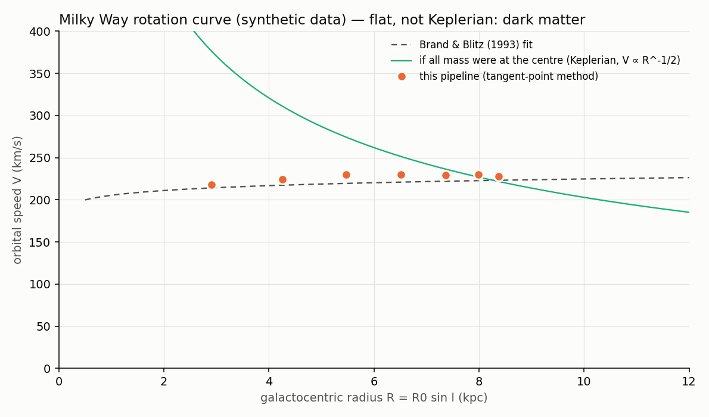
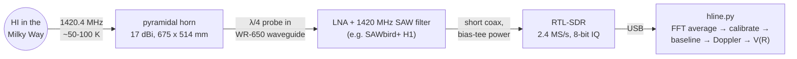
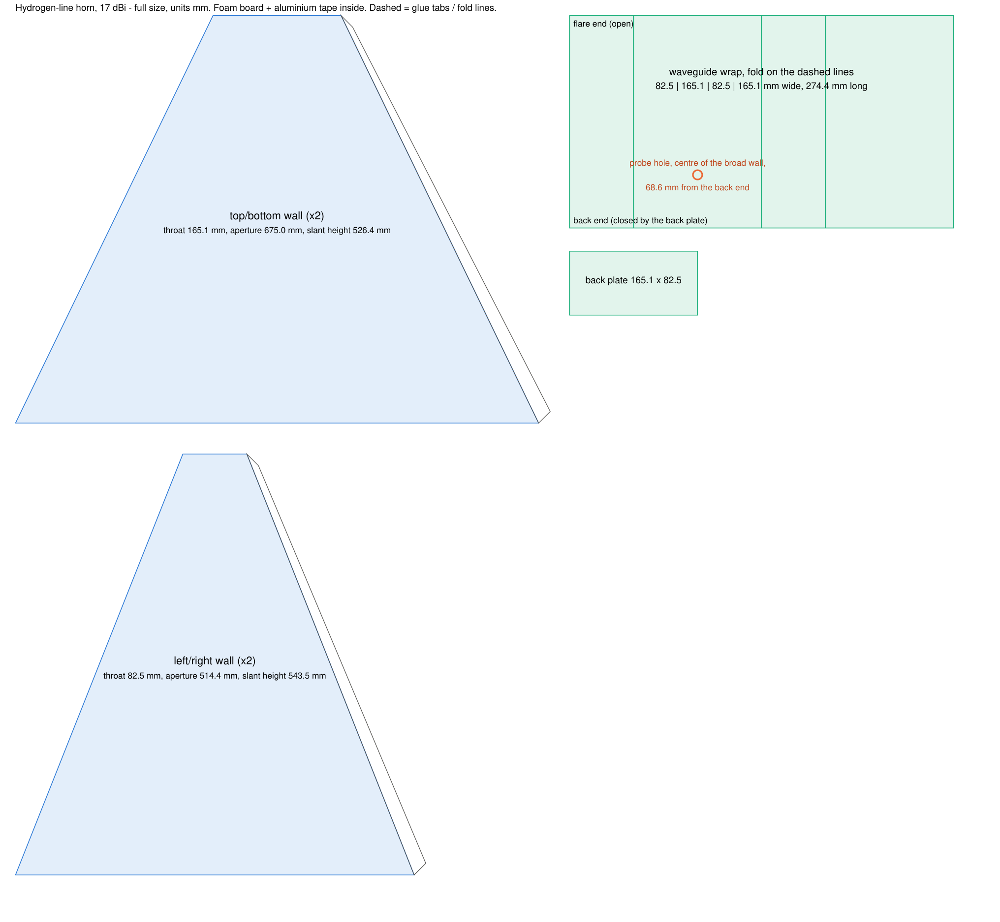
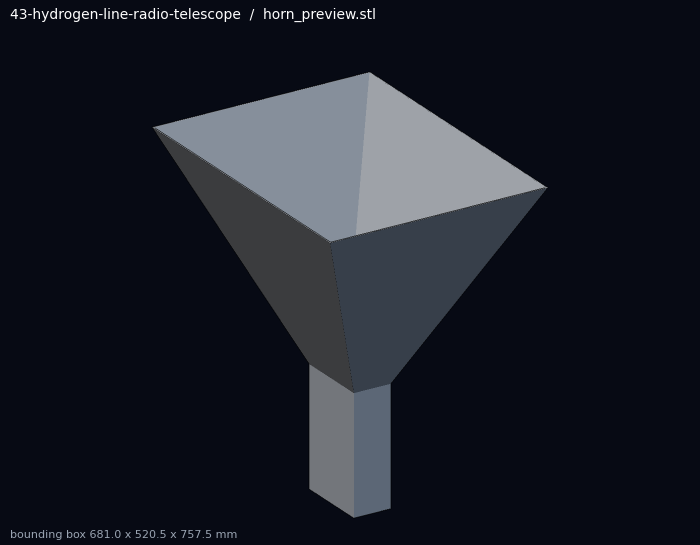
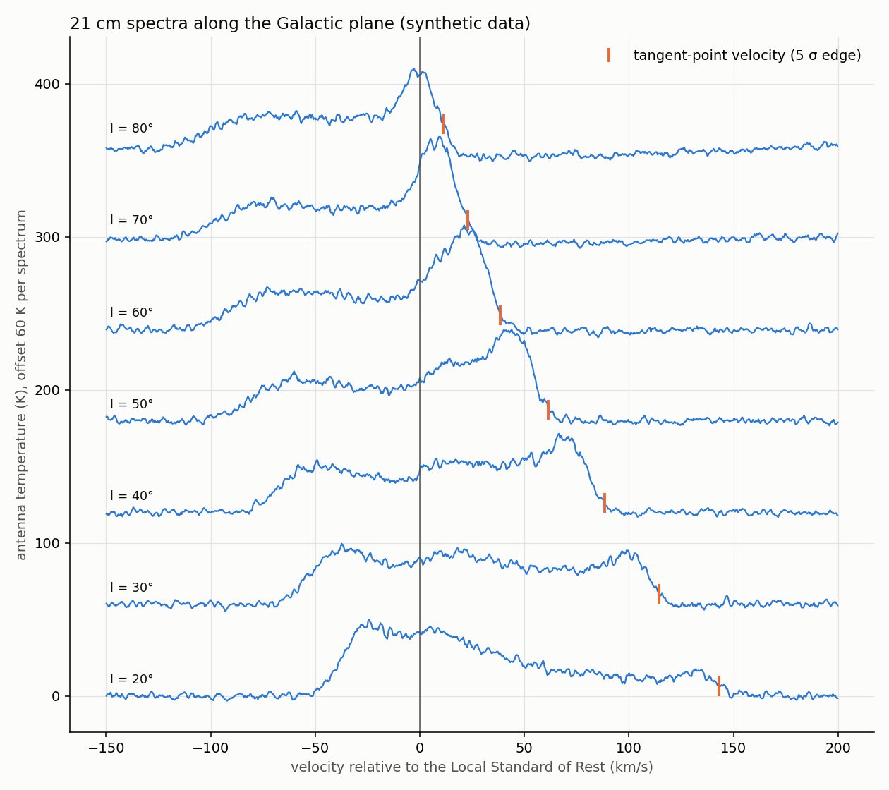

# 43 · Hydrogen-line radio telescope — weigh the Milky Way with a cardboard horn

**Level 4 · upper stage** — every cold hydrogen atom in the Galaxy occasionally flips the spin of its
electron and emits a photon at **1420.405 751 768 MHz** (21.1 cm). Point a horn antenna at the Milky
Way, amplify, digitise with an RTL-SDR, average the spectrum, and the Doppler shifts of that line tell
you how fast the Galaxy spins at each radius — and that the answer is **not** what the visible stars
alone would give. This experiment designs the horn from first principles, provides a complete
processing pipeline, and proves the pipeline on a synthetic galaxy before you ever go outside.

| Cost | Time | Difficulty | Ages |
|---|---|---|---|
| **$60–150** (RTL-SDR ≈ $35–45 if you do not own one, LNA + filter ≈ $40–50, foam board + tape ≈ $30, connector + cables ≈ $15) | **10–20 h** build + evenings of observing | ●●●●○ | 13+ |

> [!NOTE]
> Receive-only: no licence is needed to listen, and 1400–1427 MHz is a protected radio-astronomy band
> where nobody is allowed to transmit — which is exactly why the line is observable at all. Work safely
> with knives and on ladders when mounting the horn.



## What you'll learn

- The **physics of the 21 cm line**: hyperfine splitting, why a transition with an 11-million-year
  lifetime is still bright, and how its intensity measures the amount of hydrogen.
- **Antenna engineering**: rectangular waveguide modes, the quarter-wave probe feed, and the
  **optimum-gain pyramidal horn** design procedure.
- **Receiver sensitivity**: system temperature, the Friis noise formula, the **radiometer equation**, and
  Y-factor calibration.
- **Digital signal processing**: FFT spectra, averaging, windowing, bandpass calibration, baselines.
- **Doppler astronomy**: velocities relative to the **Local Standard of Rest (LSR)**, the tangent-point
  method, the Galactic **rotation curve** — and its dark-matter implication.

## Folder

```text
43-hydrogen-line-radio-telescope/
├── tools/
│   ├── horn_design.py       optimum pyramidal horn (Balanis) -> dimensions, cad/horn_params.scad, cutting diagram
│   ├── hline.py             the processing library (read IQ, spectra, calibration, baseline, Doppler, LSR, rotation curve)
│   ├── process_hline.py     obs.json -> spectra + rotation curve; --selftest runs it on a synthetic galaxy
│   ├── synth_hline.py       synthetic Milky Way + receiver -> RTL-SDR IQ files
│   ├── where_to_point.py    alt/az of the Galactic plane for your site and time (astropy)
│   ├── capture.sh           rtl_sdr ON/OFF capture for one pointing
│   └── obs_template.json
├── cad/horn.scad            horn preview model + printable probe jig   (stl/horn_preview.stl, stl/probe_jig.stl)
├── data/rotation_curve.csv  output of the self-test
└── images/
```

## Signal chain



## Bill of Materials

| Qty | Item | Notes | Approx. |
|---|---|---|---|
| 4 | foam board, 5 mm, 76 × 102 cm (30 × 40 in) | horn walls and waveguide | $20 |
| 1 | aluminium foil **tape**, 50 mm × 50 m | lines every inside surface and seals every joint (conductive joints matter) | $10 |
| 1 | N-type (or SMA) female chassis connector, 4-hole flange | the probe is its centre pin extended with 2 mm brass/copper rod | $5–10 |
| — | 2 mm brass or copper rod, 60 mm | the probe | $2 |
| 1 | low-noise amplifier with a 1420 MHz SAW band-pass filter, bias-tee powered | e.g. Nooelec SAWbird+ H1; noise figure ≲ 1 dB | $40–50 |
| 1 | RTL-SDR with bias tee (RTL-SDR Blog V3/V4) | you may already own one | $35–45 |
| 1–2 | short, low-loss coax + adapters (N/SMA) | put the LNA right at the horn; cable loss before the LNA adds noise 1:1 | $10–15 |
| — | tripod or wooden stand, hot glue, inclinometer (phone app), compass | | — |
| — | optional: NanoVNA to tune the probe for best match | | $50–70 |

Printed parts: `stl/probe_jig.stl` (marks the probe hole and checks the probe length).

## The science

### 1. The line

The ground state of hydrogen is split in two by the interaction of the electron's and proton's magnetic
moments. The upper (parallel spins) level decays with a spontaneous emission rate
$A_{10} = 2.87\times10^{-15}\ \text{s}^{-1}$ — once every **11 million years** per atom. Collisions keep the
levels populated, and the Galaxy contains ~$10^{67}$ atoms along our sightlines, so the line is easily
detectable. Because the gas is mostly optically thin, the brightness temperature integrated over velocity
gives the **column density**:

$$ N_{HI} = 1.823\times10^{18}\ \text{cm}^{-2} \int T_b\,dv\quad (T_b\ \text{in K},\ v\ \text{in km/s}). $$

The self-test finds $N_{HI} \approx 8\times10^{21}\ \text{cm}^{-2}$ in the plane at $l = 20$–40° — the order
of magnitude of the real Galaxy.

### 2. Designing the horn

Feed: **WR-650** rectangular waveguide, $a \times b = 165.1 \times 82.55$ mm. The dominant TE$_{10}$ mode has
cut-off $f_c = c/(2a) = 908$ MHz; the next modes (TE$_{20}$, TE$_{01}$) start at 1816 MHz, so at 1420 MHz only
TE$_{10}$ propagates. Its **guide wavelength** is longer than in free space:

$$ \lambda_g = \frac{\lambda}{\sqrt{1 - (\lambda/2a)^2}} = \frac{211.06}{\sqrt{1 - 0.639^2}} = 274.4\ \text{mm}. $$

A monopole probe $\approx\lambda/4 = 52.8$ mm long (cut ≈ 5 % short: **50 mm**) sits in the centre of the
broad wall **λg/4 = 68.6 mm** in front of the shorted back wall, so the wave reflected by the back wall
returns in phase.

**Optimum pyramidal horn** (Balanis, *Antenna Theory*, ch. 13): for a design gain $G_0$ solve for $\chi$

$$ \left(\sqrt{2\chi} - \frac{b}{\lambda}\right)^2 (2\chi - 1) = \left(\frac{G_0}{2\pi}\sqrt{\frac{3}{2\pi}}\frac{1}{\sqrt\chi} - \frac{a}{\lambda}\right)^2\left(\frac{G_0^2}{6\pi^3}\frac1\chi - 1\right) $$

then $\rho_e = \chi\lambda$, $\rho_h = \dfrac{G_0^2}{8\pi^3\chi}\lambda$, $a_1 = \sqrt{3\lambda\rho_h}$, $b_1 = \sqrt{2\lambda\rho_e}$ and
the flare lengths $p_e = (b_1 - b)\sqrt{(\rho_e/b_1)^2 - 1/4}$, $p_h = (a_1 - a)\sqrt{(\rho_h/a_1)^2 - 1/4}$, which
must be equal for the horn to be buildable. `python3 tools/horn_design.py` (17 dBi):

```text
TE10 cutoff 908 MHz, next modes TE01 1816 MHz / TE20 1816 MHz -> single-mode at 1420 MHz
guide wavelength 274.4 mm
probe: 50.1 mm long (lambda/4, -5 %), 68.6 mm (lambda_g/4) from the back wall
horn: chi = 2.9705
  aperture a1 x b1 = 675.0 x 514.4 mm
  axial length pe = 480.0 mm, ph = 480.0 mm (equal -> realisable)
  gain check 0.51 * 4 pi A / lambda^2 = 16.99 dBi
  half-power beamwidth: E-plane 22.1 deg, H-plane 24.4 deg
  corner angle between adjacent flare walls: 101.09 deg
```

The same numbers drive the OpenSCAD preview and the **full-size cutting diagram**
[`images/horn-cutting-diagram.svg`](images/horn-cutting-diagram.svg) (units: mm — print it tiled, or copy
the dimensions onto the foam board):

| Cutting diagram | Preview model |
|---|---|
|  |  |

### 3. How faint, and how long to integrate

The receiver's noise is expressed as a **system temperature** $T_{sys}$. With the Friis formula, the LNA
dominates: $T_{sys} \approx T_{sky} + T_{spill} + T_{LNA} + T_{SDR}/G_{LNA} \approx 10 + 20 + 50 + 1 \approx 80$–100 K
(an LNA noise figure of 0.7 dB is $T = 290(10^{0.07} - 1) = 51$ K). The HI line adds 5–100 K on top. The
**radiometer equation** says how quietly we can measure it:

$$ \Delta T_{rms} = \frac{T_{sys}}{\sqrt{\Delta\nu\,\tau}} $$

With 2048-point FFTs at 2.4 MS/s each channel is $\Delta\nu = 1.17$ kHz (0.25 km/s); smoothing to 8 channels
(2 km/s) and integrating $\tau = 60$ s gives $\Delta T \approx 100/\sqrt{9400 \times 60} = 0.13$ K. Real-world
gain drifts, not the radiometer equation, usually set the limit — hence ON/OFF switching.

**Calibration.** The receiver's bandpass $G(f)$ multiplies everything, so dividing an ON spectrum (plane)
by an OFF spectrum (cold sky) removes it: $T_A(f) = T_{sys}\,(P_{on}/P_{off} - 1)$. Measure $T_{sys}$ with the
**Y-factor** method: point at the ground ($T_{hot} \approx 290$ K) and at cold sky ($T_{cold} \approx 10$ K), then
$Y = P_{hot}/P_{cold}$, $T_{sys} = (T_{hot} - Y T_{cold})/(Y - 1)$ (at an off-line frequency).

### 4. From frequency to velocity to a rotation curve

Doppler (radio convention): $v = c\,(f_0 - f)/f_0$ — **4.74 kHz per km/s**, so 100 km/s is only 474 kHz.
The measured velocity includes the Earth's rotation and orbit and the Sun's motion; `hline.lsr_correction()`
uses astropy to convert to the **Local Standard of Rest**, the frame circling the Galaxy with the Sun.

A gas cloud at galactocentric radius $R$ on a circular orbit, seen at galactic longitude $l$ from the Sun
(at $R_0$ moving at $V_0$) has line-of-sight velocity

$$ v_r = \left(\frac{V(R)\,R_0}{R} - V_0\right)\sin l . $$

For $0 < l < 90°$, the line of sight passes closest to the centre at the **tangent point**, $R = R_0\sin l$,
where $v_r$ is largest. So the highest velocity in the spectrum gives

$$ V(R_0\sin l) = v_{max} + V_0\sin l . $$

Measuring $v_{max}$ at $l = 20°, 30°, \dots, 80°$ traces $V(R)$ from 2.9 to 8.4 kpc (using the IAU standard
$R_0 = 8.5$ kpc, $V_0 = 220$ km/s; modern values are ≈ 8.2 kpc and ≈ 233 km/s).

If the Galaxy's mass were concentrated like its light, $V$ would fall as $R^{-1/2}$ outside the bulge (the
green Keplerian curve above). Instead it stays **flat** at ~220 km/s — the mass enclosed keeps growing with
radius, $M(R) = V^2R/G$: the classic evidence for a **dark-matter halo**.

## Verification — the pipeline on a synthetic galaxy

```bash
cd tools
python3 horn_design.py
python3 process_hline.py --selftest
```

`synth_hline.py` builds a model Galaxy (Brand & Blitz 1993 rotation curve, an HI disc with a thinner
centre, 7 km/s velocity dispersion), "observes" it with a model receiver ($T_{sys}$ = 100 K, rippled bandpass
with RTL-SDR band edges, 8-bit quantisation, DC spike, 1 % gain drift between ON and OFF, a −14.2 km/s
LSR offset) and writes real RTL-SDR `.cu8` files. `process_hline.py` then reduces them blind:

```text
    l  v_t km/s  R kpc  V km/s  true V  rms K  N_HI cm^-2
   20     142.9   2.91   218.2   214.1   1.22    8.60e+21
   30     114.5   4.25   224.5   217.3   1.31    8.64e+21
   ...
   80      11.1   8.37   227.8   223.1   2.70    2.79e+21
selftest: recovered V - true V = +7.1 +/- 2.1 km/s (the 5-sigma edge sits about one velocity dispersion, ~7 km/s, beyond the tangent velocity)
PASS
```



The small positive bias is physical, not a bug: the edge of the line is broadened by the gas's own
random motions, so a threshold at 5σ sits beyond the true tangent velocity. Good practice — which you can
add — is to fit the line edge and subtract the dispersion.

## Build and observe — step by step

1. **Run the design** (`tools/horn_design.py`) and print or copy the cutting diagram.
2. **Cut the four flare walls and the waveguide wrap** from foam board with a sharp knife and a steel rule.
   Cover the *inside* faces completely with aluminium tape, overlapping each strip.
3. **Waveguide**: fold the wrap into a 165.1 × 82.55 mm box (inside dimensions), close the back with the back
   plate, and tape every inside seam with conductive tape — gaps in the direction of current flow leak.
4. **Probe**: with the printed jig, mark the hole in the centre of a broad wall 68.6 mm from the back;
   mount the connector; solder the brass rod to the centre pin and trim it to **50 mm** inside the guide
   (the jig's slot checks the length). A NanoVNA lets you trim for the lowest reflection at 1420 MHz.
5. **Flare**: tape the four walls to the waveguide mouth and to each other (corners ≈ 101°); tape all
   inside seams. Check the aperture: 675 × 514 mm.
6. **Electronics**: LNA directly on the horn connector, short cable to the RTL-SDR, enable the bias tee
   (`rtl_biast -b 1`). Look at the band in SDR++ or GQRX first: 2.4 MS/s centred 100 kHz below the line.
7. **Plan**: `python3 tools/where_to_point.py --lat <your lat> --lon <your lon> --time <UTC>` lists where
   l = 20–80° is; from mid-northern latitudes the stretch l ≈ 20–80° is well placed on summer and autumn
   evenings. Keep the horn above ~30° elevation to limit ground pick-up.
8. **Observe**: for each longitude run `tools/capture.sh <l>` (ON at the plane, OFF at high galactic
   latitude), add the lines it prints to `obs.json`, then `python3 tools/process_hline.py obs.json`.
   Start with **l ≈ 30–50°**: bright and easy.
9. **Calibrate $T_{sys}$** once with the Y-factor method and put it in `obs.json`.

## Testing & data analysis

- `python3 tools/process_hline.py --selftest` must print PASS before you trust real results.
- The **first light test**: point at the plane near l = 40–70° and look at a live averaged spectrum in SDR++ —
  a hump 0.5–1 dB high, ≈ 0.5 MHz wide, below 1420.4 MHz.
- **Drift scan**: fix the horn on the meridian and capture every 10 minutes for a night; the line appears,
  shifts and fades as the plane drifts through the beam (`where_to_point.py --horn-alt … --horn-az …`).
- **Compare** your rotation-curve points with published curves; discuss the 22° beam (it averages many
  longitudes), non-circular motions near the Galactic bar (why we skip l < 20°), and the $R_0$, $V_0$ choice.
- Estimate the Galaxy's **mass within the Sun's orbit**: $M = V_0^2 R_0 / G \approx 9.5\times10^{10}\,M_\odot$.

## Troubleshooting

| Symptom | Cause | Fix |
|---|---|---|
| No line at all | LNA unpowered, bias tee off, wrong centre frequency | check LNA current; `rtl_biast -b 1`; confirm 1420.3 MHz tuning |
| Big ripples, line buried | cable/ impedance mismatch, ON/OFF gain drift | shorter cable, LNA at the horn, alternate ON/OFF quickly, longer baseline fit |
| Spike at the centre | RTL-SDR DC offset | expected; `mask_dc()` interpolates it; tune off-line as the scripts do |
| Line in both ON and OFF | the OFF position is still in the plane, or the horn sees the line through its side lobes | choose OFF at \|b\| > 40°; aluminium-tape the outside edges of the aperture |
| Strong narrow spurs | USB/laptop noise, mobile-phone / radar harmonics | ferrite on USB, laptop on battery, move away from buildings |
| Everything wobbles with temperature | LNA gain drift | let it warm up 20 min; shade it from the sun |

## Going further

- **Map the sky**: drift scans at several elevations → a longitude–velocity diagram and an HI map of the plane.
- Fit **spiral arms**: each velocity peak at a given l is an arm; with the rotation curve, convert (l, v) to distance.
- Add a **dish** (a 1–2 m surplus satellite dish) with this horn's waveguide as the feed: more gain, narrower beam.
- Use the **Andromeda galaxy** or the **Sun** (continuum) as test targets.
- Join a community: the SARA (Society of Amateur Radio Astronomers) and PICTOR open telescope project.

## References

- C. A. Balanis, *Antenna Theory: Analysis and Design*, Wiley — ch. 13, pyramidal horn optimum-gain design
- J. Brand & L. Blitz (1993), "The velocity field of the outer Galaxy", *A&A* 275, 67 — rotation-curve fit
- K. Rohlfs & T. L. Wilson, *Tools of Radio Astronomy*, Springer — radiometer equation, HI column density, LSR
- F. J. Kerr & D. Lynden-Bell (1986), IAU standard Galactic constants ($R_0$ = 8.5 kpc, $V_0$ = 220 km/s)
- Lichfield Radio Astronomy Observatory, "How to build a horn antenna at 1420 MHz" — <https://www.astronomy.me.uk/how-to-build-a-horn-antenna-at-1420-mhz>
- PhysicsOpenLab, "Horn Antenna for the 21 cm Neutral-Hydrogen Line" — <https://physicsopenlab.org/2020/07/20/horn-antenna-for-the-21cm-neutral-hydrogen-line/>
- RTL-SDR.com, "Cheap and easy hydrogen line radio astronomy with an RTL-SDR…" — <https://www.rtl-sdr.com/cheap-and-easy-hydrogen-line-radio-astronomy-with-a-rtl-sdr-wifi-parabolic-grid-dish-lna-and-sdrsharp/>
- Astropy Collaboration, *astropy* (coordinates, radial-velocity corrections) — <https://www.astropy.org>
