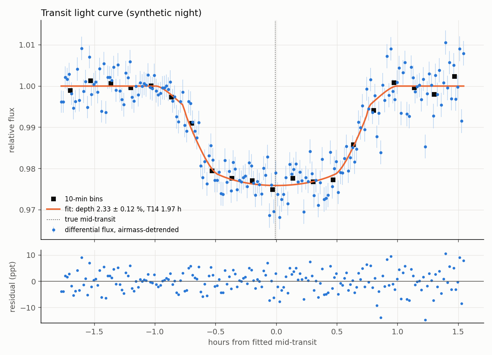
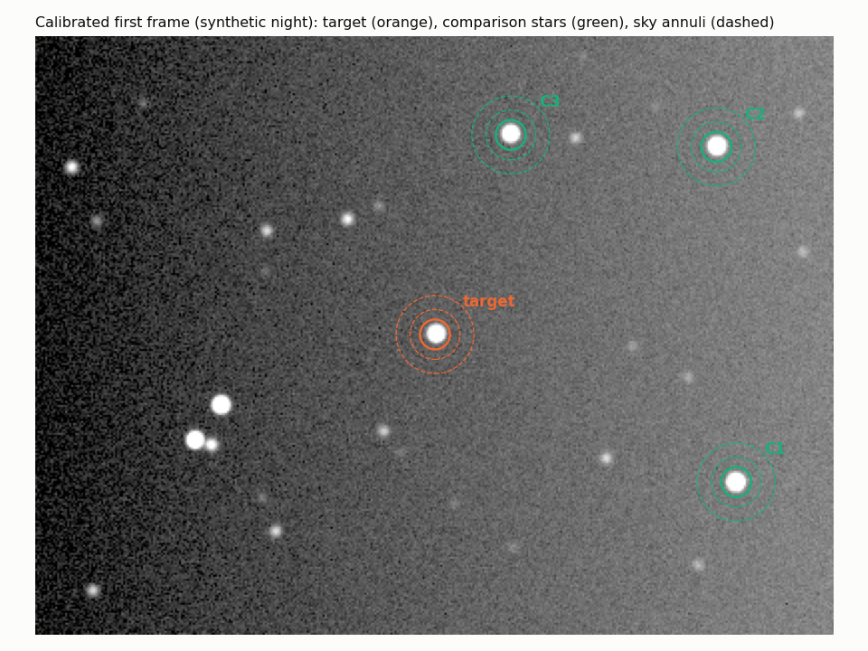

# 44 · Exoplanet transit photometry — see a planet cross another star

**Level 4 · upper stage** — when a hot Jupiter passes in front of its star, the star dims by 1–3 % for
2–3 hours. That is within reach of a DSLR or a small astronomy camera on a tracking mount. This
experiment gives you a complete **aperture-photometry pipeline** in Python (calibration, star finding,
centroiding, sub-pixel apertures, sky annuli, differential photometry, detrending, a limb-darkened transit
fit), proves it on a **synthetic night** with a known planet, and shows how to contribute real data to
**NASA's Exoplanet Watch** through the **AAVSO**.

| Cost | Time | Difficulty | Ages |
|---|---|---|---|
| **$0–600** ($0 with a DSLR + telephoto on the [barn-door tracker](../32-barn-door-star-tracker/); $300–600 for a 60–80 mm refractor + astronomy camera + tracking mount you may already have) | **6–10 h** setup + a 4–5 h observing night per transit | ●●●●○ | 13+ |

> [!NOTE]
> Night-sky work only — never point a telescope or camera lens at the Sun without a certified solar
> filter ([../SAFETY.md](../SAFETY.md)).



## What you'll learn

- **Transit geometry**: depth $\delta = (R_p/R_\star)^2$, duration, impact parameter, limb darkening — and
  how a light curve alone measures the **density of the star**.
- **CCD/CMOS photometry**: bias, dark and flat calibration; the **CCD equation**; aperture photometry with
  sub-pixel edges; sky estimation; why comparison stars cancel the atmosphere.
- **Noise budgets**: photon noise, sky, read noise and **scintillation** — and why defocusing helps.
- **Model fitting** with least squares, parameter uncertainties from the covariance matrix.
- **Timing standards**: UTC → **BJD_TDB**, the clock exoplanet ephemerides run on.
- How real **citizen science** submissions work (EXOTIC, AAVSO observer codes, Exoplanet Watch).

## Folder

```text
44-exoplanet-transit-photometry/
├── tools/
│   ├── photometry.py      the pipeline: FITS -> calibrated -> apertures -> light curve -> transit fit (+ BJD_TDB)
│   ├── transit_model.py   limb-darkened transit model (exact overlap area, small-planet LD), T14 formula
│   └── synth_field.py     synthetic night: star field, transit, extinction, seeing, drift, scintillation, calibration frames
└── images/                field-apertures.png, transit-lightcurve.png
```

## Equipment

| Option | Kit | Good for |
|---|---|---|
| **A. DSLR** | DSLR/mirrorless + 135–300 mm lens at f/4–5.6, on the barn-door tracker (exp. 32) or any equatorial mount; intervalometer | bright targets (V < 9), depths > 1.5 % |
| **B. Small telescope** | 60–80 mm refractor, monochrome or colour astronomy camera (e.g. a Sony IMX-sensor USB camera), motorised equatorial mount, laptop | V 8–12, depths > 0.8 % |
| **C. Remote** | Exoplanet Watch's access to the MicroObservatory robotic telescopes, or other remote networks | no hardware, cloudy locations |

Plus: a reliable clock (sync the laptop to internet time; record UTC), a dew heater in humid weather, and
software to convert raw files to FITS if needed (e.g. Siril for DSLR raws; astronomy cameras write FITS).

## The science

### 1. What a transit tells you

The fraction of starlight blocked is the ratio of disc areas:

$$ \delta \approx \left(\frac{R_p}{R_\star}\right)^2 \qquad (1.5\,R_J \text{ around } 0.8\,R_\odot:\ \delta \approx 3.5\%). $$

For a circular orbit with period $P$, semi-major axis $a$ and inclination $i$, the impact parameter is
$b = (a/R_\star)\cos i$ and the total duration (first to fourth contact) is (Seager & Mallén-Ornelas 2003)

$$ T_{14} = \frac{P}{\pi}\arcsin\!\left[\frac{\sqrt{(1 + R_p/R_\star)^2 - b^2}}{(a/R_\star)\sin i}\right]. $$

The star is darker at its edge (**limb darkening**), modelled with the quadratic law
$I(\mu)/I_0 = 1 - u_1(1-\mu) - u_2(1-\mu)^2$, which rounds the bottom of the transit. Kepler's third law
then turns the fitted $a/R_\star$ into the **stellar density**, with no spectroscopy at all:

$$ \rho_\star = \frac{3\pi}{G P^2}\left(\frac{a}{R_\star}\right)^3 . $$

### 2. Differential aperture photometry

Each calibrated pixel value is
$S = (\text{raw} - \text{bias} - \text{dark}\cdot t/t_{dark}) / \text{flat}_{norm}$. The star's signal is the sum
inside a circle of radius $r \approx 1.5$–2 × FWHM minus the sky level (median of an annulus) times the
aperture area. Its uncertainty follows the **CCD equation**

$$ \sigma_F = \sqrt{F g + n_{pix}\left(1 + \frac{n_{pix}}{n_{sky}}\right)\left(S_{sky}\,g + \sigma_{RN}^2\right)}\ \Big/ g . $$

Thin clouds, changing airmass and seeing dim all stars together, so we divide the target by the sum of
**comparison stars** of similar brightness and colour — the ratio cancels the atmosphere. The pipeline
rejects comparisons with a neighbour near their sky annulus, re-centres every star every frame, scales the
aperture with the measured seeing, and removes any remaining airmass trend while fitting the transit.

### 3. The noise budget — why you defocus

For a V ≈ 7.7 star, an 80 mm aperture and 50 s exposures you collect ≈ $6\times10^5$ electrons per frame:
photon noise $1/\sqrt{N} \approx 1.3$ ppt (parts per thousand). But at such brightness **scintillation** —
twinkling — dominates. Young's (1967) approximation for its relative amplitude is

$$ \sigma_{sc} = 0.09\,D^{-2/3}\,X^{1.75}\,e^{-h/8000}\,(2t)^{-1/2} \quad (D\ \text{in cm},\ X\ \text{airmass},\ h\ \text{altitude in m},\ t\ \text{in s}) $$

≈ 2.4–4 ppt per frame for $D$ = 8 cm. Longer exposures and bigger apertures shrink it; you avoid saturating
the bright star by **defocusing** into a fat donut, which also averages over pixel-to-pixel sensitivity
differences. Binning 10 frames (10 min) brings the scatter of our synthetic night from 4 ppt to ≈ 1.3 ppt —
ample for a 24 ppt deep transit.

## Verification — a synthetic night with a known planet

```bash
cd tools
pip install numpy scipy astropy matplotlib
python3 photometry.py --selftest
```

`synth_field.py` renders 200 frames of a 400 × 300 px field (target + 5 comparisons + 25 field stars) with a
planet of $R_p/R_\star = 0.155$ (depth 2.40 %), extinction of 0.2 mag/airmass, varying seeing, tracking drift,
a brightening sky gradient, vignetting and dust in the flat, hot pixels, read noise, 16-bit saturation and
scintillation — plus bias, dark and flat frames. The pipeline reduces it blind:

```text
frames 200, comparison stars 3, median FWHM 4.58 px
mid-transit  2026-10-10T04:16:22.560 UTC  (+/- 0.6 min)
Rp/R*        0.1527 +/- 0.0040   depth 2.330 +/- 0.123 %
a/R*         7.79 +/- 0.57   inclination 84.71 +/- 0.73 deg
duration T14 1.97 h, residual rms 4.14 ppt, reduced chi2 2.11
truth: Rp/R* 0.155, depth 2.403 %, mid-transit offset +0.62 min
PASS
```



Everything is recovered within about one standard error. The reduced $\chi^2 \approx 2$ says the CCD equation
under-predicts the scatter — correct, because it does not include scintillation: a lesson worth keeping for
real data (inflate the error bars, or add a noise term).

## Observe a real transit — step by step

1. **Pick a target and night.** Use the NASA **Exoplanet Watch** target list, the NASA Exoplanet Archive
   *Transit and Ephemeris Service*, or the Swarthmore *Transit Finder* for your location. Classic bright
   targets for small equipment: **HD 189733 b** (V ≈ 7.7, depth ≈ 2.4 %, P ≈ 2.219 d, T14 ≈ 1.8 h, in
   Vulpecula) and **HD 209458 b** (V ≈ 7.6, depth ≈ 1.5 %, P ≈ 3.525 d, T14 ≈ 3 h, in Pegasus). Require the
   whole transit plus ≥ 1 h before and after, with the target above ~30° altitude.
2. **Set up** at least an hour early: polar-align, focus on a star, then **defocus** until the target's
   peak is ~40–60 % of saturation (check with the camera's histogram/FITS header).
3. **Frame** the target with 3–6 comparison stars of similar brightness (and ideally colour) in the field;
   keep the target away from the frame edges and at the **same pixels** all night (guiding helps).
4. **Expose**: 30–120 s, continuous, with a fixed ISO/gain; record UTC in each file (sync the clock!).
5. **Calibration frames** the same night: 20 darks (same exposure and temperature, lens capped), 20 bias
   (shortest exposure), 20 flats (evenly lit white screen or twilight sky, ~50 % full well).
6. **Name the files** `bias_*.fits`, `dark_*.fits`, `flat_*.fits`, `light_*.fits` (DATE-OBS, EXPTIME, AIRMASS
   in headers — most capture programs write them; Siril can add them) and run:
   ```bash
   python3 tools/photometry.py /path/to/night --target 812,604 --period 2.21857 \
       --t0-guess 2026-10-10T04:15:00 --radec 300.18,22.71 --site 35.0,-117.0
   ```
   `--radec` + `--site` also print the mid-transit time in **BJD_TDB**.
7. **Submit to Exoplanet Watch**: register with the **AAVSO** for an observer code, reduce the same night
   with NASA's **EXOTIC** (runs in Google Colab), and upload the result to the AAVSO Exoplanet Database as the
   Exoplanet Watch instructions describe. Observers whose light curves are used in papers are listed as
   co-authors. Your own pipeline's answer is the independent cross-check.

## Testing & data analysis

- `python3 tools/photometry.py --selftest` → PASS.
- **Aperture study**: rerun with fixed apertures of 1.0–3.0 × FWHM and plot the out-of-transit scatter; the
  minimum is your optimal aperture.
- **Comparison-star study**: add comparisons one at a time; watch the scatter fall, then rise when a variable
  or too-faint star is included.
- **Timing**: compare your mid-transit time with the ephemeris prediction. A few minutes of offset,
  repeated over many observers and years, is how Exoplanet Watch keeps ephemerides fresh for missions
  such as JWST and Ariel.
- **Stellar density**: compute $\rho_\star$ from your $a/R_\star$ and compare with the star's catalogue mass
  and radius.

## Troubleshooting

| Symptom | Cause | Fix |
|---|---|---|
| Light curve follows the airmass curve | too-red/blue comparison stars (differential extinction) | choose comparisons of similar colour; the airmass term in the fit absorbs a little |
| Sudden jumps | star crossed a dust donut or hot pixel after drifting | better guiding, flats taken without touching the focus |
| Flat-topped target, noisy result | saturation / non-linearity | defocus more, shorter exposure, check peak ADU |
| Scatter ≫ predicted | scintillation, wind shake, thin cloud | bigger aperture, longer exposures, bin in time |
| Transit "too short/too deep" | limb darkening or baseline too short | ≥ 1 h out-of-transit on both sides; use band-appropriate $u_1, u_2$ |
| Time offsets of minutes | computer clock not synced, time written at end of exposure | sync to internet time; check whether DATE-OBS is start or mid-exposure |

## Going further

- Fit $u_1, u_2$ as free parameters with an MCMC (e.g. `emcee`) and compare with theoretical tables.
- **Transit-timing variations** from many epochs.
- Observe in two filters (blue and red) — equal depths argue against an eclipsing-binary false positive.
- Follow a **TESS** planet candidate flagged for ground-based follow-up.
- Use **variable stars** (the AAVSO's core mission) as a second project with the same pipeline.

## References

- NASA Science, *Exoplanet Watch* — <https://science.nasa.gov/citizen-science/exoplanet-watch/> and "How to contribute" —
  <https://science.nasa.gov/citizen-science/exoplanet-watch/how-to-contribute/>
- AAVSO, *Exoplanet Watch* — <https://www.aavso.org/exoplanet-watch>
- Zellem R. T. et al. (2020), "Utilizing Small Telescopes Operated by Citizen Scientists for Transiting Exoplanet
  Follow-up", *PASP* 132, 054401 — the Exoplanet Watch/EXOTIC paper
- Seager S. & Mallén-Ornelas G. (2003), *ApJ* 585, 1038 — transit geometry, T14, stellar density
- Mandel K. & Agol E. (2002), *ApJ* 580, L171 — transit light-curve models
- Young A. T. (1967), *AJ* 72, 747 — scintillation noise
- Howell S. B., *Handbook of CCD Astronomy*, Cambridge — the CCD equation
- Eastman J., Siverd R. & Gaudi B. S. (2010), *PASP* 122, 935 — BJD_TDB timing
