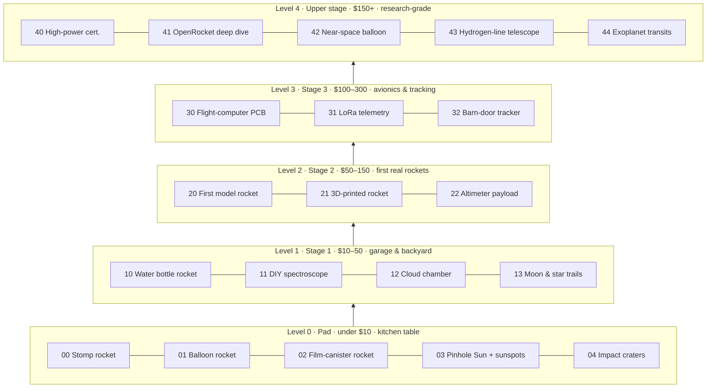

<p align="center"></p>

# Experiments — the Cosmic Library build ladder

Twenty hands-on builds that climb from a paper rocket on the kitchen table to a certified high-power
flight, a near-space balloon and a home-made radio telescope. Each rung reuses what you learned on the
one below it, the way a rocket stacks its stages: **Level 0 sits on the launch pad, Level 4 is the
upper stage.**

> [!IMPORTANT]
> Read **[SAFETY.md](SAFETY.md)** first. Model rocketry uses only **certified, commercially made
> motors** under the National Association of Rocketry (NAR) Model Rocket Safety Code, FAA 14 CFR Part 101
> and NFPA 1122. Nothing here teaches you to make propellant, motors, igniters or anything pyrotechnic.

Every tutorial folder has the same shape:

| Section | What you get |
|---|---|
| **What you'll learn** | the physics and the engineering skills |
| **Cost · time · difficulty** | honest US-dollar range, hours, a 1–5 difficulty |
| **Bill of Materials (BOM)** | a table with quantities, sources and prices |
| **Build it** | numbered step-by-step instructions |
| **Diagram** | a Mermaid or SVG drawing |
| **The science** | the equations, derived, with worked numbers |
| **Record & analyse** | a `data-sheet.csv` template and, where it helps, a Python analysis script |
| **Troubleshooting** · **Going further** · **References** | for when it doesn't work, and for when it does |

Browse them visually on the website: **<https://normansrule.github.io/cosmic-library/experiments.html>**
(3D viewer for every printable part).

---

## The ladder



### Level 0 — the pad (under $10, kitchen table, no tools)

| # | Build | You learn | Cost | Time | Difficulty |
|---|---|---|---|---|---|
| 00 | [Stomp rocket](00-stomp-rocket/) | impulse, pressure, drag, measuring height with trigonometry | $3–8 | 1 h | ●○○○○ |
| 01 | [Balloon rocket — Newton's third law](01-balloon-rocket-newtons-third-law/) | action/reaction, momentum, speed vs. balloon volume | $2–5 | 1 h | ●○○○○ |
| 02 | [Film-canister rocket](02-film-canister-rocket/) | gas pressure from a chemical reaction, reaction rates vs. temperature | $4–9 | 1 h | ●○○○○ |
| 03 | [Pinhole solar projector + sunspots](03-pinhole-solar-projector-and-sunspots/) | optics of a pinhole, the Sun's size and rotation, safe solar observing | $0–5 | 1 h + daily | ●○○○○ |
| 04 | [Impact craters](04-impact-craters/) | kinetic energy, scaling laws, log–log fits | $3–8 | 1–2 h | ●●○○○ |

### Level 1 — stage 1 ($10–50, garage and backyard)

| # | Build | You learn | Cost | Time | Difficulty |
|---|---|---|---|---|---|
| 10 | [Water bottle rocket](10-water-bottle-rocket/) | thrust, optimum water fill, pull-string launcher, **OpenSCAD** nose cone + fin can for a 2 L bottle | $25–45 | 4–6 h | ●●○○○ |
| 11 | [DIY spectroscope](11-diy-spectroscope/) | diffraction, emission lines, Fraunhofer lines, Python image analysis | $0–10 | 2 h | ●●○○○ |
| 12 | [Cloud chamber](12-cloud-chamber/) | cosmic-ray muons, time dilation, supersaturation | $20–40 | 2 h | ●●○○○ |
| 13 | [Moon & star-trail photography](13-moon-and-star-trail-photography/) | exposure, Earth's rotation, stacking noise away with Python | $0–40 | 1 night | ●●○○○ |

### Level 2 — stage 2 ($50–150, your first real rockets)

| # | Build | You learn | Cost | Time | Difficulty |
|---|---|---|---|---|---|
| 20 | [First model rocket](20-first-model-rocket/) | certified A/B/C motors, Barrowman stability, swing test, the NAR code | $50–100 | 4–6 h | ●●○○○ |
| 21 | [3D-printed model rocket](21-3d-printed-model-rocket/) | parametric **OpenSCAD** nose cones (conical, ogive, von Kármán), fin cans, motor mounts, Bambu print settings | $30–80 | 6–10 h | ●●●○○ |
| 22 | [Barometric altimeter payload](22-barometric-altimeter-payload/) | Raspberry Pi Pico + BMP390, MicroPython logger with launch/apogee detection, flight analysis | $25–60 | 6–8 h | ●●●○○ |

### Level 3 — stage 3 ($100–300, avionics and tracking)

| # | Build | You learn |
|---|---|---|
| 30 | [Flight-computer PCB](30-flight-computer-pcb/) | a KiCad printed-circuit-board flight computer: inertial measurement unit (IMU), barometer, logging |
| 31 | [LoRa telemetry ground station](31-lora-telemetry-ground-station/) | long-range (LoRa) radio downlink, antennas, link budgets |
| 32 | [Barn-door star tracker](32-barn-door-star-tracker/) | cancelling Earth's rotation for long-exposure astrophotography |

### Level 4 — upper stage ($150+, research-grade)

| # | Build | You learn |
|---|---|---|
| 40 | [High-power certification](40-high-power-rocketry-certification/) | NAR / Tripoli Level 1 certification path (H/I motors), under a certified flyer's supervision |
| 41 | [OpenRocket deep dive](41-openrocket-deep-dive/) | six-degree-of-freedom simulation, validating it against your logged flights |
| 42 | [Near-space balloon CubeSat](42-near-space-balloon-cubesat/) | a CubeSat-format payload to ~30 km under FAA Part 101 Subpart D balloon rules |
| 43 | [Hydrogen-line radio telescope](43-hydrogen-line-radio-telescope/) | the 21 cm line of neutral hydrogen, the Milky Way's rotation curve |
| 44 | [Exoplanet transit photometry](44-exoplanet-transit-photometry/) | measuring a planet crossing another star with a small telescope |

(Levels 3–4 are documented in their own folders; costs and times are given there.)

---

## What each level hands to the next

| From | Skill | Used again in |
|---|---|---|
| 00 → 10 | measuring apogee by angle (inclinometer) | 20, 22 (compare with the altimeter) |
| 01 → 10 → 20 | Newton's third law, impulse $I = \int F\,dt$ | motor selection in 20, 40 |
| 04 | log–log fits | 22 (drag), 41, 44 |
| 10 → 21 | OpenSCAD parametric design, 3D printing | 21 nose cones, 22 payload sled, 30 enclosures |
| 11 | spectra, calibration against known lines | 43 (Doppler-shifted hydrogen line) |
| 13 | exposure, stacking, noise $\propto 1/\sqrt{N}$ | 32, 44 |
| 20 | Barrowman centre of pressure, stability margin | 21, 41 |
| 22 | pressure → altitude, embedded logging, state machines | 30, 31, 42 |

---

## Printable parts and code

| Folder | Files | How to rebuild |
|---|---|---|
| `10-water-bottle-rocket/cad/` | `water_rocket.scad` → `stl/nose_2L.stl`, `stl/fincan_2L.stl` | `python3 tools/build_cad.py` |
| `21-3d-printed-model-rocket/cad/` | `nosecone.scad`, `fincan.scad`, `motor_mount.scad`, `rocketlib.scad` → 17 STLs | same |
| `22-barometric-altimeter-payload/cad/` | `sled.scad` → `stl/sled_BT60.stl` | same |
| `22-barometric-altimeter-payload/firmware/` | MicroPython `main.py`, `bmp.py`, `flightlogic.py` | `python3 22-barometric-altimeter-payload/tools/test_flightlogic.py` |

`tools/build_cad.py` runs OpenSCAD for every part, converts to binary STL, checks each mesh is
watertight and the right size, and copies the web subset to `site/models/`. `tools/render_previews.py`
draws the PNG previews in each `images/` folder. Both need `pip install trimesh numpy matplotlib`.

```bash
sudo apt install openscad            # or download from openscad.org (2021.01 or newer)
python3 experiments/tools/build_cad.py
python3 experiments/tools/render_previews.py
```

The website reads `site/data/experiments.json` (Levels 0–2) and `site/data/experiments-advanced.json`
(Levels 3–4); the format is in [SCHEMA.md](SCHEMA.md).

---

## Share your results

Open an issue or pull request with your filled-in `data-sheet.csv`, photos and plots. The best
measurements become example data for the next builder. Please credit anyone who helped, and never post
photos of minors without a guardian's permission.

*Licence: code MIT; CAD, templates and text CC BY 4.0 unless a file says otherwise.*
