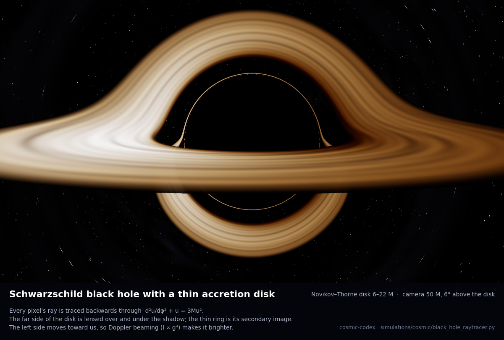
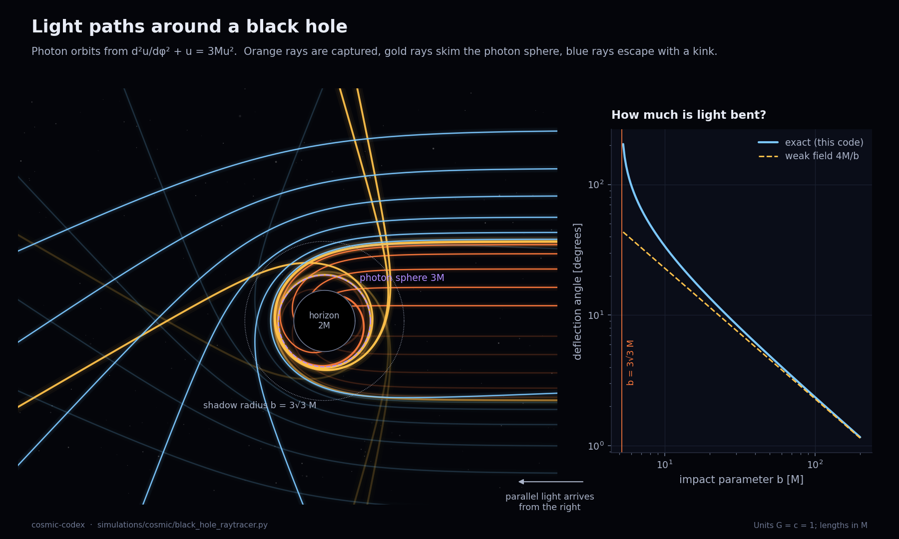
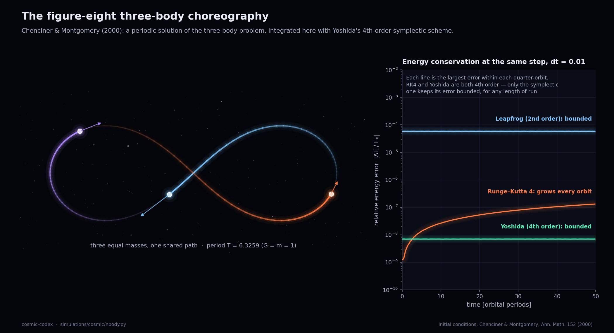
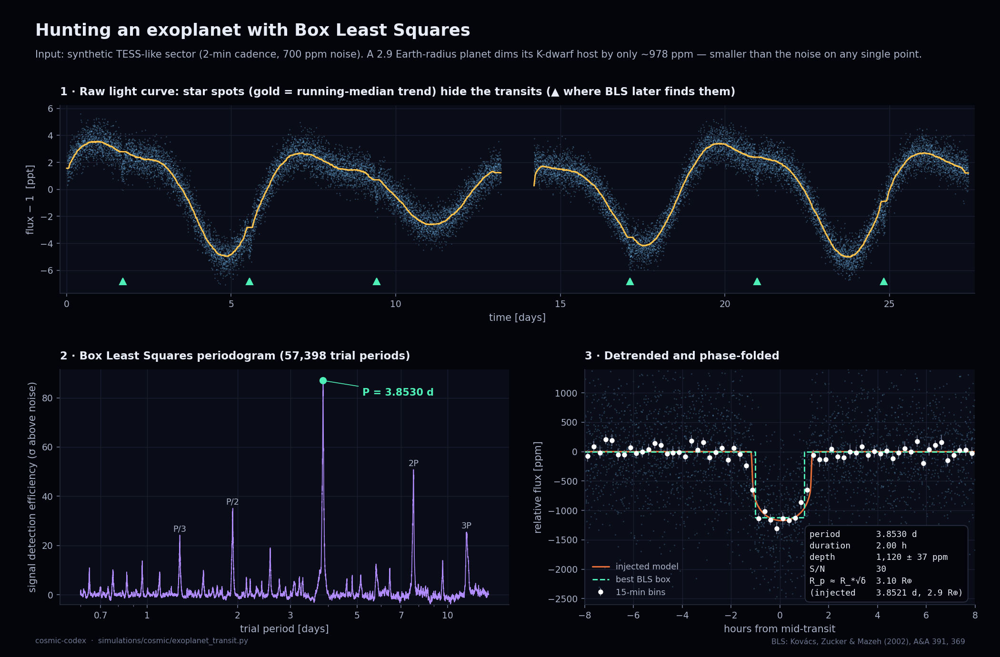
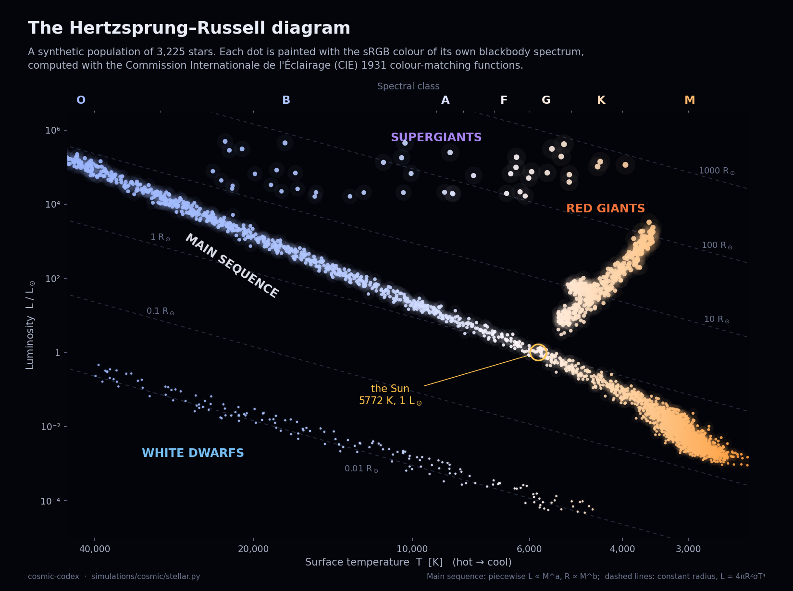
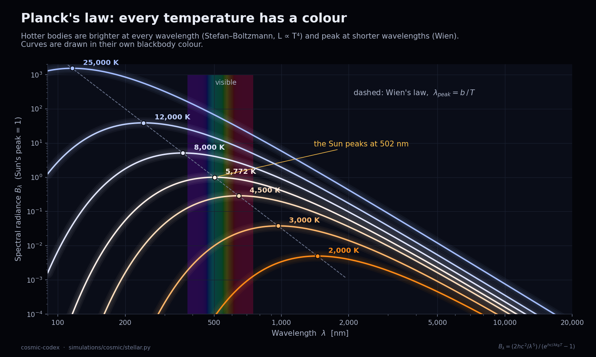
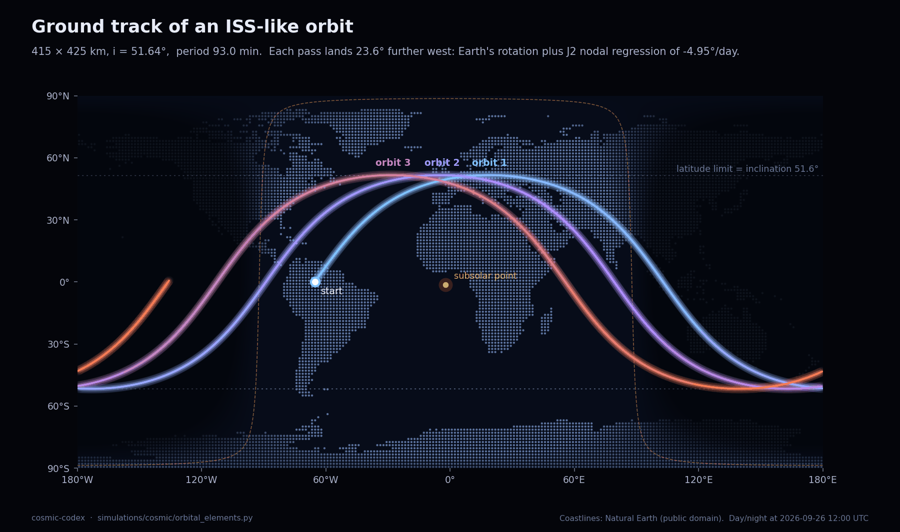

<p align="center"></p>

# Cosmic Library · Simulations

Seven small, readable physics engines written in NumPy. Each one turns a handful of equations into a picture. Every module:

- explains its physics in plain language, with the equations, at the top of the file,
- runs from the command line (`--help` lists every option),
- writes figures to `outputs/` (git-ignored); `--showcase` also refreshes the gallery in `media/sims/`,
- works **offline**. Network features, such as downloading real Transiting Exoplanet Survey Satellite (TESS) light curves, are optional and fall back to synthetic data.

```bash
pip install -r simulations/requirements.txt

python simulations/run.py blackhole            # or: cd simulations && python -m cosmic.black_hole_raytracer
python simulations/run.py nbody figure8 --gif
python simulations/run.py rocket
python simulations/run.py transfers porkchop
python simulations/run.py transit
python simulations/run.py stellar hr
python simulations/run.py orbits groundtrack

python simulations/run.py showcase             # regenerate every gallery image (~5 min)
python -m pytest simulations/tests -q          # 52 offline tests, < 60 s
```

---

## Gallery

### 1 · Black hole ray tracer: `cosmic/black_hole_raytracer.py`



A camera 50 M from a non-rotating black hole looks 6° above its accretion disk. Each pixel's light ray is traced **backwards** with the Schwarzschild photon-orbit equation

$$\frac{d^2u}{d\varphi^2} + u = 3Mu^2, \qquad u = 1/r .$$

Every ray with the same impact parameter *b* follows the same curve. So the code integrates about 1,800 values of *b* once (4th-order Runge–Kutta, packed densely around the critical value 3√3 M), stores *u(b, φ)* in a table, and then only needs a table lookup for each pixel. Crossings of the disk plane at φ₀, φ₀+π and φ₀+2π give the primary, secondary and tertiary images. The disk glows with the Novikov–Thorne / Page–Thorne flux profile at local blackbody temperature *T = (F/σ)^¼*. Its light is shifted by

$$g = \frac{\sqrt{1-3M/r}}{1-\Omega\lambda}\cdot\frac{1}{\sqrt{1-2M/r_\text{cam}}}, \qquad I_\text{obs} = g^4 I_\text{emit},$$

which combines gravitational redshift, time dilation and Doppler shift. The side of the disk moving toward us is therefore brighter.

`python simulations/run.py blackhole` renders 800×450 with 2×2 supersampling in about 10–25 s. Options: `--inclination`, `--r-obs`, `--tmax`, `--streaks 0` (a pure physics disk with no cosmetic texture), `--gif` for a swirling-disk animation, and `--geodesics` for the diagram below.

| Light paths and bending angle | Animated disk |
|---|---|
|  |  |

The geodesic diagram shows three kinds of ray: captured rays (b < 3√3 M), rays that skim the photon sphere at r = 3M, and escaping rays. The right-hand panel compares the exact deflection angle with Einstein's weak-field result 4M/b.

### 2 · N-body with symplectic integrators: `cosmic/nbody.py`



This is the Chenciner–Montgomery figure-eight: three equal masses that chase each other around a single shared curve. The initial conditions are x₁ = −x₂ = (0.97000436, −0.24308753) and v₃ = (−0.93240737, −0.86473146), with period T = 6.3259. The right-hand panel shows why orbital codes use **symplectic** integrators. Classic Runge–Kutta 4 (RK4) and Yoshida's 4th-order scheme have the same formal order, but only the symplectic one keeps its energy error bounded forever. Leapfrog, which is only 2nd order, also stays bounded.


Other scenarios:

- `python simulations/run.py nbody solar`: the Sun, Mercury, Venus, Earth, Mars and Jupiter, started from the Jet Propulsion Laboratory (JPL) Standish elements.
- `python simulations/run.py nbody circumbinary`: a Kepler-16-like "Tatooine" planet orbiting two suns.

### 3 · Rocket ascent: `cosmic/rocket_ascent.py`


The model is a two-dimensional multistage ascent in an Earth-centred inertial frame. It includes:

- thrust that depends on altitude, *T = T_vac − p·A_e*
- the US Standard Atmosphere 1976 (seven layers)
- a Mach-dependent drag coefficient
- a gravity turn at zero angle of attack
- a closed-loop upper-stage guidance law that nulls vertical speed exactly at orbital speed

Vehicle data come from the Saturn V Flight Evaluation Report AS-506 (Apollo 11) and the SpaceX Falcon User's Guide. The model lands within a few seconds of the Apollo 11 flight: Max-Q 78 s against 83 s flown, parking-orbit insertion 705 s against 709 s, and a 186 × 187 km orbit against 183 × 186 km.

### 4 · Transfers and porkchop plots: `cosmic/transfers.py`


Every pixel solves **Lambert's problem**: which orbit links Earth on the launch date to Mars on the arrival date? The solver uses universal variables with a vectorised bisection, about 57,600 solutions per window. It is checked against Curtis Example 5.2. Colour shows launch energy C3 = v∞²; blue contours show the arrival v∞ at Mars. Planet positions come from E. M. Standish's JPL Keplerian elements (Table 1). The top strip shows the 26-month synodic rhythm of Mars launch windows.

Also in this module:

- `python simulations/run.py transfers hohmann` computes Hohmann and bi-elliptic Δv. Low Earth Orbit (LEO) 300 km → Geostationary Orbit (GEO) costs 3.893 km/s, and the module plots where bi-elliptic transfers become cheaper (r₂/r₁ > 11.94).
- `python simulations/run.py transfers lambert` solves a single Lambert problem.

### 5 · Exoplanet transit search: `cosmic/exoplanet_transit.py`



The input is a synthetic TESS-like sector: 2-minute cadence, a downlink gap, star-spot variability and 700 ppm of noise per point. The code removes the stellar trend with a running median, masking transits on the second pass. It then searches 57,000 trial periods with a self-contained, fully vectorised **Box Least Squares** (Kovács, Zucker & Mazeh 2002) periodogram. Finally it phase-folds the light curve and estimates the planet's radius from the transit depth, *R_p ≈ R_* √δ*.

With [`lightkurve`](https://docs.lightkurve.org) installed and internet access, `--target "Pi Mensae"` runs the same pipeline on real TESS data.

### 6 · Stars as blackbodies: `cosmic/stellar.py`



The module covers Planck's law, Wien's displacement law (the Sun peaks at 502 nm), the Stefan–Boltzmann law, and the true colour of a blackbody. That colour is computed from an embedded Commission Internationale de l'Éclairage (CIE) 1931 colour-matching table, which is converted to sRGB. The synthetic Hertzsprung–Russell diagram contains:

- a main sequence built from the mass–luminosity and mass–radius relations
- giants, supergiants and white dwarfs
- lines of constant radius

Every star is drawn in its own blackbody colour.



### 7 · Orbital elements and ground tracks: `cosmic/orbital_elements.py`



The module converts Keplerian elements to state vectors (Curtis Algorithms 4.2 and 4.5), propagates orbits with Kepler's equation plus the secular drift caused by Earth's J2 oblateness, and converts sidereal time to Earth-fixed latitude and longitude. The map shows three passes of an orbit like the International Space Station's (ISS), with day and night shading for the chosen epoch. The dot-matrix coastlines are rasterised from Natural Earth, which is public domain. `python simulations/run.py orbits convert --a-km 7000 --e 0.1` prints a round trip from elements to state vector and back.

---

## Layout

```
simulations/
├── run.py                 dispatcher:  python simulations/run.py <sim> [options]
├── make_showcase.py       regenerates media/sims/*
├── requirements.txt
├── cosmic/
│   ├── constants.py       CODATA 2018 / IAU 2015 constants
│   ├── style.py           dark theme, palette, save helpers (size-capped PNGs)
│   ├── stellar.py  orbital_elements.py  transfers.py  nbody.py
│   ├── rocket_ascent.py  exoplanet_transit.py  black_hole_raytracer.py
│   └── data/land_mask_025deg.npz   Natural Earth land mask (12 KB)
└── tests/                 pytest, fully offline
```

## What the tests check

| Test | Expectation |
|---|---|
| N-body energy | Yoshida: \|ΔE/E\| < 10⁻⁹ over one figure-eight period; leapfrog bounded; RK4 drifts |
| Kepler's third law | 1 au → 365.257 days; 42,164 km → one sidereal day |
| Circular / escape velocity | 7.726 km/s at 300 km; 11.18 km/s at the surface |
| Hohmann | LEO 300 km → GEO: 3.89 km/s |
| Lambert | Curtis Example 5.2 to 10⁻³ km/s, and a propagated orbit to 10⁻⁶ |
| Black hole | photon sphere at r = 3M, critical impact parameter 3√3 M, weak-field deflection 4M/b |
| Box Least Squares | injected period recovered within 1 % |
| Stellar | Wien peak of the Sun ≈ 502 nm at 5772 K; 5772 K blackbody colour is near-white; Stefan–Boltzmann gives L☉ |
| Rocket | US Standard Atmosphere 1976 values; Saturn V reaches its parking orbit within ±40 s of the flown time |

## Honest limitations

- **Black hole:** the black hole is Schwarzschild (non-rotating), and the disk is geometrically thin and optically thick. The disk's colour-temperature scale, the optional turbulence texture, the procedural star field, the bloom and the tone curve are artistic choices; only the geometry, redshift and relative brightness are physical.
- **Rocket ascent:** the model is planar, with a generic drag curve and no winds. SpaceX does not publish Falcon 9 stage masses, so those figures are widely quoted estimates.
- **Porkchop plots:** the Standish elements are accurate to arc-minutes, the Lambert solver is zero-revolution only, and there are no patched-conic departure or arrival burns.
- **Transit search:** the transit model uses the small-planet approximation with quadratic limb darkening. The radius estimate ignores limb darkening and impact parameter, so expect ±10 %.
- **Hertzsprung–Russell diagram:** the population is a synthetic teaching sample, not a star catalogue.

## References

- S. Chandrasekhar, *The Mathematical Theory of Black Holes* (1983); J.-P. Luminet, A&A 75, 228 (1979); D. Page & K. Thorne, ApJ 191, 499 (1974); O. James et al., Class. Quantum Grav. 32, 065001 (2015).
- A. Chenciner & R. Montgomery, Annals of Mathematics 152, 881 (2000); H. Yoshida, Phys. Lett. A 150, 262 (1990); L. Doyle et al., Science 333, 1602 (2011).
- NASA Marshall Space Flight Center, *Saturn V Flight Evaluation Report AS-506 Apollo 11 Mission* (MPR-SAT-FE-69-9, 1969); R. Orloff, *Apollo by the Numbers* (NASA SP-2000-4029); SpaceX, *Falcon User's Guide*; *U.S. Standard Atmosphere, 1976* (NOAA-S/T 76-1562).
- H. Curtis, *Orbital Mechanics for Engineering Students*; D. Vallado, *Fundamentals of Astrodynamics and Applications*; E. M. Standish, *Keplerian Elements for Approximate Positions of the Major Planets* (JPL Solar System Dynamics).
- G. Kovács, S. Zucker & T. Mazeh, A&A 391, 369 (2002); K. Mandel & E. Agol, ApJ 580, L171 (2002).
- CIE 1931 2° standard observer (CIE 018:2019); IEC 61966-2-1 (sRGB); Natural Earth 1:110m (public domain).
